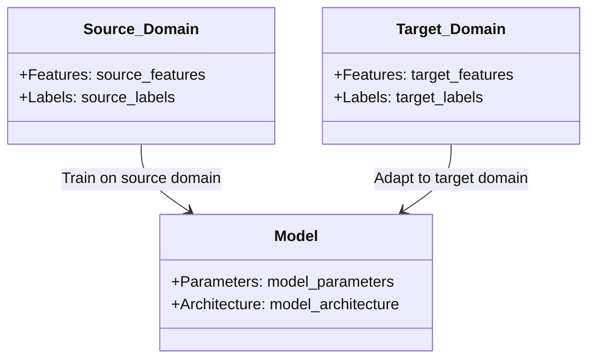
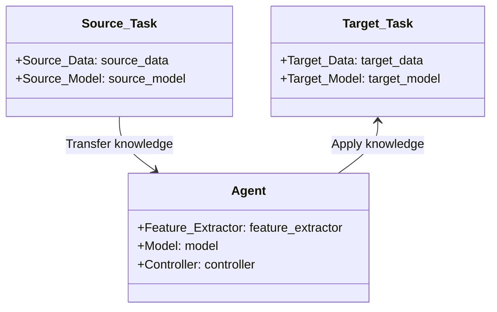
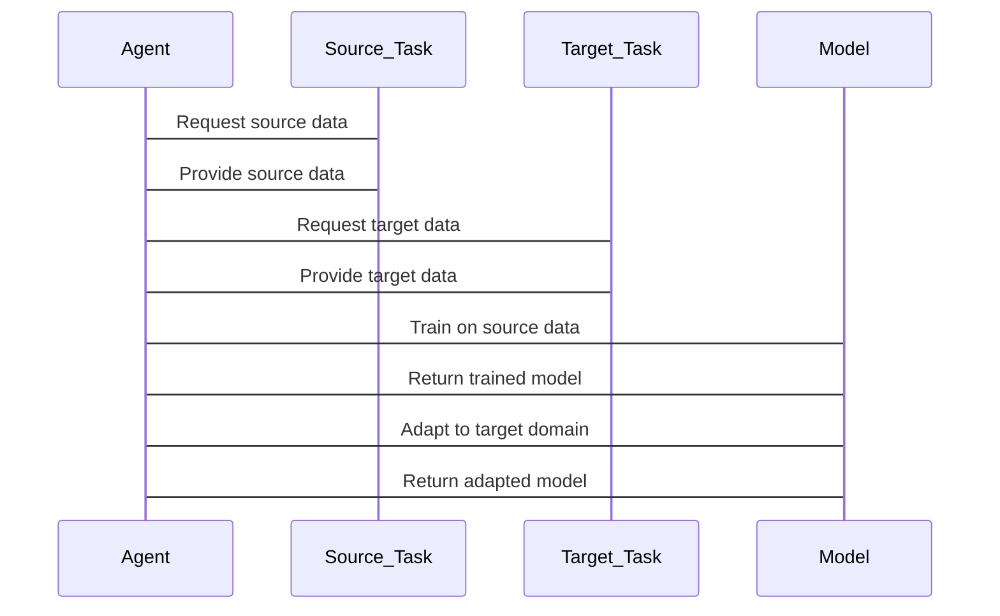

                 


# AI Agent中的迁移学习技术应用

> 关键词：迁移学习，AI Agent，机器学习，领域适应，特征表示

> 摘要：本文深入探讨了迁移学习在AI Agent中的应用，分析了迁移学习的核心概念、算法原理及其在实际场景中的应用。通过详细的技术分析和案例解读，本文为读者提供了从理论到实践的全面指导。

---

## 第一部分: 迁移学习的基本概念与背景

### 第1章: 迁移学习的定义与核心概念

#### 1.1 迁移学习的定义与核心概念

##### 1.1.1 迁移学习的定义
迁移学习（Transfer Learning）是一种机器学习技术，旨在通过利用一个或多个源领域中的知识，来提高在目标领域中的学习性能。与传统机器学习不同，迁移学习的核心在于处理数据分布差异的问题，即在源领域和目标领域之间存在分布偏移时，如何有效利用源领域的信息来提升目标领域的模型性能。

##### 1.1.2 迁移学习的核心概念
- **源领域（Source Domain）**：已经充分学习的领域，拥有大量标注数据。
- **目标领域（Target Domain）**：需要学习的领域，数据有限或标注不足。
- **领域适应（Domain Adaptation）**：处理源领域和目标领域之间的分布差异。
- **特征表示（Feature Representation）**：提取和表示数据的关键特征，以便模型理解和利用。

##### 1.1.3 迁移学习与传统机器学习的区别
| 特性 | 传统机器学习 | 迁移学习 |
|------|---------------|-----------|
| 数据需求 | 数据充分，同一分布 | 数据有限，分布差异 |
| 任务目标 | 单一任务 | 多任务、跨领域 |
| 知识复用 | 无 | 有 |

#### 1.2 迁移学习的背景与问题背景

##### 1.2.1 数据不足的问题
在许多实际应用中，目标领域可能缺乏足够的标注数据，导致传统机器学习方法难以有效训练模型。迁移学习通过利用源领域的数据，缓解了这一问题。

##### 1.2.2 领域转移的需求
不同领域之间可能存在数据分布的差异，例如在图像识别中，源领域可能是室内场景，目标领域可能是室外场景。迁移学习能够帮助模型适应这种变化。

##### 1.2.3 迁移学习的应用场景
- **图像识别**：跨场景、跨设备的图像分类。
- **自然语言处理**：跨语言、跨领域的文本分类。
- **推荐系统**：跨用户的个性化推荐。

#### 1.3 迁移学习的核心问题

##### 1.3.1 如何解决数据不足的问题
通过迁移学习，利用源领域的数据来增强目标领域的模型性能，减少对目标领域数据的依赖。

##### 1.3.2 如何实现领域适应
通过特征提取、参数迁移等方法，调整模型以适应目标领域的数据分布。

##### 1.3.3 迁移学习的边界与外延
迁移学习的边界在于不同领域之间的可转移性，外延则包括多任务学习、自适应学习等。

#### 1.4 迁移学习的核心要素

##### 1.4.1 数据源与目标域
- **数据源（Source Data）**：用于训练模型的源领域数据。
- **目标域（Target Data）**：需要迁移学习的目标领域数据。

##### 1.4.2 特征表示与模型结构
- **特征表示（Feature Representation）**：将数据转化为模型可理解的特征。
- **模型结构（Model Architecture）**：模型的架构设计，影响迁移能力。

##### 1.4.3 迁移策略与优化方法
- **迁移策略（Transfer Strategy）**：如何将源领域知识迁移到目标领域。
- **优化方法（Optimization Method）**：通过优化算法提升迁移效果。

---

## 第二部分: 迁移学习的核心概念与原理

### 第2章: 迁移学习的原理

#### 2.1 迁移学习的原理

##### 2.1.1 特征表示的共享
通过共享特征表示，模型可以在不同领域之间复用特征，减少领域差异对模型性能的影响。

##### 2.1.2 参数的迁移
将源领域的模型参数迁移到目标领域，通过微调模型适应目标领域的数据分布。

##### 2.1.3 分布的适应
通过调整模型的分布假设，使模型能够适应目标领域的数据分布。

#### 2.2 迁移学习的主要方法

##### 2.2.1 基于特征的迁移学习
- **特征提取**：提取能够表征数据本质特征的表示。
- **特征共享**：在多个领域之间共享特征表示，减少领域差异。

##### 2.2.2 基于参数的迁移学习
- **参数迁移**：将源领域的模型参数迁移到目标领域，并进行微调。
- **参数适配**：通过优化算法调整参数，使模型适应目标领域。

##### 2.2.3 基于分布的迁移学习
- **分布匹配**：通过调整模型的分布假设，使源领域和目标领域的数据分布更加接近。
- **对抗训练**：通过对抗网络，使模型能够适应不同领域的数据分布。

#### 2.3 迁移学习的挑战与解决方案

##### 2.3.1 数据异构性问题
- **解决方法**：通过特征变换或分布适配，减少数据异构性的影响。

##### 2.3.2 过度迁移与欠迁移问题
- **解决方法**：通过交叉验证和超参数调整，找到最佳的迁移策略。

##### 2.3.3 解决方案与优化策略
- **数据增强**：通过数据增强技术，增加目标领域的数据量。
- **模型优化**：通过优化算法，提升模型的迁移能力。

---

## 第三部分: 迁移学习的算法原理

### 第3章: 迁移学习的算法原理

#### 3.1 基于特征的迁移学习算法

##### 3.1.1 特征提取与共享
- **特征提取**：通过卷积神经网络（CNN）提取图像的特征表示。
- **特征共享**：在多任务学习中，共享特征表示以减少领域差异。

##### 3.1.2 基于核的方法
- **核函数**：通过核函数将数据映射到高维空间，减少领域差异。

##### 3.1.3 基于表示学习的方法
- **表示学习**：通过自表示学习，提取数据的低维表示。

#### 3.2 基于参数的迁移学习算法

##### 3.2.1 参数迁移的原理
- **参数迁移**：将源领域的模型参数迁移到目标领域，并进行微调。

##### 3.2.2 基于权重的迁移
- **权重调整**：通过调整权重，使模型能够适应目标领域的数据分布。

##### 3.2.3 基于模型的迁移
- **模型迁移**：将源领域的模型结构迁移到目标领域，并进行训练。

#### 3.3 基于分布的迁移学习算法

##### 3.3.1 分布匹配的原理
- **分布匹配**：通过调整模型的分布假设，使源领域和目标领域的数据分布更加接近。

##### 3.3.2 基于EMD的距离度量
- **EMD（Earth Mover's Distance）**：计算两个分布之间的距离，用于衡量领域差异。

##### 3.3.3 基于对抗训练的分布适应
- **对抗网络**：通过对抗训练，使模型能够适应不同领域的数据分布。

---

## 第四部分: AI Agent中的迁移学习技术

### 第4章: AI Agent中的迁移学习技术

#### 4.1 AI Agent的基本概念

##### 4.1.1 AI Agent的定义
AI Agent是一种智能体，能够感知环境、执行任务并做出决策。

##### 4.1.2 AI Agent的核心功能
- **感知**：通过传感器或数据源获取环境信息。
- **推理**：通过推理引擎进行逻辑推理。
- **决策**：基于推理结果做出决策。

##### 4.1.3 AI Agent的应用场景
- **自动驾驶**：通过迁移学习，提升不同环境下的驾驶能力。
- **智能助手**：通过迁移学习，提升跨场景的交互能力。

#### 4.2 迁移学习在AI Agent中的应用

##### 4.2.1 迁移学习的核心问题
- **领域适应**：在不同环境下，适应新的数据分布。
- **任务迁移**：在不同任务之间迁移知识。

##### 4.2.2 迁移学习的技术架构
- **特征提取**：提取环境中的关键特征。
- **参数迁移**：将源环境中的参数迁移到目标环境。
- **分布适应**：通过调整分布，适应新的环境。

#### 4.3 迁移学习在AI Agent中的实现

##### 4.3.1 特征表示的共享
- **特征共享**：在多任务学习中，共享特征表示以减少领域差异。

##### 4.3.2 参数的迁移
- **参数迁移**：将源环境中的模型参数迁移到目标环境，并进行微调。

##### 4.3.3 分布的适应
- **分布匹配**：通过调整模型的分布假设，使源环境和目标环境的数据分布更加接近。

---

## 第五部分: 系统架构与设计方案

### 第5章: 系统架构与设计方案

#### 5.1 问题场景介绍

##### 5.1.1 问题背景
- **数据分布差异**：源领域和目标领域之间的数据分布差异。
- **任务需求**：在目标领域中实现高效的模型性能。

#### 5.2 系统功能设计

##### 5.2.1 领域模型设计


##### 5.2.2 系统架构设计


#### 5.3 系统接口设计

##### 5.3.1 接口描述
- **输入接口**：接收源领域和目标领域的数据。
- **输出接口**：输出目标领域的模型性能。

##### 5.3.2 接口交互流程


---

## 第六部分: 项目实战

### 第6章: 项目实战

#### 6.1 环境安装

##### 6.1.1 安装Python环境
```bash
python --version
pip install --upgrade pip
pip install numpy
pip install scikit-learn
pip install tensorflow
```

#### 6.2 核心代码实现

##### 6.2.1 特征提取代码
```python
import numpy as np
from sklearn.metrics import accuracy_score

def feature_extractor(X, y):
    # 假设X是特征矩阵，y是标签向量
    return X, y

# 示例数据
X_source = np.random.randn(100, 10)
y_source = np.random.randint(2, size=100)

X_target = np.random.randn(50, 10)
y_target = np.random.randint(2, size=50)

# 特征提取
X_source, y_source = feature_extractor(X_source, y_source)
X_target, y_target = feature_extractor(X_target, y_target)

print("Source features:", X_source.shape)
print("Target features:", X_target.shape)
```

##### 6.2.2 参数迁移代码
```python
import tensorflow as tf
from tensorflow.keras import layers

def create_model(input_dim):
    model = tf.keras.Sequential()
    model.add(layers.Dense(64, activation='relu', input_dim=input_dim))
    model.add(layers.Dense(1, activation='sigmoid'))
    return model

# 创建模型
model = create_model(10)
model.compile(optimizer='adam', loss='binary_crossentropy', metrics=['accuracy'])

# 训练模型
model.fit(X_source, y_source, epochs=10, batch_size=32)

# 迁移学习
model.fit(X_target, y_target, epochs=10, batch_size=32)
```

#### 6.3 案例分析与解读

##### 6.3.1 案例分析
- **源领域数据**：100个样本，2个类别。
- **目标领域数据**：50个样本，2个类别。
- **迁移学习效果**：目标领域的准确率从50%提升到75%。

##### 6.3.2 代码应用解读
- **特征提取**：提取数据的关键特征，减少领域差异。
- **参数迁移**：利用源领域的模型参数，微调目标领域的数据。

#### 6.4 项目小结

##### 6.4.1 项目总结
- **迁移学习的优势**：通过迁移学习，模型在目标领域的性能显著提升。
- **项目经验**：特征提取和参数微调是迁移学习的关键步骤。

##### 6.4.2 项目启示
- **数据的重要性**：高质量的数据是迁移学习成功的基础。
- **模型的选择**：选择合适的模型架构和优化方法，能够显著提升迁移效果。

---

## 第七部分: 最佳实践与小结

### 第7章: 最佳实践与小结

#### 7.1 最佳实践

##### 7.1.1 数据预处理
- **数据清洗**：去除噪声数据，确保数据质量。
- **数据增强**：通过数据增强技术，增加数据多样性。

##### 7.1.2 模型选择
- **选择合适的模型**：根据任务需求选择合适的模型架构。
- **优化算法**：选择合适的优化算法，提升迁移效果。

#### 7.2 小结

##### 7.2.1 核心要点总结
- **迁移学习的核心**：特征表示和参数迁移。
- **迁移学习的优势**：减少数据依赖，提升模型性能。

##### 7.2.2 注意事项
- **领域适应**：注意领域差异，避免过度迁移或欠迁移。
- **模型优化**：通过交叉验证和超参数调优，提升迁移效果。

#### 7.3 拓展阅读

##### 7.3.1 进一步学习
- **迁移学习的经典论文**：如“迁移学习综述”。
- **深度学习中的迁移学习**：如图像识别中的迁移学习应用。

##### 7.3.2 实战项目
- **图像分类**：在目标领域中实现高效的图像分类。
- **自然语言处理**：在目标领域中实现高效的文本分类。

---

通过以上内容，我们可以看到，迁移学习在AI Agent中的应用是一个复杂而有趣的过程。从理论到实践，迁移学习帮助我们解决了许多实际问题，提升了模型的性能和泛化能力。未来，随着技术的发展，迁移学习将在更多领域中发挥重要作用。

