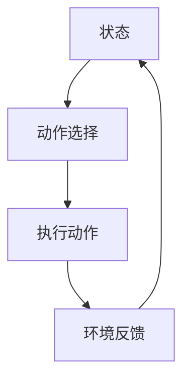
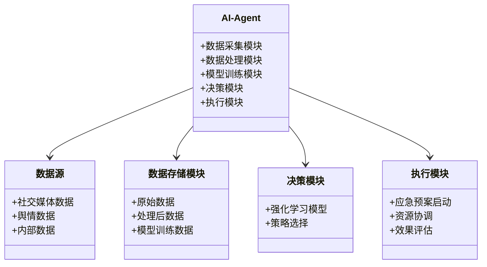

                 


# AI Agent在企业危机预警与应急响应中的关键作用

## 关键词：AI Agent，企业危机预警，应急响应，人工智能，危机管理，系统架构

## 摘要：  
本文详细探讨了AI Agent在企业危机预警与应急响应中的关键作用。通过分析AI Agent的核心技术、算法原理、系统架构以及实际应用场景，本文揭示了AI Agent如何通过智能化的感知、决策与执行能力，显著提升企业危机预警的准确性与应急响应的效率。文章结合实际案例与系统设计，为企业在危机管理中的智能化转型提供了 valuable insights and actionable strategies.

---

## 第1章: AI Agent与企业危机预警概述

### 1.1 AI Agent的基本概念  
AI Agent（人工智能代理）是指能够感知环境、自主决策并执行任务的智能系统。其核心特点包括：  
- **自主性**：能够在无需人工干预的情况下完成任务。  
- **反应性**：能够实时感知环境变化并做出响应。  
- **学习能力**：通过数据与经验不断优化自身的决策能力。  

AI Agent在企业危机预警中的作用主要体现在：  
1. **实时监测**：通过多源数据采集，识别潜在危机的早期信号。  
2. **智能分析**：利用AI算法对数据进行深度分析，评估危机的严重性与影响范围。  
3. **决策支持**：为应急响应提供智能化的决策建议。  

### 1.2 企业危机预警与应急响应的定义  
**危机预警**：指通过监测内外部环境的变化，识别可能对企业造成负面影响的事件或趋势，并提前发出警示。  
**应急响应**：指在危机发生后，企业迅速启动应急预案，协调资源，采取行动以降低损失的过程。  

企业在危机管理中面临的主要挑战包括：  
- 危机事件的复杂性与不确定性。  
- 应急响应的及时性与效率。  
- 跨部门协同与资源分配的难度。  

### 1.3 AI Agent在危机预警中的作用  
AI Agent通过以下方式显著提升了企业危机预警与应急响应的能力：  
1. **实时监测与数据分析**：AI Agent能够实时采集企业内外部数据（如社交媒体、舆情、市场数据等），并通过自然语言处理（NLP）与机器学习（ML）技术，识别潜在危机信号。  
2. **智能决策支持**：AI Agent基于历史数据与实时信息，评估危机的潜在影响，并生成应对策略。  
3. **快速响应与协调**：在危机发生时，AI Agent能够快速启动应急响应流程，并协调各部门资源，确保危机处理的高效性。  

---

## 第2章: AI Agent的核心技术与原理  

### 2.1 AI Agent的技术架构  
AI Agent的技术架构通常包括以下三个层次：  
1. **感知层**：负责数据的采集与初步分析。  
2. **决策层**：基于感知层提供的信息，进行决策与策略制定。  
3. **执行层**：根据决策层的指令，执行具体的行动。  

#### 感知层：数据采集与分析  
AI Agent的感知层通过多种数据源（如社交媒体、新闻、传感器等）采集数据，并利用NLP技术对文本数据进行情感分析与关键词提取。  
例如，当监测到社交媒体上出现大量负面评论时，AI Agent可以通过NLP技术识别出潜在的危机信号。  

#### 决策层：策略制定与优化  
决策层通过强化学习（Reinforcement Learning）算法，优化危机应对策略。例如，AI Agent可以通过强化学习模型，模拟不同的应对方案，并选择最优策略。  

#### 执行层：行动与反馈  
执行层负责根据决策层的指令，启动相应的应急响应流程。例如，AI Agent可以自动触发邮件或短信通知相关负责人，并生成应急响应计划。  

### 2.2 自然语言处理在AI Agent中的应用  
NLP技术在AI Agent中的应用主要体现在：  
1. **文本分析**：通过NLP技术对社交媒体、新闻等文本数据进行情感分析与关键词提取，识别潜在危机信号。  
2. **对话交互**：AI Agent可以通过自然语言理解（NLU）技术，与用户进行自然对话，获取更多信息并提供支持。  

#### 常见的NLP模型及其特点  
- **情感分析模型**：用于判断文本的情感倾向（正面、负面、中性）。  
- **关键词提取模型**：用于从文本中提取关键信息（如事件主题、时间、地点等）。  
- **对话模型**：用于实现人机交互，支持用户查询与问题解答。  

### 2.3 强化学习在AI Agent中的应用  
强化学习是一种通过试错方式优化决策的算法。在危机管理中，强化学习主要用于优化应急响应策略。  
例如，AI Agent可以通过强化学习模型，模拟不同的应对方案，并选择最优策略以最小化危机的影响。  

#### 强化学习算法流程图  



---

## 第3章: 危机预警与应急响应的体系构建  

### 3.1 危机预警体系的构建  
#### 危机预警的指标体系  
危机预警的指标体系通常包括以下几类：  
- **市场指标**：如股价波动、订单量变化等。  
- **舆情指标**：如社交媒体情感分析结果。  
- **内部指标**：如员工满意度、内部报告等。  

#### 数据采集与预处理  
数据预处理是危机预警系统的重要环节，主要包括：  
- **数据清洗**：去除噪声数据，确保数据质量。  
- **数据融合**：将多源数据进行整合，形成统一的数据集。  
- **特征提取**：从数据中提取关键特征，为模型提供输入。  

#### 预警模型的构建与优化  
预警模型通常采用机器学习算法，如随机森林（Random Forest）与支持向量机（SVM）。模型的优化可以通过交叉验证（Cross-Validation）进行。  

### 3.2 应急响应体系的设计  
#### 应急响应的流程设计  
应急响应的流程通常包括以下步骤：  
1. **危机确认**：通过预警系统确认危机的存在。  
2. **预案启动**：根据危机类型启动相应的应急预案。  
3. **资源协调**：协调各部门资源，启动应急响应行动。  
4. **行动执行**：执行具体的应对措施，如发布声明、调整策略等。  
5. **效果评估**：评估应急响应的效果，并总结经验教训。  

#### 应急预案的制定与执行  
应急预案的制定需要结合企业的实际情况，明确每个危机场景的应对措施。例如，当发生舆情危机时，应急预案可能包括：  
1. **舆情监控**：实时监控舆情变化。  
2. **快速响应**：通过AI Agent发布官方声明，回应公众关切。  
3. **舆情引导**：通过社交媒体传播正面信息，降低负面影响。  

### 3.3 AI Agent在危机预警与应急响应中的协同作用  
#### AI Agent如何优化预警体系  
AI Agent通过实时监测与智能分析，显著提升了危机预警的准确性和及时性。例如，当监测到潜在危机信号时，AI Agent可以提前通知相关部门，做好应对准备。  

#### AI Agent在应急响应中的具体应用  
在应急响应阶段，AI Agent可以通过以下方式提供支持：  
1. **快速决策支持**：基于实时数据与历史案例，提供最优应对策略。  
2. **资源协调**：协调各部门资源，确保应急响应的高效执行。  
3. **效果评估**：实时跟踪应急响应的效果，并动态调整应对措施。  

---

## 第4章: 系统架构与实现  

### 4.1 系统功能设计  
#### 领域模型（Mermaid类图）  



### 4.2 系统架构设计  
#### 系统架构图（Mermaid架构图）  

```mermaid
--- 
flowchart TD
    A[数据源] --> B[数据采集模块]
    B --> C[数据存储模块]
    C --> D[数据处理模块]
    D --> E[模型训练模块]
    E --> F[决策模块]
    F --> G[执行模块]
```

---

## 第5章: 项目实战  

### 5.1 环境安装与配置  
#### 环境要求  
- Python 3.8+  
- TensorFlow 2.0+  
- Scikit-learn 0.23+  
- NLTK 3.6+  

#### 安装依赖  
```bash
pip install numpy pandas scikit-learn tensorflow nltk
```

### 5.2 核心实现代码  

#### 数据预处理代码  
```python
import pandas as pd
import numpy as np

def preprocess_data(data):
    # 数据清洗
    data = data.dropna()
    data = data.replace([np.inf, -np.inf, np.nan], 0)
    
    # 数据转换
    data['date'] = pd.to_datetime(data['date'])
    data = data.sort_values('date')
    
    return data
```

#### 危机预警模型代码  
```python
from sklearn.ensemble import RandomForestClassifier
from sklearn.model_selection import train_test_split

def train_model(X, y):
    # 数据划分
    X_train, X_test, y_train, y_test = train_test_split(X, y, test_size=0.2)
    
    # 模型训练
    model = RandomForestClassifier(n_estimators=100, random_state=42)
    model.fit(X_train, y_train)
    
    return model
```

---

## 第6章: 最佳实践与未来展望  

### 6.1 最佳实践  
- **数据质量**：确保数据的准确性和完整性。  
- **模型优化**：通过不断优化模型参数与架构，提升预警的准确性。  
- **人机协同**：AI Agent应与人类专家协同工作，而非完全替代人类决策。  

### 6.2 小结与展望  
本文详细探讨了AI Agent在企业危机预警与应急响应中的关键作用。通过智能化的感知、决策与执行能力，AI Agent显著提升了企业的危机管理能力。未来，随着AI技术的不断发展，AI Agent在企业危机管理中的应用将更加广泛与深入。  

--- 

通过以上章节的详细讲解，本文为企业在危机管理中的智能化转型提供了 valuable insights and actionable strategies.

