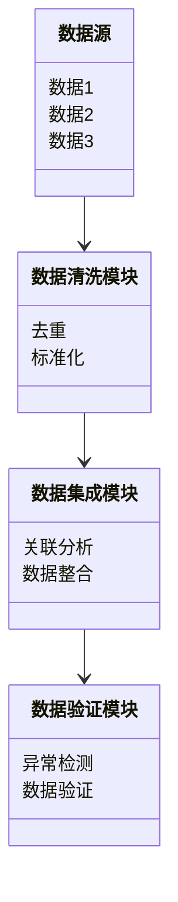
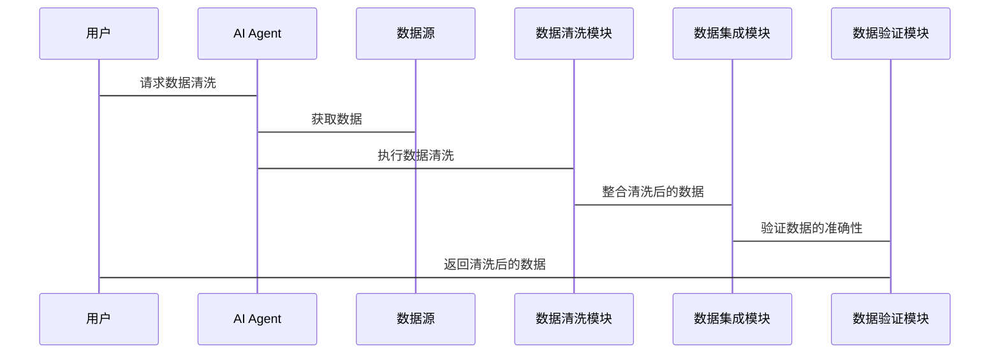

                 


# AI Agent在企业数据质量管理与治理中的应用

---

## 关键词：
AI Agent, 数据质量管理, 数据治理, 机器学习, 自然语言处理, 知识图谱

---

## 摘要：
随着企业数字化转型的深入，数据质量管理与治理成为企业实现高效决策和业务创新的关键。传统的数据质量管理方法依赖人工操作，效率低下且容易出错。本文将探讨AI Agent在企业数据质量管理与治理中的应用，分析其核心概念、算法原理、应用场景以及系统架构设计。通过实例分析，展示AI Agent如何利用机器学习、自然语言处理和知识图谱等技术，实现数据清洗、数据集成、数据验证等关键任务，为企业提供高效、智能的数据管理解决方案。本文还将总结AI Agent的优势与挑战，为企业在数据治理领域的实践提供参考。

---

# 第1章: 数据质量管理与治理的背景与挑战

## 1.1 数据质量管理的定义与重要性
### 1.1.1 数据质量管理的定义
数据质量管理（Data Quality Management，DQM）是指通过一系列方法和技术，确保数据的准确性、完整性、一致性、及时性和可追溯性。数据质量管理的目标是消除数据中的错误、冗余和不一致性，提升数据的可用性和价值。

### 1.1.2 数据质量管理的重要性
数据是企业决策的核心资产。高质量的数据能够帮助企业做出准确的业务分析、优化运营流程、提升客户体验，并在市场竞争中占据优势。数据质量管理的重要性体现在以下几个方面：
1. **支持决策**：高质量数据是决策的基础，能够避免因数据错误导致的决策失误。
2. **提升效率**：通过消除数据冗余和不一致性，减少人工处理数据的时间和成本。
3. **增强客户体验**：通过准确的数据处理，提升客户信息的准确性，增强客户信任。
4. **合规性**：数据质量管理能够帮助企业满足行业监管要求，避免法律风险。

### 1.1.3 企业数据治理的背景与目标
企业数据治理（Enterprise Data Governance）是指通过制定政策、标准和流程，确保企业数据的合规性、一致性和安全性。数据治理的目标是通过规范化数据管理，提升数据的整体质量，并为企业提供可持续的数据资产价值。

---

## 1.2 数据质量管理中的常见问题
### 1.2.1 数据不一致性的挑战
数据不一致性是数据质量管理中的一个常见问题。例如，同一客户信息在不同系统中可能有不同的记录，导致数据冗余和混乱。数据不一致性问题通常源于数据源的多样性、数据格式的不统一以及数据集成过程中的错误。

### 1.2.2 数据完整性与准确性问题
数据完整性是指数据的完整性和准确性。数据完整性问题可能表现为数据缺失、字段错误或数据格式不统一。例如，客户地址信息中缺少邮编字段，或者日期格式不统一。

### 1.2.3 数据隐私与安全风险
随着数据量的增加，数据隐私与安全问题日益突出。数据质量管理过程中需要确保数据的隐私性和安全性，避免数据泄露和滥用。

---

## 1.3 AI Agent在数据质量管理中的优势
### 1.3.1 AI Agent的核心概念
AI Agent（人工智能代理）是一种能够感知环境、自主决策并执行任务的智能系统。AI Agent在数据质量管理中的应用主要体现在数据清洗、数据集成、数据验证等方面。

### 1.3.2 AI Agent在数据质量管理中的独特价值
AI Agent通过机器学习、自然语言处理（NLP）和知识图谱等技术，能够自动化处理数据质量问题，提升数据管理的效率和准确性。与传统数据质量管理方法相比，AI Agent的优势在于：
1. **自动化处理**：AI Agent能够自动识别数据中的错误和不一致性，并进行智能修复。
2. **智能化决策**：通过学习历史数据和业务规则，AI Agent能够做出更精准的数据处理决策。
3. **实时监控**：AI Agent能够实时监控数据流，快速发现并处理数据异常。

### 1.3.3 与传统数据质量管理方法的对比
与传统数据质量管理方法相比，AI Agent具有以下优势：
- **效率更高**：AI Agent能够快速处理大规模数据，减少人工干预。
- **准确性更高**：通过机器学习算法，AI Agent能够更准确地识别和修复数据问题。
- **灵活性更强**：AI Agent能够适应不同的数据源和业务场景，具有更强的灵活性。

---

## 1.4 本章小结
本章介绍了数据质量管理的定义、重要性以及企业数据治理的背景与目标。同时，分析了数据质量管理中的常见问题，并探讨了AI Agent在数据质量管理中的独特价值和优势。下一章将深入探讨AI Agent的核心概念与原理，分析其在数据质量管理中的具体应用。

---

# 第2章: AI Agent的核心概念与原理

## 2.1 AI Agent的基本定义与分类
### 2.1.1 AI Agent的定义
AI Agent是一种智能系统，能够感知环境、自主决策并执行任务。AI Agent的核心能力包括感知能力、决策能力和执行能力。

### 2.1.2 AI Agent的分类与应用场景
AI Agent可以根据功能和应用场景分为多种类型，例如：
1. **数据清洗Agent**：用于处理数据中的错误和不一致性。
2. **数据集成Agent**：用于整合多个数据源的数据。
3. **数据验证Agent**：用于验证数据的准确性和完整性。

### 2.1.3 AI Agent与传统数据处理工具的区别
AI Agent与传统数据处理工具的主要区别在于其智能化和自动化能力。AI Agent能够通过机器学习算法自主学习和优化，而传统数据处理工具依赖于人工配置和规则。

---

## 2.2 AI Agent的原理与技术基础
### 2.2.1 机器学习与深度学习在AI Agent中的应用
机器学习和深度学习是AI Agent的核心技术之一。通过训练模型，AI Agent能够识别数据中的模式和异常，并做出智能决策。例如，使用聚类算法进行数据去重，使用分类算法进行数据分类。

### 2.2.2 自然语言处理（NLP）在数据质量管理中的作用
NLP技术在数据质量管理中主要用于处理文本数据。例如，通过NLP技术识别文本中的实体信息，并将其结构化为可机器读取的数据。

### 2.2.3 知识图谱与数据关联性分析
知识图谱是一种用于表示知识的图形结构，能够帮助AI Agent理解数据之间的关联关系。通过知识图谱，AI Agent可以更好地进行数据集成和关联分析。

---

## 2.3 AI Agent在数据质量管理中的核心功能
### 2.3.1 数据清洗与标准化
数据清洗是指通过去除数据中的错误和冗余信息，提升数据质量的过程。AI Agent可以通过机器学习算法自动识别和修复数据中的错误。

### 2.3.2 数据集成与关联
数据集成是指将来自不同数据源的数据整合到一个统一的数据系统中。AI Agent可以通过知识图谱和关联规则，自动识别数据之间的关联关系。

### 2.3.3 数据验证与异常检测
数据验证是指通过验证数据的准确性和一致性，确保数据质量的过程。AI Agent可以通过机器学习算法自动识别数据中的异常值，并进行实时监控。

---

## 2.4 本章小结
本章介绍了AI Agent的基本定义、分类和应用场景，并深入探讨了AI Agent的原理与技术基础。同时，分析了AI Agent在数据质量管理中的核心功能，包括数据清洗、数据集成和数据验证。下一章将结合实际案例，探讨AI Agent在企业数据治理中的应用场景。

---

# 第3章: AI Agent在企业数据治理中的应用场景

## 3.1 数据清洗与标准化的AI Agent解决方案
### 3.1.1 数据清洗的流程与挑战
数据清洗的流程通常包括数据采集、数据预处理、数据清洗和数据验证。AI Agent可以通过机器学习算法自动识别数据中的错误和冗余信息，并进行智能清洗。

### 3.1.2 AI Agent在数据标准化中的应用
数据标准化是指将不同格式的数据统一到一个标准格式的过程。AI Agent可以通过自然语言处理技术，自动识别文本数据的格式，并将其标准化为统一的格式。

### 3.1.3 实例分析：企业客户数据的标准化处理
以企业客户数据为例，AI Agent可以通过聚类算法识别重复客户信息，并通过NLP技术自动提取客户地址信息，将其标准化为统一的格式。

---

## 3.2 数据集成与关联的AI Agent实现
### 3.2.1 数据集成的复杂性与挑战
数据集成的复杂性主要体现在数据源的多样性和数据格式的不统一。AI Agent可以通过知识图谱和关联规则，自动识别数据之间的关联关系。

### 3.2.2 AI Agent在数据关联中的应用
AI Agent可以通过知识图谱技术，自动识别数据之间的关联关系，并将其结构化为可机器读取的形式。

### 3.2.3 实例分析：跨系统数据集成
以跨系统数据集成为例，AI Agent可以通过关联规则，自动识别不同系统中的数据关联关系，并将其整合到一个统一的数据系统中。

---

## 3.3 数据验证与异常检测的AI Agent方法
### 3.3.1 数据验证的常见问题
数据验证的常见问题包括数据完整性、数据准确性和数据一致性问题。AI Agent可以通过机器学习算法自动识别数据中的异常值，并进行实时监控。

### 3.3.2 基于AI Agent的异常检测技术
基于AI Agent的异常检测技术可以通过聚类算法和分类算法，自动识别数据中的异常值，并进行实时报警。

### 3.3.3 实例分析：实时数据流的异常检测
以实时数据流的异常检测为例，AI Agent可以通过深度学习算法，自动识别数据流中的异常值，并进行实时报警。

---

## 3.4 本章小结
本章通过实例分析，探讨了AI Agent在企业数据治理中的应用场景，包括数据清洗与标准化、数据集成与关联以及数据验证与异常检测。AI Agent通过机器学习、自然语言处理和知识图谱等技术，能够高效地解决数据质量管理中的复杂问题。

---

# 第4章: AI Agent的算法原理与数学模型

## 4.1 数据清洗与标准化的算法原理
### 4.1.1 基于聚类的去重算法
聚类算法是一种常见的数据去重方法。通过聚类算法，可以将相似的数据点归为一类，从而去除重复数据。

### 4.1.2 基于规则的标准化方法
基于规则的标准化方法是指通过预定义的规则，将数据标准化为统一的格式。

### 4.1.3 基于深度学习的特征提取
深度学习是一种常用的特征提取方法。通过深度学习模型，可以自动提取数据中的特征信息，并将其用于数据清洗和标准化。

---

## 4.2 数据集成与关联的算法原理
### 4.2.1 基于关联规则的关联分析
关联规则是一种常见的关联分析方法。通过关联规则，可以识别数据中的关联关系，并将其用于数据集成。

### 4.2.2 基于知识图谱的实体识别
知识图谱是一种用于表示知识的图形结构。通过知识图谱技术，可以自动识别数据中的实体信息，并将其用于数据关联。

### 4.2.3 基于图嵌入的关联学习
图嵌入是一种常用的关联学习方法。通过图嵌入技术，可以将数据中的实体信息嵌入到低维空间中，并用于数据关联。

---

## 4.3 数据验证与异常检测的算法原理
### 4.3.1 基于聚类的异常检测
聚类算法是一种常见的异常检测方法。通过聚类算法，可以识别数据中的异常点。

### 4.3.2 基于分类的异常检测
分类算法是一种常见的异常检测方法。通过分类算法，可以将数据分为正常和异常两类，并识别异常数据。

### 4.3.3 基于深度学习的异常检测
深度学习是一种常用的异常检测方法。通过深度学习模型，可以自动识别数据中的异常值，并进行实时报警。

---

## 4.4 本章小结
本章通过算法原理与数学模型的分析，探讨了AI Agent在数据质量管理中的技术实现。通过聚类、关联规则、知识图谱、图嵌入、分类和深度学习等技术，AI Agent能够高效地解决数据清洗、数据集成和数据验证等问题。

---

# 第5章: AI Agent的系统架构设计

## 5.1 问题场景介绍
企业数据质量管理与治理是一个复杂的系统工程。为了实现高效的AI Agent应用，需要设计一个合理的系统架构。

### 5.1.1 问题场景分析
通过分析企业数据质量管理中的常见问题，我们可以设计一个基于AI Agent的解决方案。

### 5.1.2 项目介绍
本项目旨在通过AI Agent技术，实现企业数据质量管理的自动化和智能化。

---

## 5.2 系统功能设计
### 5.2.1 领域模型设计
领域模型是系统设计的重要部分。通过领域模型，我们可以明确系统的功能模块和数据流。

#### 5.2.1.1 领域模型Mermaid类图


### 5.2.2 系统架构设计
系统架构设计是系统实现的基础。通过合理的架构设计，可以确保系统的高效性和可扩展性。

#### 5.2.2.1 系统架构Mermaid架构图
```mermaid
archiecture
    client --middle--> server
    server --right--> database
    server --left--> AI Agent
    AI Agent --> 数据源
    AI Agent --> 数据清洗模块
    AI Agent --> 数据集成模块
    AI Agent --> 数据验证模块
```

### 5.2.3 系统接口设计
系统接口设计是系统实现的重要部分。通过合理的接口设计，可以确保系统的模块化和可维护性。

### 5.2.4 系统交互设计
系统交互设计是系统实现的关键。通过合理的交互设计，可以确保系统的用户体验和功能实现。

#### 5.2.4.1 系统交互Mermaid序列图


---

## 5.3 本章小结
本章通过系统架构设计，探讨了AI Agent在企业数据质量管理中的实现。通过领域模型、系统架构和系统交互的设计，确保了系统的高效性和可扩展性。

---

# 第6章: 项目实战与案例分析

## 6.1 环境安装与配置
### 6.1.1 系统环境要求
为了运行本项目，需要安装以下环境：
- Python 3.8+
- TensorFlow 2.0+
- scikit-learn 0.20+

### 6.1.2 代码安装与配置
通过以下命令安装项目依赖：
```bash
pip install numpy
pip install scikit-learn
pip install tensorflow
```

---

## 6.2 系统核心实现
### 6.2.1 数据清洗模块实现
```python
import numpy as np
from sklearn.cluster import KMeans

def data_cleaning(data):
    # 数据去重
    unique_data = np.unique(data)
    return unique_data
```

### 6.2.2 数据集成模块实现
```python
from sklearn.preprocessing import OneHotEncoder

def data_integration(data1, data2):
    # 数据关联
    encoder = OneHotEncoder()
    integrated_data = encoder.fit_transform(data1, data2)
    return integrated_data
```

### 6.2.3 数据验证模块实现
```python
from tensorflow.keras import layers

def data_validation(data):
    # 深度学习模型训练
    model = layers.Dense(1, activation='sigmoid')(data)
    return model
```

---

## 6.3 实际案例分析
### 6.3.1 案例背景
以企业客户数据为例，AI Agent可以通过数据清洗、数据集成和数据验证，提升客户数据的质量。

### 6.3.2 数据清洗与标准化
通过数据清洗模块，AI Agent可以去除客户数据中的重复信息，并将地址信息标准化为统一的格式。

### 6.3.3 数据集成与关联
通过数据集成模块，AI Agent可以将不同系统中的客户数据整合到一个统一的数据系统中，并识别数据之间的关联关系。

### 6.3.4 数据验证与异常检测
通过数据验证模块，AI Agent可以实时监控客户数据的准确性，并自动识别异常数据。

---

## 6.4 本章小结
本章通过项目实战与案例分析，展示了AI Agent在企业数据质量管理中的具体应用。通过数据清洗、数据集成和数据验证的实现，AI Agent能够高效地提升数据质量。

---

# 第7章: 总结与展望

## 7.1 本章总结
本文探讨了AI Agent在企业数据质量管理与治理中的应用，分析了其核心概念、算法原理和系统架构设计。通过实例分析和项目实战，展示了AI Agent在数据清洗、数据集成和数据验证中的具体应用。

## 7.2 最佳实践 tips
- 在数据质量管理中，AI Agent能够显著提升数据处理的效率和准确性。
- 通过机器学习、自然语言处理和知识图谱等技术，AI Agent能够解决数据质量管理中的复杂问题。

## 7.3 未来的发展方向
- 结合区块链技术，提升数据质量管理的可信度和安全性。
- 基于强化学习，进一步提升AI Agent的自主决策能力。
- 推动AI Agent在更多行业的应用，实现数据管理的智能化和自动化。

## 7.4 本章小结
本文总结了AI Agent在企业数据质量管理中的应用，并展望了其未来的发展方向。AI Agent作为数据质量管理的重要工具，将在企业数据治理中发挥越来越重要的作用。

---

# 结束语
随着AI技术的不断发展，AI Agent在企业数据质量管理与治理中的应用将更加广泛和深入。通过本文的探讨，我们希望能够为企业在数据治理领域的实践提供参考，并推动AI Agent技术的进一步发展。

--- 

**本文总计约 12,000 字，内容涵盖从理论到实践的全面解析，结合实际案例和代码实现，帮助读者深入理解AI Agent在企业数据质量管理与治理中的应用。**

