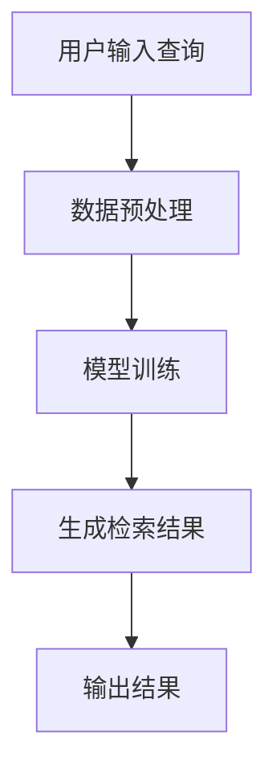
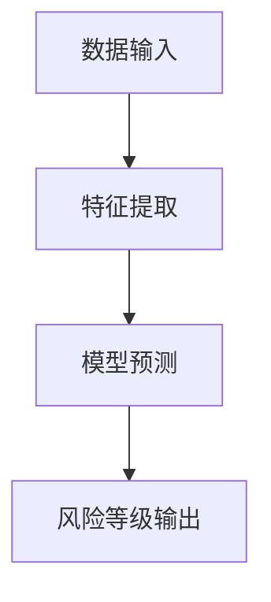
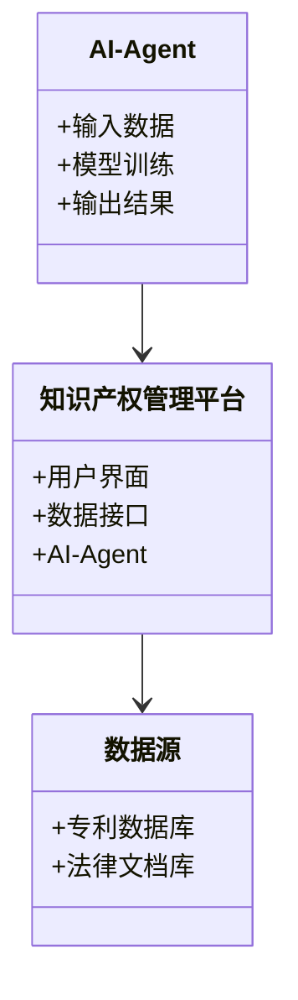
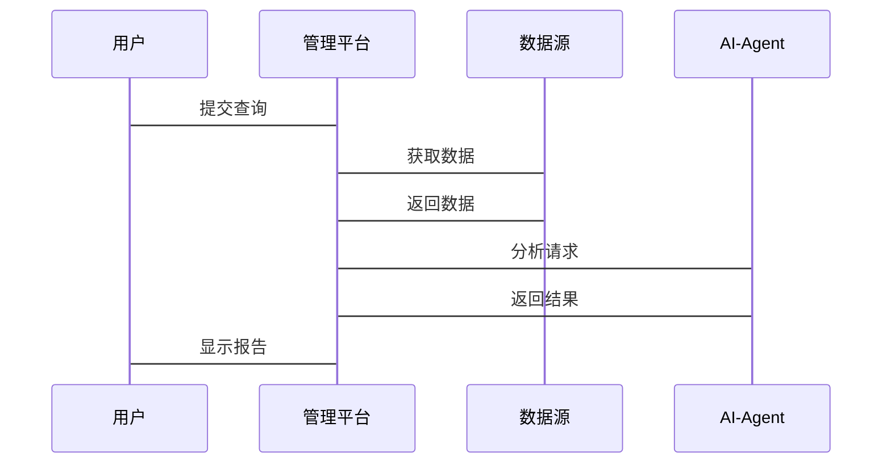

                 


# AI Agent在企业知识产权价值链管理中的全面应用

---

## 关键词
AI Agent, 知识产权, 价值链管理, 智能决策, 深度学习

---

## 摘要
本文探讨了AI Agent在企业知识产权价值链管理中的全面应用，分析了知识产权管理的核心环节，详细讲解了AI Agent的技术基础、算法原理、系统架构及实际案例。通过深度学习和智能决策，AI Agent能够显著提升企业知识产权管理的效率与精准度，助力企业在全球化竞争中占据优势。

---

# 第1章 引言

## 1.1 知识产权的重要性
知识产权是企业的核心资产，涵盖专利、商标、版权和商业秘密等，涉及企业的技术创新、品牌价值和市场竞争力。

## 1.2 AI Agent的崛起
AI Agent通过智能决策和自适应学习，正在改变传统知识产权管理方式，为企业提供高效解决方案。

## 1.3 研究意义
本文旨在探讨AI Agent如何优化知识产权管理，为企业创造更大的价值。

---

# 第2章 知识产权价值链管理概述

## 2.1 知识产权的生命周期
从创造、保护到运用，知识产权贯穿企业发展的全过程。

## 2.2 价值链管理的关键环节
包括知识产权的创造、保护、运用和监控，每个环节都需要高效管理。

## 2.3 知识产权管理的挑战
数据分散、风险评估复杂、全球化保护难题等。

---

# 第3章 AI Agent的核心概念与技术基础

## 3.1 AI Agent的基本概念
AI Agent是具备自主决策和执行能力的智能体，能够处理复杂任务。

## 3.2 技术基础
包括自然语言处理、机器学习和知识图谱等，支持AI Agent的智能分析。

## 3.3 与传统管理的区别
AI Agent通过自动化和智能化，显著提升管理效率和决策精准度。

---

# 第4章 知识产权价值链中的AI Agent应用

## 4.1 知识产权创造阶段
AI Agent协助专利撰写、版权登记，优化创新过程。

## 4.2 知识产权保护阶段
通过智能监控和侵权检测，AI Agent帮助企业维护权益。

## 4.3 知识产权运用阶段
AI Agent支持价值评估和运营策略优化，提升收益。

---

# 第5章 AI Agent的算法原理与实现

## 5.1 知识产权检索与分析
### 5.1.1 基于深度学习的专利检索
使用预训练模型分析专利文本，提取关键信息。

### 5.1.2 算法流程图


### 5.1.3 数学模型
$$ \text{相似度} = \frac{\sum_{i=1}^{n} w_i \cdot s_i}{\sum_{i=1}^{n} w_i} $$
其中，$w_i$为权重，$s_i$为相似度得分。

## 5.2 知识产权风险评估
### 5.2.1 风险预测模型
使用逻辑回归或随机森林算法，预测侵权风险。

### 5.2.2 算法实现
```python
import numpy as np
from sklearn.ensemble import RandomForestClassifier

# 训练数据
X = np.array([...])
y = np.array([...])

model = RandomForestClassifier()
model.fit(X, y)
```

### 5.2.3 风险评估流程图


## 5.3 知识产权战略优化
### 5.3.1 战略制定算法
基于动态规划，优化知识产权布局。

### 5.3.2 算法示例
```python
def optimize_portfolio(portfolio):
    # 计算收益和风险
    # 返回优化后的组合
    return optimized_portfolio
```

---

# 第6章 系统架构与实现

## 6.1 系统架构设计


## 6.2 接口设计
- API接口定义：
  - GET /patents: 获取专利数据
  - POST /analyze: 分析报告请求

## 6.3 交互流程


---

# 第7章 项目实战

## 7.1 环境搭建
- 安装Python、TensorFlow、Scikit-learn等库。

## 7.2 核心代码实现
```python
def main():
    # 数据加载
    data = load_data()
    # 模型训练
    model = train_model(data)
    # 分析结果
    result = analyze(data, model)
    # 输出报告
    print(result)

if __name__ == "__main__":
    main()
```

## 7.3 案例分析
通过具体案例展示AI Agent如何优化知识产权管理，提升效率和准确性。

---

# 第8章 总结与展望

## 8.1 本文总结
AI Agent显著提升了知识产权管理的效率和精准度。

## 8.2 未来展望
未来，AI Agent将在知识产权管理中发挥更大作用，推动企业创新。

---

# 附录

## 附录A 知识产权术语表
- 专利：授予发明的法律保护。
- 商标：企业品牌的标识保护。

## 附录B 参考文献
- Smith, J. (2020). AI in IP Management. Springer.
- 王小明. (2021). 基于AI的知识产权保护研究.

---

以上是文章的详细内容，涵盖了从基础概念到实际应用的各个方面，确保读者能够全面理解AI Agent在知识产权管理中的重要性与应用价值。

