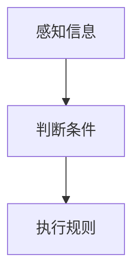
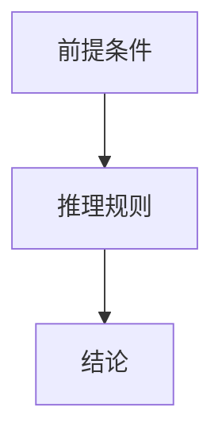
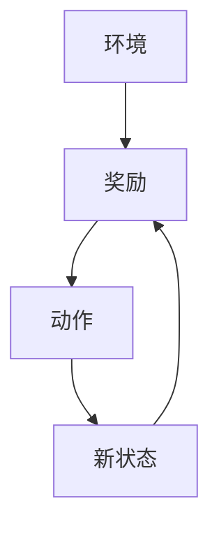
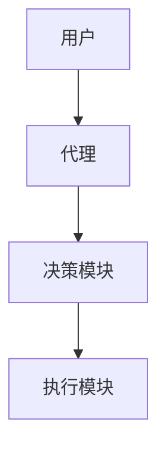
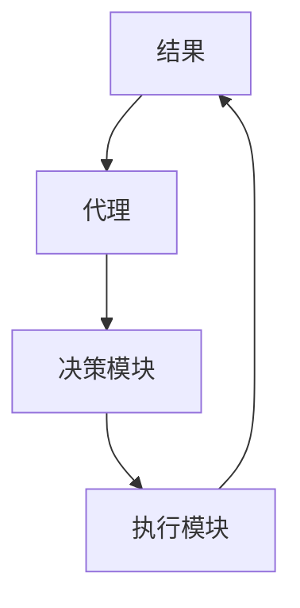

                 


# AI Agent在复杂决策系统中的应用与优化

## 关键词：AI Agent，复杂决策系统，优化方法，强化学习，多智能体协作，系统架构

## 摘要：  
本文详细探讨了AI Agent在复杂决策系统中的应用与优化方法。首先介绍了AI Agent的基本概念和复杂决策系统的定义，接着分析了AI Agent在复杂决策系统中的核心原理，包括感知、决策和执行机制。然后，深入讨论了复杂决策系统的建模与分析，提出了基于AI Agent的优化方法，如强化学习和多智能体协作。最后，通过项目实战案例，展示了AI Agent在复杂决策系统中的具体应用，并总结了最佳实践和未来发展方向。

---

## 第1章: AI Agent概述

### 1.1 AI Agent的基本概念

#### 1.1.1 什么是AI Agent
AI Agent（人工智能代理）是指能够感知环境、自主决策并执行任务的智能实体。AI Agent可以是软件程序、机器人或其他智能系统，其核心目标是通过与环境的交互，实现特定的目标或解决复杂问题。

#### 1.1.2 AI Agent的特点与分类
AI Agent具有以下特点：
- **自主性**：能够自主决策，无需外部干预。
- **反应性**：能够实时感知环境并做出反应。
- **目标导向性**：具有明确的目标，并通过行为实现目标。
- **学习能力**：能够通过经验改进性能。

AI Agent可以分为以下几类：
- **简单反射型Agent**：基于规则做出反应，适用于简单的决策任务。
- **基于模型的反射型Agent**：通过内部模型进行推理和决策，适用于复杂任务。
- **目标驱动型Agent**：以目标为导向，优化行为以达到目标。
- **实用驱动型Agent**：以效用最大化为目标，适用于多智能体协作场景。

#### 1.1.3 AI Agent在复杂决策系统中的作用
在复杂决策系统中，AI Agent能够处理多目标、动态变化和高维状态空间的问题，通过自主决策和协作实现系统的高效运行。

### 1.2 复杂决策系统的定义与特点

#### 1.2.1 复杂决策系统的定义
复杂决策系统是指涉及多个决策主体、目标冲突、环境动态变化且具有高度不确定性的系统。这类系统需要通过智能代理进行协调和优化，以实现整体目标的最优。

#### 1.2.2 复杂决策系统的特征
复杂决策系统的特征包括：
- **多目标性**：系统中有多个目标，且目标之间可能存在冲突。
- **动态性**：环境和状态随时变化，决策需要动态调整。
- **高维性**：系统状态空间维度高，决策复杂性大。
- **不确定性**：系统中存在不确定性和模糊性，决策需要考虑多种可能性。

#### 1.2.3 复杂决策系统的应用场景
复杂决策系统的应用场景包括：
- **自动驾驶**：车辆需要实时感知环境并做出决策。
- **金融投资**：需要在复杂市场中做出最优投资决策。
- **智能交通管理**：协调交通流以减少拥堵。
- **智能制造**：优化生产流程和资源分配。

### 1.3 AI Agent与复杂决策系统的结合

#### 1.3.1 AI Agent在复杂决策系统中的优势
AI Agent在复杂决策系统中的优势包括：
- **高效性**：能够快速处理大量信息并做出决策。
- **适应性**：能够根据环境变化自适应调整策略。
- **协作性**：多个AI Agent可以协作完成复杂任务。

#### 1.3.2 复杂决策系统对AI Agent的需求
复杂决策系统对AI Agent的需求包括：
- **高计算能力**：处理复杂决策任务需要强大的计算能力。
- **多智能体协作**：需要多个AI Agent协作完成任务。
- **动态适应性**：能够快速适应环境变化。

#### 1.3.3 AI Agent在复杂决策系统中的应用现状
当前，AI Agent在复杂决策系统中的应用已经取得了一些成果，但在动态性、不确定性较高的场景中仍面临挑战。

### 1.4 本章小结
本章介绍了AI Agent的基本概念和复杂决策系统的定义，分析了AI Agent在复杂决策系统中的作用和优势，为后续章节的深入讨论奠定了基础。

---

## 第2章: AI Agent的核心原理

### 2.1 AI Agent的基本原理

#### 2.1.1 感知机制
感知机制是AI Agent获取环境信息的关键步骤。通过传感器、数据输入等手段，AI Agent能够感知当前的状态和环境。

#### 2.1.2 决策机制
决策机制是AI Agent根据感知信息，基于一定的算法和模型，做出决策的过程。决策机制的核心是选择最优或满意的行为。

#### 2.1.3 执行机制
执行机制是AI Agent将决策转化为具体行动的过程。通过执行机制，AI Agent能够与环境进行交互，实现目标。

### 2.2 复杂决策系统中的AI Agent特点

#### 2.2.1 多目标优化
在复杂决策系统中，AI Agent需要在多个目标之间进行权衡，找到最优解。

#### 2.2.2 动态环境适应性
复杂决策系统的环境是动态变化的，AI Agent需要能够快速适应环境变化。

#### 2.2.3 高效计算能力
复杂决策系统需要处理大量信息，AI Agent需要具备高效的计算能力。

### 2.3 AI Agent的核心算法

#### 2.3.1 基于规则的决策算法
基于规则的决策算法通过预定义的规则进行决策。例如，如果条件满足，则执行相应动作。



#### 2.3.2 基于逻辑推理的决策算法
基于逻辑推理的决策算法通过逻辑推理引擎进行决策。例如，通过推理规则库推导出结论。



#### 2.3.3 基于机器学习的决策算法
基于机器学习的决策算法通过训练模型进行决策。例如，使用决策树、随机森林等算法进行分类或回归。

### 2.4 本章小结
本章详细介绍了AI Agent的核心原理，包括感知、决策和执行机制，并分析了复杂决策系统中AI Agent的特点和核心算法。

---

## 第3章: 复杂决策系统的建模与分析

### 3.1 复杂决策系统的建模方法

#### 3.1.1 领域模型的构建
领域模型是复杂决策系统建模的基础。通过领域模型，可以明确系统的功能和交互关系。

```mermaid
classDiagram
    class 系统状态 {
        状态1
        状态2
        状态3
    }
    class 行为模型 {
        行为1
        行为2
        行为3
    }
    系统状态 <--| 行为模型
```

#### 3.1.2 系统状态表示
系统状态表示是复杂决策系统建模的重要部分。通过状态表示，可以描述系统的当前情况。

#### 3.1.3 行为模型设计
行为模型设计是复杂决策系统建模的关键。通过行为模型，可以描述系统如何根据状态做出决策。

### 3.2 AI Agent在复杂决策系统中的建模挑战

#### 3.2.1 高维状态空间的处理
复杂决策系统通常具有高维状态空间，如何有效处理高维状态空间是一个挑战。

#### 3.2.2 动态环境的建模
复杂决策系统的环境是动态变化的，如何建模动态环境是一个难点。

#### 3.2.3 多智能体协作的建模
在多智能体协作的场景中，如何建模多个AI Agent之间的协作关系是一个挑战。

### 3.3 基于AI Agent的复杂决策系统分析

#### 3.3.1 系统性能评估
系统性能评估是复杂决策系统分析的重要部分。通过评估系统的性能，可以优化AI Agent的行为。

#### 3.3.2 系统鲁棒性分析
系统鲁棒性分析是确保复杂决策系统在各种情况下都能稳定运行的关键。

#### 3.3.3 系统扩展性分析
系统扩展性分析是确保复杂决策系统能够适应未来需求的重要部分。

### 3.4 本章小结
本章详细介绍了复杂决策系统的建模方法，并分析了AI Agent在复杂决策系统中的建模挑战和系统分析方法。

---

## 第4章: AI Agent的优化方法

### 4.1 强化学习优化方法

#### 4.1.1 强化学习的基本原理
强化学习是一种通过试错学习的算法。AI Agent通过与环境的交互，逐步学习最优策略。



#### 4.1.2 基于Q-learning的优化方法
Q-learning是一种经典的强化学习算法。通过Q表，AI Agent可以学习最优动作。

$$ Q(s, a) = Q(s, a) + \alpha (r + \gamma \max Q(s', a') - Q(s, a)) $$

#### 4.1.3 基于深度强化学习的优化方法
深度强化学习通过深度神经网络进行决策，适用于高维状态空间的复杂任务。

### 4.2 多智能体协作优化方法

#### 4.2.1 多智能体协作的基本原理
多智能体协作是指多个AI Agent通过协作完成复杂任务。协作机制包括通信、协调和共享。

#### 4.2.2 基于博弈论的协作优化
通过博弈论，多个AI Agent可以在冲突中找到均衡点，实现协作优化。

#### 4.2.3 基于分布式计算的协作优化
通过分布式计算，多个AI Agent可以并行处理任务，提高效率。

### 4.3 本章小结
本章详细介绍了AI Agent的优化方法，包括强化学习和多智能体协作优化，并通过数学公式和算法流程图进行了详细讲解。

---

## 第5章: 项目实战——复杂决策系统的AI Agent实现

### 5.1 项目背景与目标
本项目旨在实现一个基于AI Agent的复杂决策系统，解决实际问题。

### 5.2 系统功能设计

#### 5.2.1 领域模型设计
领域模型是系统设计的基础，通过领域模型明确系统功能。

```mermaid
classDiagram
    class 状态 {
        状态1
        状态2
        状态3
    }
    class 动作 {
        动作1
        动作2
        动作3
    }
    状态 <--| 动作
```

#### 5.2.2 系统架构设计
系统架构设计是系统实现的关键。通过分层架构，可以明确各部分的功能。



### 5.3 系统核心实现

#### 5.3.1 环境搭建
需要安装必要的库和工具，例如Python、TensorFlow等。

#### 5.3.2 AI Agent实现
通过Python代码实现AI Agent，包括感知、决策和执行模块。

```python
class AI-Agent:
    def __init__(self):
        self.state = None
        self.action = None

    def perceive(self, environment):
        self.state = environment.get_state()
        return self.state

    def decide(self, state):
        # 假设使用Q-learning算法
        action = self.Qlearning.choose_action(state)
        return action

    def execute(self, action):
        # 执行动作
        pass
```

#### 5.3.3 系统交互实现
通过系统交互流程图，展示系统各部分的交互过程。



### 5.4 项目小结
本章通过项目实战，详细讲解了AI Agent在复杂决策系统中的实现过程，包括环境搭建、系统设计和代码实现。

---

## 第6章: 总结与展望

### 6.1 本章总结
本文详细探讨了AI Agent在复杂决策系统中的应用与优化方法，通过理论分析和项目实战，展示了AI Agent在复杂决策系统中的巨大潜力。

### 6.2 最佳实践tips
- 在复杂决策系统中，AI Agent需要具备高效计算能力和动态适应性。
- 多智能体协作是解决复杂问题的重要手段。
- 强化学习是优化AI Agent行为的有效方法。

### 6.3 未来展望
未来，AI Agent在复杂决策系统中的应用将更加广泛，优化方法也将更加成熟。

---

# 关键词：AI Agent，复杂决策系统，优化方法，强化学习，多智能体协作，系统架构

# 摘要：  
本文详细探讨了AI Agent在复杂决策系统中的应用与优化方法。首先介绍了AI Agent的基本概念和复杂决策系统的定义，接着分析了AI Agent在复杂决策系统中的核心原理，包括感知、决策和执行机制。然后，深入讨论了复杂决策系统的建模与分析，提出了基于AI Agent的优化方法，如强化学习和多智能体协作。最后，通过项目实战案例，展示了AI Agent在复杂决策系统中的具体应用，并总结了最佳实践和未来发展方向。

---

## 结束语
通过本文的探讨，我们可以看到AI Agent在复杂决策系统中的巨大潜力。未来，随着技术的进步，AI Agent将在更多领域得到广泛应用，为人类社会带来更多的便利和效益。

