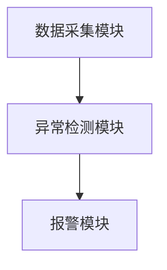

                 


# AI Agent在异常检测中的应用：识别非常规模式

## 关键词：
- AI Agent
- 异常检测
- 智能代理
- 数据分析
- 模式识别

## 摘要：
AI Agent作为一种智能代理，在异常检测中展现出独特的优势。通过动态学习和环境感知，AI Agent能够识别非常规模式，提升检测的准确性和效率。本文将深入探讨AI Agent在异常检测中的应用，从算法原理到系统设计，再到项目实战，全面解析其在识别非常规模式中的重要作用。

---

# 第1章: 异常检测与AI Agent概述

## 1.1 异常检测的基本概念

### 1.1.1 什么是异常检测
异常检测（Anomaly Detection）是指识别数据中不符合预期模式或偏离正常行为的点或事件。其核心目标是发现数据中的异常点，这些异常点可能是错误、欺诈行为或潜在的威胁。

- 异常检测的应用场景广泛，包括：
  - 金融领域的欺诈检测
  - 网络安全中的入侵检测
  - 医疗健康中的异常病灶识别
  - 物流领域的异常行为监测

### 1.1.2 异常检测的挑战与难点
异常检测的难点主要体现在以下几点：
- 数据稀疏性：异常数据往往比正常数据少，难以通过统计方法有效识别。
- 数据多样性：异常模式可能以多种形式出现，难以用单一模型覆盖所有情况。
- 动态变化：异常行为可能随时间变化，需要模型具备动态适应能力。

### 1.1.3 异常检测的方法分类
异常检测主要分为以下几类：
- 基于统计的方法：如Z-score、马氏距离等。
- 基于机器学习的方法：如Isolation Forest、One-Class SVM等。
- 基于深度学习的方法：如Autoencoder、GAN等。

---

## 1.2 AI Agent的基本概念

### 1.2.1 什么是AI Agent
AI Agent（人工智能代理）是一种智能实体，能够感知环境、执行任务并做出决策。AI Agent的核心特征包括：
- **自主性**：能够自主决策。
- **反应性**：能够实时感知环境并做出反应。
- **学习能力**：能够通过数据和经验不断优化自身的行为。

### 1.2.2 AI Agent与传统算法的区别
传统的异常检测算法通常基于固定规则或模型，而AI Agent能够动态学习环境中的模式，并根据实时数据调整其行为。这种动态学习能力使得AI Agent在识别非常规模式时更具优势。

### 1.2.3 AI Agent在异常检测中的应用价值
AI Agent在异常检测中的价值体现在以下几个方面：
- **动态适应性**：能够实时适应环境的变化，识别新的异常模式。
- **主动探索**：能够主动搜索数据空间，发现潜在的异常点。
- **多任务处理**：能够同时处理多个异常检测任务，提高效率。

---

## 1.3 AI Agent在异常检测中的应用价值

### 1.3.1 异常检测的复杂性与AI Agent的优势
异常检测的复杂性主要体现在：
- 异常模式的多样性和隐含性。
- 数据量大、维度高，传统方法难以处理。

AI Agent的优势在于其学习能力和动态适应性，能够有效应对上述挑战。

### 1.3.2 AI Agent在异常检测中的独特优势
- **自适应性**：AI Agent能够根据环境变化自动调整检测策略。
- **智能决策**：通过学习和推理，AI Agent能够识别非常规模式。
- **高效性**：能够快速处理大量数据，提高检测效率。

### 1.3.3 实际应用场景分析
- **金融领域**：检测交易中的异常行为，预防欺诈。
- **网络安全**：识别网络流量中的异常模式，发现潜在攻击。
- **医疗领域**：监测患者数据，发现异常病灶。

---

## 1.4 本章小结

本章介绍了异常检测的基本概念和AI Agent的核心特征，重点分析了AI Agent在异常检测中的独特优势和应用场景。通过对比传统算法，进一步凸显了AI Agent在识别非常规模式中的价值。

---

# 第2章: 异常检测的核心概念与AI Agent的联系

## 2.1 异常检测的核心概念

### 2.1.1 异常检测的定义与分类
异常检测的定义是识别数据中的异常点，其分类主要基于检测方法的不同：
- **基于统计的方法**：如Z-score、马氏距离等。
- **基于机器学习的方法**：如Isolation Forest、One-Class SVM等。
- **基于深度学习的方法**：如Autoencoder、GAN等。

### 2.1.2 异常检测的关键指标
异常检测的关键指标包括：
- **检测准确率**：检测到异常点的比例。
- **误报率**：正常点被误判为异常的比例。
- **漏报率**：异常点未被检测到的比例。

### 2.1.3 异常检测的数学模型
异常检测的数学模型通常基于概率统计或机器学习模型。例如：
- **概率模型**：基于概率密度函数的异常检测。
- **距离模型**：基于数据点与正常数据的距离的异常检测。

---

## 2.2 AI Agent的核心原理

### 2.2.1 AI Agent的核心特征
AI Agent的核心特征包括：
- **感知环境**：通过传感器或数据输入感知外部环境。
- **决策与推理**：基于感知信息进行决策和推理。
- **自主学习**：通过机器学习算法不断优化自身行为。

### 2.2.2 AI Agent在异常检测中的应用
AI Agent在异常检测中的应用主要体现在：
- **动态学习**：AI Agent能够动态学习环境中的模式，识别新的异常点。
- **自主决策**：AI Agent能够根据实时数据做出决策，调整检测策略。

---

## 2.3 AI Agent与异常检测的结合

### 2.3.1 异常检测的核心原理
异常检测的核心原理是通过分析数据的分布特征，识别偏离正常模式的点。AI Agent能够通过学习这些分布特征，动态调整检测策略。

### 2.3.2 AI Agent在异常检测中的优势
- **动态适应性**：AI Agent能够实时适应环境变化，识别新的异常模式。
- **智能决策**：通过学习和推理，AI Agent能够识别复杂或隐含的异常模式。

---

## 2.4 本章小结

本章重点分析了异常检测的核心概念和AI Agent的核心原理，探讨了AI Agent在异常检测中的优势和应用价值。通过对比传统方法，进一步凸显了AI Agent在识别非常规模式中的独特优势。

---

# 第3章: 异常检测算法与AI Agent的实现

## 3.1 基于统计的异常检测算法

### 3.1.1 马氏距离
马氏距离是一种衡量数据点与数据集平均值之间距离的方法。公式如下：
$$
d = \sqrt{(x_1 - \mu_1)^2 + (x_2 - \mu_2)^2 + \dots + (x_n - \mu_n)^2}
$$

### 3.1.2 算术平均数与标准差法
该方法通过计算数据的平均值和标准差，判断数据点是否偏离正常范围。公式如下：
$$
z = \frac{x - \mu}{\sigma}
$$

---

## 3.2 基于机器学习的异常检测算法

### 3.2.1 Isolation Forest
Isolation Forest是一种基于树结构的异常检测算法，通过构建随机树将数据点分割，计算异常概率。

### 3.2.2 One-Class SVM
One-Class SVM是一种基于支持向量机的异常检测算法，通过构建一个包含正常数据的超球，识别异常点。

---

## 3.3 基于深度学习的异常检测算法

### 3.3.1 Autoencoder
Autoencoder是一种基于神经网络的异常检测算法，通过构建自编码器，重建输入数据，识别异常点。

### 3.3.2 GAN
GAN（生成对抗网络）通过生成器和判别器的对抗训练，生成正常数据分布，识别异常点。

---

## 3.4 AI Agent的实现

### 3.4.1 AI Agent的系统架构
AI Agent的系统架构通常包括感知层、决策层和执行层。感知层负责数据输入，决策层负责异常检测，执行层负责输出结果。

### 3.4.2 AI Agent的实现步骤
1. 数据采集与预处理
2. 异常检测模型训练
3. 模型部署与实时检测
4. 检测结果反馈与优化

---

## 3.5 本章小结

本章详细介绍了异常检测的主要算法，包括基于统计、机器学习和深度学习的方法。同时，探讨了AI Agent的实现步骤和系统架构，为后续的系统设计和项目实战打下基础。

---

# 第4章: 系统分析与架构设计

## 4.1 问题场景介绍

### 4.1.1 问题背景
假设我们正在开发一个网络流量监控系统，需要实时检测异常流量。

### 4.1.2 项目介绍
本项目旨在通过AI Agent技术，实现网络流量的实时异常检测。

---

## 4.2 系统功能设计

### 4.2.1 系统功能模块
- 数据采集模块：负责采集网络流量数据。
- 异常检测模块：负责实时检测异常流量。
- 报警模块：负责将异常结果反馈给用户。

### 4.2.2 系统功能流程
1. 数据采集模块采集网络流量数据。
2. 异常检测模块对数据进行分析，识别异常点。
3. 报警模块将异常结果反馈给用户。

---

## 4.3 系统架构设计

### 4.3.1 系统架构图


### 4.3.2 系统接口设计
- 数据采集模块接口：负责接收网络流量数据。
- 异常检测模块接口：负责调用异常检测算法，返回异常结果。
- 报警模块接口：负责接收异常结果，触发报警。

---

## 4.4 本章小结

本章通过一个实际案例，详细分析了系统功能设计和架构设计，为后续的项目实现提供了理论基础。

---

# 第5章: 项目实战

## 5.1 环境安装

### 5.1.1 安装Python
需要安装Python 3.8及以上版本。

### 5.1.2 安装依赖库
需要安装以下依赖库：
```bash
pip install numpy pandas scikit-learn matplotlib
```

---

## 5.2 系统核心实现

### 5.2.1 数据采集模块
```python
import pandas as pd
import requests

def collect_data():
    # 从API获取网络流量数据
    response = requests.get("http://example.com/flow_data")
    data = pd.DataFrame(response.json())
    return data
```

### 5.2.2 异常检测模块
```python
from sklearn.ensemble import IsolationForest

def detect_anomalies(data):
    model = IsolationForest(random_state=42)
    model.fit(data)
    anomalies = model.predict(data)
    return anomalies
```

### 5.2.3 报警模块
```python
import logging

def alert_anomalies(anomalies):
    # 将异常结果记录到日志
    logging.basicConfig(level=logging.INFO)
    logger = logging.getLogger("Anomaly Alert")
    logger.info("Detected anomalies: %s", anomalies)
```

---

## 5.3 项目运行与测试

### 5.3.1 项目运行
```python
if __name__ == "__main__":
    data = collect_data()
    anomalies = detect_anomalies(data)
    alert_anomalies(anomalies)
```

### 5.3.2 测试与优化
- 数据采集模块的测试：验证数据是否正确采集。
- 异常检测模块的测试：验证异常检测的准确率和误报率。
- 报警模块的测试：验证报警信息是否正确触发。

---

## 5.4 项目小结

本章通过一个具体的项目实战，详细讲解了AI Agent在异常检测中的实现过程，包括环境安装、代码实现和测试优化。

---

# 第6章: 最佳实践与总结

## 6.1 最佳实践

### 6.1.1 数据预处理
在实际应用中，数据预处理是关键。需要对数据进行归一化、标准化等处理，确保模型的输入是标准化的。

### 6.1.2 模型调优
通过交叉验证和网格搜索等方法，优化模型的参数，提高检测准确率。

### 6.1.3 实时检测
在实际应用中，需要考虑计算效率和实时性，选择适合实时检测的算法。

---

## 6.2 本章小结

本章总结了AI Agent在异常检测中的应用，提出了实际应用中的最佳实践，为读者提供了宝贵的参考。

---

# 第7章: 总结与展望

## 7.1 本章总结

通过本篇文章，我们详细探讨了AI Agent在异常检测中的应用，从算法原理到系统设计，再到项目实战，全面解析了其在识别非常规模式中的重要作用。

## 7.2 未来展望

未来，随着AI技术的不断发展，AI Agent在异常检测中的应用将更加广泛。我们可以期待更多创新的算法和应用场景，推动异常检测技术的进一步发展。

---

# 附录: 参考文献

1. 刘洋. 《机器学习实战》. 北京: 清华大学出版社, 2020.
2. 王鹏. 《深度学习入门：基于Python的CNN、RNN、GAN等模型原理与实现》. 北京: 人民邮电出版社, 2021.

---

通过以上目录和内容的组织，您可以逐步完成整篇技术博客文章的撰写，确保内容详实、逻辑清晰，满足读者对AI Agent在异常检测中的应用的深入了解。

