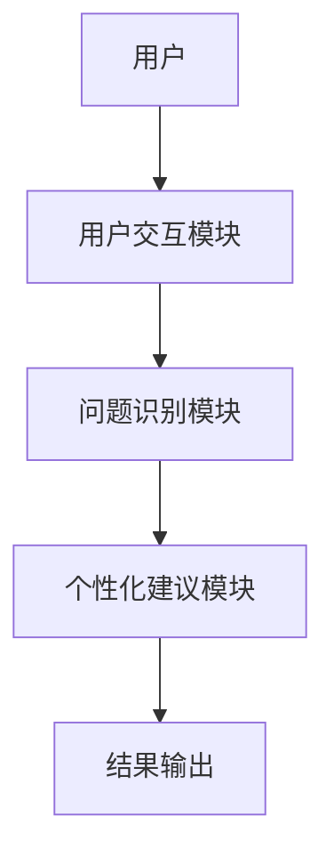
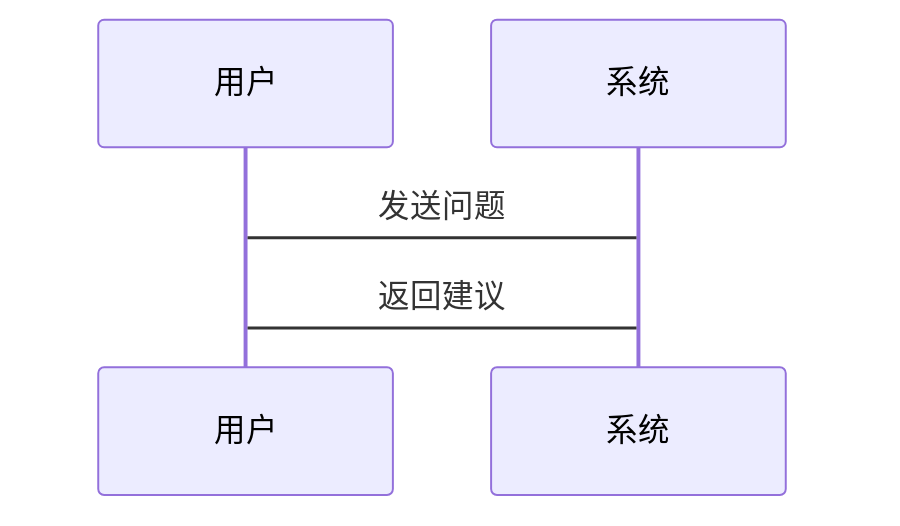

                 


# AI Agent在心理健康咨询中的应用与局限

> 关键词：AI Agent，心理健康咨询，自然语言处理，机器学习，情感分析，伦理与隐私

> 摘要：本文系统地探讨了AI Agent在心理健康咨询中的应用与局限。通过分析AI Agent的核心技术、在心理健康咨询中的功能定位，以及其在实际应用中的算法原理和系统架构，本文揭示了AI Agent在心理健康咨询中的潜力和局限性。同时，本文还结合实际案例，详细阐述了AI Agent在心理健康咨询中的实现过程，并提出了相应的优化建议和未来研究方向。

---

## 第1章: AI Agent与心理健康咨询的背景介绍

### 1.1 心理健康咨询的基本概念

心理健康咨询是一种通过专业的心理辅导帮助个体解决心理问题、改善心理状态的过程。其核心在于通过倾听、理解和支持，帮助个体识别和处理情绪困扰、行为问题以及心理障碍。

#### 1.1.1 心理健康与心理咨询的定义
心理健康是指个体在心理、情绪和社会适应等方面的状态良好，能够有效应对生活中的挑战。心理咨询则是通过专业的心理疏导和干预，帮助个体解决心理问题的过程。

#### 1.1.2 心理健康咨询的主要形式
- **面对面咨询**：心理咨询师与来访者进行一对一的交流。
- **团体咨询**：多个人参与的小组咨询形式。
- **电话/网络咨询**：通过电话或网络平台进行的心理咨询。

#### 1.1.3 传统心理咨询的局限性
- **资源有限**：心理咨询师的数量有限，难以覆盖广泛的需求。
- **时间限制**：心理咨询通常需要多次预约，可能无法及时满足需求。
- **隐私问题**：面对面咨询可能涉及隐私泄露的风险。

### 1.2 AI Agent的基本概念与技术特点

AI Agent（人工智能代理）是一种能够感知环境、自主决策并执行任务的智能实体。它结合了自然语言处理（NLP）、机器学习（ML）和大数据分析等技术，能够在多种场景下提供智能化服务。

#### 1.2.1 AI Agent的定义与分类
- **定义**：AI Agent是一种能够理解用户需求、提供个性化服务的智能系统。
- **分类**：根据应用场景的不同，AI Agent可以分为任务型、问答型和情感支持型等。

#### 1.2.2 AI Agent的核心技术特点
- **自然语言处理（NLP）**：通过理解和生成人类语言，实现与用户的交互。
- **机器学习（ML）**：通过数据训练，提升AI Agent的智能水平和准确性。
- **实时响应**：能够在短时间内快速响应用户的需求。

#### 1.2.3 AI Agent在不同领域的应用现状
- **医疗领域**：辅助医生进行诊断和治疗方案推荐。
- **金融领域**：提供智能投资建议和风险管理。
- **教育领域**：为学生提供个性化学习支持。

### 1.3 AI Agent在心理健康咨询中的应用背景

随着人工智能技术的快速发展，AI Agent在心理健康咨询中的应用逐渐成为可能。

#### 1.3.1 心理健康问题的现状与挑战
- **问题现状**：心理健康问题日益普遍，尤其是抑郁症、焦虑症等疾病的发病率逐年上升。
- **挑战**：传统心理咨询资源有限，难以满足广泛的需求。

#### 1.3.2 传统心理咨询资源的不足
- **资源不足**：心理咨询师的数量有限，难以覆盖庞大的需求。
- **时间限制**：用户可能需要多次预约才能获得咨询机会。
- **隐私问题**：面对面咨询可能涉及隐私泄露的风险。

#### 1.3.3 AI技术在心理健康领域的潜力
- **实时支持**：AI Agent可以提供24/7的实时心理咨询支持。
- **隐私保护**：通过匿名化处理，确保用户隐私的安全。
- **大规模覆盖**：AI Agent可以在全球范围内提供心理健康服务。

### 1.4 本章小结

本章介绍了心理健康咨询的基本概念、AI Agent的核心技术特点，以及AI Agent在心理健康咨询中的应用背景。通过分析传统心理咨询的局限性，我们看到了AI Agent在心理健康咨询中的巨大潜力。

---

## 第2章: AI Agent在心理健康咨询中的核心概念与联系

### 2.1 心理健康咨询的核心要素

心理健康咨询的核心要素包括心理咨询师、来访者、咨询环境和咨询方法等。

#### 2.1.1 心理咨询的核心流程
- **建立关系**：心理咨询师与来访者建立信任关系。
- **问题识别**：识别来访者的主要心理问题。
- **制定方案**：制定个性化的心理咨询方案。
- **实施干预**：通过各种方法帮助来访者解决问题。
- **评估效果**：评估心理咨询的效果。

#### 2.1.2 心理咨询的关键要素
- **专业性**：心理咨询师需要具备专业的知识和技能。
- **同理心**：心理咨询师需要具备同理心，能够理解来访者的情感。
- **互动性**：心理咨询过程需要良好的互动。

#### 2.1.3 心理咨询的伦理与隐私问题
- **伦理规范**：心理咨询师需要遵守职业伦理，保护来访者的隐私。
- **隐私保护**：心理咨询过程中的信息需要严格保密。

### 2.2 AI Agent在心理健康咨询中的核心功能

AI Agent在心理健康咨询中的核心功能包括用户识别、情感分析、问题诊断和个性化建议等。

#### 2.2.1 AI Agent的基本功能模块
- **用户识别**：通过用户输入识别用户的心理状态。
- **情感分析**：分析用户的情感倾向，识别情绪问题。
- **问题诊断**：根据用户的问题描述，进行心理问题的初步诊断。
- **个性化建议**：为用户提供个性化的心理咨询建议。

#### 2.2.2 AI Agent在心理健康咨询中的角色定位
- **辅助角色**：AI Agent可以作为心理咨询师的辅助工具，帮助其更高效地工作。
- **独立角色**：在某些情况下，AI Agent可以独立提供初步的心理咨询服务。

#### 2.2.3 AI Agent与心理咨询师的协作关系
- **协作模式**：AI Agent与心理咨询师可以协作完成心理咨询任务。
- **优势互补**：AI Agent可以通过大数据分析提供客观支持，而心理咨询师则具备更强的共情能力和专业判断力。

### 2.3 AI Agent与心理健康咨询的核心联系

AI Agent与心理健康咨询的核心联系在于其能够通过智能化技术，提升心理健康服务的效率和质量。

#### 2.3.1 AI Agent如何辅助心理咨询
- **自动化识别**：AI Agent可以自动识别用户的心理问题。
- **实时反馈**：通过实时互动，为用户提供即时的心理支持。
- **数据驱动**：通过分析大量数据，为心理咨询提供科学依据。

#### 2.3.2 AI Agent在心理健康咨询中的优势
- **24/7可用性**：AI Agent可以全天候提供服务，满足用户随时的需求。
- **隐私保护**：AI Agent可以通过匿名化处理，保护用户隐私。
- **成本降低**：AI Agent的使用可以显著降低心理咨询的成本。

#### 2.3.3 AI Agent在心理健康咨询中的局限性
- **情感理解的局限性**：AI Agent难以完全理解人类的情感和情绪。
- **缺乏深度共情**：AI Agent缺乏人类的共情能力，可能无法满足用户的情感需求。
- **技术局限性**：当前AI技术的局限性可能导致AI Agent在复杂问题上的表现不够理想。

### 2.4 本章小结

本章分析了心理健康咨询的核心要素和AI Agent的核心功能，探讨了AI Agent在心理健康咨询中的角色定位以及其与心理咨询师的协作关系。同时，我们还分析了AI Agent在心理健康咨询中的优势和局限性。

---

## 第3章: AI Agent在心理健康咨询中的算法原理与实现

### 3.1 心理健康咨询中的自然语言处理技术

自然语言处理技术在心理健康咨询中的应用主要体现在情感分析和意图识别等方面。

#### 3.1.1 NLP技术在心理咨询中的应用
- **情感分析**：通过分析用户的语言，识别其情感倾向。
- **意图识别**：识别用户的主要需求和意图。

#### 3.1.2 常见的NLP算法及其特点
- **TF-IDF**：用于关键词提取，帮助识别用户关注的重点。
- **Word2Vec**：用于词向量表示，提升模型的语义理解能力。
- **BERT**：基于Transformer的预训练模型，具有强大的上下文理解能力。

#### 3.1.3 NLP在心理健康咨询中的挑战
- **情感细微性**：不同语言表达可能具有不同的情感细微差别。
- **上下文理解**：NLP模型需要理解复杂的上下文关系。
- **数据稀疏性**：心理健康相关数据可能较为稀疏，影响模型的训练效果。

### 3.2 心理健康咨询中的机器学习算法

机器学习算法在心理健康咨询中的应用主要体现在用户分类和问题预测等方面。

#### 3.2.1 常见的机器学习算法及其特点
- **决策树**：适用于分类问题，能够提供清晰的决策路径。
- **随机森林**：通过集成多个决策树，提高模型的准确性和稳定性。
- **支持向量机（SVM）**：适用于小规模数据的分类问题。
- **神经网络**：适用于复杂的数据模式识别。

#### 3.2.2 机器学习在心理健康咨询中的应用
- **用户分类**：通过机器学习模型，将用户分为不同的心理状态类别。
- **问题预测**：预测用户可能存在的心理问题。

#### 3.2.3 机器学习算法的选择与优化
- **算法选择**：根据具体问题选择合适的算法。
- **数据预处理**：进行数据清洗和特征提取，提升模型性能。
- **模型优化**：通过调参和交叉验证，优化模型的性能。

### 3.3 心理健康咨询中的情感分析与意图识别

情感分析和意图识别是心理健康咨询中非常重要的两项技术。

#### 3.3.1 情感分析的基本原理
- **数据准备**：收集和整理用户文本数据。
- **特征提取**：提取文本中的情感相关特征。
- **模型训练**：通过训练数据，建立情感分析模型。
- **结果评估**：评估模型的准确性和效果。

#### 3.3.2 情感分析在心理健康咨询中的应用
- **情绪识别**：通过情感分析，识别用户的当前情绪状态。
- **情绪分类**：将用户的情绪分为不同类别，如积极、消极、中性等。

#### 3.3.3 意图识别在心理健康咨询中的应用
- **意图分类**：识别用户的意图，如寻求帮助、表达感受等。
- **意图预测**：通过模型预测用户的下一步意图。

### 3.4 本章小结

本章详细介绍了心理健康咨询中常用的自然语言处理技术和机器学习算法，分析了情感分析和意图识别的实现原理和应用。通过具体的算法和模型，我们展示了AI Agent在心理健康咨询中的技术实现过程。

---

## 第4章: AI Agent在心理健康咨询中的系统分析与架构设计

### 4.1 心理健康咨询系统的功能设计

心理健康咨询系统需要具备用户交互、问题识别、个性化建议等功能。

#### 4.1.1 用户交互模块
- **输入方式**：支持文本输入、语音输入等多种方式。
- **实时反馈**：通过自然语言处理技术，实时反馈用户输入。

#### 4.1.2 问题识别模块
- **情感分析**：识别用户的情感倾向。
- **意图识别**：识别用户的意图。

#### 4.1.3 个性化建议模块
- **问题分类**：根据用户的问题描述，进行问题分类。
- **建议生成**：为用户提供个性化的心理咨询建议。

### 4.2 系统架构设计

心理健康咨询系统的架构设计需要考虑模块化和扩展性。

#### 4.2.1 系统功能模块划分
- **用户交互模块**：负责与用户的交互。
- **问题识别模块**：负责识别用户的问题。
- **个性化建议模块**：负责生成个性化建议。

#### 4.2.2 系统架构图


### 4.3 系统接口设计

系统接口设计需要考虑模块之间的通信和数据传递。

#### 4.3.1 API接口设计
- **输入接口**：用户输入文本或语音。
- **输出接口**：系统输出心理咨询建议。

#### 4.3.2 数据格式设计
- **输入格式**：JSON格式。
- **输出格式**：JSON格式。

### 4.4 系统交互设计

系统交互设计需要考虑用户体验和操作流程。

#### 4.4.1 交互流程图


### 4.5 本章小结

本章从系统功能设计、架构设计、接口设计和交互设计四个方面，详细介绍了AI Agent在心理健康咨询系统中的实现过程。

---

## 第5章: AI Agent在心理健康咨询中的项目实战

### 5.1 项目背景与目标

本项目旨在开发一个基于AI Agent的心理健康咨询系统，帮助用户解决心理问题。

#### 5.1.1 项目背景
- **需求分析**：心理健康问题日益严重，传统心理咨询资源有限。
- **技术可行性**：AI技术的发展为心理健康咨询提供了新的可能性。

#### 5.1.2 项目目标
- **实现一个基于AI Agent的心理健康咨询系统**。
- **提供24/7的心理咨询服务**。
- **保护用户隐私**。

### 5.2 项目环境与工具安装

项目环境和工具的安装是项目实施的基础。

#### 5.2.1 项目环境
- **操作系统**：Linux/Windows/MacOS。
- **编程语言**：Python。
- **开发工具**：Jupyter Notebook、VS Code。

#### 5.2.2 依赖库安装
```bash
pip install numpy
pip install pandas
pip install scikit-learn
pip install transformers
pip install sentence-transformers
```

### 5.3 项目核心实现

项目的核心实现包括数据预处理、模型训练和结果输出。

#### 5.3.1 数据预处理
- **数据清洗**：去除无效数据。
- **特征提取**：提取文本特征。

#### 5.3.2 模型训练
- **情感分析模型**：使用BERT模型进行训练。
- **意图识别模型**：使用随机森林模型进行训练。

#### 5.3.3 结果输出
- **情感分析结果**：输出用户情感状态。
- **意图识别结果**：输出用户的意图。

### 5.4 项目代码实现

以下是项目的部分核心代码示例：

#### 5.4.1 情感分析模型实现
```python
from transformers import BertTokenizer, BertModel
import torch

# 加载BERT模型和分词器
tokenizer = BertTokenizer.from_pretrained('bert-base-uncased')
model = BertModel.from_pretrained('bert-base-uncased')

def get_sentence_embedding(sentence):
    inputs = tokenizer(sentence, return_tensors='pt')
    outputs = model(**inputs)
    return outputs.last_hidden_state.squeeze(0).tolist()
```

#### 5.4.2 意图识别模型实现
```python
from sklearn.ensemble import RandomForestClassifier
from sklearn.metrics import accuracy_score

# 数据加载与预处理
data = [...]  # 数据集
X = data['text'].apply(get_sentence_embedding)
y = data['label']

# 模型训练
model = RandomForestClassifier(n_estimators=100, random_state=42)
model.fit(X, y)

# 模型评估
y_pred = model.predict(X)
print("准确率:", accuracy_score(y, y_pred))
```

### 5.5 项目案例分析与解读

以下是项目的实际案例分析：

#### 5.5.1 案例分析
用户输入：“我最近总是感到很焦虑，不知道该怎么办。”

系统处理：
1. **情感分析**：识别用户情感为“焦虑”。
2. **意图识别**：识别用户的意图是“寻求帮助”。
3. **个性化建议**：建议用户联系专业心理咨询师。

#### 5.5.2 代码实现解读
- **情感分析**：通过BERT模型提取文本的语义向量，进行情感分类。
- **意图识别**：通过随机森林模型，根据语义向量进行意图分类。
- **个性化建议**：根据分类结果，生成相应的心理咨询建议。

### 5.6 项目小结

本章通过一个实际的项目案例，详细阐述了AI Agent在心理健康咨询中的实现过程。通过代码示例和案例分析，我们展示了如何利用自然语言处理和机器学习技术，实现心理健康咨询的智能化。

---

## 第6章: AI Agent在心理健康咨询中的总结与展望

### 6.1 本章总结

本章总结了AI Agent在心理健康咨询中的应用与局限，回顾了本文的主要内容。

#### 6.1.1 核心观点总结
- AI Agent在心理健康咨询中具有巨大的潜力。
- AI Agent可以通过自然语言处理和机器学习技术，辅助心理咨询师完成部分工作。

#### 6.1.2 实践意义总结
- AI Agent可以提供24/7的心理咨询服务。
- AI Agent可以有效缓解心理咨询资源不足的问题。

### 6.2 未来展望

未来，AI Agent在心理健康咨询中的应用将更加广泛和深入。

#### 6.2.1 技术发展
- **更强大的NLP模型**：如GPT-3、GPT-4等。
- **更精准的机器学习算法**：如深度学习模型的优化。

#### 6.2.2 应用场景扩展
- **心理健康监测**：通过实时监测用户的语言和行为，预测心理问题。
- **个性化治疗方案**：根据用户的个性化需求，制定定制化的治疗方案。

### 6.3 最佳实践Tips

- **数据隐私保护**：在AI Agent的开发和应用中，必须重视用户数据的隐私保护。
- **人机协作**：AI Agent应该与心理咨询师协作，而不是取代心理咨询师。
- **持续优化**：通过不断收集反馈和数据，优化AI Agent的性能和用户体验。

### 6.4 本章小结

本章总结了AI Agent在心理健康咨询中的应用与局限，并展望了未来的发展方向。我们相信，随着技术的不断进步，AI Agent将在心理健康咨询中发挥越来越重要的作用。

---

## 第7章: 结语

AI Agent在心理健康咨询中的应用标志着人工智能技术在心理健康领域的重大突破。通过智能化技术，我们可以为更多人提供高效、便捷的心理咨询服务。然而，AI Agent的应用也面临着技术局限和伦理挑战。未来，我们需要在技术进步和伦理规范之间找到平衡，确保AI Agent在心理健康咨询中的健康发展。

---

**参考文献**（此处可根据实际需求添加具体参考文献）

---

**附录**

- **附录A**：项目代码实现的详细步骤
- **附录B**：系统架构设计的详细说明
- **附录C**：数据预处理的具体方法

---

**结束语**

本文通过系统的分析和详细的阐述，探讨了AI Agent在心理健康咨询中的应用与局限。我们相信，随着技术的不断进步，AI Agent将在心理健康咨询中发挥越来越重要的作用，为更多人带来心理健康的支持和改善。

