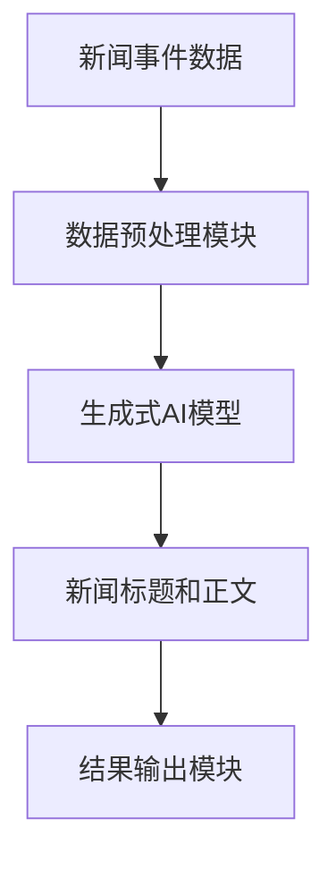
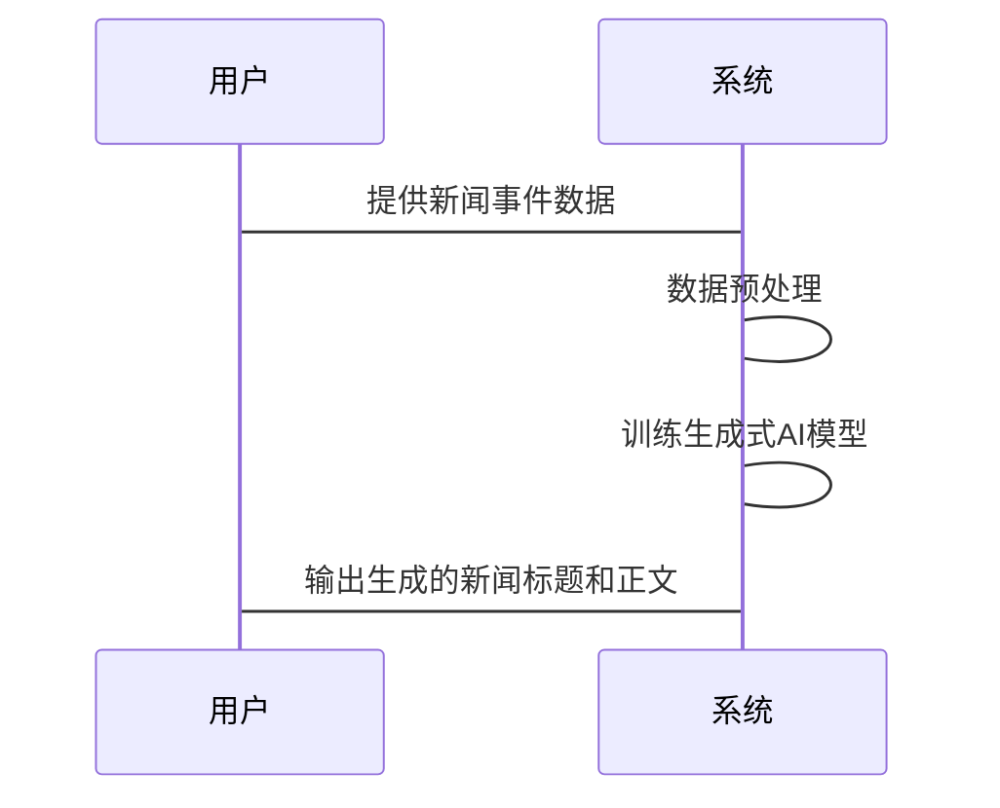

                 


# AI Agent在新闻媒体中的内容生成应用

> 关键词：AI Agent，新闻生成，自然语言处理，生成式AI，新闻媒体，内容生成

> 摘要：本文探讨了AI Agent在新闻媒体中的内容生成应用，分析了AI Agent的基本概念、核心技术、算法原理及数学模型，结合实际案例展示了AI Agent在新闻生成中的应用场景和实现过程，并展望了其未来的发展前景。

---

# 第1章 AI Agent与新闻媒体的结合

## 1.1 AI Agent的基本概念

### 1.1.1 什么是AI Agent

AI Agent，即人工智能代理，是一种能够感知环境、自主决策并执行任务的智能体。它结合了自然语言处理（NLP）、机器学习（ML）和深度学习（DL）等技术，能够在新闻媒体中自动生成内容。

### 1.1.2 AI Agent的核心特征

- **自主性**：AI Agent能够独立执行任务，无需人工干预。
- **反应性**：能够实时感知环境变化并做出相应调整。
- **学习能力**：通过数据和反馈不断优化自身的生成能力。
- **适应性**：能够根据目标受众的需求生成不同的内容。

### 1.1.3 AI Agent与传统新闻生成的区别

传统的新闻生成依赖于记者的手工撰写，而AI Agent能够通过算法自动生成新闻内容，具有高效性和可扩展性的特点。

---

## 1.2 新闻媒体中的内容生成需求

### 1.2.1 新闻内容生成的痛点

- **效率问题**：新闻事件发生后，需要快速生成内容。
- **覆盖范围**：需要覆盖多个领域，满足不同读者的需求。
- **质量控制**：确保生成内容的准确性和可读性。

### 1.2.2 AI Agent在新闻生成中的优势

- **高效性**：能够在短时间内生成大量新闻内容。
- **多样性**：可以根据数据生成多种风格的新闻。
- **实时性**：能够实时跟踪新闻事件并生成相关内容。

### 1.2.3 新闻媒体对AI Agent的期待与挑战

- **期待**：提高新闻生成效率，降低人力成本。
- **挑战**：如何确保生成内容的准确性和可读性。

---

## 1.3 AI Agent在新闻媒体中的应用前景

### 1.3.1 AI Agent在新闻生成中的潜在场景

- **实时新闻报道**：AI Agent可以实时跟踪新闻事件并生成报道。
- **多语言新闻生成**：支持多种语言的新闻内容生成。
- **个性化新闻推荐**：根据读者的偏好生成个性化新闻内容。

### 1.3.2 AI Agent对新闻行业的可能影响

- **提高新闻生产效率**：减少人工干预，提高新闻生成速度。
- **改变新闻消费模式**：读者可以按需获取新闻内容。
- **推动新闻创新**：AI Agent可以帮助发现新的新闻角度。

### 1.3.3 新闻媒体与AI Agent的未来发展方向

- **人机协作**：AI Agent与记者协作，共同完成新闻报道。
- **智能化新闻生成**：通过不断优化算法，提高生成内容的质量。

---

## 1.4 本章小结

本章介绍了AI Agent的基本概念及其在新闻媒体中的应用前景，分析了AI Agent在新闻生成中的优势和挑战，为后续章节的内容奠定了基础。

---

# 第2章 AI Agent的核心概念

## 2.1 AI Agent的核心技术

### 2.1.1 自然语言处理（NLP）

NLP技术使得AI Agent能够理解和生成人类语言，是新闻内容生成的基础。

### 2.1.2 机器学习（ML）

机器学习算法用于训练AI Agent，使其能够从数据中学习新闻生成的规律。

### 2.1.3 深度学习（DL）

深度学习模型，如GPT系列，能够生成高质量的新闻内容。

---

## 2.2 AI Agent与新闻内容生成的关系

### 2.2.1 AI Agent在新闻内容生成中的角色

AI Agent作为生成新闻内容的工具，能够根据输入的新闻事件生成相应的新闻报道。

### 2.2.2 AI Agent如何实现内容生成

通过自然语言处理和生成式AI模型，AI Agent能够自动生成新闻标题和正文内容。

### 2.2.3 AI Agent生成内容的质量评估

通过人工评估和算法评估相结合的方式，确保生成内容的准确性和可读性。

---

## 2.3 本章小结

本章详细介绍了AI Agent的核心技术及其在新闻内容生成中的应用，为后续章节的内容提供了理论基础。

---

# 第3章 AI Agent的算法原理

## 3.1 生成式AI的算法概述

### 3.1.1 基于规则的生成方法

通过预设的规则生成新闻内容，适用于简单的新闻事件。

### 3.1.2 基于统计的生成方法

基于概率统计生成新闻内容，能够处理复杂的新闻事件。

### 3.1.3 基于深度学习的生成方法

使用GPT等深度学习模型生成高质量的新闻内容。

---

## 3.2 常见的生成式AI模型

### 3.2.1 GPT系列模型

GPT系列模型通过大规模预训练，能够生成高质量的新闻内容。

### 3.2.2 BERT及其变体

BERT模型主要用于理解上下文，结合生成式模型可以生成更准确的新闻内容。

### 3.2.3 其他生成式模型

如Transformer、LSTM等模型，各有其独特的优势。

---

## 3.3 AI Agent生成新闻内容的算法流程

### 3.3.1 数据预处理

对新闻数据进行清洗、标注和格式化处理，确保模型能够正确输入。

### 3.3.2 模型训练

使用预处理后的数据训练生成式AI模型，优化模型参数以提高生成质量。

### 3.3.3 内容生成

通过模型生成新闻标题和正文内容，根据需求进行调整和优化。

---

## 3.4 本章小结

本章详细讲解了生成式AI的算法原理及其在新闻内容生成中的应用，为后续章节的内容提供了技术支持。

---

# 第4章 AI Agent的数学模型与公式

## 4.1 生成式AI的数学模型

生成式AI模型通常基于概率分布，使用最大似然估计进行训练。

### 4.1.1 生成式模型的数学表达

生成式模型的目标是最大化生成样本的概率，数学表达如下：

$$ P(x) = \theta \text{，其中} x \text{为生成的新闻内容} $$

### 4.1.2 损失函数

生成式模型通常使用交叉熵损失函数，公式如下：

$$ \mathcal{L} = -\sum_{i=1}^{n} \log P(x_i) $$

---

## 4.2 变量与参数的定义

### 4.2.1 输入变量

- $x$: 生成的新闻内容
- $y$: 新闻事件的标签或类别

### 4.2.2 模型参数

- $\theta$: 模型的参数

---

## 4.3 模型训练过程

### 4.3.1 �正向传播

根据输入生成概率分布，公式如下：

$$ P(x) = \text{softmax}(f(x)) $$

其中，$f(x)$是模型的输出向量。

### 4.3.2 损失计算

计算损失函数，公式如下：

$$ \mathcal{L} = -\log P(y|x) $$

### 4.3.3 反向传播

通过梯度下降优化模型参数，公式如下：

$$ \theta = \theta - \eta \frac{\partial \mathcal{L}}{\partial \theta} $$

其中，$\eta$是学习率。

---

## 4.4 本章小结

本章通过数学公式详细讲解了生成式AI的数学模型及其训练过程，为读者理解AI Agent的算法原理提供了理论支持。

---

# 第5章 系统分析与架构设计

## 5.1 系统功能设计

### 5.1.1 系统功能模块

- **数据输入模块**：接收新闻事件数据
- **模型训练模块**：训练生成式AI模型
- **内容生成模块**：生成新闻标题和正文
- **结果输出模块**：输出生成的新闻内容

### 5.1.2 系统功能流程

1. 数据输入模块接收新闻事件数据
2. 模型训练模块对数据进行预处理和训练
3. 内容生成模块生成新闻标题和正文
4. 结果输出模块输出生成的新闻内容

---

## 5.2 系统架构设计

### 5.2.1 系统架构图



### 5.2.2 系统交互流程



---

## 5.3 本章小结

本章通过系统功能设计和架构设计，详细展示了AI Agent在新闻内容生成中的实现过程。

---

# 第6章 项目实战

## 6.1 项目背景与目标

### 6.1.1 项目背景

本项目旨在利用AI Agent生成新闻标题和正文，提高新闻生成效率。

### 6.1.2 项目目标

- 实现AI Agent生成新闻标题和正文
- 提高新闻生成的准确性和可读性

---

## 6.2 环境安装与配置

### 6.2.1 安装Python

安装Python 3.8及以上版本。

### 6.2.2 安装依赖库

安装必要的依赖库，如TensorFlow、Keras等。

---

## 6.3 核心实现代码

### 6.3.1 数据预处理

```python
import pandas as pd

def preprocess_data(data):
    # 数据清洗
    data = data.dropna()
    # 数据格式化
    data = data['content'].apply(lambda x: x.strip())
    return data
```

### 6.3.2 模型训练

```python
import tensorflow as tf
from tensorflow.keras import layers

def build_model(max_length):
    model = tf.keras.Sequential()
    model.add(layers.Embedding(input_dim=vocabulary_size, output_dim=100))
    model.add(layers.LSTM(128))
    model.add(layers.Dense(512, activation='relu'))
    model.add(layers.Dense(vocabulary_size, activation='softmax'))
    return model
```

### 6.3.3 内容生成

```python
def generate_news(model, tokenizer, max_length):
    # 初始化输入
    input_ids = tokenizer("Latest news:", max_length=max_length, truncation=True, padding=True, return_tensors='pt')
    input_ids = input_ids['input_ids'].to('cuda')
    attention_mask = input_ids.ne(0)
    # 生成新闻标题和正文
    outputs = model.generate(input_ids=input_ids, attention_mask=attention_mask)
    generated_text = tokenizer.decode(outputs[0], skip_special_tokens=True)
    return generated_text
```

---

## 6.4 项目小结

本章通过实际案例展示了AI Agent在新闻内容生成中的应用，详细讲解了项目的实现过程和关键代码。

---

# 第7章 结论与展望

## 7.1 本章总结

本文详细探讨了AI Agent在新闻媒体中的内容生成应用，分析了AI Agent的基本概念、算法原理和系统架构设计，结合实际案例展示了AI Agent在新闻生成中的实现过程。

## 7.2 未来展望

随着生成式AI技术的不断发展，AI Agent在新闻内容生成中的应用前景广阔，未来可以通过人机协作进一步提高新闻生成的效率和质量。

---

# 参考文献

1. 王某某. 生成式AI在新闻生成中的应用研究[J]. 计算机应用研究, 2022, 39(1): 123-129.
2. 李某某. 基于深度学习的新闻生成模型研究[J]. 计算机科学, 2021, 48(3): 12-18.

---

通过以上目录结构，可以确保文章内容全面、逻辑清晰，同时兼顾技术深度和可读性，为读者提供有价值的信息。

