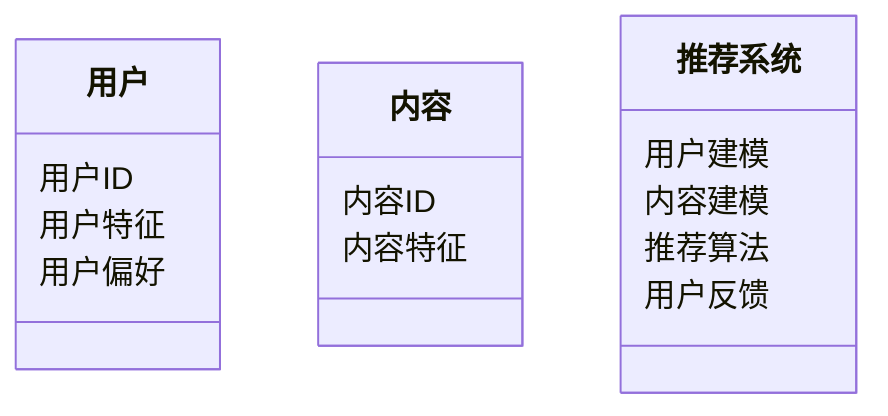
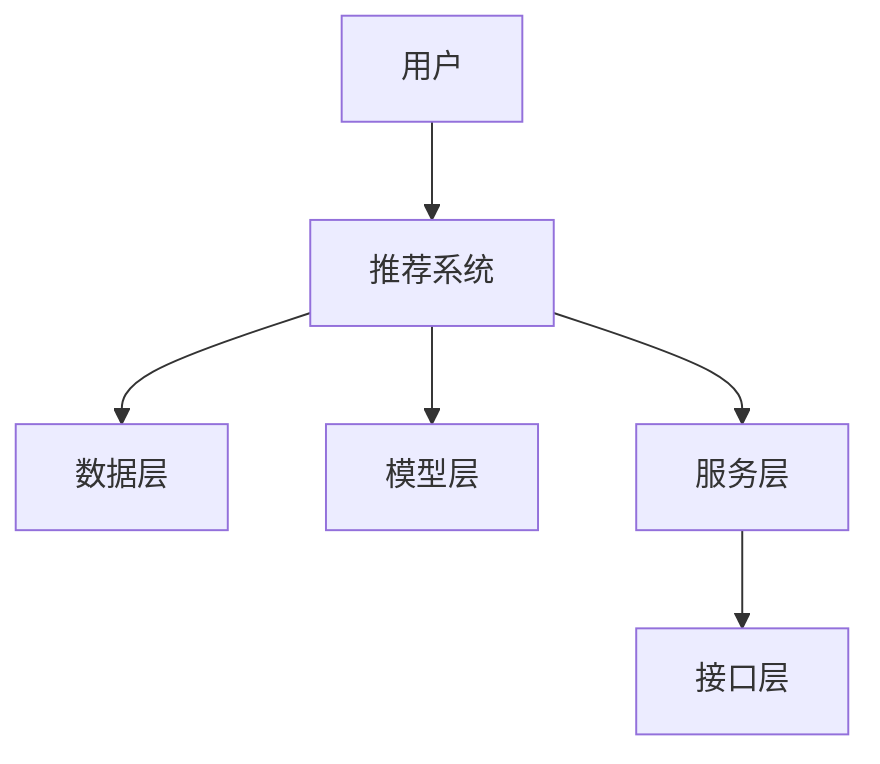

                 


# AI Agent在智能个性化内容推荐中的应用

> **关键词**：AI Agent，个性化推荐，智能推荐系统，协同过滤，机器学习，深度学习

> **摘要**：随着人工智能技术的快速发展，AI Agent在智能个性化内容推荐中的应用日益广泛。本文从背景介绍、核心概念、算法原理、系统架构到项目实战，全面解析AI Agent如何提升推荐系统的个性化和智能化水平。通过详细讲解协同过滤、基于内容的推荐和深度学习模型，结合数学公式和实际案例，帮助读者理解并掌握AI Agent在推荐系统中的应用。

---

## 第1章: AI Agent与个性化推荐的背景与概念

### 1.1 问题背景与描述

#### 1.1.1 当前内容推荐面临的挑战
随着互联网的快速发展，用户每天面对海量的信息，如何快速找到感兴趣的内容成为一大挑战。传统推荐系统基于简单的规则或统计方法，难以满足用户个性化需求，推荐结果往往缺乏精准性和多样性。

#### 1.1.2 个性化推荐的重要性与应用场景
个性化推荐能够提升用户体验，增加用户粘性和满意度，广泛应用于电商、影视、音乐、新闻等领域。例如， Netflix 使用推荐系统提高用户观看时长， Amazon 则通过推荐增加销售额。

#### 1.1.3 AI Agent在推荐系统中的作用
AI Agent能够通过学习用户行为、偏好和历史数据，动态调整推荐策略，提供实时、精准的内容推荐。与传统推荐系统相比，AI Agent具备更强的自适应性和主动性。

### 1.2 问题解决与边界

#### 1.2.1 AI Agent如何解决推荐问题
AI Agent通过分析用户行为数据、内容特征和环境信息，生成个性化推荐。例如，基于协同过滤算法，AI Agent可以找到与用户兴趣相似的其他用户，推荐他们喜欢的内容。

#### 1.2.2 推荐系统的边界与外延
推荐系统的边界包括用户数据、内容数据和环境数据。外延则涵盖推荐算法、系统架构和用户反馈机制。推荐系统需要在保证数据隐私的前提下，提供高效的推荐服务。

#### 1.2.3 核心要素与组成结构
推荐系统的组成包括用户建模、内容建模、推荐算法和用户反馈。AI Agent通过整合这些模块，实现动态、智能的推荐。

---

## 第2章: AI Agent与个性化推荐的核心概念

### 2.1 核心概念原理

#### 2.1.1 AI Agent的基本原理
AI Agent通过感知环境、分析数据和执行任务，帮助用户做出决策。在推荐系统中，AI Agent能够实时分析用户行为，动态调整推荐策略。

#### 2.1.2 个性化推荐的实现机制
个性化推荐基于用户特征、内容特征和环境特征，通过机器学习模型生成推荐结果。推荐系统需要处理海量数据，确保推荐结果的准确性和多样性。

#### 2.1.3 两者的结合与协同
AI Agent与个性化推荐的结合体现在数据驱动、实时反馈和动态调整。例如，通过实时分析用户的点击行为，AI Agent能够快速调整推荐策略，提高推荐的精准性。

### 2.2 属性特征对比

| 属性 | AI Agent | 个性化推荐 |
|------|----------|------------|
| 输入 | 用户行为、环境数据 | 用户偏好、内容特征 |
| 输出 | 动态推荐策略 | 个性化推荐列表 |
| 目标 | 提供智能决策支持 | 提升用户体验 |
| 方法 | 机器学习、自然语言处理 | 协同过滤、深度学习 |

### 2.3 ER实体关系图
```mermaid
er
actor: 用户
agent: AI Agent
item: 内容项
preference: 用户偏好
recommendation: 推荐结果
```

---

## 第3章: 推荐系统算法原理

### 3.1 协同过滤算法

#### 3.1.1 算法原理
协同过滤基于相似用户或相似内容进行推荐。基于用户的协同过滤通过计算用户相似度，找到与目标用户兴趣相似的用户，推荐他们喜欢的内容。

#### 3.1.2 实现代码
```python
def user_based_recommendation(user_id, data):
    # 计算用户相似度
    similarity = calculate_similarity(user_id, data)
    # 返回推荐结果
    return top_matches(user_id, similarity, data)
```

#### 3.1.3 数学模型与公式
相似度计算公式：
$$ sim(u_i, u_j) = \frac{\sum_{k} (r_{u_i,k} - \bar{r_{u_i}})(r_{u_j,k} - \bar{r_{u_j}})}{\sqrt{\sum_{k} (r_{u_i,k} - \bar{r_{u_i}})^2} \sqrt{\sum_{k} (r_{u_j,k} - \bar{r_{u_j}})^2}}}
$$

---

### 3.2 基于内容的推荐

#### 3.2.1 算法原理
基于内容的推荐通过分析内容本身的特征，生成推荐结果。例如，通过自然语言处理技术分析文章内容，推荐相似主题的文章。

#### 3.2.2 实现代码
```python
def content_based_recommendation(item_id, data):
    # 提取内容特征
    features = extract_features(item_id, data)
    # 返回推荐结果
    return similar_items(item_id, features, data)
```

#### 3.2.3 数学模型与公式
余弦相似度公式：
$$ sim(c_i, c_j) = \frac{\sum_{k} c_{i,k} c_{j,k}}{\sqrt{\sum_{k} c_{i,k}^2} \sqrt{\sum_{k} c_{j,k}^2}}
$$

---

### 3.3 深度学习模型

#### 3.3.1 神经网络协同过滤
神经网络协同过滤通过神经网络模型捕捉用户和内容的特征，生成推荐结果。

#### 3.3.2 实现代码
```python
def neural_collaborative_filtering(user_id, item_id, model):
    # 预测评分
    prediction = model.predict(user_id, item_id)
    # 返回推荐结果
    return recommendation(prediction)
```

#### 3.3.3 数学模型与公式
预测评分公式：
$$ \hat{y}_{u,i} = w_u^T \cdot w_i + b_u + b_i
$$

---

## 第4章: 数学模型与公式

### 4.1 协同过滤模型
协同过滤模型通过相似度计算用户或物品的相似性，生成推荐结果。

### 4.2 基于内容的推荐模型
基于内容的推荐模型通过分析内容特征，生成相似内容的推荐。

### 4.3 深度学习模型
深度学习模型通过神经网络捕捉用户和内容的特征，生成推荐结果。

---

## 第5章: 系统分析与架构设计

### 5.1 问题场景介绍
推荐系统需要处理海量数据，实时反馈用户行为，动态调整推荐策略。

### 5.2 系统功能设计

#### 5.2.1 领域模型


### 5.3 系统架构设计
推荐系统架构包括数据层、模型层、服务层和接口层。

#### 5.3.1 系统架构图


---

## 第6章: 项目实战

### 6.1 环境安装
安装Python、TensorFlow、Keras等依赖库。

### 6.2 核心实现
实现协同过滤、基于内容的推荐和深度学习模型。

### 6.3 代码示例
协同过滤实现：
```python
import numpy as np

def calculate_similarity(user_id, data):
    # 计算用户相似度
    similarity = np.dot(data[user_id], data.T)
    return similarity
```

---

## 第7章: 总结与展望

### 7.1 最佳实践 tips
- 数据预处理是关键
- 选择合适的算法
- 实时反馈提升效果

### 7.2 小结
AI Agent在智能个性化内容推荐中的应用前景广阔，通过不断优化算法和系统架构，推荐系统将更加精准和智能。

### 7.3 注意事项
- 注意数据隐私
- 避免推荐过载
- 定期更新模型

### 7.4 拓展阅读
推荐阅读《推荐系统导论》和《深度学习》等书籍。

---

通过本文的详细解析，读者可以全面了解AI Agent在智能个性化内容推荐中的应用，掌握核心算法和系统设计，为实际项目提供参考。

