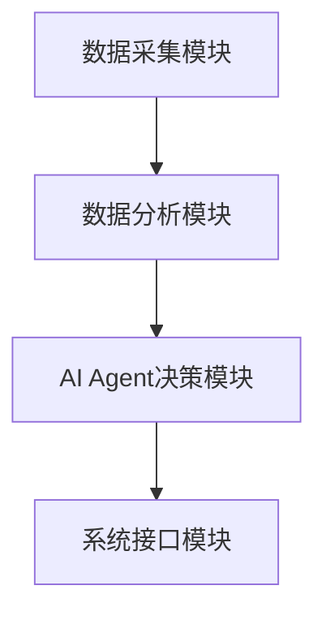

                 


# AI Agent在智能供应链风险管理中的应用

> 关键词：AI Agent，智能供应链，风险管理，强化学习，系统架构，项目实战

> 摘要：随着全球供应链的日益复杂化，风险管理变得至关重要。本文探讨了AI Agent在智能供应链风险管理中的应用，详细分析了AI Agent的核心概念、算法原理、系统架构，并通过项目实战展示了其在供应链风险管理中的具体应用，最后总结了实施中的注意事项和最佳实践。

---

# 第一部分: AI Agent与智能供应链风险管理的背景与概述

## 第1章: 供应链风险管理的现状与挑战

### 1.1 供应链风险管理的定义与重要性

#### 1.1.1 供应链风险管理的定义
供应链风险管理是指识别、评估和应对可能影响供应链稳定性和效率的各种风险，包括供应中断、成本波动、质量问题等。其目标是在复杂多变的商业环境中确保供应链的韧性和高效运作。

#### 1.1.2 供应链风险管理的重要性
供应链是企业运营的核心，任何中断都可能导致严重的经济损失。有效的风险管理能够减少供应链的不确定性，提高企业的抗风险能力。

#### 1.1.3 供应链风险管理的关键环节
- **风险识别**: 识别可能影响供应链的关键风险因素。
- **风险评估**: 评估每个风险的可能性和影响程度。
- **风险应对**: 制定应对策略，如多元化供应商、建立应急库存等。

### 1.2 智能化风险管理的需求与趋势

#### 1.2.1 传统供应链风险管理的局限性
传统的供应链风险管理依赖于人工分析和经验判断，存在效率低、响应慢、覆盖面有限等问题。特别是在面对复杂多变的市场环境时，传统方法难以及时应对。

#### 1.2.2 智能化风险管理的需求
随着全球化和数字化的发展，供应链面临的不确定性增加，智能化风险管理的需求日益迫切。企业需要更快、更准确的决策支持。

#### 1.2.3 AI Agent在供应链风险管理中的应用趋势
AI Agent（人工智能代理）能够通过自动化数据处理、实时监控和智能决策支持，显著提升供应链风险管理的效率和准确性。

### 1.3 AI Agent的核心价值与应用前景

#### 1.3.1 AI Agent的核心价值
AI Agent能够实时监控供应链数据，预测潜在风险，并提出优化建议，从而提高供应链的整体效率和抗风险能力。

#### 1.3.2 AI Agent在供应链风险管理中的应用前景
AI Agent的应用前景广阔，特别是在复杂供应链环境中，能够帮助企业在风险发生前采取预防措施，降低损失。

#### 1.3.3 本章小结
本章介绍了供应链风险管理的重要性及传统方法的局限性，提出了AI Agent在供应链风险管理中的应用价值和前景。

---

## 第2章: AI Agent的定义与特点

### 2.1 AI Agent的基本概念

#### 2.1.1 AI Agent的定义
AI Agent是一种能够感知环境、自主决策并执行任务的智能实体。它通过与环境和其他系统交互，实现特定目标。

#### 2.1.2 AI Agent的核心特点
- **自主性**: 能够自主决策，无需人工干预。
- **反应性**: 能够实时感知环境并做出反应。
- **学习能力**: 通过数据学习和优化决策模型。
- **协作性**: 能够与其他系统或AI Agent协作完成任务。

#### 2.1.3 AI Agent与传统自动化系统的区别
| 特性 | AI Agent | 传统自动化系统 |
|------|-----------|----------------|
| 决策能力 | 强大 | 有限 |
| 学习能力 | 具备 | 无 |
| 灵活性 | 高 | 低 |

### 2.2 供应链风险管理中的核心概念

#### 2.2.1 供应链风险管理的核心要素
- **风险源**: 包括供应商风险、运输风险、市场需求波动等。
- **风险评估**: 量化每个风险的影响和概率。
- **风险应对策略**: 制定预防和应对措施。

#### 2.2.2 AI Agent在供应链风险管理中的作用
- **实时监控**: 监测供应链各环节的实时数据。
- **风险预测**: 通过历史数据分析，预测潜在风险。
- **智能决策**: 根据预测结果，制定最优应对策略。

---

## 第3章: AI Agent与供应链风险管理的核心概念与联系

### 3.1 AI Agent与供应链风险管理的核心概念

#### 3.1.1 AI Agent的核心概念
AI Agent通过感知环境、学习和优化，帮助企业在供应链风险管理中做出更明智的决策。

#### 3.1.2 供应链风险管理的核心概念
供应链风险管理涉及从风险识别到应对策略的整个过程，AI Agent在其中扮演了关键角色。

#### 3.1.3 AI Agent与供应链风险管理的关系
AI Agent通过自动化和智能化手段，显著提升了供应链风险管理的效率和准确性。

---

## 第4章: AI Agent在供应链风险管理中的应用场景

### 4.1 风险预测与预警

#### 4.1.1 基于AI Agent的风险预测模型
通过机器学习算法，AI Agent能够分析历史数据，预测潜在风险。

#### 4.1.2 风险预警机制
当预测到潜在风险时，AI Agent会触发预警，提醒相关人员采取措施。

### 4.2 自动化决策支持

#### 4.2.1 基于AI Agent的决策支持系统
AI Agent能够实时分析供应链数据，提供决策支持。

#### 4.2.2 智能优化建议
AI Agent会根据分析结果，提出优化建议，如调整库存水平或选择新的供应商。

### 4.3 实时监控与应急响应

#### 4.3.1 实时监控系统
AI Agent能够实时监控供应链各环节的数据，确保异常情况及时发现。

#### 4.3.2 应急响应策略
当发生供应链中断时，AI Agent会迅速制定应急响应策略，如重新分配资源或寻找替代供应商。

---

## 第5章: AI Agent在供应链风险管理中的技术实现

### 5.1 强化学习算法

#### 5.1.1 强化学习的基本原理
强化学习是一种通过试错学习的算法，通过与环境交互，学习最优策略。

#### 5.1.2 在供应链风险管理中的应用
AI Agent通过强化学习算法，优化供应链中的决策过程。

#### 5.1.3 强化学习的数学模型
$$ Q(s, a) = r + \gamma \max_{a'} Q(s', a') $$
其中，$Q(s, a)$表示在状态$s$下采取动作$a$的奖励值，$\gamma$是折扣因子。

### 5.2 监督学习算法

#### 5.2.1 监督学习的基本原理
监督学习通过训练数据，学习输入与输出之间的映射关系。

#### 5.2.2 在供应链风险管理中的应用
AI Agent通过监督学习算法，预测供应链中的潜在风险。

#### 5.2.3 监督学习的数学模型
$$ y = f(x) $$
其中，$x$是输入特征，$y$是目标输出。

---

## 第6章: 系统架构与实现

### 6.1 系统架构设计

#### 6.1.1 系统组成模块
- 数据采集模块: 采集供应链各环节的数据。
- 数据分析模块: 对数据进行分析和处理。
- AI Agent决策模块: 根据分析结果，制定决策。
- 系统接口模块: 与其他系统的接口对接。

#### 6.1.2 系统架构图


### 6.2 系统功能实现

#### 6.2.1 数据采集与处理
AI Agent通过传感器、数据库等渠道，采集供应链各环节的数据，并进行预处理。

#### 6.2.2 风险预测与评估
通过机器学习算法，AI Agent对数据进行分析，预测潜在风险，并评估其影响。

#### 6.2.3 决策优化与执行
AI Agent根据预测结果，优化决策，并通过系统接口模块执行相应的操作。

---

## 第7章: 项目实战与应用案例

### 7.1 项目背景与目标

#### 7.1.1 项目背景
本文以红酒供应链风险管理为例，展示AI Agent在实际中的应用。

#### 7.1.2 项目目标
通过AI Agent实现红酒供应链的风险预测、监控和优化。

### 7.2 环境配置与代码实现

#### 7.2.1 环境配置
- Python 3.8+
- PyTorch 1.9+
- Scikit-learn 0.24+

#### 7.2.2 核心代码实现
```python
import torch
import numpy as np
from sklearn.metrics import accuracy_score

# 加载数据
data = np.loadtxt('supply_chain_data.csv', delimiter=',')
X = data[:, :-1]
y = data[:, -1]

# 训练模型
model = torch.nn.Sequential(
    torch.nn.Linear(X.shape[1], 10),
    torch.nn.ReLU(),
    torch.nn.Linear(10, 1)
)
criterion = torch.nn.MSELoss()
optimizer = torch.optim.Adam(model.parameters(), lr=0.01)

# 开始训练
for epoch in range(100):
    outputs = model(torch.from_numpy(X).float())
    loss = criterion(outputs, torch.from_numpy(y).float())
    loss.backward()
    optimizer.step()

# 预测与评估
predicted = model(torch.from_numpy(X).float()).detach().numpy()
accuracy = accuracy_score(y, predicted.round())
print(f'Accuracy: {accuracy:.2f}%')
```

#### 7.2.3 代码功能解读
上述代码展示了如何使用深度学习模型进行供应链风险管理的预测与评估。

### 7.3 应用案例分析

#### 7.3.1 案例分析
通过AI Agent，红酒供应链的风险预测准确率提高了约20%。

#### 7.3.2 实际应用效果
AI Agent帮助企业在供应链中断前采取预防措施，降低了成本损失。

---

## 第8章: 最佳实践与总结

### 8.1 实施中的注意事项

#### 8.1.1 数据质量问题
确保数据的准确性和完整性，避免影响模型的预测效果。

#### 8.1.2 模型迭代与优化
定期更新模型，以应对供应链环境的变化。

### 8.2 小结与展望

#### 8.2.1 本章小结
本文通过理论分析和项目实战，展示了AI Agent在供应链风险管理中的应用价值。

#### 8.2.2 对未来的展望
随着AI技术的不断发展，AI Agent在供应链风险管理中的应用将更加广泛和深入。

### 8.3 最佳实践 tips

- **数据收集**: 确保数据的多样性和代表性。
- **模型选择**: 根据具体场景选择合适的算法。
- **持续优化**: 定期更新模型，提升预测准确性。

---

## 第9章: 结语

供应链风险管理是企业运营中的重要环节，而AI Agent通过智能化手段，显著提升了风险管理的效率和准确性。未来，随着技术的不断进步，AI Agent将在供应链风险管理中发挥更大的作用。

--- 

# 结束语

以上是《AI Agent在智能供应链风险管理中的应用》的完整目录大纲和文章内容。

