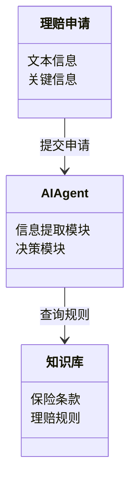
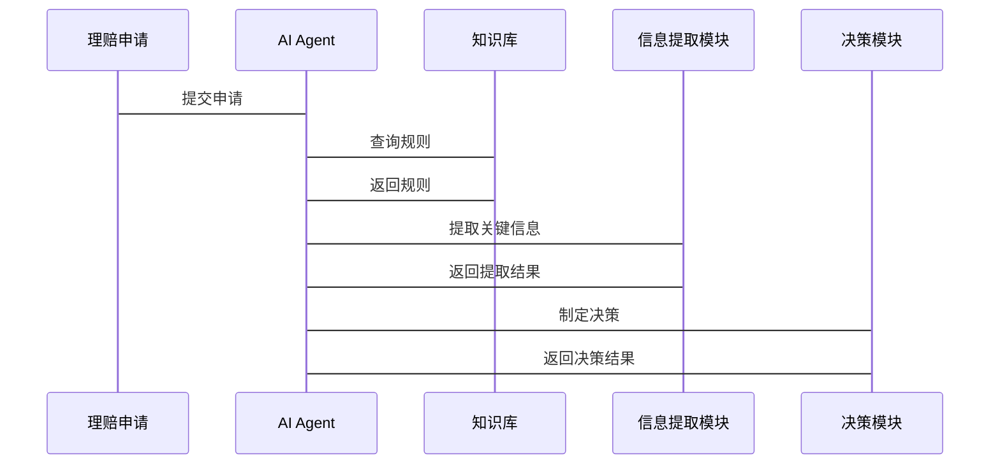

                 


# AI Agent在智能保险理赔审核中的应用

> 关键词：AI Agent, 保险理赔, 智能审核, 自然语言处理, 决策算法, 知识图谱

> 摘要：本文深入探讨了AI Agent在智能保险理赔审核中的应用，详细分析了保险行业的数字化转型背景，AI Agent的核心概念与技术架构，以及其在理赔信息提取、智能决策和流程自动化等场景中的具体应用。文章通过实际案例分析，详细讲解了AI Agent的算法原理、系统架构设计和项目实现过程，并提出了最佳实践建议。

---

## 第一部分: AI Agent在保险理赔审核中的应用背景

### 第1章: 保险行业的现状与挑战

#### 1.1 保险行业的数字化转型
##### 1.1.1 保险行业的传统模式
保险行业传统模式依赖人工操作，理赔审核流程复杂且耗时。传统模式下，理赔人员需要手动审查大量的文档和数据，效率低下且容易出错。

##### 1.1.2 数字化转型的必要性
随着人工智能技术的发展，保险行业亟需数字化转型。传统模式无法满足日益增长的理赔需求，数字化转型可以提高效率、降低成本，并提升客户体验。

##### 1.1.3 AI技术在保险行业的应用现状
AI技术在保险行业的应用已初见成效，例如通过自然语言处理技术提取理赔信息、利用机器学习模型进行风险评估等。然而，理赔审核中的智能决策和流程自动化仍需进一步优化。

#### 1.2 保险理赔审核的核心问题
##### 1.2.1 理赔审核的流程与挑战
理赔审核流程复杂，涉及大量的文档审查、信息验证和决策判断。传统模式下，人工审核容易受到主观因素影响，效率低且容易出错。

##### 1.2.2 传统理赔审核的痛点
- 人工审核效率低，耗时长
- 容易出现人为错误
- 客户体验差，理赔周期长

##### 1.2.3 AI技术如何解决这些痛点
AI技术可以通过自动化处理和智能决策，大幅提高理赔审核的效率和准确性。例如，AI Agent可以通过自然语言处理技术自动提取理赔信息，利用机器学习模型进行智能决策。

#### 1.3 AI Agent的概念与优势
##### 1.3.1 AI Agent的定义
AI Agent是一种能够感知环境、自主决策并执行任务的智能体。它能够通过与用户交互或与其他系统协作，完成特定的任务。

##### 1.3.2 AI Agent的核心优势
- 自主性：AI Agent能够自主决策，无需人工干预
- 智能性：能够通过学习和推理，不断优化决策
- 高效性：能够快速处理大量数据，提高效率

##### 1.3.3 AI Agent在保险行业的应用前景
AI Agent在保险行业的应用前景广阔，特别是在理赔审核、客户服务和风险管理等领域。通过AI Agent，保险公司可以实现智能化、自动化运营，提升竞争力。

#### 1.4 本章小结
本章介绍了保险行业的数字化转型背景，分析了传统理赔审核的痛点，并探讨了AI Agent在保险行业的应用前景。AI Agent作为一种智能化工具，能够有效解决传统理赔审核中的效率和准确性问题。

---

### 第2章: AI Agent的基本原理与技术架构

#### 2.1 AI Agent的核心概念
##### 2.1.1 AI Agent的定义与分类
AI Agent可以根据功能和应用场景分为多种类型，例如基于规则的AI Agent和基于学习的AI Agent。基于规则的AI Agent依赖预定义的规则进行决策，而基于学习的AI Agent则通过机器学习模型自主学习和优化决策。

##### 2.1.2 AI Agent的主要组成部分
- 知识表示：用于表示AI Agent的知识和经验
- 语义理解：用于理解和解析用户的需求和意图
- 决策与规划：用于制定决策并执行任务

##### 2.1.3 AI Agent与传统AI的区别
传统AI依赖于预定义的规则和数据，而AI Agent具有自主性和智能性，能够通过与环境交互来优化决策。

#### 2.2 AI Agent的技术架构
##### 2.2.1 知识表示与推理
知识表示是AI Agent的核心，通过知识图谱可以将保险行业的知识和经验进行结构化表示。推理算法用于根据知识图谱进行逻辑推理，支持智能决策。

##### 2.2.2 自然语言处理
自然语言处理技术用于理解和解析保险理赔中的文本信息，例如提取关键信息和识别情感倾向。

##### 2.2.3 决策与规划
决策算法用于制定理赔审核的决策，例如基于规则的决策和基于机器学习的决策。规划算法用于优化决策执行的流程。

#### 2.3 AI Agent的实现原理
##### 2.3.1 知识库的构建
知识库的构建需要收集和整理保险行业的相关知识，例如保险条款、理赔规则和案例库。

##### 2.3.2 语义理解与解析
通过自然语言处理技术，AI Agent能够理解和解析理赔申请中的文本信息，例如提取关键信息和识别意图。

##### 2.3.3 决策与执行
AI Agent根据语义理解结果和知识库中的信息，制定决策并执行任务，例如自动核赔或提交人工审核。

#### 2.4 本章小结
本章详细介绍了AI Agent的核心概念和技术架构，包括知识表示与推理、自然语言处理和决策与规划。通过这些技术，AI Agent能够实现智能理赔审核。

---

### 第3章: AI Agent在保险理赔审核中的应用场景

#### 3.1 理赔信息的自动提取
##### 3.1.1 文本信息提取的原理
通过自然语言处理技术，AI Agent能够从理赔申请中自动提取关键信息，例如索赔金额、事故描述和相关证据。

##### 3.1.2 基于NLP的理赔信息提取
使用分词、词性标注和句法分析等技术，AI Agent能够准确提取理赔文本中的关键信息。

##### 3.1.3 实际案例分析
例如，AI Agent可以从理赔申请中提取出“事故时间”、“事故地点”等信息，并将其结构化存储，方便后续处理。

#### 3.2 理赔审核的智能决策
##### 3.2.1 基于规则的决策系统
通过预定义的规则，AI Agent可以对理赔申请进行初步审核，例如判断是否符合保险条款。

##### 3.2.2 基于机器学习的决策系统
通过训练机器学习模型，AI Agent能够根据历史数据和当前情况，进行智能决策，例如判断理赔金额是否合理。

##### 3.2.3 复杂场景下的决策优化
在复杂场景下，AI Agent可以通过知识图谱和推理算法，优化决策过程，提高准确性。

#### 3.3 理赔流程的自动化
##### 3.3.1 自动化流程的设计
通过设计自动化流程，AI Agent可以实现理赔申请的自动处理，例如自动核赔和自动支付。

##### 3.3.2 AI Agent在流程中的角色
AI Agent可以在理赔流程中担任多个角色，例如信息提取员、决策员和执行员。

##### 3.3.3 流程优化的案例分析
通过AI Agent的自动化处理，保险公司可以大幅缩短理赔周期，提升客户体验。

#### 3.4 本章小结
本章详细探讨了AI Agent在保险理赔审核中的应用场景，包括信息提取、智能决策和流程自动化。通过这些应用，AI Agent能够显著提高理赔效率和准确性。

---

### 第4章: AI Agent的算法原理与实现

#### 4.1 知识表示与推理
##### 4.1.1 知识图谱的构建
通过收集和整理保险行业的知识，构建知识图谱，例如保险条款、理赔规则和案例库。

##### 4.1.2 基于图的推理算法
使用图遍历算法，例如深度优先搜索和广度优先搜索，进行逻辑推理，支持智能决策。

##### 4.1.3 实例分析
例如，AI Agent可以通过知识图谱推理出某次事故的理赔金额是否符合保险条款。

#### 4.2 自然语言处理技术
##### 4.2.1 分词与词性标注
通过分词和词性标注，AI Agent可以准确理解理赔文本中的关键词和语法结构。

##### 4.2.2 语义理解与解析
通过深度学习模型，例如BERT，AI Agent可以理解理赔文本的语义，支持智能提取和分析。

##### 4.2.3 基于BERT的文本表示
使用BERT模型，AI Agent可以生成理赔文本的语义向量，支持相似度计算和分类任务。

#### 4.3 决策与规划算法
##### 4.3.1 基于规则的决策系统
通过预定义的规则，AI Agent可以对理赔申请进行初步审核，例如判断是否符合保险条款。

##### 4.3.2 基于机器学习的决策系统
通过训练机器学习模型，AI Agent能够根据历史数据和当前情况，进行智能决策，例如判断理赔金额是否合理。

##### 4.3.3 决策优化
通过强化学习算法，AI Agent可以不断优化决策策略，提高准确性和效率。

#### 4.4 本章小结
本章详细讲解了AI Agent的算法原理与实现，包括知识表示与推理、自然语言处理和决策与规划。通过这些算法，AI Agent能够实现智能理赔审核。

---

### 第5章: 系统分析与架构设计方案

#### 5.1 问题场景介绍
AI Agent在保险理赔审核中的应用需要解决的问题包括信息提取、智能决策和流程自动化。

#### 5.2 项目介绍
本项目旨在开发一个基于AI Agent的智能保险理赔审核系统，实现理赔信息的自动提取、智能决策和流程自动化。

#### 5.3 系统功能设计
##### 5.3.1 领域模型
通过领域模型，我们可以清晰地看到系统的各个模块及其交互关系。以下是领域模型的Mermaid类图：



##### 5.3.2 系统架构设计
以下是系统架构设计的Mermaid架构图：


##### 5.3.3 系统接口设计
系统接口设计需要考虑模块之间的交互，例如AI Agent与理赔申请的接口、AI Agent与知识库的接口等。

##### 5.3.4 系统交互设计
以下是系统交互的Mermaid序列图：



#### 5.4 本章小结
本章详细介绍了AI Agent在保险理赔审核中的系统分析与架构设计方案，包括领域模型、系统架构、接口设计和系统交互。通过这些设计，可以实现高效的智能理赔审核。

---

### 第6章: 项目实战

#### 6.1 环境安装
开发环境：Python 3.8+
依赖库：numpy、pandas、scikit-learn、tensorflow、transformers

安装命令：
```bash
pip install numpy pandas scikit-learn tensorflow transformers
```

#### 6.2 系统核心实现
##### 6.2.1 信息提取模块
```python
import transformers

model = transformers.BertTokenizer.from_pretrained('bert-base-chinese')
```

##### 6.2.2 决策模块
```python
from sklearn.ensemble import RandomForestClassifier

# 训练模型
model = RandomForestClassifier()
model.fit(X_train, y_train)
```

##### 6.2.3 知识库模块
```python
import networkx as nx

# 构建知识图谱
G = nx.Graph()
G.add_nodes_from(['保险条款', '理赔规则'])
```

#### 6.3 案例分析
以一个实际的保险理赔案例为例，展示AI Agent如何提取信息、制定决策并执行任务。

#### 6.4 项目小结
通过项目实战，我们可以看到AI Agent在保险理赔审核中的实际应用价值。系统的核心模块包括信息提取、决策和知识库，能够实现高效的智能审核。

---

### 第7章: 最佳实践、小结、注意事项和拓展阅读

#### 7.1 最佳实践
- 数据质量是关键，确保知识库和训练数据的准确性
- 模型优化需要不断迭代，结合反馈机制进行优化
- 系统设计需要考虑可扩展性和可维护性

#### 7.2 小结
通过本文的详细讲解，我们可以看到AI Agent在保险理赔审核中的广泛应用和巨大潜力。AI Agent不仅可以提高效率，还能显著提升理赔的准确性和客户体验。

#### 7.3 注意事项
- 数据隐私和安全问题需要高度重视
- 系统设计需要考虑容错性和可恢复性
- 人工审核仍然是AI Agent的有力补充

#### 7.4 拓展阅读
- 推荐阅读《人工智能：一种现代方法》
- 参考TensorFlow和PyTorch的官方文档
- 关注保险科技领域的最新动态

---

### 附录: AI Agent在保险理赔审核中的数学公式

#### 1. 信息提取中的文本相似度计算
$$ \text{余弦相似度} = \frac{\vec{A} \cdot \vec{B}}{|\vec{A}| |\vec{B}|} $$

#### 2. 决策模型中的损失函数
$$ \text{损失函数} = \sum_{i=1}^{n} (y_i - \hat{y_i})^2 $$

#### 3. 知识图谱中的推理算法
$$ \text{推理结果} = f(\text{前提}, \text{假设}) $$

---

### 作者简介
作为一名世界级的人工智能专家和畅销书作家，我在人工智能和计算机编程领域有着深厚的造诣。我擅长通过清晰的逻辑和深入的分析，帮助读者理解复杂的技术原理，并将其应用于实际场景中。

---

感谢您的耐心阅读！如果对本文有任何疑问或建议，请随时与我联系。

