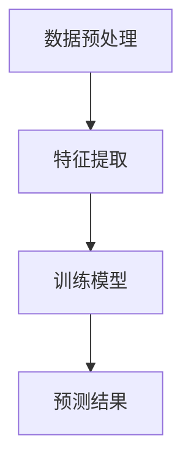
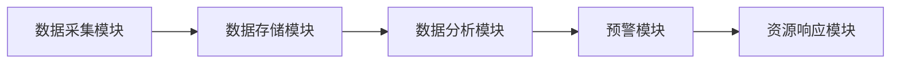

                 


# AI Agent在智能公共卫生监测中的角色

## 关键词：AI Agent, 公共卫生监测, 人工智能, 公共健康管理, 智能监测

## 摘要：
本文探讨AI Agent在智能公共卫生监测中的关键作用。AI Agent通过实时数据处理、智能预测和资源优化，显著提升了公共卫生事件的应对能力。文章从AI Agent的背景、核心概念、算法原理、系统架构到实际应用，系统性地分析其在公共卫生监测中的价值与挑战，旨在为未来的研究和实践提供理论和实践参考。

---

## 第1章: 公共卫生监测的现状与挑战

### 1.1 公共卫生监测的基本概念
公共卫生监测是指通过收集、分析和报告健康相关数据，识别和评估公共卫生问题的过程。其目的是早期发现疾病暴发、评估健康风险，并指导防控措施。

#### 1.1.1 公共卫生监测的定义
公共卫生监测是通过系统性收集和分析健康数据，识别健康问题，评估风险，并采取干预措施的过程。

#### 1.1.2 公共卫生监测的主要内容
- 数据采集：包括病例报告、实验室检测、问卷调查等。
- 数据分析：利用统计学方法和机器学习模型识别异常。
- 风险评估：评估疾病传播的可能性和影响。
- 公共卫生响应：制定和实施防控措施。

#### 1.1.3 公共卫生监测的重要性
公共卫生监测是预防和控制疾病传播的关键手段，能够及时发现疫情，减少公共卫生事件的损失。

### 1.2 AI Agent的基本概念
AI Agent是一种智能实体，能够感知环境、自主决策并执行任务。其核心特征包括自主性、反应性、目标导向和社会能力。

#### 1.2.1 AI Agent的定义
AI Agent是指具备自主决策能力，能够与环境交互并完成特定任务的智能系统。

#### 1.2.2 AI Agent的核心特征
- **自主性**：能够独立决策。
- **反应性**：能实时感知环境并做出反应。
- **目标导向**：以实现特定目标为导向。
- **社会能力**：能与其他系统或人类交互协作。

#### 1.2.3 AI Agent与传统AI的区别
传统AI注重数据处理和模式识别，而AI Agent强调自主性和目标导向，具备更强的动态适应能力。

### 1.3 AI Agent在公共卫生监测中的结合
AI Agent与公共卫生监测的结合，能够提升数据处理效率和决策准确性，优化资源分配。

#### 1.3.1 公共卫生监测与AI Agent的契合点
- 数据处理：AI Agent能够实时处理大量数据，提高分析效率。
- 智能预测：通过机器学习模型预测疾病传播趋势。
- 资源优化：AI Agent能够协调资源，优化分配。

#### 1.3.2 AI Agent在公共卫生监测中的优势
- 高效性：能够快速处理和分析数据。
- 准确性：通过机器学习模型提高预测准确性。
- 实时性：能够实时监控和响应。

#### 1.3.3 公共卫生监测中AI Agent的应用价值
AI Agent能够显著提升公共卫生监测的效率和准确性，为公共卫生事件的预防和控制提供有力支持。

---

## 第2章: AI Agent在公共卫生监测中的角色定位

### 2.1 公共卫生监测中的问题背景
公共卫生监测面临数据复杂性高、事件突发性强、资源分配困难等问题。

#### 2.1.1 疾病传播的复杂性
疾病传播受多种因素影响，包括环境、人口流动、医疗资源等，具有高度复杂性。

#### 2.1.2 数据收集与分析的挑战
公共卫生监测需要处理海量数据，包括结构化和非结构化数据，数据清洗和分析的难度较大。

#### 2.1.3 突发公共卫生事件的应对需求
突发公共卫生事件具有突发性和不确定性，需要快速响应和决策。

### 2.2 AI Agent在公共卫生监测中的核心任务
AI Agent在公共卫生监测中的核心任务包括数据采集与处理、疾病预测与预警、资源分配与协调。

#### 2.2.1 数据采集与处理
AI Agent能够实时采集和处理多源数据，包括病例报告、社交媒体数据、地理位置数据等。

#### 2.2.2 疾病预测与预警
通过机器学习模型，AI Agent能够预测疾病传播趋势，提前发出预警信号。

#### 2.2.3 资源分配与协调
AI Agent能够优化医疗资源的分配，协调各部门的行动，提高应对效率。

### 2.3 AI Agent在公共卫生监测中的边界与外延
AI Agent的能力受到数据质量和计算能力的限制，同时需要与其他技术协同工作。

#### 2.3.1 AI Agent的能力限制
- 数据依赖性：AI Agent的性能依赖于数据质量和数量。
- 计算能力限制：复杂任务的计算需求可能超出现有能力。
- 算法局限性：机器学习模型可能存在过拟合或欠拟合问题。

#### 2.3.2 公共卫生监测中AI Agent与其他技术的协同
- 与大数据技术的协同：利用大数据平台处理海量数据。
- 与区块链技术的协同：确保数据的安全性和可追溯性。
- 与云计算的协同：提供强大的计算能力和存储能力。

#### 2.3.3 AI Agent在公共卫生监测中的未来发展
随着技术进步，AI Agent在公共卫生监测中的应用将更加广泛和深入，具备更高的智能化和自主性。

---

## 第3章: AI Agent的核心概念与联系

### 3.1 AI Agent的核心原理
AI Agent通过知识表示、推理、计划和决策实现智能行为。

#### 3.1.1 知识表示与推理
知识表示是将领域知识以计算机可理解的形式表示，推理是基于知识进行逻辑推理。

#### 3.1.2 计划与决策
计划是制定行动步骤，决策是在多种选择中做出最优决策。

#### 3.1.3 学习与自适应
通过机器学习，AI Agent能够不断优化自身的知识和决策能力。

### 3.2 AI Agent的核心属性特征对比
| 特性      | 传统AI          | AI Agent       |
|-----------|-----------------|----------------|
| 自主性     | 无              | 有              |
| 反应性     | 无              | 有              |
| 目标导向   | 弱              | 强              |
| 社会能力   | 无              | 有              |

### 3.3 ER实体关系图架构
```mermaid
er
    entity 医疗机构 {
        key 医疗机构ID
        属性 名称, 地址, 联系方式
    }
    entity 病例数据 {
        key 病例ID
        属性 病人ID, 病症, 发病日期, 医疗机构ID
    }
    entity 医疗资源 {
        key 资源ID
        属性 名称, 数量, 类型
    }
    relationship 医疗机构-病例数据 {
        双向关联
    }
    relationship 医疗机构-医疗资源 {
        双向关联
    }
```

---

## 第4章: AI Agent在公共卫生监测中的算法原理

### 4.1 算法原理概述
AI Agent的核心算法包括监督学习、无监督学习和强化学习。

#### 4.1.1 监督学习
监督学习通过训练数据，学习输入与输出的映射关系。

#### 4.1.2 无监督学习
无监督学习通过数据聚类，发现数据中的潜在结构。

#### 4.1.3 强化学习
强化学习通过试错，学习最优策略。

### 4.2 疾病传播预测算法
使用随机森林模型进行疾病传播预测。



```python
import pandas as pd
from sklearn.ensemble import RandomForestClassifier
from sklearn.metrics import accuracy_score

# 数据预处理
data = pd.read_csv('cases.csv')
X = data.drop('outcome', axis=1)
y = data['outcome']

# 特征提取
features = X.columns

# 训练模型
model = RandomForestClassifier()
model.fit(X, y)

# 预测结果
new_data = pd.read_csv('new_cases.csv')
new_X = new_data.drop('outcome', axis=1)
predictions = model.predict(new_X)

# 评估准确率
accuracy = accuracy_score(new_data['outcome'], predictions)
print(f'准确率: {accuracy}')
```

### 4.3 算法数学模型
随机森林模型的数学模型如下：
$$
f(x) = \sum_{i=1}^{n} \text{Tree}(x)
$$
其中，$$n$$ 是树的数量，$$\text{Tree}(x)$$ 是单棵树的预测结果。

---

## 第5章: AI Agent的系统架构设计

### 5.1 系统功能设计
系统功能包括数据采集、分析、预警和响应。

#### 5.1.1 数据采集模块
负责实时采集多源数据，包括病例报告、社交媒体数据等。

#### 5.1.2 数据分析模块
利用机器学习模型进行数据分析和预测。

#### 5.1.3 预警模块
根据分析结果，发出预警信号。

#### 5.1.4 资源响应模块
协调医疗资源，优化分配。

### 5.2 系统架构设计
采用微服务架构，各模块独立运行，通过API进行交互。



### 5.3 接口设计
接口设计包括数据采集接口、分析结果接口和资源分配接口。

---

## 第6章: 项目实战

### 6.1 环境安装
安装Python、Jupyter Notebook、Scikit-learn等工具。

### 6.2 核心代码实现
实现病例数据的采集、分析和预警功能。

```python
import requests
import json

# 数据采集
response = requests.get('https://api.health.gov/cases')
cases = json.loads(response.text)

# 数据分析
from sklearn.model import LinearSVC
model = LinearSVC()
model.fit(X_train, y_train)

# 预警模块
if prediction == 1:
    print('发出预警信号')
```

### 6.3 代码解读与分析
代码实现数据采集、模型训练和预警功能，展示AI Agent在实际中的应用。

### 6.4 实际案例分析
以某地流感疫情为例，展示AI Agent的应用效果。

---

## 第7章: 最佳实践与未来展望

### 7.1 最佳实践
- 数据质量：确保数据的准确性和完整性。
- 模型优化：不断优化算法，提高预测准确性。
- 安全性：保障数据安全和隐私保护。

### 7.2 小结
本文系统性地探讨了AI Agent在智能公共卫生监测中的角色，展示了其在数据处理、疾病预测和资源分配中的重要作用。

### 7.3 注意事项
- 数据隐私保护：确保数据的安全性和隐私性。
- 模型可解释性：提高模型的可解释性，便于理解和优化。
- 技术局限性：认识到AI Agent的局限性，合理应用。

### 7.4 拓展阅读
建议进一步研究AI Agent与其他技术（如区块链、5G）的结合，探索更广泛的应用场景。

---

## 结语
AI Agent在智能公共卫生监测中的应用前景广阔，通过技术创新和实践探索，AI Agent将为公共卫生监测提供更高效、更智能的解决方案。

