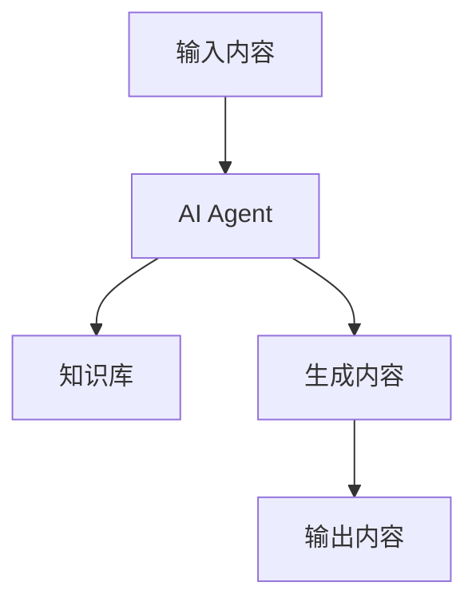
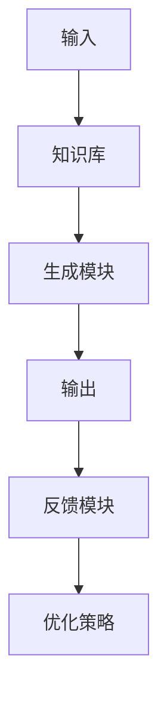
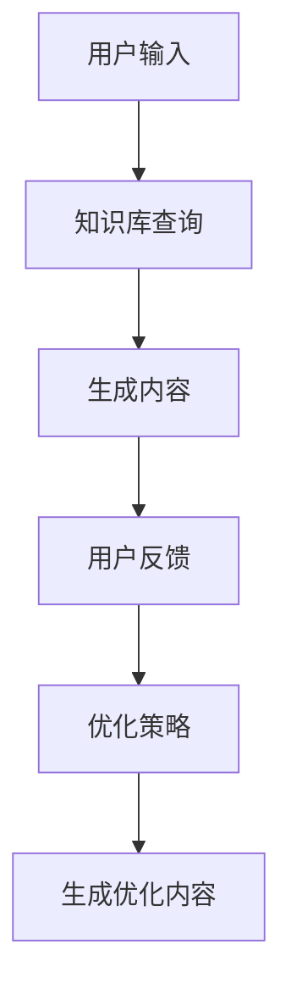
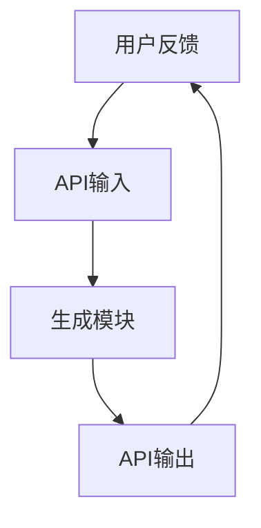

                 


# AI Agent在智能内容创作中的应用

## 关键词：AI Agent、智能内容创作、生成式AI、强化学习、内容创作平台、知识图谱

## 摘要：本文深入探讨AI Agent在智能内容创作中的应用，从基本概念到算法原理，再到系统架构和项目实战，全面解析其在提升内容创作效率和质量中的关键作用。通过详细的技术分析和实际案例，揭示AI Agent如何通过生成式AI和强化学习等技术，为内容创作带来革命性的改变。

---

# 第1章: AI Agent的基本概念与背景

## 1.1 AI Agent的定义与核心概念

### 1.1.1 什么是AI Agent
AI Agent（人工智能代理）是指能够感知环境、自主决策并执行任务的智能实体。它具备主动性、目标导向性和适应性，能够根据输入的信息和环境反馈，动态调整自身的行为策略。

### 1.1.2 AI Agent的核心属性
- **主动性**：AI Agent能够主动发起行动，而非被动响应。
- **目标导向性**：AI Agent的行为以实现特定目标为导向。
- **适应性**：AI Agent能够根据环境变化调整自身行为策略。

### 1.1.3 AI Agent与传统AI的区别
| 特性       | 传统AI                   | AI Agent              |
|------------|--------------------------|------------------------|
| 行为方式     | 被动响应                 | 主动决策                |
| 环境适应     | 静态或有限               | 动态且复杂              |
| 应用场景     | 数据处理、模式识别       | 内容创作、智能交互      |

## 1.2 AI Agent的发展历程

### 1.2.1 AI Agent的起源
AI Agent的概念起源于20世纪70年代的知识表示与推理研究，早期主要用于专家系统和自动驾驶领域。

### 1.2.2 从规则驱动到数据驱动的演变
- **规则驱动**：基于预定义的规则进行推理和决策。
- **数据驱动**：通过机器学习和深度学习，从大量数据中学习规律，生成更自然的输出。

### 1.2.3 当前AI Agent的技术趋势
当前，AI Agent主要基于生成式AI（如GPT系列）和强化学习技术，能够进行复杂场景下的智能交互和内容生成。

## 1.3 AI Agent在内容创作中的应用背景

### 1.3.1 内容创作的痛点与挑战
- **效率低下**：传统内容创作依赖人工，效率低且成本高。
- **创意枯竭**：创作者可能面临灵感不足的问题。
- **个性化需求**：市场对多样化和个性化内容的需求日益增加。

### 1.3.2 AI Agent如何解决内容创作问题
AI Agent通过生成式AI快速产出高质量内容，提供创意建议，并根据反馈不断优化生成结果。

### 1.3.3 智能内容创作的未来展望
随着AI Agent技术的进步，内容创作将更加高效、多样化和个性化，甚至能够实现跨平台、多模态的内容生成。

---

# 第2章: AI Agent的核心概念与原理

## 2.1 AI Agent的核心概念

### 2.1.1 知识表示与推理
知识表示是将领域知识以计算机可理解的形式表示，常见的表示方法包括语义网络和知识图谱。推理则是基于这些知识进行逻辑推断的过程。

### 2.1.2 行为规划与决策
行为规划涉及制定达到目标的具体步骤，而决策则是根据当前状态选择最优行动方案。

### 2.1.3 人机交互与反馈机制
人机交互是AI Agent与用户或环境进行信息交换的过程，反馈机制则用于调整AI Agent的行为策略。

## 2.2 AI Agent的技术原理

### 2.2.1 基于规则的AI Agent
基于规则的AI Agent通过预定义的规则进行推理和决策，适用于规则明确且固定的场景。

### 2.2.2 基于统计学习的AI Agent
基于统计学习的AI Agent通过分析大量数据，发现数据中的模式和规律，生成相应的输出。

### 2.2.3 基于深度学习的AI Agent
基于深度学习的AI Agent利用神经网络模型，如Transformer，进行复杂模式识别和生成任务。

## 2.3 AI Agent与相关技术的对比

### 2.3.1 AI Agent与传统AI的区别
| 特性       | 传统AI                   | AI Agent              |
|------------|--------------------------|------------------------|
| 行为方式     | 被动响应                 | 主动决策                |
| 环境适应     | 静态或有限               | 动态且复杂              |
| 应用场景     | 数据处理、模式识别       | 内容创作、智能交互      |

### 2.3.2 AI Agent与机器学习的联系
AI Agent可以基于机器学习模型构建，但AI Agent更强调自主决策和目标导向。

### 2.3.3 AI Agent与自然语言处理的关系
自然语言处理为AI Agent提供了语言理解和生成的能力，是AI Agent在内容创作中应用的重要基础。

---

# 第3章: AI Agent在智能内容创作中的算法原理

## 3.1 基于生成式AI的创作原理

### 3.1.1 变压器模型（Transformer）
Transformer模型由编码器和解码器组成，编码器负责将输入序列编码为语义向量，解码器则根据编码结果生成输出序列。

### 3.1.2 解码器（Decoder）的工作流程
解码器通过自注意力机制捕捉输入中的长距离依赖关系，逐步生成输出序列。

### 3.1.3 生成式AI的数学模型
生成式AI的核心是解码器的自注意力机制：
$$
\text{Attention}(Q, K, V) = \text{softmax}\left( \frac{QK^T}{\sqrt{d_k}} \right)V
$$

## 3.2 基于强化学习的创作优化

### 3.2.1 强化学习的基本原理
强化学习通过定义奖励函数，引导AI Agent学习最优策略。

### 3.2.2 AI Agent在强化学习中的角色
AI Agent通过与环境交互，不断优化其策略，以最大化累计奖励。

### 3.2.3 奖励机制的设计与实现
奖励机制的设计直接影响AI Agent的学习效果，常用的奖励函数包括基于生成内容质量的评分。

## 3.3 算法流程图


---

# 第4章: AI Agent的系统架构与设计

## 4.1 系统架构概述

### 4.1.1 系统整体架构
AI Agent系统通常包括知识库、生成模块、反馈模块和执行模块。

### 4.1.2 系统功能模块
- **知识库**：存储领域知识和历史数据。
- **生成模块**：负责内容的生成。
- **反馈模块**：收集用户反馈并优化生成策略。

### 4.1.3 系统架构图


## 4.2 系统功能设计

### 4.2.1 系统功能模块
- **内容生成**：根据输入生成文本内容。
- **反馈优化**：根据用户反馈调整生成策略。
- **知识管理**：维护和更新知识库。

### 4.2.2 系统功能流程


## 4.3 系统接口设计

### 4.3.1 API接口设计
- **输入接口**：接收用户的输入请求。
- **输出接口**：返回生成的内容。
- **反馈接口**：收集用户的反馈信息。

### 4.3.2 系统交互流程


---

# 第5章: AI Agent在智能内容创作中的项目实战

## 5.1 项目背景与目标

### 5.1.1 项目背景
本项目旨在开发一个基于AI Agent的智能写作助手，帮助用户快速生成高质量内容。

### 5.1.2 项目目标
- 提供多种内容生成模式。
- 支持用户自定义风格和主题。
- 提供实时反馈和优化建议。

## 5.2 环境搭建与工具安装

### 5.2.1 开发工具
- **Python**：编程语言。
- **TensorFlow**或**PyTorch**：深度学习框架。

### 5.2.2 安装命令
```bash
pip install tensorflow
pip install transformers
```

## 5.3 核心代码实现

### 5.3.1 生成式AI模型实现
```python
from transformers import GPT2LMHeadModel, GPT2Tokenizer

tokenizer = GPT2Tokenizer.from_pretrained('gpt2')
model = GPT2LMHeadModel.from_pretrained('gpt2')

def generate_text(prompt):
    inputs = tokenizer.encode(prompt, return_tensors='pt')
    outputs = model.generate(inputs, max_length=50, temperature=0.7)
    return tokenizer.decode(outputs[0], skip_special_tokens=True)
```

### 5.3.2 反馈优化模块
```python
def feedback_optimization(user_feedback):
    # 简化示例，实际应结合具体反馈机制
    pass
```

## 5.4 代码解读与优化

### 5.4.1 代码解读
- **生成式AI模型**：使用GPT-2模型进行文本生成。
- **反馈优化**：根据用户反馈调整生成策略，如调整温度参数。

### 5.4.2 优化建议
- **温度参数**：通过调整温度参数控制生成内容的多样性和创造性。
- **惩罚策略**：使用重复词惩罚机制避免内容重复。

## 5.5 实际案例分析

### 5.5.1 案例背景
用户输入：创作一篇关于人工智能的科普文章。

### 5.5.2 生成结果
AI Agent生成的内容不仅包含技术细节，还加入通俗易懂的解释。

---

# 第6章: AI Agent在智能内容创作中的最佳实践与小结

## 6.1 最佳实践

### 6.1.1 选择合适的模型
根据具体需求选择合适的生成式AI模型，如GPT-3适合复杂任务，而较小的模型适合资源受限的场景。

### 6.1.2 数据质量与多样性
确保训练数据的质量和多样性，避免模型生成偏见或不准确的内容。

### 6.1.3 用户反馈的重要性
及时收集和分析用户反馈，不断优化生成策略和内容质量。

## 6.2 项目小结

### 6.2.1 项目成果
成功开发了一个基于AI Agent的智能写作助手，能够高效生成高质量内容。

### 6.2.2 经验教训
- 模型选择和参数调优对生成效果影响显著。
- 用户反馈是优化生成策略的重要依据。

## 6.3 注意事项与未来展望

### 6.3.1 注意事项
- 数据隐私和安全问题需要重点关注。
- 模型的可解释性和透明度是用户信任的关键。

### 6.3.2 未来展望
- 多模态生成：结合视觉、听觉等多模态信息，生成更丰富的媒体内容。
- 更智能的交互：实现更自然的对话式交互，提升用户体验。

---

# 结语

AI Agent在智能内容创作中的应用前景广阔，通过不断的技术创新和实践积累，AI Agent将为内容创作带来更多的可能性。随着技术的进步，AI Agent将变得更加智能和高效，为创作者提供更强大的工具和更丰富的创作体验。

