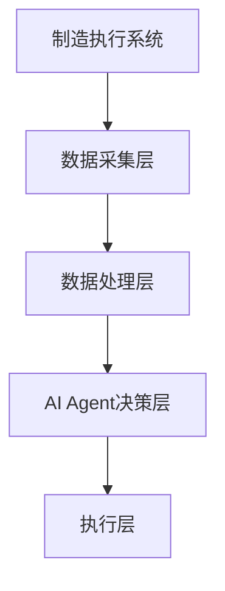

                 


# AI Agent在智能制造过程优化中的角色

> 关键词：AI Agent, 智能制造, 制造过程优化, 强化学习, 数字化转型

> 摘要：  
智能制造作为现代制造业发展的核心趋势，正在通过数字化、智能化和网络化技术的深度融合，推动生产过程的全面优化。在这个过程中，AI Agent（人工智能代理）作为一种能够感知环境、自主决策、执行任务的智能体，正在成为智能制造系统中不可或缺的关键角色。本文将从AI Agent的核心原理、智能制造的系统架构、AI Agent在制造过程优化中的具体应用，以及实际项目案例等方面，全面探讨AI Agent在智能制造中的角色与价值。通过分析强化学习、多智能体协作等技术原理，结合系统设计与实现，本文将为读者提供一个深入理解AI Agent在智能制造优化中应用的完整视角。

---

# 第一部分: AI Agent与智能制造的背景与基础

---

## 第1章: 制造业数字化与智能化转型

### 1.1 制造业的数字化转型

制造业的数字化转型是当今全球经济发展的重要趋势之一。传统制造业通过引入数字化技术，逐步实现了从人工操作到自动化、智能化的转变。这一过程不仅仅是技术的进步，更是企业管理模式和生产方式的根本性变革。

#### 1.1.1 制造业的演变历程

制造业经历了多个阶段的发展：
1. **机械化生产阶段**：依赖简单的机械装置，生产效率较低，人工干预较多。
2. **自动化生产阶段**：引入自动化设备，部分生产环节实现了机械化和自动化。
3. ** informatization 阶段**：通过计算机技术实现生产数据的采集、存储和初步分析。
4. **智能化生产阶段**：通过人工智能、大数据等技术实现生产过程的智能化优化。

#### 1.1.2 数字化转型的驱动力

数字化转型的驱动力包括：
1. **技术进步**：人工智能、物联网、5G等技术的发展为制造业的智能化提供了基础。
2. **市场竞争**：企业为了提高效率、降低成本，必须引入更先进的技术。
3. **客户需求**：消费者对个性化、定制化产品的需求增加，推动了智能制造的发展。

#### 1.1.3 工业4.0与智能制造的内涵

工业4.0是继工业1.0（机械化）、工业2.0（电气化）和工业3.0（自动化）之后的第四次工业革命。智能制造作为工业4.0的核心，强调通过数据驱动、智能决策和自主优化实现生产过程的高效运作。

---

### 1.2 智能制造的核心特征

智能制造不仅仅是简单的自动化生产，它具有以下核心特征：
1. **数据驱动**：通过传感器、物联网等技术实时采集生产数据，并利用数据分析技术进行优化决策。
2. **智能化决策**：通过AI技术实现生产过程的自主优化，例如预测性维护、质量控制等。
3. **灵活生产**：能够快速适应市场需求变化，实现个性化产品的定制化生产。
4. **人机协作**：人类与智能系统协同工作，充分发挥人类的创造力和机器的效率。

---

### 1.3 AI Agent的基本概念

AI Agent（人工智能代理）是一种能够感知环境、自主决策、执行任务的智能实体。在智能制造中，AI Agent可以用于优化生产计划、设备维护、质量控制等多个环节。

#### 1.3.1 什么是AI Agent

AI Agent具有以下特点：
1. **自主性**：能够在没有外部干预的情况下自主完成任务。
2. **反应性**：能够根据环境的变化实时调整行为。
3. **目标导向**：通过设定目标，驱动自身的行为。
4. **学习能力**：能够通过经验不断优化自身的决策模型。

#### 1.3.2 AI Agent的分类与特点

AI Agent可以根据应用场景分为以下几类：
1. **简单反射型Agent**：基于当前输入直接做出反应，适用于简单的决策任务。
2. **基于模型的反射型Agent**：通过内部模型分析环境状态，做出更复杂的决策。
3. **目标导向型Agent**：以特定目标为导向，通过规划实现目标。
4. **实用导向型Agent**：通过最大化效用函数实现目标。

#### 1.3.3 AI Agent在智能制造中的应用潜力

AI Agent在智能制造中的潜在应用包括：
1. **生产优化**：通过实时数据分析优化生产计划。
2. **设备维护**：预测设备故障，提前安排维护。
3. **质量控制**：实时监控生产过程，确保产品质量。
4. **供应链优化**：优化原材料采购和库存管理。

---

### 1.4 本章小结

本章介绍了制造业数字化转型的背景、智能制造的核心特征，以及AI Agent的基本概念和特点。通过分析AI Agent在智能制造中的潜力，我们为后续章节的深入探讨奠定了基础。

---

## 第2章: AI Agent的核心原理与数学模型

---

### 2.1 AI Agent的决策机制

AI Agent的核心在于其决策机制，而强化学习（Reinforcement Learning）是实现这一机制的重要技术。

#### 2.1.1 强化学习在AI Agent中的应用

强化学习是一种通过试错机制优化决策模型的技术。AI Agent通过与环境交互，不断优化自身的策略以最大化累积奖励。

#### 2.1.2 Q-learning算法的数学模型

Q-learning是一种常用的强化学习算法，其数学模型如下：

$$ Q(s, a) = Q(s, a) + \alpha [r + \gamma \max_{a'} Q(s', a') - Q(s, a)] $$

其中：
- \( Q(s, a) \)：状态-动作对的价值。
- \( \alpha \)：学习率。
- \( r \)：即时奖励。
- \( \gamma \)：折扣因子。
- \( s' \)：下一个状态。

---

### 2.2 AI Agent的感知与行动

AI Agent需要通过感知环境来做出决策，并通过行动与环境交互。

#### 2.2.1 感知层的输入处理

感知层负责采集环境中的数据，并将其转化为AI Agent可以处理的形式。例如，传感器数据、图像数据等。

#### 2.2.2 行动层的策略选择

行动层基于感知层提供的数据，选择最优的行动策略。例如，在生产线上选择最优的设备参数。

#### 2.2.3 感知与行动的协同优化

感知与行动的协同优化是AI Agent实现自主决策的关键。通过不断优化感知和行动的协同，AI Agent可以实现更高效的生产优化。

---

### 2.3 AI Agent的协作机制

在智能制造系统中，通常需要多个AI Agent协同工作。

#### 2.3.1 多智能体系统的基本原理

多智能体系统通过多个AI Agent的协作，实现更复杂的任务。例如，优化整个生产流程。

#### 2.3.2 协作机制的数学模型

协作机制可以通过以下公式表示：

$$ R = \sum_{i=1}^{n} r_i $$

其中：
- \( R \)：系统的总收益。
- \( r_i \)：第\( i \)个AI Agent的收益。

---

### 2.4 AI Agent与智能制造系统的实体关系图

以下是智能制造系统中AI Agent与制造系统的实体关系图：

```mermaid
er
actor AI Agent {
  id
  状态
  行为
}
actor 制造系统 {
  id
  参数
  输出
}
```

---

## 第3章: AI Agent在智能制造中的系统架构

---

### 3.1 智能制造系统的整体架构

智能制造系统的整体架构如下：



---

### 3.2 AI Agent的系统功能设计

#### 3.2.1 数据采集与处理

数据采集层负责采集生产过程中的实时数据，例如温度、压力、设备状态等。

#### 3.2.2 智能决策与优化

AI Agent根据采集的数据，通过强化学习等技术优化生产计划。

#### 3.2.3 执行与反馈

优化后的生产计划通过执行层执行，并实时反馈优化结果。

---

### 3.3 系统接口与交互流程

以下是系统的交互流程图：

```mermaid
sequence
A[制造系统] -> B[AI Agent]: 请求优化建议
B -> A: 返回优化方案
A -> C[执行层]: 执行优化方案
C -> A: 返回执行结果
```

---

## 第4章: 项目实战——AI Agent在制造过程优化中的应用

---

### 4.1 项目背景与目标

本项目旨在通过AI Agent优化某制造企业的生产计划，提高生产效率和降低成本。

---

### 4.2 环境配置

#### 4.2.1 系统环境

- 操作系统：Linux
- 开发工具：Python、TensorFlow、Keras
- 数据库：MySQL

---

### 4.3 核心代码实现

以下是AI Agent的核心代码实现：

```python
import numpy as np
import tensorflow as tf

# 定义Q-learning网络
class QNetwork:
    def __init__(self, state_space, action_space):
        self.state_space = state_space
        self.action_space = action_space
        self.model = tf.keras.Sequential([
            tf.keras.layers.Dense(32, activation='relu', input_dim=state_space),
            tf.keras.layers.Dense(action_space)
        ])
        self.model.compile(optimizer='adam', loss='mse')

    def act(self, state):
        q_values = self.model.predict(np.array([state]))
        return np.argmax(q_values[0])

    def train(self, state, action, reward, next_state):
        target = reward + gamma * np.max(self.model.predict(np.array([next_state])))
        target = target.reshape(-1, 1)
        self.model.fit(np.array([state]), target, epochs=1, verbose=0)

# 初始化网络
state_space = 4
action_space = 3
gamma = 0.99
q_network = QNetwork(state_space, action_space)
```

---

### 4.4 代码解读与分析

1. **QNetwork类**：定义了Q-learning网络的结构和训练方法。
2. **act方法**：根据当前状态选择动作。
3. **train方法**：通过强化学习更新Q值。

---

### 4.5 实际案例分析

通过上述代码实现的AI Agent可以优化生产计划，减少生产成本。

---

### 4.6 项目小结

本项目展示了AI Agent在制造过程优化中的实际应用，验证了其在提高生产效率和降低成本方面的潜力。

---

## 第5章: 总结与展望

---

### 5.1 本章总结

本文详细探讨了AI Agent在智能制造过程优化中的角色与应用，从理论到实践，全面分析了其在数字化转型中的重要性。

---

### 5.2 未来展望

随着人工智能技术的不断进步，AI Agent在智能制造中的应用将更加广泛。未来的研究方向包括多智能体协作优化、强化学习算法的改进等。

---

## 小结

通过本文的分析，我们可以看出，AI Agent在智能制造中的角色不仅限于简单的优化工具，而是成为推动整个生产过程智能化的核心力量。通过不断的技术创新和实践积累，AI Agent将为企业带来更大的竞争优势。

---

## 最佳实践 tips

1. 在实际应用中，建议从简单的优化任务入手，逐步引入AI Agent。
2. 确保数据的质量和实时性，这是AI Agent优化决策的基础。
3. 强化学习的参数设置对算法性能影响较大，需要进行充分的实验和调优。

---

## 注意事项

- AI Agent的应用需要与企业的实际需求相结合，避免盲目引入。
- 在实际应用中，要关注数据隐私和安全问题。

---

## 拓展阅读

1. 《Reinforcement Learning: Theory and Algorithms》
2. 《Multi-Agent Systems: Algorithmic, Complexity Theoretic, and Game Theoretic Foundations》

--- 

希望这篇文章能够为读者提供一个全面的视角，理解AI Agent在智能制造过程优化中的角色与价值。

