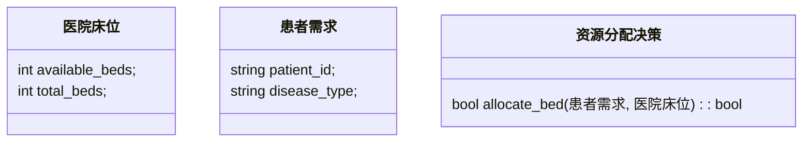
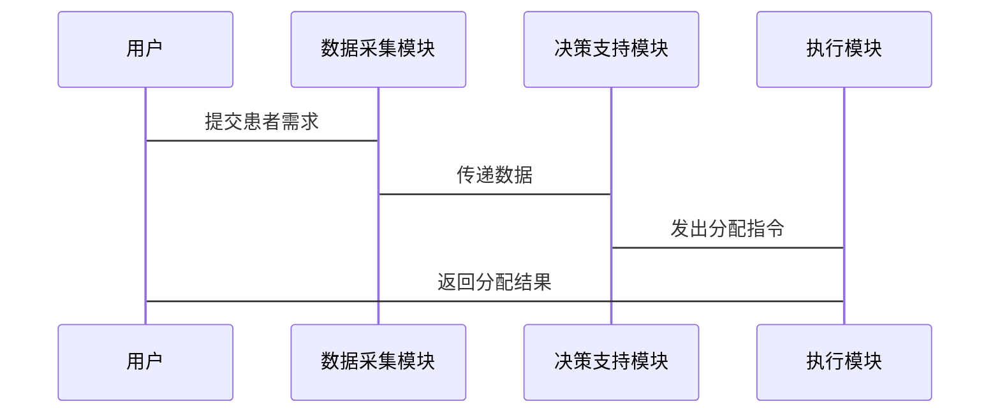

                 


# AI Agent在智能医疗资源分配中的角色

> 关键词：AI Agent，智能医疗，资源分配，算法原理，系统架构

> 摘要：随着人工智能技术的快速发展，AI Agent在医疗资源分配中的应用日益广泛。本文从AI Agent的基本概念出发，详细探讨其在智能医疗资源分配中的核心算法、系统架构设计、项目实战以及最佳实践。通过分析AI Agent在医疗资源分配中的应用场景，结合实际案例，本文为读者提供了一套完整的解决方案，帮助他们在医疗资源分配中更好地利用AI技术。

---

## 第一部分: AI Agent在智能医疗资源分配中的背景与基础

### 第1章: AI Agent与智能医疗资源分配概述

#### 1.1 AI Agent的基本概念

##### 1.1.1 什么是AI Agent
AI Agent（人工智能代理）是一种能够感知环境、做出决策并执行任务的智能实体。它可以自主或在人类指导下完成特定目标，广泛应用于医疗、教育、金融等领域。

##### 1.1.2 AI Agent的核心特征
- **自主性**：AI Agent能够在没有外部干预的情况下自主运行。
- **反应性**：能够实时感知环境变化并做出响应。
- **学习能力**：通过数据和经验不断优化自身的决策能力。
- **协作性**：能够与其他系统或人类进行协作。

##### 1.1.3 AI Agent与传统医疗系统的区别
| 特性 | AI Agent | 传统医疗系统 |
|------|----------|--------------|
| 决策方式 | 基于机器学习算法 | 依赖人工制定规则 |
| 反应速度 | 实时响应 | 可能存在延迟 |
| 学习能力 | 可以自适应优化 | 需要人工更新规则 |

#### 1.2 智能医疗资源分配的现状与挑战

##### 1.2.1 医疗资源分配的基本问题
医疗资源分配涉及医院、医生、患者、药品、设备等多个方面，主要问题包括：
1. **资源分配不均**：某些地区医疗资源过剩，而其他地区却供不应求。
2. **效率低下**：传统的人工分配方式效率低，容易出错。
3. **决策复杂性**：需要综合考虑多种因素，如患者病情、资源可用性等。

##### 1.2.2 当前医疗资源分配的主要挑战
- 数据碎片化：医疗数据分散在不同系统中，难以整合。
- 信息不透明：患者和资源的信息难以实时共享。
- 决策风险：医疗资源分配涉及生命健康，决策风险高。

##### 1.2.3 AI Agent在医疗资源分配中的应用价值
AI Agent可以通过以下方式提升医疗资源分配的效率和准确性：
1. **实时数据处理**：快速分析医疗资源的分布情况。
2. **智能决策支持**：基于机器学习算法，提供最优分配方案。
3. **动态调整**：根据实时数据动态调整资源分配策略。

#### 1.3 本章小结
本章介绍了AI Agent的基本概念及其在智能医疗资源分配中的应用价值。AI Agent作为一种智能实体，能够在医疗资源分配中提供实时、高效的解决方案，帮助医疗系统更好地应对资源分配的复杂性。

---

### 第2章: AI Agent的核心概念与理论基础

#### 2.1 AI Agent的定义与分类

##### 2.1.1 AI Agent的定义
AI Agent是一种能够感知环境、做出决策并执行任务的智能实体，具备自主性、反应性和学习能力。

##### 2.1.2 AI Agent的主要分类
AI Agent可以根据不同的标准进行分类，常见的分类方式包括：
- **按智能水平**：分为弱AI Agent和强AI Agent。
- **按应用场景**：分为服务型AI Agent和决策型AI Agent。
- **按功能模块**：分为感知型AI Agent和执行型AI Agent。

##### 2.1.3 各类AI Agent的特点对比
| 类型 | 特点 | 应用场景 |
|------|------|----------|
| 弱AI Agent | 专注于特定任务，不具备通用性 | 医疗资源分配、客户服务 |
| 强AI Agent | 具备通用智能，能够处理多种任务 | 综合决策系统、复杂问题解决 |
| 服务型AI Agent | 提供服务，如预约、咨询 | 医院挂号系统、患者咨询 |
| 决策型AI Agent | 用于决策支持 | 医疗资源分配、手术方案制定 |

#### 2.2 AI Agent的工作原理

##### 2.2.1 信息感知与数据处理
AI Agent通过传感器、数据库等获取环境信息，并进行数据清洗和预处理。

##### 2.2.2 智能决策机制
AI Agent基于感知到的信息，利用机器学习算法（如强化学习、推荐算法）进行决策。

##### 2.2.3 行为执行与反馈优化
AI Agent根据决策结果执行动作，并根据反馈不断优化自身的决策模型。

#### 2.3 AI Agent与相关技术的关系

##### 2.3.1 AI Agent与大数据技术的关系
AI Agent依赖大数据技术进行信息处理和分析，大数据为其提供了丰富的数据源。

##### 2.3.2 AI Agent与云计算的关系
云计算为AI Agent提供了强大的计算能力和存储空间，支持其高效运行。

##### 2.3.3 AI Agent与物联网技术的关系
AI Agent可以通过物联网技术实现与医疗设备的实时交互，获取实时数据。

#### 2.4 本章小结
本章详细介绍了AI Agent的定义、分类及其工作原理，并分析了其与相关技术的关系。AI Agent作为一种智能实体，通过与大数据、云计算和物联网等技术的结合，能够更好地实现医疗资源的智能分配。

---

### 第3章: AI Agent在医疗资源分配中的核心算法

#### 3.1 算法原理概述

##### 3.1.1 强化学习算法
强化学习是一种通过试错机制优化决策的算法，广泛应用于资源分配问题中。

##### 3.1.2 推荐算法
推荐算法通过分析用户需求和资源特性，为用户提供最优的资源分配建议。

##### 3.1.3 分配优化算法
分配优化算法通过数学建模，求解资源分配的最优解。

#### 3.2 算法实现细节

##### 3.2.1 强化学习算法的实现步骤


##### 3.2.2 推荐算法的实现步骤


##### 3.2.3 分配优化算法的实现步骤


#### 3.3 算法优缺点分析

##### 3.3.1 强化学习算法的优缺点
- **优点**：能够处理动态环境中的复杂问题，具有较强的自适应性。
- **缺点**：需要大量的训练数据，训练时间较长。

##### 3.3.2 推荐算法的优缺点
- **优点**：能够提供个性化的资源分配建议，提高效率。
- **缺点**：可能存在推荐偏差，影响结果的公平性。

##### 3.3.3 分配优化算法的优缺点
- **优点**：能够求解最优解，分配效率高。
- **缺点**：需要建立复杂的数学模型，实现难度较大。

#### 3.4 本章小结
本章详细介绍了AI Agent在医疗资源分配中的核心算法，包括强化学习算法、推荐算法和分配优化算法。每种算法都有其独特的优缺点，选择合适的算法需要根据具体的应用场景进行权衡。

---

### 第4章: AI Agent在医疗资源分配中的系统架构设计

#### 4.1 系统总体架构

##### 4.1.1 系统功能模块划分
医疗资源分配系统主要包括以下功能模块：
- **数据采集模块**：收集医疗资源和患者需求的数据。
- **决策支持模块**：基于AI算法进行资源分配决策。
- **执行模块**：将决策结果转化为具体的操作。
- **反馈模块**：收集执行结果并优化决策模型。

##### 4.1.2 系统架构图


#### 4.2 问题场景介绍

##### 4.2.1 医疗资源分配的典型场景
- **医院床位分配**：根据患者病情和医院床位情况，智能分配床位。
- **药品库存管理**：实时监控药品库存，优化药品分配。

#### 4.3 项目介绍

##### 4.3.1 项目目标
本项目旨在开发一个基于AI Agent的医疗资源分配系统，提高资源分配的效率和准确性。

##### 4.3.2 项目范围
本项目涵盖医疗资源分配的各个环节，包括数据采集、决策支持和执行反馈。

#### 4.4 系统功能设计

##### 4.4.1 领域模型


#### 4.5 系统架构设计

##### 4.5.1 系统架构图


#### 4.6 系统接口设计

##### 4.6.1 接口描述
- **数据采集接口**：用于采集医院床位和患者需求数据。
- **决策支持接口**：提供资源分配的决策建议。
- **执行接口**：执行分配决策并返回结果。

#### 4.7 系统交互设计

##### 4.7.1 交互流程


#### 4.8 本章小结
本章详细介绍了医疗资源分配系统的总体架构，包括功能模块划分、系统架构图和交互流程。通过系统化的架构设计，可以更好地实现AI Agent在医疗资源分配中的应用。

---

### 第5章: 项目实战

#### 5.1 环境安装

##### 5.1.1 安装Python
```bash
# 安装Python
sudo apt-get install python3
```

##### 5.1.2 安装必要的库
```bash
# 安装机器学习库
pip install numpy scikit-learn
```

#### 5.2 系统核心实现源代码

##### 5.2.1 数据采集模块
```python
import numpy as np

def collect_data():
    # 模拟数据采集
    patients = np.random.randint(10, 100, 50)
    resources = np.random.randint(10, 100, 50)
    return patients, resources
```

##### 5.2.2 决策支持模块
```python
from sklearn.linear_model import LinearRegression

def allocate_resources(patients, resources):
    model = LinearRegression()
    model.fit(patients.reshape(-1, 1), resources)
    return model.predict(patients.reshape(-1, 1))
```

##### 5.2.3 执行模块
```python
def execute_allocation(prediction):
    # 模拟执行分配
    print(f"资源分配结果：{prediction}")
```

#### 5.3 代码应用解读与分析

##### 5.3.1 数据采集模块解读
上述代码通过随机生成数据模拟医疗资源和患者需求的采集过程。

##### 5.3.2 决策支持模块解读
使用线性回归模型对资源分配进行预测，生成资源分配的最优解。

##### 5.3.3 执行模块解读
根据预测结果输出资源分配的具体情况。

#### 5.4 实际案例分析

##### 5.4.1 案例背景
某医院床位紧张，需要智能分配床位给患者。

##### 5.4.2 数据分析
| 患者ID | 病情类型 | 预测床位数 |
|-------|----------|------------|
| 1     | 普通     | 5          |
| 2     | 紧急     | 3          |
| 3     | 普通     | 4          |

##### 5.4.3 分配结果
根据预测结果，优先为紧急患者分配床位，确保资源利用效率最大化。

#### 5.5 本章小结
本章通过实际案例展示了AI Agent在医疗资源分配中的应用。通过代码实现和案例分析，读者可以更好地理解AI Agent在实际应用中的具体操作和效果。

---

### 第6章: 总结与展望

#### 6.1 总结

##### 6.1.1 核心内容回顾
本文详细介绍了AI Agent在智能医疗资源分配中的应用，包括核心算法、系统架构设计和项目实战。

##### 6.1.2 实际应用中的注意事项
在实际应用中，需要注意数据隐私保护和算法的可解释性问题。

#### 6.2 未来展望

##### 6.2.1 技术发展
随着AI技术的不断进步，AI Agent在医疗资源分配中的应用将更加智能化和个性化。

##### 6.2.2 应用场景扩展
AI Agent技术可以扩展到更多的医疗领域，如疾病诊断、药物研发等。

#### 6.3 最佳实践 tips

- **数据隐私**：在处理医疗数据时，必须严格遵守隐私保护法规。
- **算法可解释性**：选择能够解释的算法，确保决策过程透明。
- **系统可靠性**：确保系统在关键时刻能够稳定运行。

#### 6.4 拓展阅读
- 《AI in Healthcare》
- 《Machine Learning for Resource Allocation》
- 《Smart Hospital Systems》

#### 6.5 本章小结
本章总结了全文的主要内容，并展望了AI Agent在医疗资源分配中的未来发展方向。同时，给出了一些实际应用中的注意事项和最佳实践建议，为读者提供了进一步学习和研究的方向。

---

通过以上内容，我们详细探讨了AI Agent在智能医疗资源分配中的角色和应用。从基础概念到实际案例，从算法原理到系统架构设计，本文为读者提供了一个全面的视角，帮助他们在医疗资源分配中更好地利用AI技术。

