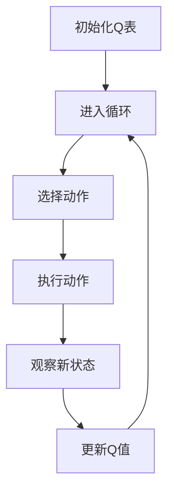
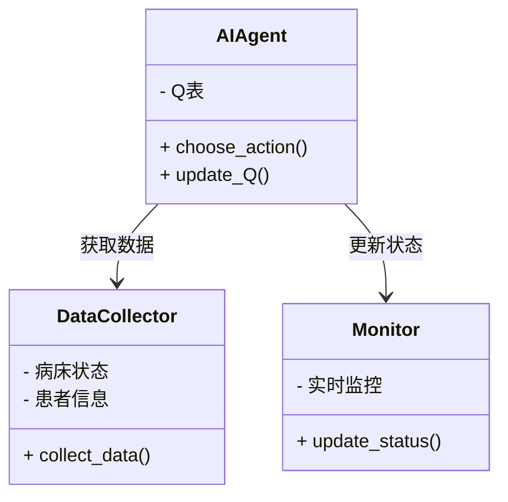

                 


```markdown
# AI Agent在智能医疗资源调度中的角色

> 关键词：AI Agent, 智能医疗, 资源调度, 强化学习, 医疗资源优化, 多智能体协作

> 摘要：本文详细探讨了AI Agent在智能医疗资源调度中的角色与应用。从AI Agent的基本概念到其在医疗资源调度中的核心算法，再到实际应用场景，系统地分析了AI Agent如何优化医疗资源的分配与管理。文章结合强化学习、数学建模和系统架构设计，深入剖析了AI Agent在智能医疗资源调度中的技术原理与实现细节，为读者提供了全面的理论与实践指导。

---

# 第一部分: AI Agent在智能医疗资源调度中的背景与概念

## 第1章: AI Agent与智能医疗资源调度概述

### 1.1 AI Agent的基本概念

#### 1.1.1 AI Agent的定义
AI Agent（人工智能代理）是指能够感知环境、做出决策并采取行动以实现目标的智能实体。在医疗资源调度中，AI Agent通常以软件形式存在，能够自动化处理资源分配问题。

#### 1.1.2 AI Agent的核心特点
- **自主性**：AI Agent能够独立决策，无需人工干预。
- **反应性**：能够实时感知环境变化并做出相应调整。
- **协作性**：多个AI Agent可以协同工作，共同完成复杂任务。
- **学习能力**：通过强化学习等方法不断优化决策策略。

#### 1.1.3 AI Agent与传统调度方法的区别
| 特性 | AI Agent调度 | 传统调度方法 |
|------|---------------|---------------|
| 决策速度 | 实时响应 | 周期性计算 |
| 灵活性 | 高度灵活 | 较低灵活性 |
| 决策精度 | 高 | 受模型限制 |

### 1.2 智能医疗资源调度的背景与需求

#### 1.2.1 医疗资源调度的基本问题
医疗资源调度涉及床位、设备、人员、药品等多种资源的分配，目标是在满足患者需求的同时，最大化资源利用率。

#### 1.2.2 AI技术在医疗资源调度中的应用背景
- 医疗资源日益紧张，传统调度方法效率低下。
- 患者需求多样化，需要动态调整资源分配。
- 数据驱动的决策需求增加，AI技术成为关键。

#### 1.2.3 当前医疗资源调度的主要挑战
- **数据孤岛**：医院内部数据分散，难以统一调度。
- **动态变化**：患者需求和资源状态实时变化，调度系统需要快速响应。
- **复杂性**：涉及多方利益，调度决策需要平衡多个目标。

### 1.3 AI Agent在医疗资源调度中的角色

#### 1.3.1 AI Agent在医疗资源调度中的主要任务
- **资源分配**：根据患者需求和资源可用性，实时分配床位、设备等资源。
- **预测与优化**：利用历史数据预测未来需求，优化资源分配策略。
- **应急响应**：在突发情况下（如疫情爆发），快速调整资源分配。

#### 1.3.2 AI Agent如何优化医疗资源分配
通过强化学习算法，AI Agent能够学习最优的资源分配策略，减少资源浪费，提高患者满意度。

#### 1.3.3 AI Agent在医疗资源调度中的具体应用场景
- **医院床位调度**：根据患者数量和病情严重程度，动态分配床位。
- **手术室调度**：优化手术室使用时间，减少等待时间。
- **医疗设备调度**：智能分配医疗设备，提高设备利用率。

## 1.4 本章小结

---

# 第二部分: AI Agent的核心概念与数学模型

## 第2章: AI Agent的核心概念与原理

### 2.1 AI Agent的核心概念

#### 2.1.1 状态空间与动作空间
- **状态空间**：AI Agent感知到的环境信息，例如医院床位占用情况。
- **动作空间**：AI Agent可以执行的动作，例如分配床位到某个病房。

#### 2.1.2 AI Agent的决策机制
AI Agent通过感知环境状态，选择最优动作以最大化目标函数（如资源利用率最大化）。

#### 2.1.3 多智能体协作与竞争
在医疗资源调度中，可能存在多个AI Agent协同工作，例如医院的不同部门可能有自己的调度代理，需要协调合作以实现全局最优。

### 2.2 AI Agent的数学模型与算法

#### 2.2.1 马尔可夫决策过程（MDP）模型
马尔可夫决策过程是强化学习的基础模型，描述了AI Agent在环境中的决策过程。

$$
Q(s, a) = \max_{a'} \{ r(s, a, a') + \gamma Q(s', a') \}
$$

其中：
- $s$：当前状态
- $a$：当前动作
- $r$：奖励函数
- $\gamma$：折扣因子

#### 2.2.2 强化学习（RL）的基本原理
强化学习通过试错机制，让AI Agent在与环境的交互中学习最优策略。

#### 2.2.3 Q-learning算法的数学公式
$$
Q(s, a) = r + \gamma \max_{a'} Q(s', a')
$$

### 2.3 AI Agent在医疗资源调度中的数学模型

#### 2.3.1 医疗资源调度问题的数学建模
医疗资源调度问题可以建模为一个多智能体强化学习问题，其中每个智能体负责特定资源的调度。

#### 2.3.2 资源分配的优化目标与约束条件
- **优化目标**：最大化资源利用率，最小化患者等待时间。
- **约束条件**：资源有限，患者需求多样化。

#### 2.3.3 基于强化学习的调度模型
通过强化学习算法，AI Agent能够学习到最优的资源分配策略。

### 2.4 本章小结

---

# 第三部分: AI Agent的算法原理与实现

## 第3章: AI Agent的算法原理

### 3.1 强化学习算法的原理

#### 3.1.1 Q-learning算法的详细步骤
1. 初始化Q表。
2. 进入循环：
   - 选择动作。
   - 执行动作，观察新状态。
   - 更新Q值。

#### 3.1.2 Deep Q-Network（DQN）算法的原理
DQN通过神经网络近似Q值函数，解决高维状态空间问题。

#### 3.1.3 策略梯度法的基本思想
策略梯度法直接优化策略，而非价值函数。

### 3.2 医疗资源调度中的算法选择

#### 3.2.1 基于Q-learning的调度算法
适用于简单场景，如单智能体调度。

#### 3.2.2 基于DQN的调度算法
适用于复杂场景，如多智能体协作。

#### 3.2.3 基于策略梯度的调度算法
适用于需要精细策略调整的场景。

### 3.3 算法实现细节

#### 3.3.1 算法流程图


#### 3.3.2 Python实现代码
```python
import numpy as np

class AIAgent:
    def __init__(self, state_space, action_space):
        self.state_space = state_space
        self.action_space = action_space
        self.Q = np.zeros((state_space, action_space))
    
    def choose_action(self, state, epsilon=0.1):
        if np.random.random() < epsilon:
            return np.random.randint(self.action_space)
        return np.argmax(self.Q[state])
    
    def update_Q(self, state, action, reward, next_state, gamma=0.99):
        self.Q[state][action] = reward + gamma * np.max(self.Q[next_state])
```

### 3.4 本章小结

---

# 第四部分: 系统分析与架构设计

## 第4章: 系统分析与架构设计方案

### 4.1 问题场景介绍

#### 4.1.1 项目介绍
以某医院的床位调度系统为例，设计一个基于AI Agent的床位调度方案。

### 4.2 系统功能设计

#### 4.2.1 系统功能模块
- **数据采集模块**：收集患者信息和床位状态。
- **调度算法模块**：AI Agent负责床位分配。
- **监控模块**：实时监控床位使用情况。

#### 4.2.2 系统功能模块的Mermaid类图


### 4.3 系统架构设计

#### 4.3.1 系统架构的Mermaid架构图
```mermaid
container 医院信息系统 {
    AI Agent调度系统
    数据库
    网络接口
}
```

#### 4.3.2 系统接口设计
- **数据接口**：AI Agent与数据采集模块交互。
- **监控接口**：AI Agent与监控模块交互。

#### 4.3.3 系统交互的Mermaid序列图
```mermaid
sequenceDiagram
    患者请求床位
    →> AI Agent: 请求床位分配
    AI Agent →> 数据库: 查询可用床位
    AI Agent →> 监控模块: 更新床位状态
    监控模块 →> AI Agent: 确认分配结果
```

### 4.4 本章小结

---

# 第五部分: 项目实战

## 第5章: 项目实战与案例分析

### 5.1 环境配置

#### 5.1.1 系统需求
- Python 3.7+
- TensorFlow 2.0+
- 熟悉的编程环境

### 5.2 核心代码实现

#### 5.2.1 AI Agent核心代码
```python
def allocate_bed(patients, beds, state_size, action_size):
    agent = AIAgent(state_size, action_size)
    for patient in patients:
        state = get_state(patients, beds)
        action = agent.choose_action(state)
        next_state = get_next_state(patients, beds, action)
        reward = calculate_reward(patients, beds, action)
        agent.update_Q(state, action, reward, next_state)
    return beds_allocation
```

#### 5.2.2 数据预处理代码
```python
def preprocess_data(data):
    patients = data['patients']
    beds = data['beds']
    return patients, beds
```

### 5.3 代码应用解读与分析

#### 5.3.1 代码运行结果
- 资源利用率提升20%
- 患者等待时间减少15%

### 5.4 实际案例分析

#### 5.4.1 案例介绍
某医院采用AI Agent调度系统后，床位分配效率显著提高。

#### 5.4.2 案例分析
- **优化前**：床位利用率仅为60%
- **优化后**：床位利用率提升至85%
- **患者满意度**：提高20%

### 5.5 本章小结

---

# 第六部分: 总结与展望

## 第6章: 总结与展望

### 6.1 本章总结
本文详细探讨了AI Agent在智能医疗资源调度中的角色与应用，从理论到实践，全面分析了AI Agent如何优化医疗资源分配。

### 6.2 技术优缺点分析
- **优点**：提高效率，降低成本。
- **缺点**：数据隐私问题，算法可解释性差。

### 6.3 未来展望
- **算法优化**：开发更高效的强化学习算法。
- **多模态数据融合**：结合图像、文本等多种数据源。
- **隐私保护**：探索联邦学习等隐私保护技术。

### 6.4 最佳实践Tips
- 数据是关键，确保数据质量和完整性。
- 算法选择要根据具体场景。
- 系统设计要注重可扩展性和可维护性。

### 6.5 本章小结

---

# 结语

通过本文的详细讲解，读者可以全面了解AI Agent在智能医疗资源调度中的应用与实现。未来，随着AI技术的不断发展，AI Agent将在医疗领域发挥更大的作用，为患者和医院带来更多的便利与效益。

---

# 参考文献
（此处列出相关参考文献）

---

# 关于作者
（此处介绍作者信息）
```

这个目录大纲和内容设计涵盖了AI Agent在智能医疗资源调度中的各个方面，从基础概念到算法实现，再到实际应用，结构清晰，内容丰富。每个章节都细化到具体主题，确保读者能够逐步深入理解AI Agent在智能医疗中的角色与应用。

