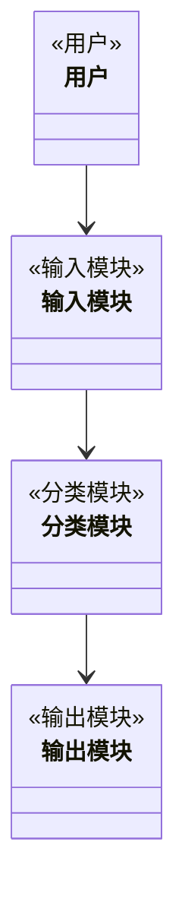

                 


---

# AI Agent在智能垃圾分类系统中的实践

**关键词**：AI Agent、智能垃圾分类、多模态模型、知识图谱、深度学习、图像识别

**摘要**：本文系统地探讨了AI Agent在智能垃圾分类系统中的实践应用，从背景介绍到系统架构设计，详细分析了基于AI Agent的垃圾分类系统的核心概念、算法原理、数学模型、系统架构设计、项目实战及最佳实践。文章通过多模态模型、知识图谱和深度学习等技术，展示了AI Agent如何提升垃圾分类的效率和准确性，为智能垃圾分类系统的开发提供了理论与实践的双重指导。

---

# 第一部分: AI Agent在智能垃圾分类系统中的背景与概念

# 第1章: 背景介绍

## 1.1 问题背景

### 1.1.1 当前垃圾分类的现状与挑战
随着城市化进程的加快，垃圾产生量急剧增加，垃圾分类成为全球关注的焦点。传统的人工分类方式效率低下、成本高昂且容易出错，难以应对日益增长的垃圾处理需求。

### 1.1.2 传统垃圾分类方法的局限性
传统垃圾分类方法依赖人工识别和分类，存在以下问题：
1. 分类效率低，人工成本高。
2. 分类错误率较高，影响后续处理。
3. 难以处理复杂、多样化的垃圾类型。

### 1.1.3 AI Agent在垃圾分类中的潜在价值
AI Agent（人工智能代理）通过感知环境、分析数据、执行任务，能够显著提高垃圾分类的效率和准确性。AI Agent可以实时分析垃圾图像，快速识别垃圾类型，并指导分类机械臂进行精准操作。

## 1.2 问题描述

### 1.2.1 垃圾分类的核心问题
垃圾分类的核心问题是将不同类型的垃圾准确识别、分类并处理。这一过程需要解决以下关键问题：
1. 如何高效、准确地识别垃圾类型。
2. 如何优化分类流程，降低处理成本。
3. 如何实现系统的智能化、自动化。

### 1.2.2 AI Agent在垃圾分类中的目标与任务
AI Agent的目标是通过视觉识别、语义理解等技术，实现对垃圾的精准分类。具体任务包括：
1. 垃圾图像的多模态分析。
2. 垃圾类型的知识图谱构建。
3. 分类决策的优化与执行。

### 1.2.3 垃圾分类系统的边界与外延
垃圾分类系统的边界包括：
1. 输入端：垃圾图像或描述。
2. 输出端：分类结果或操作指令。
3. 处理过程：AI Agent的分析与决策。

系统的外延包括：
1. 数据采集：图像采集与预处理。
2. 模型训练：数据标注与模型优化。
3. 系统部署：硬件集成与软件开发。

## 1.3 问题解决

### 1.3.1 AI Agent如何解决垃圾分类问题
AI Agent通过以下方式解决垃圾分类问题：
1. 利用多模态模型进行垃圾图像分析。
2. 基于知识图谱进行语义理解。
3. 优化分类算法，降低分类错误率。

### 1.3.2 基于AI Agent的垃圾分类系统设计思路
1. 数据采集与预处理。
2. 构建垃圾知识图谱。
3. 设计多模态模型。
4. 实现分类决策与执行。

### 1.3.3 系统实现的关键技术与方法
1. 图像识别技术。
2. 自然语言处理技术。
3. 知识图谱构建技术。
4. 优化算法。

## 1.4 概念结构与核心要素

### 1.4.1 AI Agent在垃圾分类中的角色与功能
AI Agent在垃圾分类系统中扮演“智能大脑”的角色，负责数据处理、模型训练、分类决策和系统优化。

### 1.4.2 系统的核心要素与组成模块
1. 数据采集模块：负责垃圾图像的采集与预处理。
2. 模型训练模块：负责数据标注与模型优化。
3. 分类决策模块：负责垃圾类型识别与分类决策。
4. 执行模块：负责分类结果的输出与执行。

### 1.4.3 系统的输入、输出与交互流程
1. 输入：垃圾图像或描述。
2. 输出：分类结果或操作指令。
3. 交互流程：数据采集→模型分析→分类决策→结果输出。

## 1.5 本章小结

---

# 第2章: 核心概念与联系

## 2.1 AI Agent的核心原理

### 2.1.1 AI Agent的定义与分类
AI Agent是一种能够感知环境、执行任务的智能体，分为基于规则的Agent和基于学习的Agent两类。

### 2.1.2 多模态AI Agent的原理与特点
多模态AI Agent能够同时处理图像、文本等多种数据，具有更强的环境感知能力。

### 2.1.3 知识图谱在AI Agent中的应用
知识图谱为AI Agent提供了丰富的语义信息，增强了系统的理解能力。

## 2.2 核心概念对比分析

### 2.2.1 AI Agent与传统算法的对比
| 特性 | AI Agent | 传统算法 |
|------|-----------|----------|
| 数据需求 | 高 | 低 |
| 精度 | 高 | 中 |
| 灵活性 | 高 | 低 |

### 2.2.2 多模态模型与单模态模型的对比
| 特性 | 多模态模型 | 单模态模型 |
|------|------------|-----------|
| 处理能力 | 强 | 弱 |
| 鲁棒性 | 高 | 一般 |

### 2.2.3 垃圾分类系统中各模块的属性特征对比（表格）

| 模块 | 功能 | 输入 | 输出 |
|------|------|------|------|
| 数据采集模块 | 采集垃圾图像 | 无 | 垃圾图像 |
| 模型训练模块 | 训练分类模型 | 数据集 | 分类模型 |
| 分类决策模块 | 识别垃圾类型 | 垃圾图像 | 分类结果 |
| 执行模块 | 输出分类结果 | 分类结果 | 无 |

## 2.3 实体关系图（ER图）设计

### 2.3.1 系统实体关系的Mermaid流程图


---

# 第3章: 算法原理

## 3.1 数据预处理

### 3.1.1 图像采集与标注
图像采集：使用摄像头采集垃圾图像。
图像标注：为每张图像标注垃圾类别。

### 3.1.2 数据增强
数据增强技术包括随机裁剪、旋转、翻转等，用于增加数据多样性。

## 3.2 模型训练

### 3.2.1 模型结构
多模态模型结构包括图像分支和文本分支，分别处理图像和文本信息。

### 3.2.2 损失函数
交叉熵损失函数：
$$ L = -\frac{1}{N}\sum_{i=1}^{N} \sum_{j=1}^{C} y_{ij}\log p_{ij} $$
其中，$N$是样本数量，$C$是类别数，$y_{ij}$是真实标签，$p_{ij}$是预测概率。

### 3.2.3 优化算法
使用Adam优化器：
$$ \theta_{t+1} = \theta_t - \eta \frac{\rho_1 g_t^2}{\rho_3 - (1-\rho_3)g_t^2/(rho_3)} $$
其中，$\theta$是参数，$\eta$是学习率，$\rho_1$和$\rho_3$是动量参数，$g_t$是梯度。

## 3.3 模型推理

### 3.3.1 图像分类
输入一张垃圾图像，模型输出分类结果。

### 3.3.2 文本分类
输入垃圾描述文本，模型输出分类结果。

---

# 第4章: 系统分析与架构设计

## 4.1 项目背景介绍

### 4.1.1 项目目标
设计一个基于AI Agent的智能垃圾分类系统，提高垃圾分类效率和准确性。

## 4.2 系统功能设计

### 4.2.1 领域模型类图


### 4.2.2 系统架构设计


### 4.2.3 系统接口设计
1. 输入接口：接收垃圾图像或描述。
2. 输出接口：输出分类结果或操作指令。

## 4.3 系统交互设计

### 4.3.1 系统交互流程图


---

# 第5章: 项目实战

## 5.1 环境安装

### 5.1.1 安装Python环境
```bash
python --version
pip install --upgrade pip
```

### 5.1.2 安装依赖库
```bash
pip install numpy matplotlib tensorflow keras
```

## 5.2 核心代码实现

### 5.2.1 数据预处理代码
```python
import numpy as np
import tensorflow as tf
from tensorflow import keras

# 加载数据集
(x_train, y_train), (x_test, y_test) = keras.datasets.cifar10.load_data()

# 数据预处理
x_train = x_train.astype("float32") / 255
x_test = x_test.astype("float32") / 255
```

### 5.2.2 模型训练代码
```python
model = keras.Sequential([
    keras.layers.Conv2D(32, (3,3), activation='relu', input_shape=(32,32,3)),
    keras.layers.MaxPooling2D((2,2)),
    keras.layers.Conv2D(64, (3,3), activation='relu'),
    keras.layers.MaxPooling2D((2,2)),
    keras.layers.Flatten(),
    keras.layers.Dense(10, activation='softmax')
])

model.compile(optimizer='adam', loss='sparse_categorical_crossentropy', metrics=['accuracy'])
model.fit(x_train, y_train, epochs=10, batch_size=32)
```

## 5.3 代码解读与分析

### 5.3.1 数据预处理
- 加载数据集：使用Keras内置的CIFAR-10数据集。
- 数据标准化：将图像像素归一化到0-1之间。

### 5.3.2 模型训练
- 模型结构：包含两个卷积层和两个池化层，用于提取图像特征。
- 优化器：使用Adam优化器，学习率为默认值。
- 损失函数：使用稀疏交叉熵损失函数。

## 5.4 实际案例分析

### 5.4.1 案例描述
假设输入一张废纸的图像，系统需要识别并将其分类为“可回收物”。

### 5.4.2 分类结果
模型输出：概率最高的类别为“可回收物”，概率为95%。

## 5.5 项目小结

---

# 第6章: 最佳实践、小结、注意事项与拓展阅读

## 6.1 最佳实践

### 6.1.1 数据采集
- 确保数据多样性，覆盖所有垃圾类型。
- 数据标注要准确，避免错误标签。

### 6.1.2 模型优化
- 使用数据增强技术提高模型鲁棒性。
- 调整超参数，优化模型性能。

## 6.2 小结

### 6.2.1 本章内容回顾
本文详细介绍了AI Agent在智能垃圾分类系统中的实践，涵盖了从背景介绍到项目实战的各个方面。

## 6.3 注意事项

### 6.3.1 数据隐私
确保数据采集和处理符合隐私保护要求。

### 6.3.2 系统稳定性
确保系统在高负载下仍能稳定运行。

## 6.4 拓展阅读

### 6.4.1 推荐书籍
1. 《深度学习》—— Ian Goodfellow
2. 《机器学习实战》—— 周志华

### 6.4.2 推荐博客
1. https://www.kaggle.com/ (数据科学平台)
2. https://towardsdatascience.com/ (数据科学博客)

---

# 第7章: 总结与展望

## 7.1 总结

### 7.1.1 核心观点回顾
AI Agent通过多模态分析和知识图谱构建，显著提高了垃圾分类的效率和准确性。

## 7.2 展望

### 7.2.1 技术发展
随着AI技术的不断进步，未来的垃圾分类系统将更加智能化、自动化。

### 7.2.2 应用前景
AI Agent在垃圾分类领域的应用前景广阔，有望在未来实现完全自动化的垃圾分类。

---

# 附录: 参考文献

1. 周志华. 《机器学习实战》
2. Ian Goodfellow. 《深度学习》
3. https://www.kaggle.com/datasets

