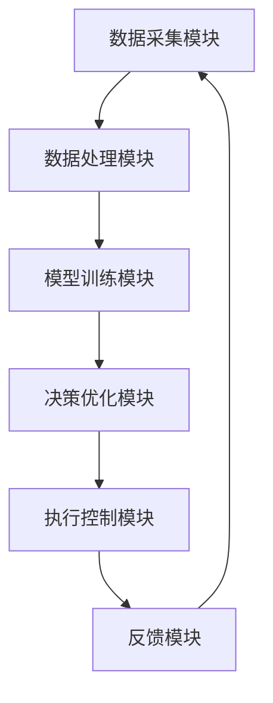
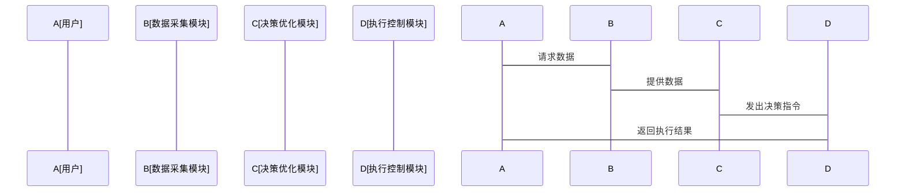

                 


# AI Agent在智能城市水资源调配中的实践

> **关键词**：AI Agent、智能城市、水资源调配、机器学习、优化算法、智能系统  
> 
> **摘要**：  
> 随着城市化进程的加快，水资源短缺问题日益严重，如何高效利用和调配水资源成为智能城市建设中的重要课题。AI Agent（人工智能代理）作为一种智能化的决策工具，能够通过机器学习、优化算法和实时数据分析，实现水资源的智能化调配。本文将从AI Agent的基本概念、核心原理、算法实现、系统架构、项目实战等方面，详细探讨AI Agent在智能城市水资源调配中的实践应用，分析其优势与挑战，并展望未来的发展方向。

---

# 第1章: AI Agent与智能城市水资源调配概述

## 1.1 AI Agent的基本概念
### 1.1.1 AI Agent的定义与特点
AI Agent（人工智能代理）是一种能够感知环境、自主决策并执行任务的智能系统。它通过数据采集、分析和学习，能够理解问题、制定解决方案并执行操作。AI Agent的特点包括：  
- **自主性**：能够在没有人工干预的情况下自主运行。  
- **反应性**：能够实时感知环境变化并做出响应。  
- **学习能力**：通过机器学习算法不断优化自身的决策能力。  
- **协作性**：能够与其他系统或AI Agent协同工作。

### 1.1.2 AI Agent在智能城市中的应用领域
AI Agent在智能城市中的应用非常广泛，包括交通管理、能源调度、环境监测、公共安全等领域。其中，水资源调配是智能城市建设中的重要组成部分。

### 1.1.3 水资源调配的智能化需求
传统的水资源调配方式依赖于人工经验，存在效率低、响应慢、资源浪费等问题。随着城市规模的扩大和水资源短缺问题的加剧，智能化调配的需求日益迫切。AI Agent通过数据驱动的决策能力，能够显著提升水资源调配的效率和精准度。

## 1.2 智能城市水资源调配的背景与挑战
### 1.2.1 城市水资源短缺问题
城市化进程的加快导致水资源需求量激增，而水资源分布不均和污染问题进一步加剧了水资源短缺的矛盾。

### 1.2.2 水资源调配的复杂性
水资源调配涉及多个因素，包括供水量、需水量、水质、气象条件等。这些因素相互关联，使得调配过程复杂且动态变化。

### 1.2.3 AI技术在水资源管理中的潜力
AI技术能够通过大数据分析和机器学习，帮助我们更好地理解水资源的分布规律、预测需求变化，并制定最优调配策略。

## 1.3 AI Agent在水资源调配中的作用
### 1.3.1 AI Agent的核心功能
AI Agent在水资源调配中的核心功能包括：  
- **数据采集与分析**：实时采集水文数据并进行分析。  
- **优化调度**：基于数据分析结果，制定最优的供水和排水方案。  
- **智能决策**：根据实时情况动态调整调配策略。

### 1.3.2 AI Agent如何优化水资源调配
AI Agent通过以下方式优化水资源调配：  
1. **实时监测与反馈**：通过物联网设备实时采集水位、流量等数据，快速响应变化。  
2. **预测与优化**：利用机器学习模型预测未来的需求变化，并优化资源配置。  
3. **多目标决策**：在满足供水需求的同时，考虑能耗、成本等多目标优化。

### 1.3.3 实际案例分析
以某城市为例，AI Agent通过分析历史用水数据和天气预报，成功预测了某次暴雨后的用水需求高峰，并提前调整供水计划，避免了供水不足的问题。

## 1.4 本章小结
本章介绍了AI Agent的基本概念、智能城市水资源调配的背景与挑战，以及AI Agent在水资源调配中的重要作用。AI Agent通过智能化的决策能力，为解决城市水资源问题提供了新的思路。

---

# 第2章: AI Agent的核心概念与工作原理

## 2.1 AI Agent的核心概念
### 2.1.1 感知层：数据采集与处理
AI Agent的第一步是感知环境，通过传感器、数据库等渠道采集水文数据，并对数据进行清洗、转换和预处理。

### 2.1.2 决策层：优化算法与模型
AI Agent的核心在于决策层，通过机器学习算法和优化模型，分析数据并生成决策方案。

### 2.1.3 执行层：指令输出与反馈
AI Agent将决策结果转化为具体的指令，输出给执行系统（如水泵、阀门等），并根据反馈进一步优化决策。

## 2.2 AI Agent的工作流程
### 2.2.1 数据采集与预处理
- 数据采集：通过传感器、数据库等获取水位、流量、水质等数据。
- 数据清洗：去除噪声数据，确保数据的准确性和完整性。

### 2.2.2 模型训练与优化
- 选择合适的机器学习算法（如随机森林、支持向量机等）进行模型训练。
- 使用优化算法（如遗传算法）对模型进行调优。

### 2.2.3 决策输出与反馈
- 根据模型预测结果生成决策指令。
- 根据执行结果反馈优化模型。

## 2.3 AI Agent的关键技术
### 2.3.1 机器学习算法
- **监督学习**：用于分类和回归任务。
- **无监督学习**：用于聚类分析。
- **强化学习**：用于动态决策任务。

### 2.3.2 强化学习与决策树
- **强化学习**：通过奖励机制优化决策策略。
- **决策树**：用于分类和回归任务，帮助AI Agent做出最优决策。

### 2.3.3 自然语言处理与知识图谱
- **自然语言处理**：用于处理文本数据，提取有用信息。
- **知识图谱**：用于构建领域知识库，辅助决策。

## 2.4 本章小结
本章详细介绍了AI Agent的核心概念和工作原理，重点讲解了感知层、决策层和执行层的功能，以及机器学习算法在AI Agent中的应用。

---

# 第3章: AI Agent的算法原理

## 3.1 常见算法概述
### 3.1.1 强化学习算法
强化学习是一种通过与环境交互来学习最优策略的算法。常用算法包括Q-Learning和Deep Q-Network（DQN）。

### 3.1.2 遗传算法
遗传算法是一种基于生物进化论的优化算法，适用于复杂的组合优化问题。

### 3.1.3 支持向量机
支持向量机（SVM）是一种监督学习算法，适用于分类和回归任务。

## 3.2 算法选择与优化
### 3.2.1 算法选择的依据
- 任务类型：分类、回归、优化等。
- 数据规模：小数据集适合SVM，大数据集适合随机森林。
- 计算资源：复杂算法需要较高的计算能力。

### 3.2.2 算法优化策略
- 参数调整：如学习率、惩罚系数等。
- 集成学习：通过集成多个模型提升性能。

## 3.3 算法实现的数学模型
### 3.3.1 强化学习的数学模型
强化学习的核心是通过状态、动作和奖励的三元组来更新策略。其数学模型如下：
$$ Q(s, a) \leftarrow Q(s, a) + \alpha (r + \gamma Q(s', a') - Q(s, a)) $$
其中，$\alpha$是学习率，$\gamma$是折扣因子。

### 3.3.2 遗传算法的数学模型
遗传算法的核心是通过选择、交叉和变异操作生成新的个体。其数学模型如下：
$$ f_{\text{适应度}}(x) = \sum_{i=1}^{n} w_i x_i $$
其中，$w_i$是权重，$x_i$是变量。

### 3.3.3 支持向量机的数学模型
支持向量机的目标是最小化经验风险和结构风险的泛化性能。其数学模型如下：
$$ \min_{w,b,\xi} \frac{1}{2}||w||^2 + C\sum_{i=1}^{n}\xi_i $$
$$ y_i(w\cdot x_i + b) \geq 1 - \xi_i $$
$$ \xi_i \geq 0 $$

## 3.4 算法实现的代码示例
### 3.4.1 强化学习代码示例
```python
import numpy as np

class QLearning:
    def __init__(self, state_size, action_size, learning_rate=0.1, gamma=0.9):
        self.q_table = np.zeros((state_size, action_size))
        self.lr = learning_rate
        self.gamma = gamma

    def choose_action(self, state, epsilon=0.1):
        if np.random.random() < epsilon:
            return np.random.randint(0, action_size)
        return np.argmax(self.q_table[state])

    def update_q_table(self, state, action, reward, next_state):
        self.q_table[state][action] = self.q_table[state][action] + self.lr * (reward + self.gamma * np.max(self.q_table[next_state]) - self.q_table[state][action])
```

### 3.4.2 遗传算法代码示例
```python
def genetic_algorithm(population_size, fitness_func, generations=100):
    population = [np.random.rand(2) for _ in range(population_size)]
    for _ in range(generations):
        fitness = [fitness_func(ind) for ind in population]
        population = [ind for ind in population if fitness[ind] > np.mean(fitness)]
        while len(population) < population_size:
            parent1 = population[np.random.randint(len(population))]
            parent2 = population[np.random.randint(len(population))]
            child = (parent1 + parent2) / 2
            population.append(child)
    return max(population, key=fitness_func)
```

## 3.5 本章小结
本章详细介绍了AI Agent中常用的算法，包括强化学习、遗传算法和支持向量机，并给出了代码示例和数学模型。

---

# 第4章: 智能城市水资源调配系统的架构设计

## 4.1 系统总体架构
### 4.1.1 系统模块划分
- **数据采集模块**：负责采集水文数据。
- **数据处理模块**：对数据进行清洗和预处理。
- **模型训练模块**：训练机器学习模型。
- **决策优化模块**：基于模型结果生成决策指令。
- **执行控制模块**：控制水泵、阀门等设备。

### 4.1.2 系统功能设计
- 数据采集与存储：通过传感器采集水位、流量等数据，并存储到数据库中。
- 数据分析与预测：利用机器学习模型预测用水需求和水资源短缺风险。
- 优化调度：根据预测结果优化供水和排水计划。
- 实时监控与反馈：实时监控系统运行状态，并根据反馈调整决策策略。

### 4.1.3 系统架构图


## 4.2 数据采集与处理模块
### 4.2.1 数据采集方式
- **物联网传感器**：如水位传感器、流量传感器等。
- **数据库查询**：从历史数据中获取相关信息。

### 4.2.2 数据预处理
- 数据清洗：去除噪声数据。
- 数据转换：将数据转换为统一格式。

## 4.3 模型训练与优化模块
### 4.3.1 模型选择
根据任务需求选择合适的机器学习算法。

### 4.3.2 模型训练
通过训练数据训练模型，并验证模型的性能。

### 4.3.3 模型优化
通过调整模型参数和优化算法提升模型性能。

## 4.4 决策优化与执行模块
### 4.4.1 决策策略
基于模型预测结果制定最优决策。

### 4.4.2 执行控制
将决策指令转化为具体的控制动作。

## 4.5 系统接口设计
### 4.5.1 接口定义
- 数据采集接口：接收传感器数据。
- 决策接口：接收模型决策结果。
- 执行接口：控制水泵、阀门等设备。

### 4.5.2 交互流程


## 4.6 本章小结
本章详细介绍了智能城市水资源调配系统的架构设计，包括模块划分、功能设计、系统架构图和接口设计。

---

# 第5章: 项目实战——AI Agent优化城市供水调度

## 5.1 项目背景
某城市面临水资源短缺问题，希望通过AI Agent优化供水调度，提升水资源利用效率。

## 5.2 项目环境与工具
### 5.2.1 环境配置
- **硬件**：服务器、传感器、数据库。
- **软件**：Python、TensorFlow、Scikit-learn、数据库管理系统。

## 5.3 系统核心实现
### 5.3.1 数据采集与处理
```python
import pandas as pd
import numpy as np

def data_preprocessing(data):
    data = data.dropna()
    data = pd.get_dummies(data)
    return data
```

### 5.3.2 模型训练与优化
```python
from sklearn.ensemble import RandomForestRegressor

def train_model(X, y):
    model = RandomForestRegressor(n_estimators=100)
    model.fit(X, y)
    return model
```

### 5.3.3 决策优化与执行
```python
def optimize Dispatch(model, X):
    y_pred = model.predict(X)
    return y_pred
```

## 5.4 项目实现与结果分析
### 5.4.1 项目实现
通过上述代码实现AI Agent的优化调度功能，并在实际场景中测试。

### 5.4.2 实际案例分析
以某次暴雨为例，AI Agent成功预测了用水需求高峰，并提前调整供水计划，避免了供水不足的问题。

## 5.5 项目小结
本项目展示了AI Agent在水资源调配中的实际应用，证明了其在优化供水调度方面的有效性。

---

# 第6章: 最佳实践与未来发展

## 6.1 最佳实践
### 6.1.1 数据质量的重要性
数据是AI Agent的核心，数据质量直接影响决策的准确性。

### 6.1.2 算法选择的策略
根据任务需求选择合适的算法，避免盲目追求复杂算法。

### 6.1.3 系统设计的原则
模块化设计、可扩展性、可维护性。

## 6.2 注意事项
### 6.2.1 数据隐私与安全
确保数据的安全性，防止数据泄露。

### 6.2.2 系统稳定性
确保系统在极端情况下的稳定性。

### 6.2.3 人机协同
AI Agent应与人工决策相结合，避免过度依赖AI。

## 6.3 未来发展方向
### 6.3.1 更智能的算法
研究更高效的机器学习算法，提升决策能力。

### 6.3.2 更广泛的应用
将AI Agent技术应用于更多领域，如交通、能源等。

### 6.3.3 更多的国际合作
加强国际合作，共同应对全球性水资源问题。

## 6.4 本章小结
本章总结了AI Agent在水资源调配中的最佳实践，并展望了未来的发展方向。

---

# 附录: 更多资源与进一步阅读

## 1. 推荐书籍
- 《机器学习实战》
- 《人工智能：一种现代的方法》
- 《水资源管理与优化》

## 2. 推荐论文
- "Reinforcement Learning for Water Resource Management"
- "Deep Learning in Water Resources"

## 3. 开源工具
- TensorFlow
- PyTorch
- Scikit-learn

---

# 结语

AI Agent作为一种智能化的决策工具，在智能城市水资源调配中具有广阔的应用前景。通过本文的介绍，读者可以全面了解AI Agent的核心原理、算法实现和系统设计，并通过实际案例了解其在水资源调配中的具体应用。未来，随着AI技术的不断发展，AI Agent将在智能城市建设中发挥越来越重要的作用。

