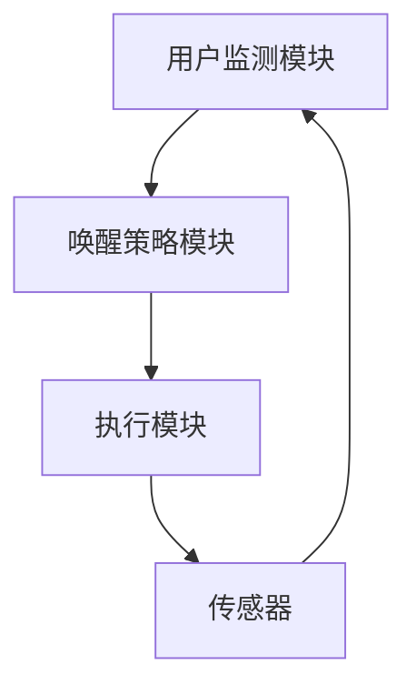

                 


# AI Agent在智能床头柜中的渐进式唤醒

## 关键词：AI Agent，智能床头柜，渐进式唤醒，算法实现，系统架构，用户监测，唤醒策略

## 摘要：  
本文深入探讨了AI Agent在智能床头柜中的渐进式唤醒技术。通过分析AI Agent的核心原理、系统架构、算法实现和项目实战，详细阐述了如何通过渐进式唤醒提升用户的睡眠质量和起床体验。文章结合理论与实践，提供了丰富的技术细节和实现方案。

---

## 目录大纲：

### 第一部分: AI Agent与智能床头柜的背景与概念

### 第1章: AI Agent与智能床头柜概述

#### 1.1 AI Agent的基本概念
- 1.1.1 什么是AI Agent
- 1.1.2 AI Agent的核心特征
- 1.1.3 AI Agent的应用场景

#### 1.2 智能床头柜的功能与价值
- 1.2.1 智能床头柜的基本功能
- 1.2.2 智能床头柜的智能化升级
- 1.2.3 渐进式唤醒的意义

#### 1.3 渐进式唤醒的概念与实现
- 1.3.1 渐进式唤醒的定义
- 1.3.2 渐进式唤醒的必要性
- 1.3.3 渐进式唤醒的技术挑战

#### 1.4 本章小结

### 第二部分: AI Agent的原理与技术实现

### 第2章: AI Agent的核心原理

#### 2.1 AI Agent的感知模块
- 2.1.1 感知模块的功能与作用
- 2.1.2 常用的感知技术
- 2.1.3 感知数据的处理与分析

#### 2.2 AI Agent的推理模块
- 2.2.1 推理模块的定义与作用
- 2.2.2 常用的推理算法
- 2.2.3 推理结果的优化与改进

#### 2.3 AI Agent的执行模块
- 2.3.1 执行模块的功能与作用
- 2.3.2 执行模块的实现方式
- 2.3.3 执行效果的评估与反馈

#### 2.4 本章小结

### 第三部分: 渐进式唤醒的系统架构与实现

### 第3章: 渐进式唤醒的系统架构

#### 3.1 系统整体架构设计
- 3.1.1 系统架构的组成与功能
- 3.1.2 系统架构的优化与改进
- 3.1.3 系统架构的可扩展性

#### 3.2 用户监测模块的设计
- 3.2.1 用户监测模块的功能与作用
- 3.2.2 用户监测模块的实现方式
- 3.2.3 用户监测模块的优化与改进

#### 3.3 唤醒策略模块的设计
- 3.3.1 唤醒策略模块的功能与作用
- 3.3.2 唤醒策略模块的实现方式
- 3.3.3 唤醒策略模块的优化与改进

#### 3.4 本章小结

### 第四部分: 渐进式唤醒的算法实现与优化

### 第4章: 渐进式唤醒算法的设计与实现

#### 4.1 渐进式唤醒算法的总体设计
- 4.1.1 算法设计的目标与原则
- 4.1.2 算法设计的关键点
- 4.1.3 算法设计的流程与步骤

#### 4.2 渐进式唤醒算法的核心实现
- 4.2.1 唤醒策略的数学模型与公式
- 4.2.2 算法实现的伪代码与Python代码示例
- 4.2.3 算法实现的优化与改进

#### 4.3 算法实现的数学模型与公式
- 使用Latex公式详细阐述算法的数学模型
- 示例：$$f(x) = a \cdot x + b$$

#### 4.4 本章小结

### 第五部分: 项目实战

### 第5章: 渐进式唤醒的项目实战

#### 5.1 环境安装与配置
- 5.1.1 系统环境要求
- 5.1.2 开发工具安装
- 5.1.3 传感器接口配置

#### 5.2 核心代码实现
- 5.2.1 用户监测模块的代码实现
- 5.2.2 唤醒策略模块的代码实现
- 5.2.3 执行模块的代码实现

#### 5.3 案例分析与解读
- 5.3.1 实际案例分析
- 5.3.2 代码实现解读
- 5.3.3 实验结果与优化建议

#### 5.4 本章小结

### 第六部分: 总结与展望

### 第6章: 总结与展望

#### 6.1 最佳实践与小结
- 6.1.1 渐进式唤醒技术的总结
- 6.1.2 实际应用中的最佳实践
- 6.1.3 技术优化与改进的方向

#### 6.2 注意事项与拓展阅读
- 6.2.1 实现过程中的注意事项
- 6.2.2 拓展阅读推荐
- 6.2.3 未来研究方向

#### 6.3 本章小结

---

## 附录: 代码与工具推荐

### 附录A: 渐进式唤醒算法的Python代码示例
```python
def gradual_wakeup(user_state, time):
    # 算法实现细节
    pass
```

### 附录B: 系统架构图的Mermaid图示


### 附录C: 数学模型与公式的详细推导
$$
f(x) = \sum_{i=1}^{n} a_i x_i + b
$$

---

## 参考文献与引用

- AI Agent相关文献
- 渐进式唤醒技术的论文
- 系统架构与算法实现的参考资料

---

通过以上详细的目录大纲，您可以逐步撰写一篇内容丰富、结构清晰的技术博客文章，全面解析AI Agent在智能床头柜中的渐进式唤醒技术。

