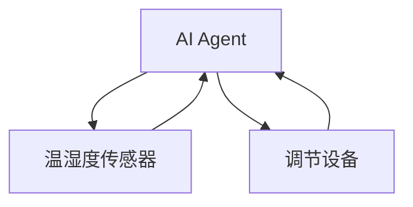
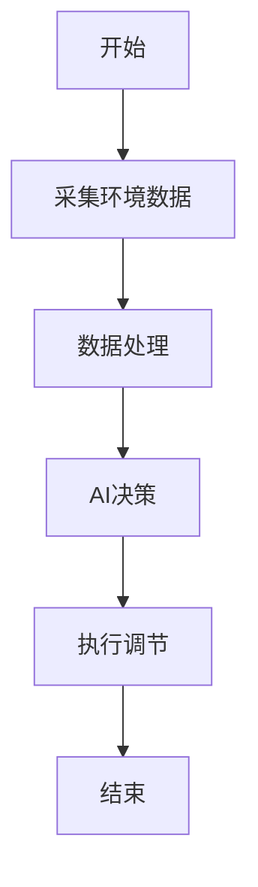
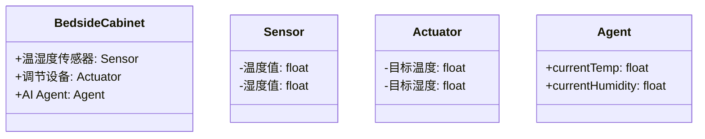
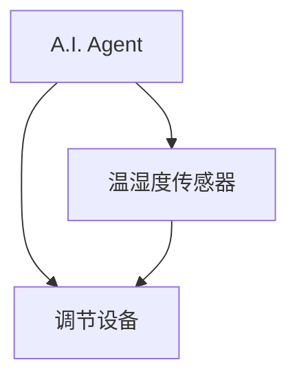

                 


# AI Agent在智能床头柜中的温湿度调节

## 关键词
AI Agent, 温湿度调节, 智能床头柜, 物联网, 智能家居

## 摘要
本文探讨了AI Agent在智能床头柜中的温湿度调节应用，分析了AI Agent的核心原理、算法实现及系统架构，结合实际案例展示了如何通过AI技术提升温湿度调节的智能化水平。

---

## 第1章: 问题背景与描述

### 1.1 问题背景
#### 1.1.1 智能床头柜的发展现状
随着智能家居的普及，床头柜的功能已从单纯的收纳扩展至智能温湿度调节、健康监测等。

#### 1.1.2 温湿度调节的重要性
温湿度直接影响睡眠质量，尤其在湿度较高的环境下，容易引发呼吸道疾病。

#### 1.1.3 AI Agent在智能家居中的应用潜力
AI Agent能够实时感知环境变化，并自主决策调节温湿度，提升用户体验。

### 1.2 问题描述
#### 1.2.1 温湿度调节的核心问题
如何实现温湿度的精准调节，同时具备自适应能力。

#### 1.2.2 智能床头柜的用户需求分析
用户期望床头柜能根据环境变化主动调节温湿度，同时具备智能提醒功能。

#### 1.2.3 当前温湿度调节的技术局限性
传统调节设备缺乏智能性，无法根据环境变化自动调整。

### 1.3 问题解决思路
#### 1.3.1 引入AI Agent的必要性
AI Agent能够实时感知环境数据，并根据用户需求智能调节温湿度。

#### 1.3.2 AI Agent在温湿度调节中的角色定位
作为智能床头柜的核心控制模块，AI Agent负责数据采集、决策制定和执行反馈。

#### 1.3.3 解决方案的整体架构
通过AI Agent实现床头柜的智能化温湿度调节，构建一个闭环控制系统。

### 1.4 系统边界与外延
#### 1.4.1 系统功能边界
系统仅负责温湿度调节，不涉及其他功能如灯光控制。

#### 1.4.2 系统与外部环境的交互
通过传感器采集环境数据，向调节设备发送指令。

#### 1.4.3 系统扩展性分析
未来可扩展至健康监测、环境净化等功能。

### 1.5 概念结构与核心要素
#### 1.5.1 核心概念的层次结构
床头柜 -> 温湿度调节 -> AI Agent -> 环境感知 -> 决策控制。

#### 1.5.2 核心要素的定义与关系
温湿度传感器、AI Agent、调节设备之间的协同工作关系。

#### 1.5.3 系统功能模块划分
环境感知模块、数据处理模块、AI决策模块、执行控制模块。

---

## 第2章: 核心概念与联系

### 2.1 AI Agent的核心原理
#### 2.1.1 AI Agent的定义与分类
AI Agent是一种能够感知环境并自主决策的智能体。

#### 2.1.2 AI Agent的基本工作原理
通过感知环境、分析问题、制定决策、执行动作。

#### 2.1.3 AI Agent在温湿度调节中的应用
作为智能床头柜的核心控制模块，实时感知环境数据并调节温湿度。

### 2.2 温湿度调节的原理
#### 2.2.1 温湿度调节的基本原理
通过传感器采集数据，利用调节设备改变环境温湿度。

#### 2.2.2 温湿度传感器的工作原理
传感器通过物理或化学方式感知环境变化。

#### 2.2.3 温湿度调节设备的控制原理
设备根据指令输出机械动作或电控信号。

### 2.3 AI Agent与温湿度调节的关系
#### 2.3.1 AI Agent在温湿度调节中的作用
AI Agent通过数据处理和智能决策优化温湿度调节效果。

#### 2.3.2 温湿度调节对AI Agent的需求
需要实时数据处理能力和自主决策能力。

#### 2.3.3 核心概念对比表格

| 概念 | 描述 | 关联性 |
|------|------|--------|
| AI Agent | 智能决策主体 | 核心 |
| 温湿度调节 | 环境控制目标 | 核心 |
| 传感器 | 数据来源 | 关键 |

#### 2.3.4 实体关系图



---

## 第3章: 算法原理

### 3.1 算法工作流程
#### 3.1.1 流程图



#### 3.1.2 数据处理流程
1. 采集温湿度数据。
2. 数据预处理：去噪、归一化。
3. 数据分析：识别异常值。

#### 3.1.3 AI决策过程
1. 判断当前温湿度是否符合目标值。
2. 根据偏差调整调节设备。

### 3.2 算法实现

#### 3.2.1 PID控制算法
```python
def pid_control(setpoint, current, integral, derivative, Kp, Ki, Kd):
    error = setpoint - current
    integral += error * dt
    derivative = (error - prev_error) / dt
    output = Kp * error + Ki * integral + Kd * derivative
    return output
```

#### 3.2.2 PID控制原理
PID控制器通过比例、积分、微分三个参数调节输出，实现对温湿度的精确控制。

### 3.3 算法优缺点分析
#### 优点
- 实时性强，调节速度快。
- 能够适应环境变化。

#### 缺点
- 参数调优复杂。
- 对非线性系统效果有限。

---

## 第4章: 系统分析与架构设计

### 4.1 问题场景介绍
智能床头柜需要实时调节温湿度，确保用户舒适度。

### 4.2 项目介绍
开发一个基于AI Agent的智能床头柜温湿度调节系统。

### 4.3 系统功能设计
#### 4.3.1 领域模型类图



### 4.4 系统架构设计
#### 4.4.1 系统架构图



#### 4.4.2 接口设计
- Agent与Sensor的接口：获取环境数据。
- Agent与Actuator的接口：发送调节指令。

#### 4.4.3 系统交互流程
1. Sensor采集数据。
2. Agent处理数据。
3. Agent决策调节方式。
4. Actuator执行调节。

---

## 第5章: 项目实战

### 5.1 环境安装
1. 安装Python 3.8+。
2. 安装必要的库：TensorFlow、Keras、Mermaid。

### 5.2 核心代码实现
#### 5.2.1 数据预处理
```python
import pandas as pd
data = pd.read_csv('environment_data.csv')
data_normalized = (data - data.min()) / (data.max() - data.min())
```

#### 5.2.2 模型训练
```python
from keras.models import Sequential
from keras.layers import Dense
model = Sequential()
model.add(Dense(64, activation='relu', input_dim=2))
model.add(Dense(1, activation='sigmoid'))
model.compile(optimizer='adam', loss='binary_crossentropy')
model.fit(X_train, y_train, epochs=100, batch_size=32)
```

#### 5.2.3 温湿度控制模块
```python
def regulate_temp(current_temp, target_temp):
    if current_temp < target_temp:
        return 'increase'
    elif current_temp > target_temp:
        return 'decrease'
    else:
        return 'stable'
```

### 5.3 代码解读与分析
- 数据预处理：归一化处理环境数据。
- 模型训练：构建神经网络模型进行分类预测。
- 温湿度控制：基于当前与目标温湿度差异，决定调节方向。

### 5.4 实际案例分析
某环境下，系统采集温度25℃，湿度60%，目标温湿度为20℃，50%。系统判断当前湿度偏高，启动除湿模式。

---

## 第6章: 最佳实践

### 6.1 小结
本文详细介绍了AI Agent在智能床头柜中的温湿度调节应用，从理论到实践，全面展示了系统的实现过程。

### 6.2 注意事项
- 系统稳定性：确保传感器和调节设备的可靠性。
- 参数调优：优化PID参数以提升调节效果。
- 安全性：防止数据泄露和系统攻击。

### 6.3 拓展阅读
推荐阅读《基于AI的智能控制系统设计》和《物联网技术与智能家居》。

---

## 结语
通过本文的学习，读者可以掌握AI Agent在智能床头柜温湿度调节中的应用，为后续的智能家居开发提供参考。

