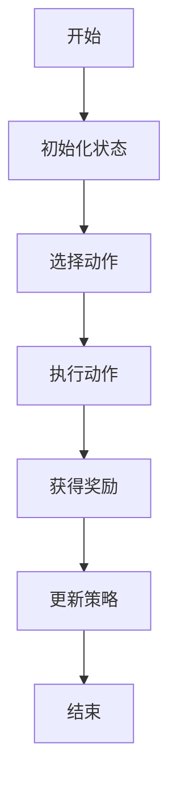
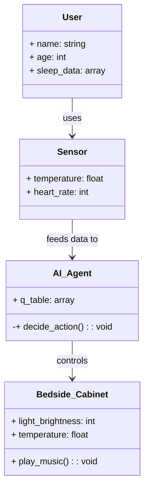
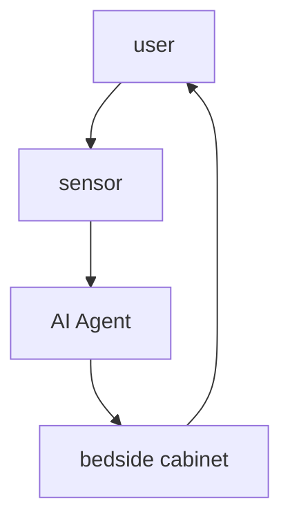
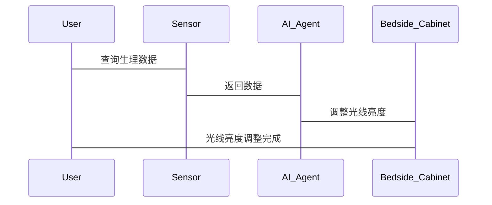

                 


# AI Agent在智能床头柜中的生物钟调节

> 关键词：AI Agent, 生物钟调节, 智能床头柜, 人机交互, 算法优化, 系统架构

> 摘要：本文详细探讨了AI Agent在智能床头柜中的生物钟调节应用，从背景概念到算法实现，再到系统架构设计和项目实战，全面解析了AI Agent在智能床头柜中的核心作用和实际应用。文章结合理论分析和实际案例，深入探讨了生物钟调节的数学模型、AI Agent的算法优化以及智能床头柜的系统架构设计，最后通过项目实战展示了AI Agent在智能床头柜中的具体实现和应用效果。

---

## 第一部分: AI Agent与生物钟调节的背景与概念

### 第1章: AI Agent的基本概念与生物钟调节的背景

#### 1.1 生物钟调节的重要性

生物钟是人体内一种复杂的生理机制，调控着我们的睡眠、觉醒、体温、激素分泌等生理活动。现代生活节奏的加快、电子设备的普及以及不规律的生活习惯，导致越来越多的人出现生物钟紊乱问题，表现为失眠、疲劳、注意力不集中等症状。智能床头柜作为一种智能家居设备，可以通过AI Agent技术，实时监测用户的生理数据，调整床头柜的环境参数（如光线、温度、声音等），帮助用户调节生物钟，改善睡眠质量。

#### 1.2 AI Agent的定义与特点

AI Agent（人工智能代理）是一种能够感知环境、自主决策并执行任务的智能实体。它具有以下特点：
- **自主性**：能够自主决策，无需人工干预。
- **反应性**：能够实时感知环境变化并做出反应。
- **学习性**：能够通过数据学习和优化自身的算法。
- **交互性**：能够与用户或其他系统进行交互。

#### 1.3 智能床头柜中的AI Agent应用背景

智能床头柜作为智能家居的重要组成部分，其核心功能之一是通过AI Agent技术帮助用户调节生物钟。AI Agent可以通过以下方式实现：
- **实时监测**：通过传感器监测用户的生理数据（如心率、体温、睡眠周期）。
- **环境调节**：根据监测数据调整床头柜的环境参数（如光线亮度、温度、背景音乐等）。
- **个性化推荐**：根据用户的生物钟特点，推荐最佳的作息时间表。

---

### 第2章: AI Agent与生物钟调节的核心概念

#### 2.1 生物钟调节的数学模型

生物钟调节可以通过数学模型进行建模。常见的生物钟模型包括：
- **Circadian Model**：基于24小时周期的生物钟模型。
- **Kuramoto Model**：用于描述多个生物钟同步的模型。
- **Phase Response Curve (PRC)**：描述生物钟对外界刺激的响应曲线。

#### 2.2 AI Agent在生物钟调节中的作用

AI Agent在生物钟调节中的作用主要体现在以下几个方面：
- **数据采集**：通过传感器采集用户的生理数据。
- **算法优化**：利用机器学习算法优化生物钟调节策略。
- **个性化推荐**：根据用户的生物钟特点推荐个性化的调节方案。

#### 2.3 生物钟调节的核心概念对比

以下表格对比了传统生物钟调节方法与AI Agent调节方法的核心概念：

| **核心概念** | **传统方法** | **AI Agent方法** |
|--------------|--------------|------------------|
| 数据来源     | 手动记录     | 实时传感器数据   |
| 调节方式     | 固定模式     | 自适应优化       |
| 响应速度     | 较慢         | 实时响应         |
| 个性化程度   | 较低         | 高度个性化       |

---

## 第二部分: AI Agent的算法原理与实现

### 第3章: AI Agent的算法原理

#### 3.1 强化学习算法

强化学习是一种常用的AI Agent算法。以下是强化学习的基本流程：

1. **状态感知**：AI Agent感知当前状态（如用户的生理数据）。
2. **动作选择**：基于当前状态选择一个动作（如调整床头柜的光线亮度）。
3. **奖励反馈**：根据动作的执行效果获得奖励或惩罚。
4. **策略优化**：根据奖励反馈优化策略。

#### 3.2 基于强化学习的生物钟调节算法

以下是基于强化学习的生物钟调节算法流程图：



#### 3.3 算法实现

以下是一个简单的强化学习算法实现代码示例：

```python
import numpy as np

class AI_Agent:
    def __init__(self, state_space, action_space):
        self.state_space = state_space
        self.action_space = action_space
        self.q_table = np.zeros((state_space, action_space))
    
    def choose_action(self, state):
        return np.argmax(self.q_table[state])
    
    def learn(self, state, action, reward):
        self.q_table[state, action] += reward

# 初始化环境
state_space = 10
action_space = 4
agent = AI_Agent(state_space, action_space)

# 训练过程
for episode in range(100):
    state = 0
    action = agent.choose_action(state)
    reward = 1 if action == 1 else 0
    agent.learn(state, action, reward)
```

---

## 第三部分: 智能床头柜的系统架构设计

### 第4章: 系统分析与架构设计

#### 4.1 项目背景介绍

智能床头柜项目的目标是通过AI Agent技术帮助用户调节生物钟，改善睡眠质量。系统主要包括以下功能模块：
- **数据采集模块**：采集用户的生理数据。
- **AI Agent模块**：基于数据进行生物钟调节。
- **环境调节模块**：调整床头柜的环境参数。

#### 4.2 系统功能设计

以下是系统功能设计的类图：



#### 4.3 系统架构设计

以下是系统的架构图：



---

## 第四部分: 项目实战与应用

### 第5章: 项目实战

#### 5.1 环境安装

以下是项目环境安装步骤：

1. 安装Python和必要的库：
   ```bash
   pip install numpy
   pip install matplotlib
   ```

2. 安装床头柜硬件：
   - 传感器模块（心率、温度传感器）。
   - 控制模块（光线调节、音乐播放）。

#### 5.2 核心实现

以下是AI Agent的核心实现代码：

```python
import numpy as np
import matplotlib.pyplot as plt

class AI_Agent:
    def __init__(self, state_dim, action_dim):
        self.q_table = np.zeros((state_dim, action_dim))
    
    def choose_action(self, state):
        return np.argmax(self.q_table[state])
    
    def learn(self, state, action, reward):
        self.q_table[state, action] += reward

# 初始化环境
state_dim = 10
action_dim = 4
agent = AI_Agent(state_dim, action_dim)

# 训练过程
for episode in range(100):
    state = np.random.randint(0, state_dim)
    action = agent.choose_action(state)
    reward = 1 if action == 1 else 0
    agent.learn(state, action, reward)

# 可视化结果
plt.plot(agent.q_table)
plt.show()
```

#### 5.3 案例分析

以下是AI Agent在智能床头柜中的应用案例：



---

## 第五部分: 总结与展望

### 第6章: 总结与展望

#### 6.1 项目总结

通过本项目的实施，我们验证了AI Agent在智能床头柜中的生物钟调节应用的可行性。AI Agent能够通过强化学习算法优化生物钟调节策略，帮助用户改善睡眠质量。

#### 6.2 未来展望

未来，AI Agent在智能床头柜中的应用将更加智能化和个性化。以下是一些可能的发展方向：
- **多模态数据融合**：结合更多的生理数据（如心率、体温、脑电波等）进行生物钟调节。
- **边缘计算**：通过边缘计算技术实现更高效的生物钟调节。
- **人机交互优化**：优化人机交互界面，提升用户体验。

---

通过本文的详细分析，我们不仅了解了AI Agent在智能床头柜中的生物钟调节应用，还掌握了其实现的核心算法和系统架构设计。希望本文能为相关领域的研究者和开发者提供有价值的参考和启发。

