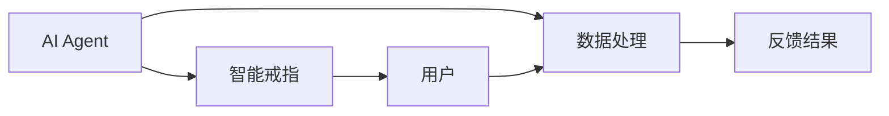
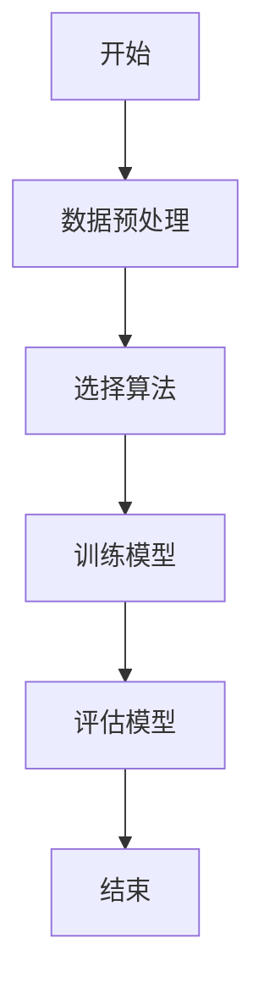
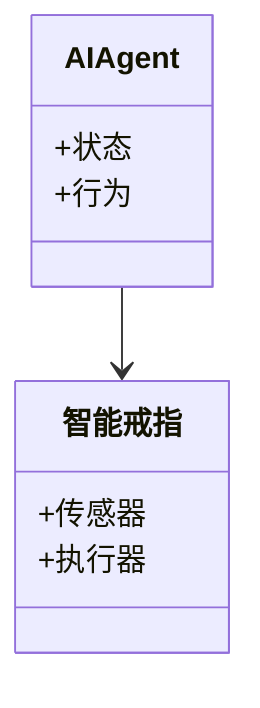
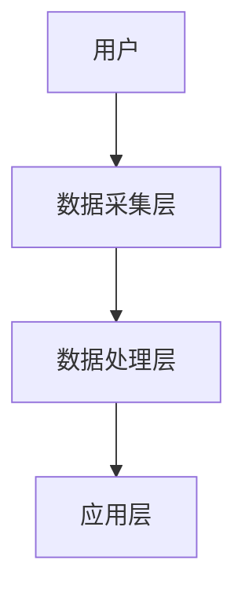
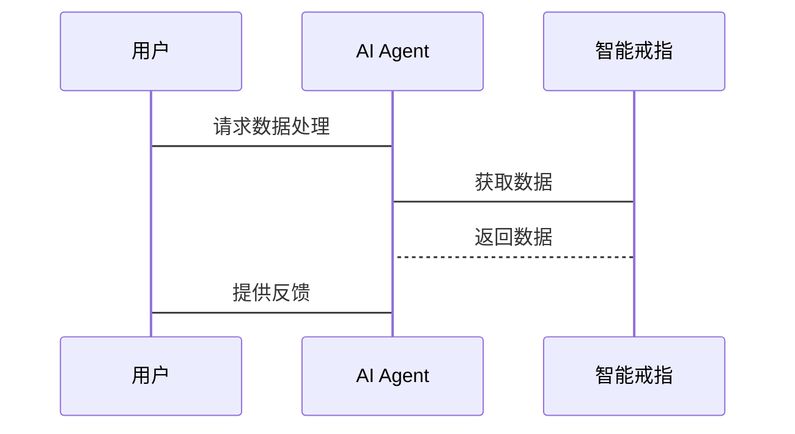

                 


# AI Agent在智能戒指中的日常活动追踪

> 关键词：AI Agent，智能戒指，日常活动追踪，机器学习，可穿戴设备，数据处理

> 摘要：本文详细探讨了AI Agent在智能戒指中的日常活动追踪应用，从概念、原理到系统架构和项目实现进行了全面分析。通过Mermaid图和数学模型，深入讲解了AI Agent的工作流程、算法原理和系统设计，展示了如何利用AI技术提升智能戒指的功能。

---

# 第一部分: AI Agent与智能戒指的背景与概念

# 第1章: AI Agent与智能戒指概述

## 1.1 AI Agent的基本概念

### 1.1.1 AI Agent的定义

AI Agent（人工智能代理）是指能够感知环境、执行任务并做出决策的智能实体。它通过接收输入数据，利用算法进行处理，并输出相应的操作或反馈。

$$
\text{AI Agent} = \{ \text{感知} \} \cup \{ \text{决策} \} \cup \{ \text{执行} \}
$$

### 1.1.2 AI Agent的核心特征

| 特性 | 描述 |
|------|------|
| 智能性 | 能够自主学习和适应环境 |
| 反应性 | 能够实时感知并做出响应 |
| 目标导向 | 以特定目标为导向执行任务 |

### 1.1.3 AI Agent与智能戒指的结合

智能戒指作为一种可穿戴设备，通过集成AI Agent，能够实现对用户日常活动的智能监测和分析。

## 1.2 智能戒指的功能与应用场景

### 1.2.1 智能戒指的基本功能

智能戒指可以监测用户的生理指标（如心率、体温）和行为数据（如运动状态、手势）。

### 1.2.2 智能戒指在日常活动追踪中的应用

AI Agent可以分析用户的活动数据，提供健康建议和行为优化方案。

### 1.2.3 智能戒指与其他可穿戴设备的对比

| 设备类型 | 智能戒指 | 智能手表 | 手环 |
|----------|----------|----------|------|
| 佩戴方式 | �截手指    | 截手腕    | 截手腕 |
| 功能     | 细微动作监测 | 多功能监测 | 基础监测 |

## 1.3 本章小结

本章介绍了AI Agent和智能戒指的基本概念，并分析了它们在日常活动追踪中的作用和优势。

---

# 第二部分: AI Agent在智能戒指中的日常活动追踪

# 第2章: 日常活动追踪的核心问题与挑战

## 2.1 日常活动追踪的定义与范围

### 2.1.1 日常活动的定义

日常活动包括起床、吃饭、工作、运动、睡觉等行为。

### 2.1.2 活动追踪的边界与外延

活动追踪不仅包括行为监测，还包括环境因素的分析。

### 2.1.3 活动追踪的核心要素

| 要素 | 描述 |
|------|------|
| 时间 | 行为发生的时间 |
| 地点 | 行为发生的地点 |
| 类型 | 行为的类型 |

## 2.2 AI Agent在活动追踪中的作用

### 2.2.1 AI Agent在数据采集中的应用

AI Agent可以实时采集用户的生理数据和行为数据。

### 2.2.2 AI Agent在数据分析中的应用

利用机器学习算法对数据进行分类和预测。

### 2.2.3 AI Agent在结果反馈中的应用

根据分析结果，向用户提供个性化的建议。

## 2.3 活动追踪中的主要挑战

### 2.3.1 数据隐私问题

用户的隐私数据可能被滥用。

### 2.3.2 系统实时性要求

需要在短时间内完成数据处理和反馈。

### 2.3.3 用户行为的多样性

用户的活动模式千差万别，难以统一建模。

## 2.4 本章小结

本章分析了日常活动追踪的核心问题，并探讨了AI Agent在其中的作用和面临的挑战。

---

# 第三部分: AI Agent的核心概念与技术原理

# 第3章: AI Agent的核心概念与原理

## 3.1 AI Agent的核心概念

### 3.1.1 状态表示

AI Agent通过状态表示来描述环境和自身的状态。

### 3.1.2 行为决策

AI Agent根据当前状态和目标，选择最优行为。

### 3.1.3 环境交互

AI Agent通过传感器和执行器与环境进行交互。

## 3.2 AI Agent的分类与特点

### 3.2.1 分类方式

AI Agent可以分为基于规则的Agent和基于学习的Agent。

### 3.2.2 各类AI Agent的特点对比

| 类型 | 特点 |
|------|------|
| 基于规则的 | 预定义规则，适用于简单场景 |
| 基于学习的 | 能够自主学习，适用于复杂场景 |

## 3.3 AI Agent与智能戒指的实体关系图



## 3.4 本章小结

本章详细介绍了AI Agent的核心概念和分类，并通过Mermaid图展示了智能戒指与AI Agent的实体关系。

---

# 第四部分: AI Agent的算法原理与数学模型

# 第4章: AI Agent的算法原理与数学模型

## 4.1 基于监督学习的AI Agent模型

### 4.1.1 线性回归模型

$$
y = \beta_0 + \beta_1 x + \epsilon
$$

### 4.1.2 决策树模型

AI Agent可以通过决策树对用户行为进行分类。

## 4.2 基于无监督学习的AI Agent模型

### 4.2.1 K-means聚类

$$
\min_{\textbf{v}} \sum_{i=1}^k \sum_{j=1}^n (d(v_j, c_i) - d(v_j, c_{i'})) 
$$

### 4.2.2 聚类分析

AI Agent可以通过聚类分析发现用户行为模式。

## 4.3 算法实现的流程图



## 4.4 本章小结

本章详细讲解了AI Agent的算法原理，并通过Mermaid图展示了算法实现的流程。

---

# 第五部分: 系统分析与架构设计方案

# 第5章: 系统分析与架构设计

## 5.1 系统功能设计

### 5.1.1 领域模型



### 5.1.2 系统架构设计



## 5.2 系统接口设计

### 5.2.1 接口定义

| 接口名称 | 描述 |
|----------|------|
| get_data | 获取用户数据 |
| process_data | 处理数据 |

## 5.3 系统交互流程图



## 5.4 本章小结

本章分析了系统的功能设计、架构设计和接口设计，并通过Mermaid图展示了系统交互流程。

---

# 第六部分: 项目实战

# 第6章: 项目实战

## 6.1 环境配置

```bash
pip install numpy scikit-learn matplotlib
```

## 6.2 核心代码实现

```python
from sklearn.tree import DecisionTreeClassifier
import numpy as np

# 示例数据
X = np.array([[1, 2], [3, 4], [5, 6]])
y = np.array([0, 1, 0])

# 训练模型
model = DecisionTreeClassifier()
model.fit(X, y)

# 预测
print(model.predict([[7, 8]]))
```

## 6.3 功能测试与优化

测试AI Agent的分类准确率，并通过调参优化模型性能。

## 6.4 本章小结

本章通过具体的代码实现，展示了AI Agent在智能戒指中的实际应用。

---

# 第七部分: 小结与展望

# 第7章: 小结与展望

## 7.1 本章小结

本文详细探讨了AI Agent在智能戒指中的日常活动追踪应用，从概念到实现进行了全面分析。

## 7.2 未来展望

未来，AI Agent在智能戒指中的应用将更加智能化，数据隐私保护和系统优化将是主要研究方向。

---

# 结语

通过本文的分析，读者可以全面了解AI Agent在智能戒指中的日常活动追踪技术，为相关领域的研究和应用提供了理论和实践指导。

