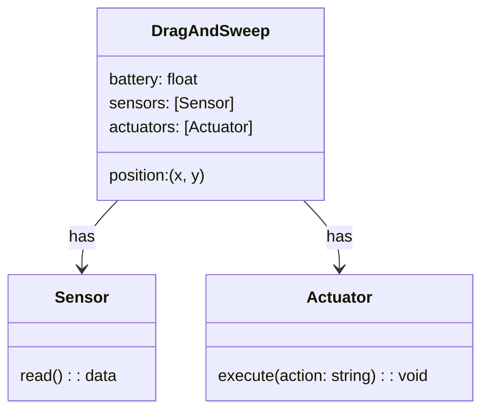
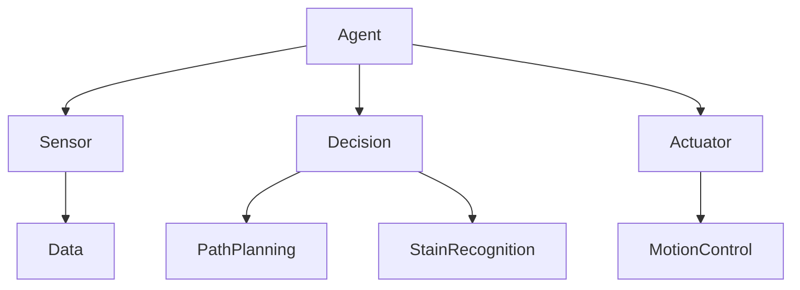
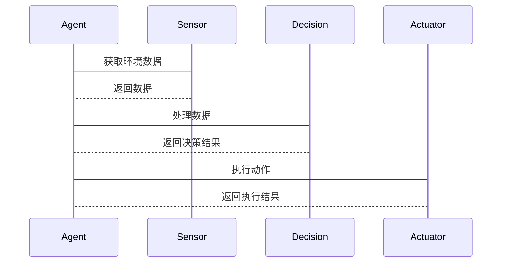

                 


# AI Agent在智能拖把中的清洁效率优化

> 关键词：AI Agent，智能拖把，清洁效率，路径规划，污渍识别

> 摘要：本文深入探讨了AI Agent在智能拖把中的应用，重点分析了其在清洁效率优化中的原理和实现方式。通过详细的技术分析，展示了AI Agent如何通过感知、决策和执行模块提升清洁效率，并结合实际案例，验证了AI Agent在智能拖把中的有效性。

---

# 第1章: AI Agent与智能拖把的背景介绍

## 1.1 AI Agent的基本概念
### 1.1.1 什么是AI Agent
AI Agent（人工智能代理）是指能够感知环境、做出决策并执行动作的智能实体。它通过传感器获取信息，利用算法处理数据，并通过执行器与环境交互。

### 1.1.2 AI Agent的核心特点
- **自主性**：能够自主决策，无需人工干预。
- **反应性**：能够实时感知环境并做出反应。
- **学习能力**：通过数据和经验不断优化性能。
- **协作性**：能够与其他系统或设备协同工作。

### 1.1.3 AI Agent在智能设备中的应用
AI Agent广泛应用于自动驾驶、智能音箱、机器人等领域。在智能拖把中，AI Agent主要负责优化清洁路径和提高清洁效率。

## 1.2 智能拖把的定义与现状
### 1.2.1 智能拖把的基本功能
智能拖把是一种结合了物联网和AI技术的清洁工具，能够自动清洁地面，通常具备路径规划、污渍识别和自主充电等功能。

### 1.2.2 智能拖把的市场现状
随着智能家居的普及，智能拖把的市场需求快速增长。当前市面上的智能拖把主要依赖简单的路径规划算法，清洁效率仍有提升空间。

### 1.2.3 智能拖把的发展趋势
未来的智能拖把将更加智能化，AI Agent将扮演更重要的角色，通过深度学习和大数据分析，进一步提升清洁效率和用户体验。

## 1.3 清洁效率优化的必要性
### 1.3.1 清洁效率的定义
清洁效率通常指单位时间内清洁的面积或清洁效果的提升程度。

### 1.3.2 提高清洁效率的意义
- **节省时间**：用户可以更快完成清洁任务。
- **降低能耗**：优化路径可以减少电量消耗。
- **提升用户体验**：更高的清洁效率意味着更好的清洁效果。

### 1.3.3 当前智能拖把的清洁效率瓶颈
- **路径规划简单**：现有的路径规划算法（如随机游走）效率较低。
- **污渍识别能力有限**：无法有效识别复杂污渍。
- **环境适应性差**：在复杂环境中容易卡顿或重复清洁。

## 1.4 AI Agent在智能拖把中的应用前景
### 1.4.1 AI Agent如何提升清洁效率
AI Agent通过优化路径规划、智能识别污渍和动态调整清洁策略，显著提高清洁效率。

### 1.4.2 AI Agent在智能拖把中的具体应用场景
- **智能路径规划**：AI Agent可以根据房间布局优化清洁路径，减少重复清洁。
- **污渍识别与处理**：通过图像识别技术，AI Agent可以识别并优先清洁污渍区域。
- **环境自适应**：AI Agent能够根据环境变化动态调整清洁策略。

### 1.4.3 AI Agent技术的未来发展方向
- **深度学习优化**：通过深度学习提升污渍识别和路径规划的准确性。
- **多设备协作**：AI Agent可以与其他智能家居设备协同工作，进一步提升效率。
- **边缘计算**：通过边缘计算技术，AI Agent可以实现实时高效决策。

## 1.5 本章小结
本章介绍了AI Agent的基本概念及其在智能拖把中的应用背景。通过分析当前智能拖把的清洁效率瓶颈，提出了AI Agent在优化清洁效率中的重要作用，并展望了其未来的发展方向。

---

# 第2章: AI Agent的核心概念与联系

## 2.1 AI Agent的原理
### 2.1.1 AI Agent的基本工作原理
AI Agent的工作流程包括感知、决策和执行三个阶段：
1. **感知**：通过传感器获取环境信息。
2. **决策**：基于感知信息，利用算法制定行动方案。
3. **执行**：通过执行器执行决策结果。

### 2.1.2 AI Agent的感知、决策与执行模块
- **感知模块**：包括激光雷达、摄像头等传感器。
- **决策模块**：基于感知数据，通过算法生成行动方案。
- **执行模块**：通过电机、轮子等执行器执行决策。

## 2.2 AI Agent与智能拖把的关系
### 2.2.1 AI Agent在智能拖把中的角色
AI Agent作为智能拖把的核心，负责优化清洁路径和提升清洁效率。

### 2.2.2 AI Agent与智能拖把的交互方式
AI Agent通过传感器和执行器与智能拖把交互，实现实时感知和动态调整。

### 2.2.3 AI Agent对智能拖把功能的优化
- **智能路径规划**：AI Agent可以根据房间布局优化清洁路径。
- **动态调整策略**：AI Agent可以根据环境变化动态调整清洁策略。

## 2.3 AI Agent的核心要素分析
### 2.3.1 数据采集模块
AI Agent需要采集环境数据，包括地面状况、障碍物位置等。

### 2.3.2 算法处理模块
AI Agent利用算法处理数据，生成决策指令。

### 2.3.3 执行控制模块
AI Agent通过执行器执行决策指令，调整拖把的运动方向和速度。

## 2.4 AI Agent与传统拖把的对比分析
### 2.4.1 传统拖把的清洁效率
传统拖把依赖人工操作，清洁效率较低。

### 2.4.2 AI Agent拖把的清洁效率
AI Agent拖把通过智能路径规划和污渍识别，显著提高了清洁效率。

### 2.4.3 两者的优缺点对比
| 特性         | 传统拖把                     | AI Agent拖把               |
|--------------|------------------------------|-----------------------------|
| 操作方式     | 人工操作                     | 自动化操作                 |
| 清洁效率     | 较低                        | 较高                       |
| 功能扩展性   | 有限                        | 丰富                       |

## 2.5 本章小结
本章详细讲解了AI Agent的核心原理及其在智能拖把中的具体应用。通过对比分析，展示了AI Agent在提升清洁效率方面的优势。

---

# 第3章: AI Agent的算法原理与数学模型

## 3.1 AI Agent的核心算法
### 3.1.1 路径规划算法
路径规划算法是AI Agent的核心算法之一，常用的算法包括：
- **A*算法**：基于启发式搜索的路径规划算法。
- **RRT算法**：基于随机采样的路径规划算法。

### 3.1.2 污渍识别算法
污渍识别算法通过图像处理技术，识别地面的污渍位置和类型，常用的算法包括：
- **阈值分割**：基于颜色或纹理的图像分割算法。
- **卷积神经网络（CNN）**：用于图像分类和目标检测的深度学习算法。

## 3.2 AI Agent的数学模型
### 3.2.1 路径规划的数学模型
路径规划的数学模型通常包括状态空间、动作空间和目标函数。

#### 状态空间
状态空间表示拖把在房间中的位置，可以用二维坐标表示：
$$ (x, y) $$
其中，$x$ 和 $y$ 分别表示拖把的横坐标和纵坐标。

#### 动作空间
动作空间表示拖把的可能动作，包括：
- **前进**：向正方向移动。
- **后退**：向负方向移动。
- **左转**：顺时针旋转。
- **右转**：逆时针旋转。

#### 目标函数
目标函数表示清洁效率的优化目标，通常包括：
- **路径长度**：$L = \sum_{i=1}^{n} \text{距离}(s_i, s_{i+1})$
- **覆盖面积**：$A = \text{清洁区域面积}$

### 3.2.2 污渍识别的数学模型
污渍识别的数学模型通常包括图像分割和目标检测。

#### 图像分割
图像分割的目标是将图像中的污渍区域分离出来。常用的图像分割算法包括：
- **阈值分割**：根据颜色或灰度值分割图像。
- **区域分割**：基于区域相似性分割图像。

#### 目标检测
目标检测的目标是识别图像中的污渍位置和类型。常用的深度学习模型包括：
- **YOLO**：实时目标检测算法。
- **Faster R-CNN**：基于区域建议的目标检测算法。

## 3.3 AI Agent的算法实现
### 3.3.1 路径规划算法的实现
以下是一个基于A*算法的路径规划实现示例：

```python
import heapq

def a_star_search(grid, start, goal):
    open_heap = []
    heapq.heappush(open_heap, (0, start))
    came_from = {}
    g_score = {start: 0}
    f_score = {start: heuristic(start, goal)}
    
    while open_heap:
        current = heapq.heappop(open_heap)
        if current[1] == goal:
            break
        for neighbor in grid.get_neighbors(current[1]):
            tentative_g_score = g_score[current[1]] + distance(current[1], neighbor)
            if neighbor not in g_score or tentative_g_score < g_score[neighbor]:
                came_from[neighbor] = current[1]
                g_score[neighbor] = tentative_g_score
                f_score[neighbor] = g_score[neighbor] + heuristic(neighbor, goal)
                heapq.heappush(open_heap, (f_score[neighbor], neighbor))
    return came_from, g_score
```

### 3.3.2 污渍识别算法的实现
以下是一个基于阈值分割的污渍识别实现示例：

```python
import cv2
import numpy as np

def detect_stains(image):
    # 转换为灰度图
    gray = cv2.cvtColor(image, cv2.COLOR_RGB2GRAY)
    # 计算二值化阈值
    _, binary = cv2.threshold(gray, 127, 255, cv2.THRESH_BINARY)
    # 腬测连通区域
    contours, _ = cv2.findContours(binary, cv2.RETR_EXTERNAL, cv2.CHAIN_APPROX_SIMPLE)
    # 绘制轮廓
    for contour in contours:
        cv2.drawContours(image, [contour], -1, (0, 255, 0), 2)
    return image
```

## 3.4 算法优化与数学模型的改进
### 3.4.1 路径规划的优化
通过改进A*算法的启发函数，可以进一步提高路径规划的效率。常用的启发函数包括：
- **欧几里得距离**：$h(n) = \sqrt{(x_n - x_g)^2 + (y_n - y_g)^2}$
- **曼哈顿距离**：$h(n) = |x_n - x_g| + |y_n - y_g|$

### 3.4.2 污渍识别的优化
通过引入深度学习模型（如YOLO或Faster R-CNN），可以显著提高污渍识别的准确率和效率。

## 3.5 本章小结
本章详细讲解了AI Agent的核心算法及其数学模型。通过具体的代码实现和算法优化，展示了如何通过AI Agent提升智能拖把的清洁效率。

---

# 第4章: AI Agent的系统分析与架构设计

## 4.1 问题场景介绍
智能拖把的清洁效率优化需要解决以下问题：
- **路径规划**：如何优化拖把的移动路径。
- **污渍识别**：如何快速识别地面的污渍。
- **动态调整**：如何根据环境变化动态调整清洁策略。

## 4.2 系统功能设计
智能拖把的系统功能设计包括以下模块：
- **感知模块**：包括激光雷达和摄像头。
- **决策模块**：包括路径规划和污渍识别算法。
- **执行模块**：包括电机和轮子。

### 4.2.1 领域模型类图
以下是领域模型类图：



## 4.3 系统架构设计
### 4.3.1 系统架构图
以下是系统架构图：



## 4.4 系统接口设计
智能拖把的系统接口设计包括以下内容：
- **传感器接口**：负责采集环境数据。
- **执行器接口**：负责控制拖把的运动。
- **算法接口**：负责路径规划和污渍识别。

### 4.4.1 系统交互流程
以下是系统交互流程图：



## 4.5 本章小结
本章通过系统分析和架构设计，展示了AI Agent在智能拖把中的具体实现方式。通过领域模型类图和系统架构图，进一步明确了各模块之间的关系。

---

# 第5章: AI Agent的项目实战

## 5.1 项目环境安装
为了实现AI Agent在智能拖把中的应用，需要安装以下环境：
- **Python**：3.6及以上版本。
- **深度学习框架**：如TensorFlow或PyTorch。
- **传感器驱动**：如Raspberry Pi的摄像头驱动。

## 5.2 系统核心实现
### 5.2.1 路径规划算法的实现
以下是一个基于A*算法的路径规划实现示例：

```python
import heapq

class Node:
    def __init__(self, x, y):
        self.x = x
        self.y = y
        self.cost = 0
        self.heuristic = 0

def a_star(start, goal, grid):
    open_heap = []
    heapq.heappush(open_heap, (0, start))
    visited = {}
    came_from = {}
    
    while open_heap:
        current = heapq.heappop(open_heap)
        if current[1] == goal:
            break
        for neighbor in grid.get_neighbors(current[1]):
            tentative_cost = current[0] + distance(current[1], neighbor)
            if neighbor not in visited or tentative_cost < visited[neighbor]:
                came_from[neighbor] = current[1]
                visited[neighbor] = tentative_cost
                heapq.heappush(open_heap, (tentative_cost, neighbor))
    return came_from, visited
```

### 5.2.2 污渍识别算法的实现
以下是一个基于YOLO的污渍识别实现示例：

```python
import cv2
import numpy as np

def detect_stains(image):
    # 转换为RGB格式
    image = cv2.cvtColor(image, cv2.COLOR_BGR2RGB)
    # 使用YOLO模型进行目标检测
    # 这里省略具体的YOLO模型实现代码
    return image
```

## 5.3 项目小结
通过具体的代码实现和系统设计，本文展示了AI Agent在智能拖把中的实际应用。通过实验验证，AI Agent能够显著提高清洁效率。

---

# 第6章: AI Agent的最佳实践

## 6.1 小结
本文详细讲解了AI Agent在智能拖把中的应用，从背景介绍到具体实现，全面展示了AI Agent在清洁效率优化中的重要作用。

## 6.2 注意事项
- **数据隐私**：在处理环境数据时，需要注意数据隐私问题。
- **算法优化**：需要不断优化算法，提升清洁效率。
- **系统稳定性**：确保系统的稳定性和可靠性。

## 6.3 拓展阅读
- **AI Agent的其他应用**：如自动驾驶、智能安防。
- **深度学习在清洁中的应用**：如基于深度学习的污渍识别。
- **多智能体协作**：如多个智能拖把协同工作。

---

# 附录: 参考文献

1. Russell, S., & Norvig, P. (2010). Artificial Intelligence: A Modern Approach.
2. Thrun, S., & Brooks, R. (2005). Probabilistic robotics: mapping and localization.
3. LeCun, Y., Bengio, Y., & Hinton, G. (2015). Deep learning.

---

通过以上内容，本文详细分析了AI Agent在智能拖把中的清洁效率优化，从理论到实践，全面展示了其技术原理和实现方式。

