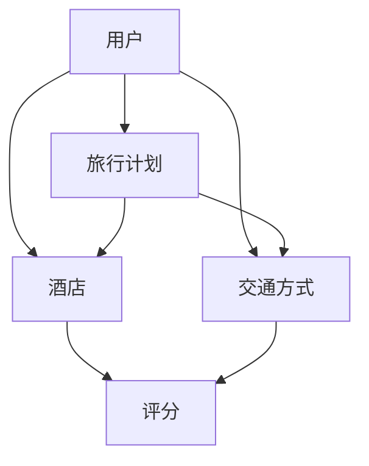
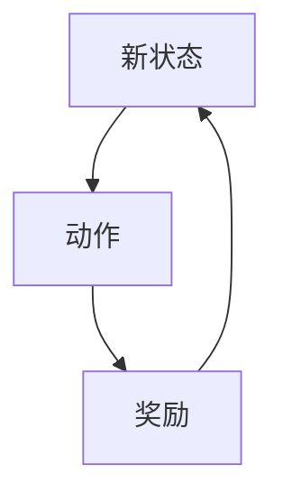
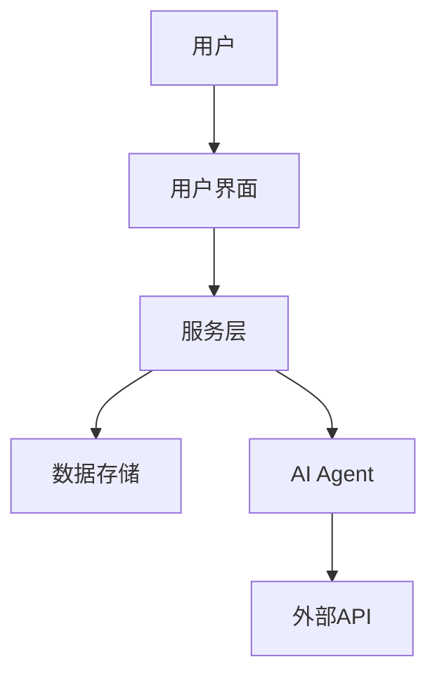
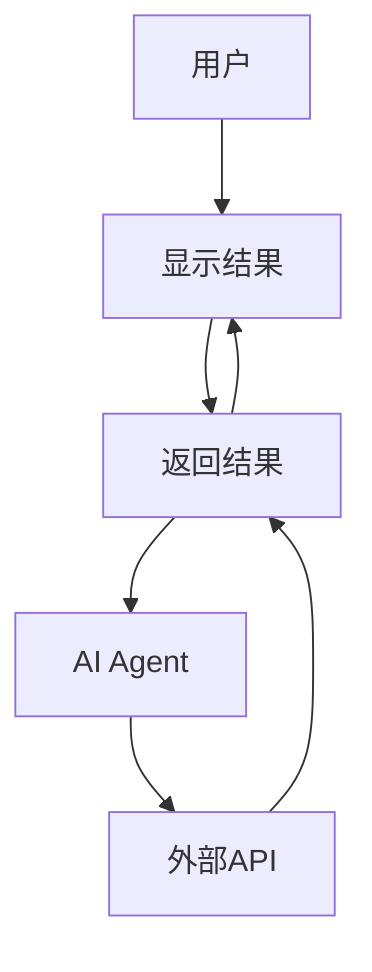

                 


# AI Agent在智能旅游规划中的应用

## 关键词：AI Agent，智能旅游，旅游规划，强化学习，推荐系统

## 摘要：  
本文探讨了AI Agent在智能旅游规划中的应用，分析了其核心概念、算法原理、系统架构，并通过实际案例展示了AI Agent如何优化旅游体验。文章从背景介绍、算法实现到项目实战，全面解析了AI Agent在旅游规划中的潜力和应用前景。

---

# 第1章: AI Agent与智能旅游规划的背景

## 1.1 AI Agent的基本概念  
AI Agent，即人工智能代理，是指能够感知环境、做出决策并执行任务的智能实体。它可以理解为一种软件或系统，通过学习和优化，帮助用户完成特定任务。  

### 1.1.1 AI Agent的核心特征  
1. **自主性**：能够在没有人工干预的情况下独立运行。  
2. **反应性**：能够根据环境变化实时调整行为。  
3. **学习能力**：通过数据和经验不断优化决策能力。  
4. **协作性**：能够与其他Agent或系统协同工作。  

## 1.2 智能旅游规划的背景与需求  
随着旅游业的快速发展，用户对个性化、高效化的旅游体验需求日益增长。传统的旅游规划方式依赖人工推荐或固定行程，难以满足用户的多样化需求。  

### 1.2.1 旅游行业的数字化转型  
- 数字化技术的普及推动了旅游服务的智能化。  
- 用户期望通过智能系统获得个性化的行程规划和实时建议。  

### 1.2.2 用户需求的变化  
- 用户希望获得基于个人偏好的行程推荐。  
- 对实时信息（如天气、交通状况）的依赖性增强。  

## 1.3 AI Agent在旅游规划中的应用前景  
AI Agent在旅游规划中的应用前景广阔，其核心优势在于能够通过数据驱动的方式，为用户提供智能化、个性化的服务。  

### 1.3.1 提高旅游体验的潜力  
- AI Agent可以实时分析用户偏好，推荐最优路线和景点。  
- 提供动态调整的行程安排，确保用户体验最大化。  

### 1.3.2 优化旅游资源分配的可能性  
- AI Agent可以通过大数据分析，优化旅游资源的分配，减少浪费。  
- 提高酒店、交通等资源的利用率。  

### 1.3.3 未来发展趋势与挑战  
- 技术进步将推动AI Agent在旅游领域的深度应用。  
- 数据隐私和安全问题需要得到妥善解决。  

## 1.4 本章小结  
本章介绍了AI Agent的基本概念及其在旅游规划中的应用背景，强调了AI Agent在提高旅游体验和优化资源分配方面的潜力。接下来的章节将深入探讨AI Agent的核心概念和算法原理。

---

# 第2章: AI Agent的核心概念与原理  

## 2.1 AI Agent的感知、决策与执行机制  
AI Agent的工作流程可以分为感知、决策和执行三个阶段。  

### 2.1.1 感知层：信息收集与分析  
AI Agent通过传感器、API或用户输入等方式收集数据，并对数据进行清洗和预处理。  

### 2.1.2 决策层：基于数据的智能决策  
基于感知层提供的数据，AI Agent利用算法（如强化学习、推荐系统）进行决策，生成最优解决方案。  

### 2.1.3 执行层：任务的自动化执行  
AI Agent根据决策结果执行任务，例如预订酒店、安排交通等。  

## 2.2 AI Agent的实体关系分析  
为了更好地理解AI Agent在旅游规划中的应用，我们需要建立实体关系模型。  

### 2.2.1 实体关系图（ER图）  
以下是旅游规划系统中的实体关系图：  


## 2.3 AI Agent的核心算法原理  
AI Agent的核心算法包括强化学习和推荐系统。  

### 2.3.1 强化学习算法  
强化学习是一种通过试错机制优化决策的算法。以下是一个简单的Q-learning算法流程图：  


### 2.3.2 推荐系统  
推荐系统通过分析用户行为和偏好，向用户推荐景点、酒店等。  

## 2.4 本章小结  
本章详细介绍了AI Agent的核心概念及其工作流程，并通过ER图和算法流程图展示了其在旅游规划中的应用。接下来的章节将重点探讨AI Agent的算法实现和系统架构设计。

---

# 第3章: AI Agent的算法实现  

## 3.1 基于强化学习的旅游路径规划算法  
### 3.1.1 Q-learning算法实现  
以下是一个简单的Q-learning算法实现示例：  
```python
class QLearning:
    def __init__(self, states, actions, learning_rate=0.1, discount_factor=0.9):
        self.q_table = {s: {a: 0 for a in actions} for s in states}
        self.learning_rate = learning_rate
        self.discount_factor = discount_factor

    def choose_action(self, state, epsilon=0.1):
        # 探索与利用
        if random.random() < epsilon:
            return random.choice(list(self.q_table[state].keys()))
        else:
            max_action = max(self.q_table[state], key=lambda k: self.q_table[state][k])
            return max_action

    def update_q_table(self, state, action, reward, next_state):
        self.q_table[state][action] = self.q_table[state][action] + self.learning_rate * (reward + self.discount_factor * max(self.q_table[next_state].values()) - self.q_table[state][action])
```

### 3.1.2 算法实现步骤  
1. 初始化Q表。  
2. 根据策略选择动作。  
3. 执行动作并获得奖励。  
4. 更新Q表。  

## 3.2 基于推荐系统的景点推荐算法  
### 3.2.1 基于协同过滤的推荐算法  
协同过滤是一种通过用户行为数据进行推荐的算法。以下是其实现步骤：  
1. 收集用户行为数据。  
2. 计算用户相似度。  
3. 推荐相似用户的喜好景点。  

### 3.2.2 基于内容的推荐算法  
内容推荐算法通过分析景点的特征进行推荐。以下是其实现步骤：  
1. 提取景点特征（如类别、评分）。  
2. 计算景点之间的相似度。  
3. 推荐相似的景点。  

## 3.3 本章小结  
本章详细介绍了AI Agent在旅游规划中的两种核心算法：强化学习和推荐系统，并通过代码示例展示了其实现过程。接下来的章节将探讨AI Agent的系统架构设计。

---

# 第4章: AI Agent的系统架构设计  

## 4.1 旅游规划系统的功能设计  
旅游规划系统需要具备以下功能：  
1. 用户信息收集与分析。  
2. 景点推荐。  
3. 行程规划与优化。  
4. 预订与提醒。  

## 4.2 系统架构设计  
以下是旅游规划系统的架构设计图：  


## 4.3 系统交互设计  
以下是系统交互流程图：  


## 4.4 本章小结  
本章详细介绍了旅游规划系统的架构设计和交互流程，为后续的项目实现奠定了基础。

---

# 第5章: AI Agent在旅游规划中的项目实战  

## 5.1 项目背景与目标  
本项目旨在开发一个基于AI Agent的智能旅游助手，帮助用户规划个性化行程。  

## 5.2 系统实现  
### 5.2.1 环境安装  
需要安装以下库：  
- Python 3.8+  
- TensorFlow  
- Scikit-learn  
- Flask  

### 5.2.2 核心代码实现  
以下是AI Agent的核心代码示例：  
```python
class TourismAgent:
    def __init__(self, user偏好, 数据库):
        self.user_preference = user偏好
        self.database = 数据库

    def 推荐景点(self):
        # 基于协同过滤的推荐算法
        pass

    def 规划行程(self):
        # 基于强化学习的路径规划算法
        pass
```

### 5.2.3 系统功能展示  
1. 用户输入偏好信息。  
2. 系统推荐景点并规划行程。  
3. 用户确认行程后，系统协助预订酒店和交通。  

## 5.3 项目小结  
本章通过实际项目展示了AI Agent在旅游规划中的应用，验证了其有效性和实用性。

---

# 第6章: AI Agent在旅游规划中的最佳实践  

## 6.1 经验总结  
1. 数据质量对推荐系统的准确性影响重大。  
2. 算法的选择需要根据具体场景进行优化。  

## 6.2 小结与注意事项  
1. 数据隐私和安全问题是需要重点关注的。  
2. 系统的可扩展性和灵活性需要在设计阶段充分考虑。  

## 6.3 未来展望  
随着技术的进步，AI Agent在旅游规划中的应用将更加智能化和个性化。  

---

# 附录: AI Agent相关技术资料  

## 附录1: 强化学习算法资源  
- TensorFlow官方文档  
-《Deep Reinforcement Learning》  

## 附录2: 推荐系统算法资源  
-《推荐系统实战》  

---

# 结语  
本文全面探讨了AI Agent在智能旅游规划中的应用，从理论到实践，为读者提供了丰富的技术资料和实现方案。希望本文能够为AI Agent在旅游行业的应用提供有价值的参考。

--- 

**全文完**

