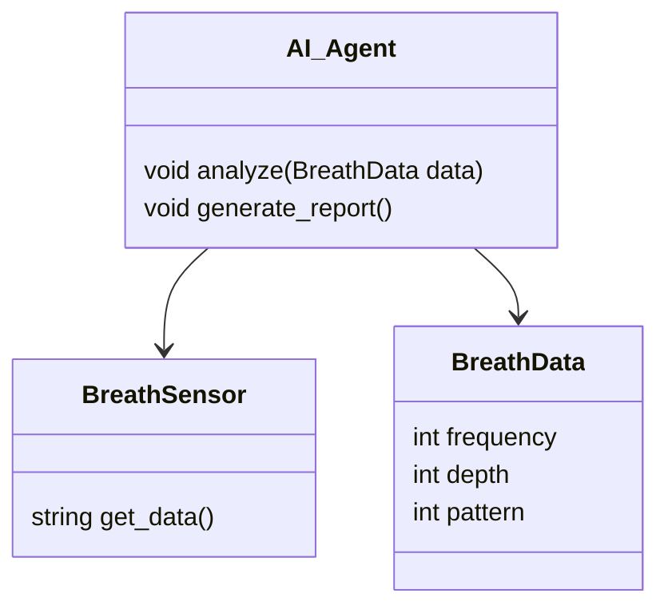
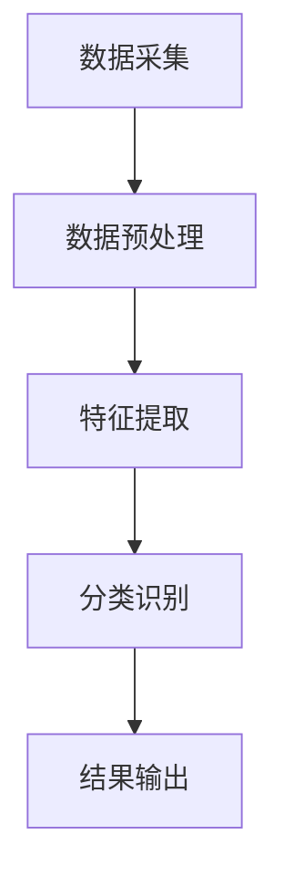
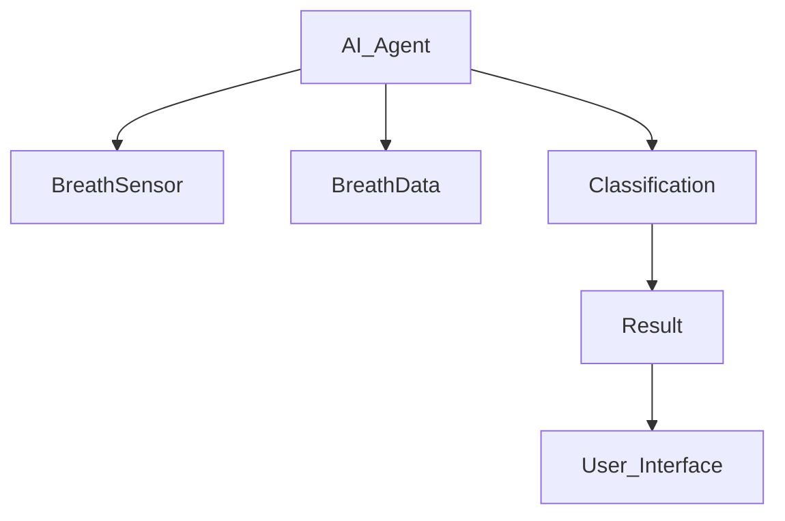

                 


# AI Agent在智能枕头中的呼吸模式分析

> 关键词：AI Agent, 智能枕头, 呼吸模式分析, 健康监测, 信号处理

> 摘要：本文探讨AI Agent在智能枕头中的应用，重点分析呼吸模式的识别与优化。通过背景介绍、算法原理、系统架构和项目实战，详细阐述如何利用AI技术提升睡眠健康监测。

---

## 第一部分：AI Agent与智能枕头概述

### 第1章：AI Agent的基本概念

#### 1.1 AI Agent的定义与特点
AI Agent（人工智能代理）是指能够感知环境并采取行动以实现目标的智能实体。其特点包括自主性、反应性、目标导向和社交能力。

- 自主性：AI Agent能够独立决策，无需人工干预。
- 反应性：能实时感知环境变化并做出反应。
- 目标导向：所有行动均以实现特定目标为导向。
- 社交能力：能够与其他系统或用户进行交互。

#### 1.2 AI Agent的核心技术
AI Agent的核心技术包括感知、决策和执行。

- 感知：通过传感器或数据输入获取环境信息。
- 决策：利用算法处理信息，做出最优决策。
- 执行：通过执行器或输出模块将决策转化为行动。

#### 1.3 AI Agent在智能设备中的应用
AI Agent广泛应用于智能家居、医疗设备和自动驾驶等领域。在智能枕头中，AI Agent主要用于健康监测和睡眠优化。

---

### 第2章：智能枕头的功能与应用

#### 2.1 智能枕头的基本功能
智能枕头通过集成多种传感器，实时监测用户的睡眠状态，包括心率、呼吸频率和体动情况。

- 睡眠监测：记录用户的睡眠周期和深度。
- 健康分析：评估用户的健康状况，识别潜在问题。
- 个性化建议：根据数据提供改善睡眠的建议。

#### 2.2 呼吸模式分析的重要性
呼吸模式与健康密切相关，异常呼吸可能预示着健康问题。

- 健康监测：通过分析呼吸频率和节律，早期发现潜在健康问题。
- 睡眠优化：通过调整枕头的支撑和震动，改善睡眠质量。
- 应急响应：在紧急情况下发出警报。

---

## 第二部分：呼吸模式分析的背景与意义

### 第3章：呼吸模式分析的基本概念

#### 3.1 呼吸模式的定义
呼吸模式指人在呼吸过程中的节奏、深度和频率等特征。这些特征可以通过传感器捕捉并进行分析。

#### 3.2 呼吸模式的分类
呼吸模式主要分为正常呼吸、浅呼吸、深呼吸和异常呼吸（如哮喘、睡眠呼吸暂停）。

- 正常呼吸：规律且均匀的呼吸模式。
- 浅呼吸：呼吸频率快但深度浅。
- 深呼吸：呼吸深度大，频率适中。
- 异常呼吸：如呼吸暂停、急促等。

#### 3.3 呼吸模式分析的意义
呼吸模式分析对健康监测和疾病预防具有重要意义。

- 早期发现健康问题：通过异常呼吸模式识别潜在疾病。
- 改善睡眠质量：通过调整枕头参数优化睡眠。
- 提供个性化健康建议：根据分析结果定制健康方案。

---

## 第三部分：AI Agent在呼吸模式分析中的应用

### 第4章：AI Agent的核心概念与联系

#### 4.1 AI Agent与呼吸模式分析的原理
AI Agent通过传感器获取呼吸信号，利用算法进行分析和分类，最终生成健康报告。

- 数据采集：通过传感器捕捉呼吸信号。
- 数据处理：对信号进行降噪和特征提取。
- 模型训练：利用机器学习算法训练分类模型。
- 结果输出：生成分析结果并采取相应行动。

#### 4.2 核心概念对比表
| 概念       | 特征                 |
|------------|----------------------|
| 数据采集   | 实时采集呼吸信号     |
| 特征提取   | 提取呼吸特征         |
| 模型训练   | 训练分类器           |
| 结果输出   | 生成分析报告         |

#### 4.3 ER实体关系图
```mermaid
erDiagram
    user {
        id
        name
        age
        gender
    }
    sensor {
        id
        type
        data
        timestamp
    }
    analysis {
        id
        result
        timestamp
    }
    user --> sensor
    sensor --> analysis
```

#### 4.4 领域模型类图


---

### 第5章：算法原理与实现

#### 5.1 呼吸信号处理流程
呼吸信号处理流程包括数据采集、预处理、特征提取和分类识别。

- 数据采集：通过传感器获取原始呼吸信号。
- 数据预处理：去除噪声，提取有用特征。
- 特征提取：提取呼吸频率、深度和节律等特征。
- 分类识别：利用机器学习算法进行模式识别。

#### 5.2 算法实现步骤


#### 5.3 Python实现代码
```python
import numpy as np
from sklearn.svm import SVC
from sklearn.metrics import accuracy_score

# 数据预处理
def preprocess_data(data):
    # 假设data是一个包含呼吸信号的数组
    # 这里进行简单的降噪处理
    return data

# 特征提取
def extract_features(data):
    # 提取呼吸频率和深度
    features = []
    for window in data:
        frequency = np.mean(window)
        depth = np.std(window)
        features.append([frequency, depth])
    return features

# 模型训练
def train_model(X_train, y_train):
    model = SVC()
    model.fit(X_train, y_train)
    return model

# 分类识别
def classify(model, X_test):
    y_pred = model.predict(X_test)
    return accuracy_score(y_test, y_pred)
```

#### 5.4 数学模型与公式
呼吸信号的周期性可以通过傅里叶变换进行分析，公式如下：

$$ X(f) = \sum_{n=0}^{N-1} x(n) e^{-j2\pi fn/N} $$

其中，$X(f)$ 是频域信号，$x(n)$ 是时域信号，$f$ 是频率，$N$ 是数据长度。

---

## 第四部分：系统架构与设计

### 第6章：系统分析与架构设计

#### 6.1 系统功能设计
系统功能包括数据采集、模式识别、反馈控制和用户界面。

- 数据采集：通过传感器获取呼吸信号。
- 模式识别：利用AI算法分析呼吸模式。
- 反馈控制：根据分析结果调整枕头参数。
- 用户界面：显示分析结果和操作界面。

#### 6.2 系统架构图


#### 6.3 接口设计
系统接口包括传感器接口、数据接口和用户接口。

- 传感器接口：与呼吸传感器通信。
- 数据接口：处理和传输数据。
- 用户接口：显示结果和接受用户输入。

---

## 第五部分：项目实战与优化

### 第7章：项目实战

#### 7.1 环境安装与配置
需要安装Python、NumPy、Scikit-learn和Mermaid工具。

```bash
pip install numpy scikit-learn
```

#### 7.2 核心代码实现
```python
# 示例代码：训练呼吸模式分类器
from sklearn.datasets import make_classification
from sklearn.model_selection import train_test_split
from sklearn.metrics import accuracy_score

# 生成合成数据
X, y = make_classification(n_samples=100, n_features=2, n_classes=2)

# 划分训练集和测试集
X_train, X_test, y_train, y_test = train_test_split(X, y, test_size=0.2)

# 训练模型
model = SVC()
model.fit(X_train, y_train)

# 预测与评估
y_pred = model.predict(X_test)
print("Accuracy:", accuracy_score(y_test, y_pred))
```

#### 7.3 代码解读与分析
上述代码展示了如何使用支持向量机（SVM）进行呼吸模式分类。通过生成合成数据并训练模型，可以实现呼吸模式的分类识别。

---

### 第8章：优化与展望

#### 8.1 总结与成果
本文详细介绍了AI Agent在智能枕头中的应用，展示了如何通过算法分析呼吸模式，优化睡眠质量。

#### 8.2 优化方向
- 提高算法效率：优化特征提取和模型训练过程。
- 增加数据维度：引入更多传感器数据，如心率和体温。
- 实时反馈：实现更快速的响应和个性化建议。

#### 8.3 注意事项
- 数据隐私：确保用户数据的安全性。
- 算法可解释性：提高模型的透明度，便于用户理解。
- 系统稳定性：确保系统的可靠性和稳定性。

---

## 第六部分：小结

通过本文的详细分析，我们了解了AI Agent在智能枕头中的应用，掌握了呼吸模式分析的核心技术。未来，随着AI技术的不断发展，智能枕头将更加智能化，为用户的健康保驾护航。

---

以上是《AI Agent在智能枕头中的呼吸模式分析》的技术博客文章目录大纲和部分内容展示。

