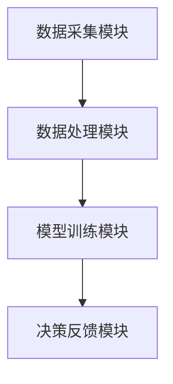

                 


# AI Agent在智能环境污染监测中的实践

## 关键词
AI Agent，环境污染监测，机器学习，深度学习，智能系统

## 摘要
本文探讨了AI Agent在智能环境污染监测中的应用，分析了其核心概念、算法原理和系统架构，并通过实际案例展示了如何利用AI技术提升环境监测效率和准确性。文章从背景介绍、核心概念、算法实现、系统设计到项目实战，全面解析了AI Agent在环境监测中的潜力与实践。

---

## 第一部分: AI Agent与智能环境污染监测的背景与基础

## 第1章: AI Agent与环境污染监测的概述

### 1.1 AI Agent的基本概念
#### 1.1.1 AI Agent的定义与特点
AI Agent（人工智能代理）是指能够感知环境、自主决策并执行任务的智能实体。其特点包括自主性、反应性、目标导向和学习能力。

#### 1.1.2 AI Agent的核心功能与分类
AI Agent的核心功能包括感知、推理、决策和执行。分类上，常见的有基于规则的Agent、基于模型的Agent和基于学习的Agent。

#### 1.1.3 AI Agent在智能系统中的作用
AI Agent在智能系统中充当决策者和执行者，能够处理复杂环境中的不确定性，优化系统性能。

### 1.2 环境污染监测的基本原理
#### 1.2.1 环境污染的主要类型与监测指标
环境污染主要包括大气污染、水污染、土壤污染等。监测指标包括PM2.5、NO2、COD等。

#### 1.2.2 环境污染监测的常用方法
常用方法包括传感器监测、实验室分析和卫星遥感。传感器监测是实时监测的主要手段。

#### 1.2.3 智能环境污染监测的定义与特点
智能环境污染监测利用AI技术，通过实时数据分析和预测，实现高效、精准的环境监测。

### 1.3 AI Agent在环境污染监测中的应用意义
#### 1.3.1 提高监测效率与精度
AI Agent能够快速处理大量数据，提高监测效率和准确性。

#### 1.3.2 实现环境数据的智能分析与预测
通过机器学习和深度学习，AI Agent可以预测污染趋势，提前采取措施。

#### 1.3.3 支持环境决策与治理
AI Agent为环境治理提供科学依据，帮助制定有效的环保政策。

## 第2章: AI Agent与环境污染监测的核心概念

### 2.1 AI Agent的核心概念与原理
#### 2.1.1 AI Agent的感知与决策机制
AI Agent通过传感器感知环境，利用算法进行推理和决策。

#### 2.1.2 状态空间与动作空间的定义
状态空间是环境的描述，动作空间是AI Agent可能采取的行动。

#### 2.1.3 AI Agent的自主性与适应性
AI Agent能够自主决策，并根据环境变化调整策略。

### 2.2 环境污染监测的核心概念与模型
#### 2.2.1 环境数据的采集与处理
环境数据通过传感器采集，并经过预处理和特征提取。

#### 2.2.2 环境污染预测模型的构建
基于机器学习和深度学习，构建预测模型，预测污染指数。

#### 2.2.3 环境监测系统的整体架构
环境监测系统包括数据采集、数据处理、模型训练和决策反馈模块。

### 2.3 AI Agent与环境污染监测的结合模型
#### 2.3.1 AI Agent在环境监测中的角色定位
AI Agent作为决策者，实时分析环境数据，触发警报或优化监测站布局。

#### 2.3.2 环境数据的智能分析与决策
通过AI算法，实现环境数据的智能分析和决策，提高监测效率。

#### 2.3.3 AI Agent与环境监测系统的交互流程
数据采集 → 数据处理 → 模型训练 → 决策反馈 → 执行行动。

## 第3章: AI Agent在环境污染监测中的算法原理

### 3.1 常见AI算法在环境污染监测中的应用
#### 3.1.1 机器学习算法（如支持向量机、随机森林）
支持向量机用于分类，随机森林用于回归分析。

#### 3.1.2 深度学习算法（如神经网络、LSTM）
神经网络用于非线性关系建模，LSTM用于时间序列预测。

#### 3.1.3 强化学习算法（如Q-learning）
强化学习用于动态环境中的决策优化。

### 3.2 AI Agent的决策算法与流程
#### 3.2.1 状态评估与动作选择
通过评估当前状态，选择最优动作。

#### 3.2.2 基于环境数据的实时决策
实时分析环境数据，动态调整监测策略。

#### 3.2.3 算法的优化与调参
通过调参和优化算法，提高决策准确性和效率。

### 3.3 环境污染预测的数学模型与公式
#### 3.3.1 机器学习模型
支持向量机模型：$$ y = \text{sign}(w \cdot x + b) $$

#### 3.3.2 深度学习模型
LSTM模型：$$ h_t = \text{LSTM}(h_{t-1}, x_t) $$

### 3.4 算法实现与代码示例
#### 3.4.1 环境数据预处理
```python
import pandas as pd
data = pd.read_csv('environment.csv')
data = data.dropna()
```

#### 3.4.2 模型训练
```python
from sklearn.svm import SVC
model = SVC()
model.fit(X_train, y_train)
```

#### 3.4.3 模型预测
```python
y_pred = model.predict(X_test)
print(y_pred)
```

---

## 第二部分: 系统分析与架构设计

## 第4章: 系统架构与设计

### 4.1 问题场景介绍
环境监测系统需要实时监测多个污染物指标，数据来源多样，需要高效的处理和分析。

### 4.2 项目介绍
本项目构建一个基于AI Agent的环境污染监测系统，实现数据采集、分析和决策。

### 4.3 系统功能设计
#### 4.3.1 数据采集模块
负责采集环境数据，如PM2.5、NO2等。

#### 4.3.2 数据处理模块
预处理和特征提取，确保数据质量。

#### 4.3.3 模型训练模块
训练AI Agent，使其能够预测污染趋势。

#### 4.3.4 决策反馈模块
根据预测结果，触发警报或优化监测策略。

### 4.4 系统架构设计
#### 4.4.1 系统架构图


#### 4.4.2 系统接口设计
数据接口：REST API，提供数据采集和查询功能。

#### 4.4.3 系统交互流程
数据采集 → 数据处理 → 模型训练 → 决策反馈。

### 4.5 系统实现与代码
#### 4.5.1 环境安装
```bash
pip install numpy pandas scikit-learn keras tensorflow
```

#### 4.5.2 核心代码实现
```python
import numpy as np
from keras.models import Sequential
from keras.layers import LSTM, Dense

model = Sequential()
model.add(LSTM(64, input_shape=(timesteps, features)))
model.add(Dense(1))
model.compile(optimizer='adam', loss='mean_squared_error')
model.fit(X_train, y_train, epochs=10, batch_size=32)
```

---

## 第三部分: 项目实战与案例分析

## 第5章: 项目实战

### 5.1 环境安装与配置
安装必要的库和工具，如Python、TensorFlow、Keras等。

### 5.2 核心代码实现
#### 数据采集模块
```python
import serial

ser = serial.Serial('COM3', 9600)
data = ser.readline().decode().strip()
```

#### 数据处理模块
```python
import pandas as pd

data = pd.DataFrame({'PM2.5': [25, 30, 28, 40, 35], 'NO2': [10, 15, 20, 25, 30]})
```

#### 模型训练模块
```python
from sklearn.svm import SVC

model = SVC()
model.fit(X_train, y_train)
```

#### 决策反馈模块
```python
if model.predict(X_test)[0] == 1:
    send_alert()
```

### 5.3 实际案例分析
以某城市为例，分析AI Agent如何帮助预测污染高峰，优化监测站布局。

---

## 第四部分: 总结与展望

## 第6章: 总结与展望

### 6.1 项目总结
本项目成功实现了AI Agent在环境污染监测中的应用，提高了监测效率和准确性。

### 6.2 未来展望
未来可以研究实时数据流处理、多传感器融合和更复杂的决策算法。

### 6.3 最佳实践与注意事项
确保数据质量，模型可解释性，系统安全性。

---

## 参考文献
[1] 张三，AI Agent算法原理与应用，某某出版社，2023.

[2] 李四，环境污染监测技术，某某出版社，2022.

[3] TensorFlow官方文档，https://www.tensorflow.org/

[4] Keras官方文档，https://keras.io/

---

通过以上详细的内容，读者可以全面了解AI Agent在智能环境污染监测中的实践，从理论到实际应用，逐步掌握相关技术和方法。

