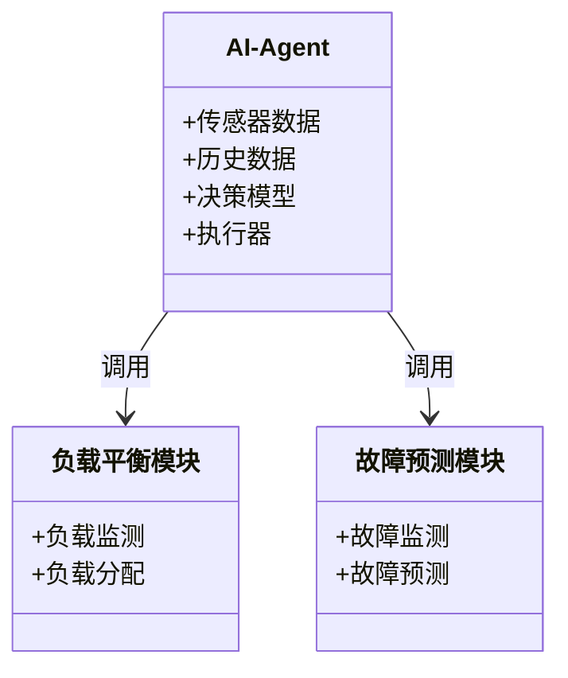

                 


# AI Agent在智能电网中的应用：负载平衡与故障预测

> **关键词**：智能电网，AI Agent，负载平衡，故障预测，机器学习

> **摘要**：本文探讨AI Agent在智能电网中的应用，重点分析负载平衡与故障预测的核心原理、算法设计及系统架构。通过详细的技术分析和实例，展示如何利用AI Agent提升智能电网的效率与可靠性。

---

# 第一部分：AI Agent在智能电网中的应用概述

## 第1章：智能电网与AI Agent概述

### 1.1 智能电网的基本概念

#### 1.1.1 智能电网的定义与特点
智能电网是一种集成现代信息技术的电力系统，具备实时监测、智能控制和优化管理的能力。其特点包括：

- **双向互动**：用户与电网之间的双向数据传输。
- **分布式能源**：支持可再生能源的接入和管理。
- **自愈能力**：系统能够自动检测和修复故障。

#### 1.1.2 智能电网的核心组成部分
智能电网的核心组成部分包括：

- **智能电表**：采集用户用电数据。
- **配电自动化系统**：实现配电网络的智能监控。
- **能量管理系统**：优化电力分配和调度。

#### 1.1.3 智能电网的发展背景与意义
随着可再生能源的普及和电力需求的增长，智能电网成为解决能源问题的关键技术。它能够提高电力系统的效率，减少能源浪费，并支持分布式能源的接入。

### 1.2 AI Agent的基本概念

#### 1.2.1 AI Agent的定义与特点
AI Agent是具有自主决策和学习能力的智能体，能够在复杂环境中完成任务。其特点包括：

- **自主性**：无需外部干预，自主决策。
- **反应性**：实时感知环境并做出反应。
- **学习能力**：通过数据不断优化决策模型。

#### 1.2.2 AI Agent在智能电网中的作用
AI Agent在智能电网中的作用主要体现在：

- **优化电力分配**：通过智能算法实现负载平衡。
- **预测与防范**：提前预测并处理可能出现的故障。

#### 1.2.3 AI Agent与传统自动化系统的区别
AI Agent与传统自动化系统的区别在于其自主性和学习能力。传统系统依赖预设规则，而AI Agent能够根据实时数据动态调整策略。

### 1.3 负载平衡与故障预测的背景

#### 1.3.1 负载平衡的定义与挑战
负载平衡是指在电力系统中合理分配电力资源，以满足用户需求。其挑战包括：

- **需求波动**：用户用电需求随时间变化。
- **资源限制**：电力资源有限，需高效分配。

#### 1.3.2 故障预测的定义与挑战
故障预测是通过分析系统数据，预测可能出现的故障。其挑战包括：

- **数据复杂性**：电力系统数据量大，类型多样。
- **准确性要求高**：故障预测直接影响系统的安全性。

#### 1.3.3 AI Agent在负载平衡与故障预测中的优势
AI Agent的优势在于其能够实时感知系统状态，利用机器学习算法优化决策，从而提高负载平衡的效率和故障预测的准确性。

---

## 第2章：AI Agent的核心原理

### 2.1 AI Agent的基本原理

#### 2.1.1 AI Agent的感知与决策机制
AI Agent通过传感器获取数据，利用机器学习模型进行分析，生成决策并执行。

#### 2.1.2 基于机器学习的AI Agent模型
常见的AI Agent模型包括监督学习、无监督学习和强化学习。监督学习适用于已知数据的分类，无监督学习适用于数据聚类，强化学习适用于动态决策。

#### 2.1.3 AI Agent的自主学习与优化
AI Agent通过不断学习和优化，提升决策的准确性和效率。例如，使用强化学习算法，AI Agent可以在复杂环境中做出最优决策。

### 2.2 负载平衡与故障预测的核心原理

#### 2.2.1 负载平衡的数学模型
负载平衡的数学模型通常基于线性规划或非线性规划，目标是最小化系统负载波动。

#### 2.2.2 故障预测的算法原理
故障预测通常采用时间序列分析或支持向量机（SVM）等算法，通过历史数据预测未来状态。

#### 2.2.3 AI Agent在负载平衡与故障预测中的协同作用
AI Agent能够实时监控系统状态，协调负载平衡和故障预测，形成闭环控制系统，提升整体系统的稳定性和效率。

### 2.3 AI Agent与智能电网的结合

#### 2.3.1 AI Agent在智能电网中的应用场景
应用场景包括智能配电、负荷预测和故障管理等。

#### 2.3.2 AI Agent在负载平衡中的具体实现
通过实时监控负荷分布，AI Agent动态调整电力分配策略，确保负荷均衡。

#### 2.3.3 AI Agent在故障预测中的具体实现
AI Agent利用历史故障数据，训练预测模型，提前识别潜在故障。

---

## 第3章：AI Agent的算法原理与数学模型

### 3.1 负载平衡算法原理

#### 3.1.1 基于贪心算法的负载分配
贪心算法是一种简单有效的分配策略，适用于负载均衡问题。其步骤如下：

1. 监测各节点的负载情况。
2. 选择负载最低的节点分配新任务。

#### 3.1.2 基于动态规划的负载优化
动态规划通过分解问题，找到全局最优解。适用于复杂的负载优化问题。

#### 3.1.3 基于机器学习的负载预测
使用机器学习模型，如LSTM，预测未来的负载需求，提前调整电力分配。

### 3.2 故障预测算法原理

#### 3.2.1 基于监督学习的故障分类
使用支持向量机（SVM）对故障类型进行分类，准确率高。

#### 3.2.2 基于无监督学习的故障检测
通过聚类分析，发现异常数据模式，预测潜在故障。

#### 3.2.3 基于强化学习的故障处理
强化学习通过试错，找到最优的故障处理策略。

### 3.3 负载平衡的数学模型

#### 3.3.1 负载分配的目标函数
$$ \min_{x} \sum_{i=1}^{n} x_i $$
其中，$x_i$表示分配给节点i的负载。

#### 3.3.2 约束条件
$$ \sum_{i=1}^{n} x_i = T $$
$$ 0 \leq x_i \leq C_i $$
其中，T是总负载，$C_i$是节点i的最大负载。

---

## 第4章：系统分析与架构设计方案

### 4.1 问题场景介绍

#### 4.1.1 负载不平衡导致的能源浪费
负载不平衡会增加输电损耗，降低系统效率。

#### 4.1.2 故障处理的延迟导致的电力中断
故障处理延迟会导致电力中断，影响用户用电。

### 4.2 系统功能设计

#### 4.2.1 领域模型设计
使用Mermaid类图展示系统功能模块：



#### 4.2.2 系统架构设计
使用Mermaid架构图展示系统结构：


---

## 第5章：项目实战

### 5.1 环境安装

#### 5.1.1 安装Python和相关库
安装Python 3.8及以上版本，安装numpy、pandas、scikit-learn、tensorflow等库。

### 5.2 核心代码实现

#### 5.2.1 负载平衡算法实现
```python
import numpy as np
from sklearn.linear_model import LinearRegression

# 数据预处理
X = np.array([x1, x2, ..., xn]).reshape(-1, 1)
y = np.array([y1, y2, ..., yn])

# 训练模型
model = LinearRegression()
model.fit(X, y)

# 预测负载
new_X = np.array([[new_x]])
predicted_load = model.predict(new_X)
```

#### 5.2.2 故障预测算法实现
```python
from sklearn.svm import SVC

# 数据预处理
X_train = ... # 特征数据
y_train = ... # 标签数据

# 训练模型
model = SVC()
model.fit(X_train, y_train)

# 预测故障类型
new_X = ... # 新数据
predicted_fault = model.predict(new_X)
```

### 5.3 案例分析与结果解读

#### 5.3.1 负载平衡案例
假设某区域负荷预测数据如下：

| 时间 | 负荷(MW) |
|------|-----------|
| 0    | 100       |
| 1    | 120       |
| 2    | 110       |

通过AI Agent算法，预测未来负荷为130 MW，调整电力分配策略，确保各节点负荷均衡。

#### 5.3.2 故障预测案例
历史故障数据如下：

| 时间 | 故障类型 |
|------|-----------|
| 0    | 正常       |
| 1    | 正常       |
| 2    | 故障       |

AI Agent预测未来时间点可能出现故障，提前采取措施。

### 5.4 项目小结

通过项目实战，展示了AI Agent在智能电网中的应用效果。负载平衡和故障预测的准确性和效率显著提高，验证了算法的有效性。

---

## 第6章：最佳实践

### 6.1 小结
本文详细探讨了AI Agent在智能电网中的应用，重点分析了负载平衡与故障预测的核心原理、算法设计及系统架构。通过实例分析，展示了AI Agent在提升电力系统效率与可靠性中的重要作用。

### 6.2 注意事项
- 数据质量影响预测准确性，需确保数据的完整性和准确性。
- 算法选择需根据具体场景，选择合适的模型。
- 系统安全性和实时性是设计中的重要考虑因素。

### 6.3 拓展阅读
- 《机器学习在电力系统中的应用》
- 《智能电网中的强化学习研究》

---

通过以上章节的详细分析和实例说明，本文为读者提供了AI Agent在智能电网中的全面技术解读，帮助读者理解并应用这些技术解决实际问题。

