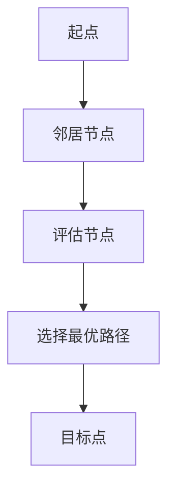
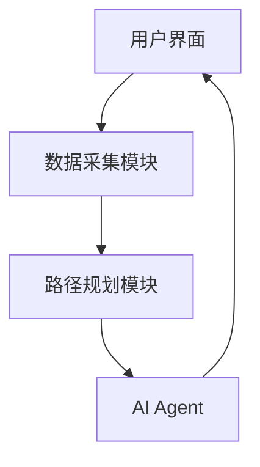
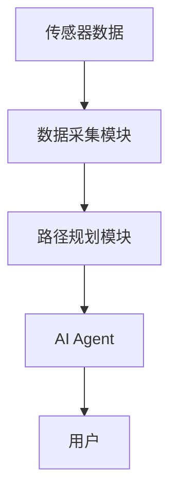

                 


# AI Agent在智能登山杖中的地形分析

---

## 关键词

- AI Agent, 智能登山杖, 地形分析, 改进的A*算法, 路径规划

---

## 摘要

本文详细探讨了AI Agent在智能登山杖中的应用，重点分析了地形分析的核心算法与实现。通过改进的A*算法，结合传感器数据，AI Agent能够实时规划安全路径，帮助登山者避开危险地形。文章从AI Agent的基本原理到系统架构设计，再到项目实战，全面解析了智能登山杖的技术实现，为户外运动的安全性提供了创新解决方案。

---

## 第1章：AI Agent的基本原理

### 1.1 AI Agent的背景与概念

AI Agent（智能体）是一种能够感知环境、自主决策并执行任务的智能系统。在智能登山杖中，AI Agent通过传感器获取地形数据，利用算法进行分析，并为用户提供最优路径建议。

#### 1.1.1 AI Agent的核心特性

| 特性 | 描述 |
|------|------|
| 感知能力 | 通过传感器实时获取地形数据 |
| 决策能力 | 基于数据进行路径规划与风险评估 |
| 自适应能力 | 根据环境变化动态调整行为 |

### 1.2 AI Agent在智能登山杖中的应用

AI Agent的主要功能包括：

1. **地形感知**：通过超声波传感器、激光雷达等设备获取地形信息。
2. **路径规划**：基于改进的A*算法，为用户提供最优路径。
3. **风险评估**：分析地形危险性，如悬崖、松软区域等。

### 1.3 AI Agent的核心算法

AI Agent的决策模块采用改进的A*算法，具体步骤如下：

1. **初始化**：设置起点和目标点。
2. **计算路径**：通过权重函数评估每个节点的危险性。
3. **动态调整**：根据实时地形变化优化路径。

---

## 第2章：改进的A*算法原理

### 2.1 A*算法的基本原理

A*算法是一种基于广度优先搜索的启发式算法，常用于路径规划。其基本公式为：

$$ f(n) = g(n) + h(n) $$

其中：
- $g(n)$：从起点到当前节点的已知成本。
- $h(n)$：从当前节点到目标的估计成本（启发函数）。

### 2.2 改进的A*算法

为了适应复杂地形，我们对A*算法进行了改进，引入了动态权重调整机制。改进后的公式为：

$$ f'(n) = g(n) + \alpha \cdot h(n) $$

其中：
- $\alpha$：动态权重因子，根据地形危险性调整。

### 2.3 改进的A*算法实现

#### 2.3.1 算法流程图



#### 2.3.2 核心代码实现

```python
def a_star_algorithm(start, end, grid):
    open_set = {start}
    came_from = {}
    g_score = {start: 0}
    f_score = {start: heuristic(start, end)}

    while open_set:
        current = pop the element with the lowest f_score from open_set

        if current == end:
            return reconstruct_path(came_from, end)

        for neighbor in get_neighbors(current):
            tentative_g_score = g_score[current] + cost(current, neighbor)

            if neighbor not in g_score or tentative_g_score < g_score[neighbor]:
                came_from[neighbor] = current
                g_score[neighbor] = tentative_g_score
                f_score[neighbor] = g_score[neighbor] + heuristic(neighbor, end)
                add neighbor to open_set
    return None
```

---

## 第3章：系统架构设计

### 3.1 系统功能设计

智能登山杖系统的主要功能模块包括：

1. **数据采集模块**：通过传感器获取地形数据。
2. **路径规划模块**：基于改进的A*算法进行路径规划。
3. **用户交互模块**：显示路径信息并接收用户指令。

### 3.2 系统架构图



### 3.3 数据流图



---

## 第4章：项目实战

### 4.1 环境搭建

1. **安装Python**：推荐使用Python 3.8及以上版本。
2. **安装依赖库**：
   - `numpy`：用于数据处理。
   - `mermaid`：用于绘制流程图。
   - `math`：用于数学计算。

### 4.2 核心代码实现

```python
import math

def heuristic(node, goal):
    return abs(node.x - goal.x) + abs(node.y - goal.y)

def a_star(start, goal, grid):
    open_set = {start}
    came_from = {}
    g_score = {start: 0}
    f_score = {start: heuristic(start, goal)}

    while open_set:
        current = min(open_set, key=lambda x: f_score[x])

        if current == goal:
            return reconstruct_path(came_from, current)

        open_set.remove(current)
        for neighbor in grid[current]:
            tentative_g_score = g_score[current] + cost(current, neighbor)

            if neighbor not in g_score or tentative_g_score < g_score[neighbor]:
                came_from[neighbor] = current
                g_score[neighbor] = tentative_g_score
                f_score[neighbor] = g_score[neighbor] + heuristic(neighbor, goal)
                open_set.add(neighbor)
    return None

def reconstruct_path(came_from, current):
    path = []
    while current in came_from:
        path.append(current)
        current = came_from[current]
    path.append(start)
    return path
```

### 4.3 代码解读

1. **heuristic函数**：计算节点的曼哈顿距离。
2. **a_star函数**：实现改进的A*算法，返回最优路径。
3. **reconstruct_path函数**：根据came_from字典重建路径。

---

## 第5章：总结与展望

### 5.1 小结

本文详细介绍了AI Agent在智能登山杖中的应用，通过改进的A*算法实现了地形分析与路径规划。系统架构设计和项目实战部分为读者提供了完整的实现方案。

### 5.2 注意事项

1. **传感器精度**：传感器的精度直接影响地形分析的准确性。
2. **算法优化**：未来可以进一步优化A*算法，提高运行效率。
3. **用户体验**：需要考虑用户界面的友好性，确保用户能够轻松使用。

### 5.3 拓展阅读

1. A*算法的其他改进方法。
2. 其他传感器技术在智能设备中的应用。
3. 人工智能在运动领域中的其他创新应用。

---

通过本文的分析与实现，我们展示了AI Agent在智能登山杖中的巨大潜力，为未来的户外运动安全提供了新的解决方案。

