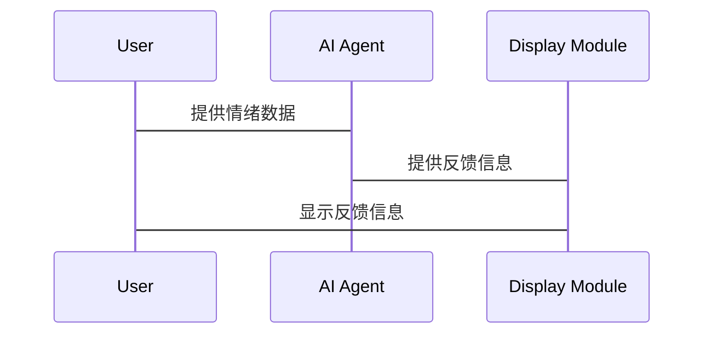

                 


# AI Agent在智能相框中的情绪识别显示

> 关键词：AI Agent, 情绪识别, 智能相框, 深度学习, 计算机视觉, 情感计算, 系统架构

> 摘要：本文探讨了AI Agent在智能相框中的情绪识别技术，详细分析了情绪识别的核心原理、算法实现、系统架构设计及项目实战。通过结合计算机视觉、深度学习和自然语言处理等技术，阐述了如何构建一个能够实时识别用户情绪并进行显示反馈的智能相框系统。

---

# 第一部分: AI Agent与智能相框概述

# 第1章: AI Agent与情绪识别概述

## 1.1 AI Agent的基本概念
### 1.1.1 AI Agent的定义与特点
AI Agent（人工智能代理）是一种能够感知环境、执行任务并做出决策的智能实体。其特点包括：
- **自主性**：能够在没有外部干预的情况下自主运行。
- **反应性**：能够实时感知环境并做出反应。
- **目标导向性**：通过目标驱动来优化决策和行动。
- **学习能力**：能够通过数据和反馈不断优化自身的性能。

### 1.1.2 情绪识别的定义与应用场景
情绪识别是指通过分析图像、语音或文本，识别出人类的情感状态（如高兴、愤怒、悲伤等）的过程。在智能相框中的应用场景包括：
- **情感反馈**：通过识别用户情绪，调整显示内容以提供个性化的反馈。
- **互动体验**：增强用户与相框之间的互动，提升用户体验。
- **健康管理**：通过长期监测情绪变化，辅助用户进行心理健康管理。

### 1.1.3 智能相框的定义与应用场景
智能相框是一种结合了AI技术和显示技术的智能设备，能够通过摄像头、麦克风等传感器感知用户的情绪，并通过屏幕显示相应的反馈信息。其应用场景包括：
- **家庭使用**：用于家庭成员之间的情感互动。
- **公共展示**：在商场、酒店等公共场所展示动态内容。
- **教育领域**：用于情感教育和心理健康指导。

## 1.2 AI Agent在智能相框中的作用
### 1.2.1 AI Agent的核心功能
- **数据采集**：通过摄像头和麦克风采集用户的情绪数据。
- **数据处理**：对采集到的图像、语音等数据进行预处理和特征提取。
- **情绪识别**：利用算法识别用户的情绪状态。
- **决策与反馈**：根据识别结果生成反馈信息，并通过相框的显示模块进行展示。

### 1.2.2 情绪识别在智能相框中的应用价值
- **提升用户体验**：通过个性化的情绪反馈，增强用户与相框的互动体验。
- **情感支持**：为用户提供情感支持，帮助用户缓解负面情绪。
- **数据采集与分析**：通过长期记录用户情绪数据，为用户提供情感健康报告。

### 1.2.3 AI Agent与智能相框的结合方式
AI Agent通过与智能相框的硬件和软件结合，实现情绪识别的核心功能。其结合方式包括：
- **嵌入式设计**：将AI Agent的功能集成到相框的硬件中。
- **云服务结合**：通过云服务进行数据处理和分析，结合本地硬件进行显示反馈。
- **边缘计算**：在相框本地进行数据处理和分析，减少对云服务的依赖。

## 1.3 本章小结
本章主要介绍了AI Agent的基本概念、情绪识别的定义与应用场景，以及AI Agent在智能相框中的作用。通过这些内容，读者可以初步理解AI Agent在智能相框中的核心地位及其在情绪识别中的重要性。

---

# 第二部分: 情绪识别的核心概念与原理

# 第2章: 情绪识别的核心概念

## 2.1 情绪识别的定义与分类
### 2.1.1 情绪识别的定义
情绪识别是通过分析图像、语音、文本等数据，识别出人类情感状态的过程。其核心在于从多模态数据中提取情感特征，并将其映射到特定的情感类别上。

### 2.1.2 情绪的分类与特征
情绪可以分为基本情绪（如高兴、愤怒、悲伤、恐惧、厌恶、惊讶、期待）和复合情绪。基本情绪是情绪识别的主要研究对象，其特征包括：
- **面部表情**：如眼睛、眉毛、嘴唇的动作。
- **语音特征**：如音调、语速、音量的变化。
- **文本特征**：如关键词、语句结构、情感词汇的使用。

### 2.1.3 情绪识别的实现方式
情绪识别的实现方式主要包括：
- **基于特征的分类方法**：通过提取情感特征，利用机器学习算法（如SVM、随机森林）进行分类。
- **基于深度学习的端到端方法**：利用CNN、RNN等深度学习模型直接从原始数据中学习情感特征。
- **多模态融合方法**：结合图像、语音、文本等多种数据源，通过融合技术提取更全面的情感特征。

## 2.2 情绪识别的关键技术
### 2.2.1 计算机视觉与图像处理
- **面部表情识别**：通过检测面部关键点，分析表情特征。
- **图像增强与预处理**：如对比度调整、噪声去除等，以提高图像质量。
- **目标检测**：识别图像中的面部区域，提取表情特征。

### 2.2.2 自然语言处理与文本分析
- **情感分析**：通过分析文本内容，识别文本中的情感倾向。
- **关键词提取**：提取与情感相关的关键词，如“快乐”、“悲伤”等。
- **语义理解**：通过NLP技术理解文本的语义，进一步分析情感。

### 2.2.3 声音识别与语音分析
- **语音特征提取**：提取音调、频率、能量等语音特征。
- **说话人识别**：通过语音特征识别说话人的情绪状态。
- **语音合成与情感语音生成**：通过生成技术模拟不同情绪的语音。

## 2.3 情绪识别的算法原理
### 2.3.1 基于特征的分类方法
基于特征的分类方法通过提取情感特征，利用机器学习算法进行分类。其流程如下：
1. **数据预处理**：对图像、语音等数据进行标准化处理。
2. **特征提取**：提取与情感相关的特征，如面部表情特征、语音特征。
3. **特征选择**：通过选择最优特征，减少计算复杂度。
4. **模型训练**：利用训练数据训练分类器，如SVM、随机森林等。
5. **情绪分类**：对测试数据进行分类，输出情绪结果。

### 2.3.2 基于深度学习的端到端方法
基于深度学习的端到端方法直接从原始数据中学习情感特征，其流程如下：
1. **数据预处理**：对图像、语音等数据进行归一化处理。
2. **模型构建**：构建深度学习模型，如CNN、RNN等。
3. **模型训练**：利用训练数据对模型进行训练，优化模型参数。
4. **情绪分类**：对测试数据进行预测，输出情绪结果。

### 2.3.3 情绪识别的挑战与解决方案
情绪识别面临的主要挑战包括：
- **数据多样性**：不同人的情绪表达方式不同，数据多样性较高。
- **数据不平衡**：某些情绪类别在数据中出现频率较低，导致分类性能下降。
- **环境干扰**：光照、背景噪声等环境因素会影响情绪识别的准确性。

解决方案包括：
- **数据增强**：通过数据增强技术增加数据多样性。
- **模型优化**：采用迁移学习、数据挖掘等技术优化模型性能。
- **多模态融合**：通过融合多模态数据提高识别准确率。

## 2.4 情绪识别的实体关系图
以下是一个情绪识别系统的实体关系图：
```mermaid
er
actor: 用户
agent: AI Agent
emotion_data: 情绪数据
camera: 相框摄像头
display: 显示模块
```

---

# 第三部分: AI Agent的算法实现

# 第3章: AI Agent的原理与实现

## 3.1 AI Agent的基本原理
### 3.1.1 AI Agent的工作流程
AI Agent在智能相框中的工作流程如下：
1. **数据采集**：通过摄像头和麦克风采集用户的情绪数据。
2. **数据处理**：对采集到的数据进行预处理和特征提取。
3. **情绪识别**：利用算法识别用户的情绪状态。
4. **决策与反馈**：根据识别结果生成反馈信息，并通过显示模块进行展示。

### 3.1.2 情感计算的核心算法
情感计算的核心算法包括：
- **面部表情识别算法**：如使用OpenCV库进行面部关键点检测。
- **语音情感识别算法**：如使用 librosa 库进行语音特征提取。
- **文本情感分析算法**：如使用 sentiment analysis库进行文本情感分析。

### 3.1.3 多模态数据的融合与分析
多模态数据的融合与分析是提高情绪识别准确率的重要手段。常见的融合方法包括：
- **特征级融合**：将不同模态的特征进行融合，如将图像特征和语音特征进行融合。
- **决策级融合**：将不同模态的分类结果进行融合，如使用加权投票法进行融合。
- **模型级融合**：将不同模态的模型输出进行融合，如使用深度学习模型进行融合。

## 3.2 情感计算的数学模型
### 3.2.1 情感评分函数
情感评分函数用于将多模态数据映射到情感评分。其数学模型如下：
$$ f(x) = \sum_{i=1}^{n} w_i x_i $$
其中，\( x_i \) 是第i个特征的值，\( w_i \) 是对应的权重系数。

### 3.2.2 情感分类模型
情感分类模型用于将情感评分映射到具体的情感类别。常用的分类模型包括：
- **支持向量机（SVM）**：用于二分类或多分类任务。
- **随机森林**：用于分类和回归任务。
- **深度学习模型**：如CNN、RNN等。

## 3.3 算法实现步骤
### 3.3.1 数据采集与预处理
- **数据采集**：通过摄像头和麦克风采集用户的面部图像和语音数据。
- **数据预处理**：对图像进行归一化处理，对语音数据进行降噪处理。

### 3.3.2 特征提取与选择
- **特征提取**：提取面部表情特征、语音特征等。
- **特征选择**：通过选择最优特征，减少计算复杂度。

### 3.3.3 模型训练与优化
- **模型训练**：利用训练数据对模型进行训练，优化模型参数。
- **模型优化**：通过交叉验证、网格搜索等方法优化模型性能。

## 3.4 项目实战: 情绪识别算法实现
### 3.4.1 环境搭建
- **安装Python环境**：安装Anaconda或虚拟环境。
- **安装依赖库**：安装numpy、pandas、scikit-learn、tensorflow等库。

### 3.4.2 核心代码实现
以下是一个基于深度学习的情绪识别算法实现示例：
```python
import numpy as np
import tensorflow as tf
from tensorflow.keras import layers

# 数据预处理
def preprocess_data(data):
    # 对数据进行归一化处理
    return (data - np.mean(data)) / np.std(data)

# 构建深度学习模型
def build_model(input_shape):
    model = tf.keras.Sequential()
    model.add(layers.Conv2D(32, (3,3), activation='relu', input_shape=input_shape))
    model.add(layers.MaxPooling2D((2,2)))
    model.add(layers.Flatten())
    model.add(layers.Dense(64, activation='relu'))
    model.add(layers.Dense(7, activation='softmax'))  # 假设7种情绪类别
    model.compile(optimizer='adam', loss='categorical_crossentropy', metrics=['accuracy'])
    return model

# 训练模型
def train_model(model, x_train, y_train, epochs=10):
    model.fit(x_train, y_train, epochs=epochs, batch_size=32, validation_split=0.2)

# 使用模型进行预测
def predict_emotion(model, x_test):
    predictions = model.predict(x_test)
    return np.argmax(predictions, axis=1)
```

### 3.4.3 算法优化与调优
- **超参数调优**：通过网格搜索等方法优化模型参数。
- **数据增强**：通过数据增强技术增加训练数据的多样性。
- **模型集成**：通过集成学习技术提高模型的泛化能力。

## 3.5 本章小结
本章详细介绍了AI Agent的基本原理、情感计算的数学模型以及情绪识别算法的实现步骤。通过具体的代码实现和算法优化，读者可以掌握如何在智能相框中实现情绪识别的核心功能。

---

# 第四部分: 系统架构与设计

# 第4章: 系统架构与设计

## 4.1 项目介绍
智能相框项目旨在通过AI Agent实现情绪识别功能，为用户提供个性化的情感反馈。其核心目标是通过实时分析用户的情绪状态，动态调整显示内容，提升用户体验。

## 4.2 系统功能设计
### 4.2.1 领域模型
以下是智能相框的领域模型：
```mermaid
classDiagram
    class User {
        id
        name
        emotion_data
    }
    class AI Agent {
        analyze_emotion(emotion_data)
        generate_feedback(emotion)
    }
    class Display Module {
        show_feedback(feedback)
    }
    User -> AI Agent: 提供emotion_data
    AI Agent -> Display Module: 提供feedback
```

### 4.2.2 系统架构设计
以下是系统的整体架构图：


### 4.2.3 接口设计
- **输入接口**：摄像头、麦克风。
- **输出接口**：显示模块。
- **数据接口**：与云服务进行数据同步。

### 4.2.4 交互流程
以下是系统的交互流程图：


## 4.3 本章小结
本章详细介绍了智能相框项目的系统架构设计，包括领域模型、系统架构图、接口设计和交互流程。通过这些设计，读者可以清晰地理解系统的整体结构和工作流程。

---

# 第五部分: 项目实战

# 第5章: 项目实战

## 5.1 环境搭建
### 5.1.1 安装Python环境
- 安装Anaconda或虚拟环境。
- 安装必要的库：numpy、pandas、scikit-learn、tensorflow、openCV、librosa等。

### 5.1.2 安装硬件设备
- 摄像头：用于采集面部图像。
- 麦克风：用于采集语音数据。

## 5.2 核心代码实现
### 5.2.1 数据采集与预处理
```python
import cv2
import numpy as np
import sounddevice as sd

# 图像采集
def capture_image():
    cap = cv2.VideoCapture(0)
    ret, frame = cap.read()
    if ret:
        cv2.imwrite("emotion_data/image.jpg", frame)
    cap.release()

# 语音采集
def capture_audio():
    duration = 5  # 采集时间（秒）
    fs = 44100  # 采样率
    audio = sd.rec(duration * fs, fs, 2)
    sd.wait()
    np.savetxt("emotion_data/audio.txt", audio)
```

### 5.2.2 情绪识别与反馈生成
```python
import tensorflow as tf
from tensorflow.keras.models import load_model

# 加载预训练模型
model = load_model("emotion_model.h5")

# 情绪反馈生成
def generate_feedback(emotion):
    feedbacks = {
        'happy': "看起来你非常开心！",
        'sad': "看起来你有点难过，需要关心一下。",
        'angry': "你看起来很生气，需要冷静一下。",
        'fear': "你看起来有些害怕，别担心。",
        'disgust': "你看起来有些厌恶，注意安全。",
        'surprise': "你看起来非常惊讶！",
        'neutral': "你看起来中性，保持好心情。"
    }
    return feedbacks.get(emotion, "未知情绪。")
```

### 5.2.3 显示模块控制
```python
import cv2

# 显示反馈信息
def display_feedback(feedback):
    font = cv2.FONT_HERSHEY_SIMPLEX
    text = feedback
    text_size = cv2.getFontProperties("font", font).size()  # 获取字体大小
    text_width = cv2.getTextSize(text, font, 1, 2)[0][0]  # 获取文本宽度
    text_height = cv2.getTextSize(text, font, 1, 2)[1][0]  # 获取文本高度

    img = np.zeros((200, 400, 3), np.uint8)  # 创建一个空图像
    img = cv2.putText(img, text, (10, 150), font, 1, (255, 255, 255), 2)
    cv2.imshow("Emotion Feedback", img)
    cv2.waitKey(0)
    cv2.destroyAllWindows()
```

## 5.3 项目小结
本章通过具体的代码实现，展示了如何在智能相框中实现情绪识别和反馈显示功能。通过环境搭建、数据采集与预处理、情绪识别与反馈生成、显示模块控制等步骤，读者可以掌握智能相框项目的核心实现方法。

---

# 第六部分: 总结与展望

# 第6章: 总结与展望

## 6.1 总结
本文详细探讨了AI Agent在智能相框中的情绪识别显示技术，从AI Agent的基本原理到情绪识别的核心算法，再到系统的架构设计和项目实战，全面介绍了如何实现一个智能相框系统。通过本文的讲解，读者可以掌握情绪识别的关键技术，并能够实际操作智能相框项目的开发。

## 6.2 未来展望
随着AI技术的不断发展，情绪识别技术将在更多领域得到应用。未来的研究方向包括：
- **更精准的情绪识别算法**：通过深度学习和多模态融合技术，提高情绪识别的准确率。
- **更智能的反馈机制**：通过动态调整反馈内容，提升用户体验。
- **更广泛的应用场景**：将情绪识别技术应用于教育、医疗、娱乐等多个领域。

## 6.3 注意事项与最佳实践
- **数据隐私保护**：在采集和处理用户数据时，必须遵守数据隐私保护的相关法律法规。
- **系统性能优化**：通过优化算法和硬件设计，提高系统的运行效率。
- **用户体验优化**：通过用户测试和反馈，不断优化系统的人机交互设计。

## 6.4 拓展阅读
- **《Deep Learning for Face Recognition》**：了解深度学习在面部表情识别中的应用。
- **《Emotion Recognition in Speech Processing》**：学习语音情感识别的相关技术。
- **《Multi-modal Emotion Recognition》**：探索多模态数据融合在情绪识别中的应用。

---

# 附录

## 附录A: 常用工具与库
- **OpenCV**：图像处理库。
- **librosa**：语音信号处理库。
- **TensorFlow/Keras**：深度学习框架。
- **scikit-learn**：机器学习库。

## 附录B: 情绪分类数据集
- **FER2013 数据集**：面部表情识别数据集。
- **EmoDB 数据库**：语音情感识别数据集。
- **Twitter 情感分析数据集**：文本情感分析数据集。

---

# 结语

通过本文的讲解，读者可以全面了解AI Agent在智能相框中的情绪识别显示技术。从理论到实践，从算法到系统，本文为读者提供了一个完整的实现方案。希望本文能够为相关领域的研究和应用提供有价值的参考和启发。

