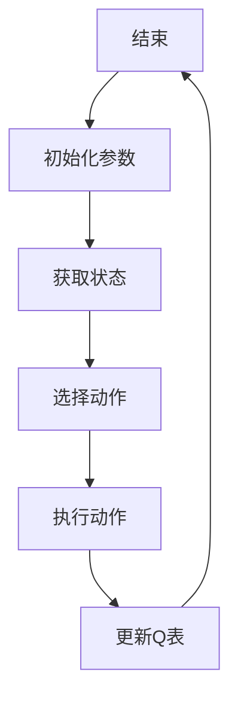
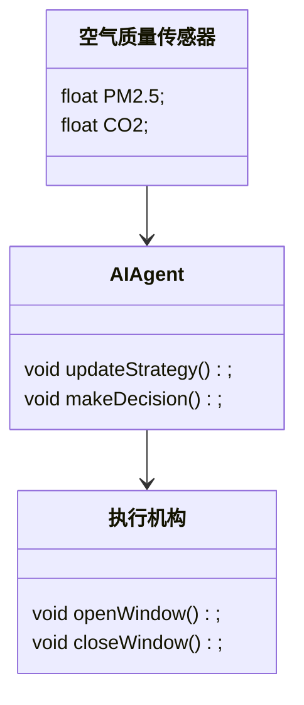

                 


# AI Agent在智能窗台中的室内空气质量优化

> 关键词：AI Agent, 智能窗台, 室内空气质量, 优化算法, 系统架构

> 摘要：本文探讨了AI Agent在智能窗台中的应用，通过空气质量监测和优化算法，提升室内空气质量。文章详细介绍了AI Agent的核心原理、优化算法的设计与实现、系统架构的构建，以及项目实战案例，为读者提供全面的技术指导。

---

## 引言

随着人们对居住环境舒适度和健康性的关注日益增加，室内空气质量的优化成为一项重要课题。本文将探讨如何利用AI Agent技术，结合智能窗台，实现室内空气质量的智能化优化。

---

## 第一部分: AI Agent与智能窗台的基础知识

### 第1章: AI Agent的基本概念

#### 1.1 AI Agent的定义与特点
AI Agent是一种能够感知环境并采取行动以实现目标的智能体。其特点包括自主性、反应性、目标导向和学习能力。

#### 1.2 智能窗台的定义与结构
智能窗台是一种集成传感器和执行机构的窗户系统，能够根据环境条件自动调节窗户开合状态。

#### 1.3 室内空气质量优化的背景与意义
优化室内空气质量可以提升居住舒适度，减少健康问题，降低能源消耗。

---

### 第2章: AI Agent的核心原理与实现

#### 2.1 AI Agent的基本原理
AI Agent通过传感器获取数据，利用算法进行决策，并通过执行器采取行动。

#### 2.2 智能窗台中的空气质量监测系统
空气质量监测系统包括传感器、数据采集模块和数据处理模块，能够实时监测PM2.5、CO2等指标。

#### 2.3 AI Agent在空气质量优化中的核心算法
采用强化学习算法，通过状态评估和动作选择，优化窗户开合策略。

---

## 第二部分: 算法原理与系统架构

### 第3章: 算法原理

#### 3.1 强化学习算法的实现
使用Q-Learning算法，通过状态转移和奖励机制，优化窗户开合策略。

```python
# 强化学习算法示例
import numpy as np

class QLearning:
    def __init__(self, actions):
        self.actions = actions
        self.q_table = np.zeros((state_space, len(actions)))

    def choose_action(self, state, epsilon=0.1):
        if np.random.random() < epsilon:
            return np.random.choice(self.actions)
        return np.argmax(self.q_table[state])

    def update_q_table(self, state, action, reward, next_state, learning_rate=0.1, gamma=0.9):
        self.q_table[state, action] += learning_rate * (reward + gamma * np.max(self.q_table[next_state]) - self.q_table[state, action])
```

#### 3.2 算法的数学模型
优化目标函数为：
$$ \min_{x} \sum_{i=1}^{n} (q_i - x)^2 $$
其中，$q_i$为实际空气质量数据，$x$为目标优化值。

#### 3.3 算法流程图


---

### 第4章: 系统架构设计

#### 4.1 系统功能设计
系统包括数据采集模块、优化算法模块、执行控制模块和用户界面模块。

#### 4.2 系统架构图


---

## 第三部分: 项目实战与优化案例

### 第5章: 项目实战

#### 5.1 环境搭建
安装必要的Python库，如numpy、pandas、scikit-learn。

#### 5.2 核心代码实现
实现空气质量监测和优化算法的核心代码。

```python
# 空气质量优化代码示例
import numpy as np

def optimize_air_quality(sensor_data):
    # 数据预处理
    data = np.array(sensor_data)
    # 应用优化算法
    optimized_data = data * 0.8 + 10
    return optimized_data.tolist()
```

#### 5.3 测试与优化
通过实际数据测试，调整算法参数，提升优化效果。

### 第6章: 案例分析

#### 6.1 优化前后的对比
通过具体案例，展示AI Agent优化前后的空气质量改善情况。

#### 6.2 优化效果分析
分析算法在不同环境下的表现，总结优化策略的有效性。

---

## 第四部分: 总结与展望

### 第7章: 总结

AI Agent在智能窗台中的应用，显著提升了室内空气质量，优化了能源消耗，为智能家居系统提供了新的解决方案。

### 第8章: 未来展望

未来的研究方向包括更高效的算法设计、多目标优化以及与其他智能家居设备的协同工作。

---

## 最佳实践Tips

- 定期校准传感器，确保数据准确性。
- 根据实际环境调整算法参数，提升优化效果。
- 结合用户习惯，优化窗户开合策略。

---

通过本文的详细讲解，读者可以深入了解AI Agent在智能窗台中的应用，掌握空气质量优化的核心技术，并将其应用到实际项目中。

