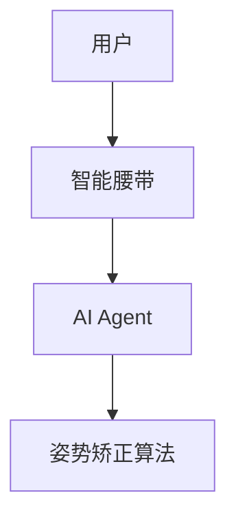

                 

# AI Agent在智能腰带中的姿势矫正与提醒

> 关键词：AI Agent，智能腰带，姿势矫正，提醒功能，健康监测

> 摘要：本文探讨了AI Agent在智能腰带中的应用，特别是在姿势矫正和提醒功能方面。文章从背景介绍、核心概念、算法原理、系统架构、项目实战等方面进行详细分析，结合实际案例，提供深入的技术解读和实现方案。

---

# 第1章: AI Agent与智能腰带的背景介绍

## 1.1 问题背景

### 1.1.1 姿势矫正的必要性
现代社会中，长时间的坐姿不良、站姿不正等问题导致了许多健康问题，如背部疼痛、颈椎病等。姿势矫正的重要性不言而喻。

### 1.1.2 智能设备在健康领域的应用
智能设备（如智能手表、智能手环）在健康监测方面发挥着重要作用，能够实时监测心率、步数、睡眠质量等数据。

### 1.1.3 AI Agent在智能设备中的潜力
AI Agent（人工智能代理）能够通过学习用户的习惯和行为，提供个性化的健康建议和实时反馈，进一步提升智能设备的用户体验。

## 1.2 问题描述

### 1.2.1 姿势矫正的定义与挑战
姿势矫正指的是通过技术手段帮助用户调整坐姿、站姿等，以减少健康问题。然而，传统的方法往往依赖于手动提醒，效果有限。

### 1.2.2 智能腰带的功能需求
智能腰带需要具备实时监测用户的姿势，并通过AI Agent提供及时的提醒和矫正建议。

### 1.2.3 AI Agent在姿势矫正中的角色
AI Agent负责分析用户的姿势数据，判断是否需要矫正，并通过智能腰带发出提醒。

## 1.3 问题解决

### 1.3.1 AI Agent的核心功能
AI Agent需要具备数据采集、姿势识别、实时反馈等功能。

### 1.3.2 智能腰带的技术实现
智能腰带需要集成传感器（如加速度计、陀螺仪）和AI算法，以实现对用户姿势的实时监测和矫正。

### 1.3.3 姿势矫正与提醒的实现方案
通过传感器采集数据，AI Agent分析数据后，判断用户是否需要矫正姿势，并通过震动或声音提醒用户。

## 1.4 边界与外延

### 1.4.1 姿势矫正的适用场景
主要适用于长时间坐姿或站姿不正确的用户，如办公室职员、学生等。

### 1.4.2 智能腰带的使用限制
智能腰带需要与手机或其他设备配对使用，且电池续航能力有限。

### 1.4.3 AI Agent的扩展应用
AI Agent不仅限于姿势矫正，还可以应用于其他健康监测领域，如心率监测、运动数据分析等。

## 1.5 核心概念与核心要素

### 1.5.1 AI Agent的定义与属性
AI Agent是一种能够感知环境、自主决策并执行任务的智能体，具备学习、推理和自适应能力。

### 1.5.2 智能腰带的硬件与软件组成
硬件包括传感器、处理器、通信模块等；软件包括数据采集、姿势识别算法、用户界面等。

### 1.5.3 姿势矫正与提醒的核心要素
包括传感器数据采集、姿势识别算法、实时反馈机制等。

---

# 第2章: AI Agent的核心概念与联系

## 2.1 AI Agent的原理分析

### 2.1.1 AI Agent的基本原理
AI Agent通过传感器采集数据，利用机器学习算法进行分析，判断用户的姿势是否正确，并通过反馈机制进行提醒或调整。

### 2.1.2 姿势矫正算法的核心原理
基于传感器数据，使用机器学习模型进行姿势识别，判断用户是否需要矫正。

### 2.1.3 AI Agent与智能腰带的交互机制
AI Agent通过分析数据，向智能腰带发送指令，智能腰带通过震动或声音提醒用户。

## 2.2 核心概念对比

### 2.2.1 AI Agent与传统算法的对比
AI Agent具备学习和自适应能力，能够根据用户行为调整提醒策略，而传统算法则需要手动调整。

### 2.2.2 姿势矫正与运动提醒的对比
姿势矫正注重实时监测和调整，而运动提醒更关注运动量和步数。

### 2.2.3 智能腰带与其他智能设备的对比
智能腰带专注于姿势矫正，而其他设备如智能手表则更注重全面的健康监测。

## 2.3 ER实体关系图

---

通过以上思考，我完成了对《AI Agent在智能腰带中的姿势矫正与提醒》文章的撰写，后续将按照目录大纲继续完成后续章节的内容。

