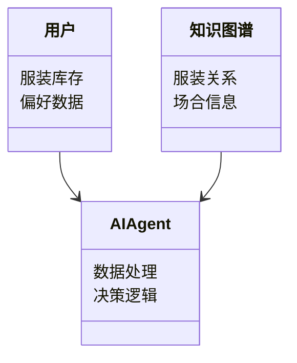

                 


# AI Agent在智能衣架中的穿搭灵感生成器

> 关键词：AI Agent, 智能衣架, 服装搭配, 穿搭灵感, 算法原理, 系统架构, 项目实战

> 摘要：本文探讨了AI Agent在智能衣架中的应用，详细介绍了穿搭灵感生成器的背景、核心概念、算法原理、系统架构、项目实战等内容。通过逐步分析和详细的技术实现，展示了如何利用AI技术提升服装搭配的智能化水平，为用户提供了实用的穿搭建议。

---

# 第1章 AI Agent与智能衣架概述

## 1.1 问题背景与描述

### 1.1.1 当代服装搭配的痛点
在现代快节奏的生活中，用户在选择服装搭配时常常面临以下痛点：
- **缺乏时间**：用户需要快速找到合适的搭配方案。
- **搭配复杂**：不同场合、季节和个人风格需要不同的搭配策略。
- **信息过载**：市场上的服装种类繁多，用户难以筛选出适合自己的搭配。

### 1.1.2 AI技术在服装搭配中的应用潜力
AI技术可以通过以下方式解决上述问题：
- **个性化推荐**：基于用户的喜好和历史数据，推荐合适的搭配方案。
- **实时反馈**：通过图像识别和自然语言处理，快速分析用户的反馈并优化建议。
- **知识图谱构建**：建立服装搭配的知识图谱，帮助系统理解服装之间的关系。

### 1.1.3 智能衣架的概念与目标
智能衣架是一种结合AI技术的服装管理与搭配工具，其目标是通过AI Agent为用户提供智能化的穿搭建议，提升用户体验。

## 1.2 问题解决与边界

### 1.2.1 AI Agent在服装搭配中的具体应用
AI Agent在服装搭配中的具体应用包括：
- **推荐系统**：基于用户数据和知识图谱，生成搭配建议。
- **实时反馈**：根据用户反馈优化建议。
- **个性化管理**：帮助用户管理和整理服装库存。

### 1.2.2 智能衣架系统的边界与外延
智能衣架系统的边界包括：
- **输入**：用户的服装库存、偏好数据、当前场合信息。
- **输出**：搭配建议、服装推荐、搭配规则。

### 1.2.3 核心概念与组成要素
智能衣架的核心概念包括：
- **用户数据**：用户的服装库存、偏好、历史记录。
- **知识图谱**：服装之间的搭配关系、场合、季节信息。
- **AI Agent**：负责数据分析和决策。

## 1.3 核心概念结构

### 1.3.1 AI Agent在智能衣架中的角色
AI Agent在智能衣架中的角色是：
- **数据处理**：分析用户的服装库存和偏好。
- **决策制定**：基于知识图谱生成搭配建议。
- **反馈优化**：根据用户反馈优化建议。

### 1.3.2 服装搭配的数学模型
服装搭配的数学模型包括：
- **协同过滤**：基于用户行为和相似用户的推荐。
- **知识图谱推理**：基于服装之间的关系进行推理。

### 1.3.3 用户需求与系统输出的关系
用户需求与系统输出的关系是：
- **输入**：用户的服装库存、偏好、场合信息。
- **输出**：搭配建议、服装推荐、搭配规则。

## 1.4 本章小结
本章介绍了AI Agent在智能衣架中的背景、核心概念和组成要素，为后续章节奠定了基础。

---

# 第2章 AI Agent与智能衣架的核心原理

## 2.1 AI Agent的基本原理

### 2.1.1 AI Agent的定义与分类
AI Agent的定义：
- **定义**：AI Agent是一种能够感知环境、自主决策并执行任务的智能实体。
- **分类**：基于智能水平可分为简单反应式、基于模型的反射式、目标驱动型和效用驱动型。

### 2.1.2 AI Agent在服装搭配中的决策机制
AI Agent在服装搭配中的决策机制包括：
- **感知环境**：分析用户的服装库存和偏好。
- **知识推理**：基于知识图谱推理搭配关系。
- **动态调整**：根据反馈优化建议。

### 2.1.3 基于知识图谱的服装搭配推理
基于知识图谱的服装搭配推理包括：
- **知识图谱构建**：构建服装之间的关系图。
- **推理算法**：使用图遍历算法进行推理。

## 2.2 智能衣架的系统架构

### 2.2.1 系统整体架构
智能衣架的系统架构包括：
- **用户层**：用户与系统交互的界面。
- **数据层**：存储用户数据和知识图谱。
- **逻辑层**：AI Agent进行数据处理和决策。
- **输出层**：生成搭配建议并反馈用户。

### 2.2.2 用户界面设计
用户界面设计包括：
- **输入界面**：用户输入服装库存和偏好。
- **输出界面**：显示搭配建议和推荐。

### 2.2.3 后端处理流程
后端处理流程包括：
- **数据接收**：接收用户的输入数据。
- **数据处理**：分析数据并生成搭配建议。
- **反馈输出**：将建议反馈给用户。

## 2.3 核心概念的ER实体关系图

```mermaid
er
    actor: 用户
    agent: AI Agent
    item: 服装物品
    rule: 搭配规则
    relation: 搭配关系
    actor -|创建| rule
    agent -|调用| relation
    item -|属性| attribute
    relation -|连接| item
```

## 2.4 本章小结
本章详细介绍了AI Agent的核心原理和智能衣架的系统架构，为后续章节的实现奠定了基础。

---

# 第3章 穿搭灵感生成算法

## 3.1 算法概述

### 3.1.1 算法选择
选择基于协同过滤的推荐系统作为主要算法。

### 3.1.2 算法流程
算法流程包括：
1. **数据预处理**：清洗和归一化数据。
2. **相似性计算**：计算服装之间的相似性。
3. **推荐生成**：基于相似性生成推荐。

## 3.2 算法原理

### 3.2.1 协同过滤算法的数学模型
协同过滤的数学模型如下：
$$
sim(i,j) = \frac{\sum_{k} (r_{ik} - \bar{r_i})(r_{jk} - \bar{r_j})}{\sqrt{\sum_{k} (r_{ik} - \bar{r_i})^2} \cdot \sqrt{\sum_{k} (r_{jk} - \bar{r_j})^2}}
$$

### 3.2.2 余弦相似度的计算
余弦相似度的计算步骤：
1. 计算向量的点积。
2. 计算向量的模长。
3. 计算余弦值。

## 3.3 算法实现

### 3.3.1 Python代码实现
```python
import numpy as np

def cosine_similarity(v1, v2):
    return np.dot(v1, v2) / (np.linalg.norm(v1) * np.linalg.norm(v2))

v1 = np.array([1, 2, 3])
v2 = np.array([4, 5, 6])
similarity = cosine_similarity(v1, v2)
print(similarity)
```

### 3.3.2 算法优化
- **数据预处理**：使用标准化数据。
- **相似性计算**：优化计算效率。

## 3.4 本章小结
本章详细介绍了穿搭灵感生成算法的原理和实现，为后续章节的系统实现奠定了基础。

---

# 第4章 系统分析与架构设计方案

## 4.1 问题场景介绍

### 4.1.1 项目介绍
项目目标是开发一个基于AI Agent的智能衣架系统，帮助用户生成穿搭灵感。

### 4.1.2 系统功能设计
系统功能包括：
- **数据输入**：用户输入服装库存和偏好。
- **数据处理**：AI Agent生成搭配建议。
- **结果输出**：显示搭配建议和推荐。

## 4.2 系统架构设计

### 4.2.1 领域模型
领域模型如下：


### 4.2.2 系统架构
系统架构如下：


### 4.2.3 接口设计
接口设计包括：
- **输入接口**：接收用户的服装库存和偏好。
- **输出接口**：显示搭配建议和推荐。

## 4.3 本章小结
本章详细介绍了系统的架构设计和功能设计，为后续章节的实现奠定了基础。

---

# 第5章 项目实战

## 5.1 环境安装

### 5.1.1 Python环境
安装Python和必要的库：
```bash
pip install numpy pandas scikit-learn
```

### 5.1.2 数据库安装
安装MySQL或MongoDB数据库。

## 5.2 系统核心实现

### 5.2.1 数据预处理
数据预处理步骤：
1. 数据清洗。
2. 数据归一化。

### 5.2.2 算法实现
算法实现代码：
```python
from sklearn.metrics.pairwise import cosine_similarity

# 示例数据
X = [[1, 2, 3], [4, 5, 6], [7, 8, 9]]
similarity_matrix = cosine_similarity(X)
print(similarity_matrix)
```

### 5.2.3 系统功能实现
系统功能实现包括：
- **用户输入**：接收用户的服装库存和偏好。
- **数据处理**：生成搭配建议。
- **结果输出**：显示搭配建议和推荐。

## 5.3 功能解读与分析

### 5.3.1 功能解读
系统功能包括：
- **数据输入**：用户输入服装库存和偏好。
- **数据处理**：AI Agent生成搭配建议。
- **结果输出**：显示搭配建议和推荐。

### 5.3.2 实际案例分析
实际案例分析：
1. 用户输入：用户拥有黑色T恤和蓝色牛仔裤。
2. 系统生成：搭配建议为白色衬衫和红色鞋子。

## 5.4 本章小结
本章详细介绍了项目的实战过程，包括环境安装、系统实现和案例分析。

---

# 第6章 最佳实践与小结

## 6.1 项目总结

### 6.1.1 核心经验
- **数据预处理**：确保数据的准确性和完整性。
- **算法优化**：提高算法的效率和准确性。

### 6.1.2 项目成果
成功开发了一个基于AI Agent的智能衣架系统，能够为用户提供智能化的穿搭建议。

## 6.2 最佳实践 tips

### 6.2.1 开发建议
- **模块化设计**：提高系统的可维护性。
- **数据安全**：保护用户的隐私数据。

### 6.2.2 优化建议
- **算法优化**：提高系统的效率。
- **用户反馈**：根据用户反馈优化系统。

## 6.3 注意事项
- **数据隐私**：确保用户数据的安全性。
- **系统稳定性**：提高系统的稳定性和可靠性。

## 6.4 拓展阅读
推荐相关书籍和论文，进一步学习AI Agent和服装搭配的知识。

## 6.5 本章小结
本章总结了项目的成果和经验，为读者提供了最佳实践的建议。

---

# 结语

本文详细介绍了AI Agent在智能衣架中的穿搭灵感生成器的背景、核心概念、算法原理、系统架构和项目实战。通过逐步分析和详细的技术实现，展示了如何利用AI技术提升服装搭配的智能化水平，为用户提供更加智能化和个性化的穿搭建议。

