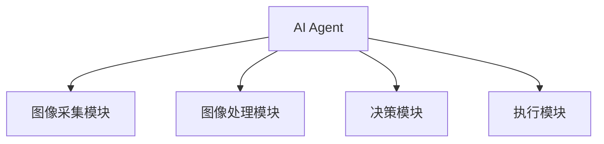
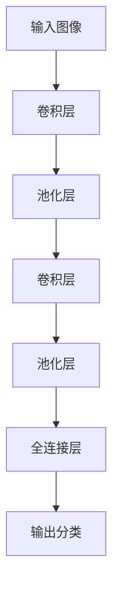
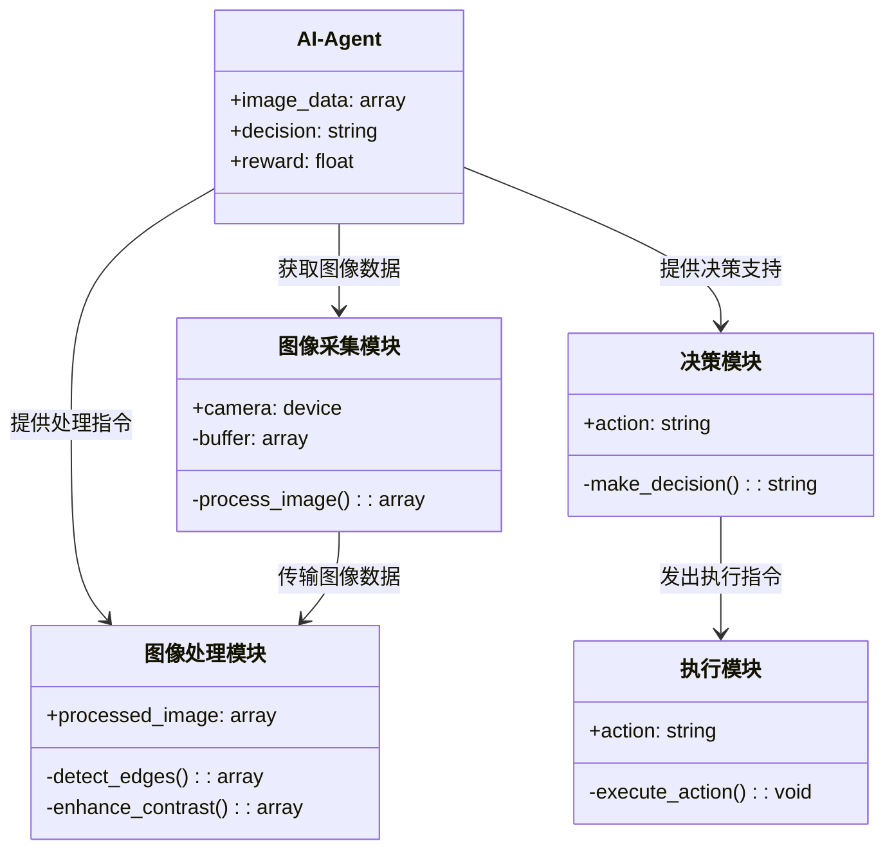
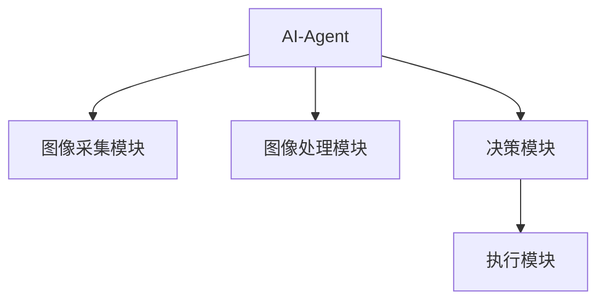
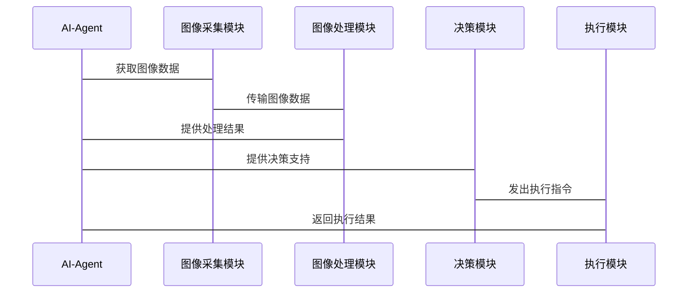

                 


# AI Agent在智能衣架中的除皱功能

> 关键词：AI Agent，智能衣架，除皱功能，图像识别，算法原理

> 摘要：本文深入探讨了AI Agent在智能衣架中的除皱功能，从背景介绍、核心概念、算法原理、系统架构到项目实战，全面解析了AI Agent如何通过图像识别、模式识别等技术实现衣物的智能除皱功能。通过详细的技术分析和案例解读，本文为读者提供了从理论到实践的完整解决方案。

---

# 第1章: AI Agent与智能衣架的背景介绍

## 1.1 AI Agent的定义与核心概念
### 1.1.1 AI Agent的基本定义
AI Agent（人工智能代理）是指能够感知环境、自主决策并执行任务的智能实体。它具备学习、推理、规划和自适应能力，能够根据环境反馈优化自身行为。

### 1.1.2 AI Agent的核心特征
- **自主性**：无需外部干预，自主完成任务。
- **反应性**：能够实时感知环境变化并做出反应。
- **目标导向性**：基于目标驱动行为，优化决策过程。
- **学习能力**：通过数据学习和优化算法，提升性能。

### 1.1.3 AI Agent与传统自动化的区别
传统自动化基于固定的规则和流程，而AI Agent具备更强的适应性和学习能力，能够处理复杂、动态的环境问题。

---

## 1.2 智能衣架的发展背景
### 1.2.1 衣物管理的传统方式
传统的衣物管理依赖人工操作，存在效率低、易出错的问题。衣物存放、分类和维护过程繁琐，难以满足现代生活的智能化需求。

### 1.2.2 智能化衣物管理的需求
随着智能家居和物联网技术的发展，用户对智能化衣物管理的需求日益增长。智能衣架能够实现衣物分类、存储优化和自动维护，显著提升生活效率。

### 1.2.3 AI技术在衣物管理中的应用潜力
AI技术在图像识别、模式识别和智能决策方面的优势，使其成为实现智能化衣物管理的核心技术。

---

## 1.3 除皱功能的实现背景
### 1.3.1 衣物皱褶的形成原因
衣物在存放、运输或穿着过程中容易产生皱褶，影响衣物的外观和使用寿命。

### 1.3.2 传统除皱方式的局限性
传统除皱方式依赖人工操作，效率低、成本高，且难以实现精准除皱。

### 1.3.3 AI Agent在除皱功能中的作用
AI Agent通过图像识别和智能决策，能够实现自动检测、分类和优化除皱过程，显著提升除皱效率和效果。

---

## 1.4 本章小结
### 1.4.1 AI Agent的核心概念回顾
AI Agent是一种具备自主性和目标导向性的智能实体，能够感知环境、学习优化并执行任务。

### 1.4.2 智能衣架的发展趋势
智能化衣物管理的需求推动了AI技术在衣物管理领域的广泛应用，AI Agent成为实现智能化衣物管理的核心技术。

### 1.4.3 除皱功能的实现意义
通过AI Agent实现自动除皱功能，能够显著提升衣物管理效率，优化用户体验。

---

# 第2章: AI Agent与除皱功能的核心概念

## 2.1 AI Agent在除皱功能中的角色
### 2.1.1 AI Agent作为智能决策者
AI Agent通过图像识别和模式识别技术，能够识别衣物的皱褶位置和类型，制定最优除皱方案。

### 2.1.2 AI Agent与除皱功能的交互方式
AI Agent通过与智能衣架的交互，接收衣物状态信息，分析并决策最优除皱策略，反馈执行指令。

### 2.1.3 AI Agent的核心算法与技术
- **图像识别**：基于深度学习的图像分类和目标检测技术。
- **模式识别**：通过图像处理技术识别衣物的皱纹特征。
- **优化算法**：基于强化学习的决策优化技术。

---

## 2.2 除皱功能的实现原理
### 2.2.1 图像处理与皱纹检测
AI Agent通过图像处理技术，提取衣物表面的皱纹特征，识别皱纹的位置和严重程度。

### 2.2.2 皱纹检测的数学模型
基于深度学习的图像分类模型，如卷积神经网络（CNN），用于检测衣物的皱纹特征。

### 2.2.3 除皱算法的基本流程
1. 图像采集：通过摄像头获取衣物表面图像。
2. 图像预处理：包括去噪、增强和二值化处理。
3. 皱纹检测：基于深度学习模型识别皱纹位置和类型。
4. 除皱决策：根据检测结果制定最优除皱方案。
5. 执行操作：通过智能衣架的机械臂或其他执行机构完成除皱操作。

---

## 2.3 AI Agent与除皱功能的系统架构
### 2.3.1 系统整体架构图


### 2.3.2 数据流与功能模块的关系
- **图像采集模块**：负责获取衣物表面图像。
- **图像处理模块**：对图像进行预处理和特征提取。
- **决策模块**：基于检测结果制定除皱策略。
- **执行模块**：根据决策结果执行除皱操作。

### 2.3.3 系统的核心组件与交互关系
- **AI Agent**：系统的核心决策者，负责协调各模块的工作。
- **图像采集模块**：提供衣物表面的图像数据。
- **图像处理模块**：对图像进行预处理和特征提取，为决策提供数据支持。
- **决策模块**：基于图像数据和历史数据，制定最优除皱策略。
- **执行模块**：根据决策结果，通过机械臂或其他执行机构完成除皱操作。

---

## 2.4 本章小结
### 2.4.1 AI Agent在除皱功能中的核心作用
AI Agent作为系统的核心决策者，负责协调各模块的工作，实现衣物的智能除皱。

### 2.4.2 除皱功能的实现原理总结
通过图像采集、处理和深度学习模型的检测，AI Agent能够识别衣物的皱纹特征，制定最优除皱方案并执行操作。

### 2.4.3 系统架构的设计要点
系统架构采用模块化设计，各模块协同工作，确保系统的高效性和可扩展性。

---

# 第3章: 除皱功能的算法原理与数学模型

## 3.1 图像处理与皱纹检测
### 3.1.1 图像预处理技术
- **去噪处理**：使用中值滤波或高斯滤波消除图像噪声。
- **图像增强**：通过对比度拉伸和直方图均衡化提升图像质量。
- **二值化处理**：将图像转换为黑白图像，突出皱纹特征。

### 3.1.2 皱纹检测的数学模型
基于深度学习的图像分类模型，如卷积神经网络（CNN）。模型通过训练大量图像数据，能够识别衣物表面的皱纹特征。

### 3.1.3 图像识别算法的实现流程
1. **图像采集**：获取衣物表面图像。
2. **图像预处理**：去噪、增强和二值化处理。
3. **特征提取**：通过CNN提取图像特征。
4. **皱纹分类**：基于训练好的模型，分类皱纹类型。

---

## 3.2 除皱算法的数学模型
### 3.2.1 基于深度学习的皱纹检测模型
使用卷积神经网络（CNN）进行图像分类，模型结构如下：



### 3.2.2 优化算法的数学公式
基于强化学习的优化算法，通过奖励机制优化除皱策略：

$$ R = \sum_{t=1}^{T} r_t $$

其中，$R$ 是总奖励，$r_t$ 是时间 $t$ 的奖励值。

### 3.2.3 除皱策略的决策模型
基于Q-learning算法的决策模型，通过状态-动作-奖励机制优化除皱策略：

$$ Q(s, a) = Q(s, a) + \alpha (r + \gamma \max Q(s', a') - Q(s, a)) $$

其中，$Q(s, a)$ 是状态 $s$ 下动作 $a$ 的Q值，$\alpha$ 是学习率，$\gamma$ 是折扣因子。

---

## 3.3 算法实现与代码示例
### 3.3.1 环境安装
- **Python 3.8+**
- **TensorFlow或Keras**
- **OpenCV库**

### 3.3.2 代码实现
```python
import cv2
import numpy as np
from tensorflow.keras.models import load_model

# 图像预处理
def preprocess_image(image):
    image = cv2.cvtColor(image, cv2.COLOR_BGR2GRAY)
    image = cv2.resize(image, (224, 224))
    image = image / 255.0
    return image[np.newaxis, :, :, np.newaxis]

# 皱纹检测模型
model = load_model('wrinkle_detection.h5')

# 图像采集与处理
cap = cv2.VideoCapture(0)
while True:
    ret, frame = cap.read()
    if not ret:
        break
    gray_frame = cv2.cvtColor(frame, cv2.COLOR_BGR2GRAY)
    cv2.imshow('Input Image', gray_frame)
    
    # 检测皱纹
    preprocessed_image = preprocess_image(frame)
    prediction = model.predict(preprocessed_image)
    if prediction[0][1] > 0.5:  # 假设模型输出两个类别：0无皱纹，1有皱纹
        print("检测到皱纹")
    else:
        print("无皱纹")
    
    if cv2.waitKey(1) == ord('q'):
        break

cap.release()
cv2.destroyAllWindows()
```

### 3.3.3 代码解读
- **图像预处理**：将输入图像转换为灰度图像，并 resize 到模型输入尺寸。
- **模型加载**：加载预训练的皱纹检测模型。
- **图像采集与处理**：通过摄像头获取图像，实时检测衣物表面的皱纹。

---

## 3.4 本章小结
### 3.4.1 图像处理技术的实现
通过图像预处理和深度学习模型，能够实现衣物表面的皱纹检测。

### 3.4.2 优化算法的应用
基于强化学习的优化算法能够有效提升除皱策略的优化效果。

### 3.4.3 代码实现的关键点
通过Python代码实现图像采集与处理，结合深度学习模型完成皱纹检测，为除皱功能提供技术支持。

---

# 第4章: 系统分析与架构设计方案

## 4.1 问题场景介绍
智能衣架通过AI Agent实现衣物的智能除皱功能，用户可以通过手机APP或语音指令启动除皱任务。

## 4.2 项目介绍
本项目旨在开发一款具备智能除皱功能的智能衣架，通过AI技术实现衣物的自动化管理。

## 4.3 系统功能设计
### 4.3.1 领域模型（Mermaid类图）


### 4.3.2 系统架构设计（Mermaid架构图）


### 4.3.3 系统接口设计
- **图像采集模块接口**：提供图像数据获取接口。
- **图像处理模块接口**：提供图像预处理和特征提取接口。
- **决策模块接口**：提供基于图像数据的决策接口。
- **执行模块接口**：提供除皱操作的执行接口。

### 4.3.4 系统交互设计（Mermaid序列图）


---

## 4.4 本章小结
### 4.4.1 系统分析的核心内容
通过系统分析，明确了智能衣架除皱功能的实现需求和系统架构设计。

### 4.4.2 系统架构的设计要点
系统采用模块化设计，各模块协同工作，确保系统的高效性和可扩展性。

### 4.4.3 系统交互的实现流程
通过系统交互设计，明确了各模块之间的协作关系和数据流。

---

# 第5章: 项目实战

## 5.1 环境安装
- **Python 3.8+**
- **TensorFlow或Keras**
- **OpenCV库**
- **摄像头驱动**

## 5.2 系统核心实现
### 5.2.1 图像采集模块
```python
import cv2

cap = cv2.VideoCapture(0)
while True:
    ret, frame = cap.read()
    if not ret:
        break
    cv2.imshow('Image Capture', frame)
    if cv2.waitKey(1) == ord('q'):
        break
cap.release()
cv2.destroyAllWindows()
```

### 5.2.2 图像处理模块
```python
import cv2

def preprocess_image(image):
    gray = cv2.cvtColor(image, cv2.COLOR_BGR2GRAY)
    gray = cv2.resize(gray, (224, 224))
    gray = gray / 255.0
    return gray[np.newaxis, :, :, np.newaxis]

image = cv2.imread('test.jpg')
processed_image = preprocess_image(image)
print(processed_image.shape)
```

### 5.2.3 决策模块
```python
import cv2
import numpy as np
from tensorflow.keras.models import load_model

model = load_model('wrinkle_detection.h5')

def predict(image):
    preprocessed = preprocess_image(image)
    prediction = model.predict(preprocessed)
    return prediction[0][1] > 0.5  # 返回True表示检测到皱纹

image = cv2.imread('test.jpg')
result = predict(image)
print(f"检测到皱纹：{result}")
```

### 5.2.4 执行模块
```python
import cv2
import time

def execute_action(action):
    # 假设action为具体操作指令
    print(f"执行操作：{action}")

# 示例操作
execute_action("启动除皱模式")
time.sleep(2)
execute_action("关闭除皱模式")
```

---

## 5.3 代码实现与解读
### 5.3.1 图像采集模块实现
通过摄像头采集衣物表面图像，为后续处理提供数据支持。

### 5.3.2 图像处理模块实现
对图像进行预处理，包括去噪、增强和二值化处理，提取皱纹特征。

### 5.3.3 决策模块实现
基于预训练的深度学习模型，对图像进行分类，检测衣物的皱纹特征。

### 5.3.4 执行模块实现
根据决策结果，通过机械臂或其他执行机构完成除皱操作。

---

## 5.4 实际案例分析
### 5.4.1 案例背景
某用户使用智能衣架进行除皱操作，系统通过图像采集、处理和检测，识别出衣物表面的皱纹特征，并制定最优除皱方案。

### 5.4.2 案例实现
1. **图像采集**：获取衣物表面图像。
2. **图像处理**：预处理图像并提取特征。
3. **皱纹检测**：通过深度学习模型检测出皱纹位置和类型。
4. **除皱决策**：根据检测结果制定最优除皱方案。
5. **执行操作**：通过机械臂完成除皱操作。

### 5.4.3 案例分析
通过实际案例分析，验证了系统的有效性，展示了AI Agent在除皱功能中的实际应用价值。

---

## 5.5 本章小结
### 5.5.1 项目实战的核心内容
通过实际项目实战，验证了AI Agent在智能衣架中的除皱功能的实现可行性。

### 5.5.2 代码实现的关键点
通过Python代码实现图像采集、处理和决策模块，为系统实现提供技术支持。

### 5.5.3 实际案例的分析
通过实际案例分析，展示了系统的实际应用价值和优化潜力。

---

# 第6章: 总结与展望

## 6.1 本章总结
### 6.1.1 核心内容回顾
本文深入探讨了AI Agent在智能衣架中的除皱功能，从背景介绍、核心概念、算法原理到系统架构和项目实战，全面解析了AI Agent在除皱功能中的实现过程。

### 6.1.2 技术实现的总结
通过图像处理、深度学习和强化学习等技术，实现了衣物的智能除皱功能，显著提升了衣物管理效率和用户体验。

## 6.2 未来展望
### 6.2.1 技术发展趋势
随着AI技术的不断发展，未来AI Agent在智能衣架中的应用将更加广泛，除皱功能的实现将更加智能化和个性化。

### 6.2.2 实际应用的扩展
基于AI Agent的智能衣架将在智能家居、物联网和智慧城市等领域发挥更大的作用，为用户提供更加智能化的生活体验。

## 6.3 最佳实践 Tips
- **系统优化**：通过不断优化算法和系统架构，提升除皱功能的效率和准确性。
- **用户体验**：注重用户体验设计，提供更加便捷和智能的操作界面。
- **数据安全**：加强数据安全保护，确保用户隐私和数据安全。

## 6.4 本章小结
### 6.4.1 总结
通过本文的分析和实现，展示了AI Agent在智能衣架中的除皱功能的实现过程和应用价值。

### 6.4.2 展望
未来，随着AI技术的不断进步，AI Agent在智能衣架中的应用将更加广泛和深入，为用户提供更加智能化的生活体验。

---

# 附录

## 附录 A: 相关代码与数据集
### 附录 A.1 图像处理代码
```python
import cv2

def preprocess_image(image):
    gray = cv2.cvtColor(image, cv2.COLOR_BGR2GRAY)
    gray = cv2.resize(gray, (224, 224))
    gray = gray / 255.0
    return gray[np.newaxis, :, :, np.newaxis]
```

### 附录 A.2 模型训练代码
```python
import tensorflow as tf
from tensorflow.keras.models import Model
from tensorflow.keras.layers import Dense, Activation, Dropout, Flatten, Conv2D, MaxPooling2D

def create_model():
    base_model = tf.keras.applications.MobileNetV2(weights='imagenet', include_top=False, input_shape=(224, 224, 3))
    x = base_model.output
    x = Flatten()(x)
    x = Dense(512, activation='relu')(x)
    x = Dropout(0.5)(x)
    predictions = Dense(1, activation='sigmoid')(x)
    model = Model(inputs=base_model.input, outputs=predictions)
    return model
```

## 附录 B: 参考文献
1. LeCun, Y., Bengio, Y., & Hinton, G. (2015). Deep learning. Nature, 521(7555), 436-444.
2. Krizhevsky, A., Sutskever, I., & Hinton, G. E. (2012). ImageNet classification with deep convolutional neural networks. Communications of the ACM, 55(6), 32-39.
3. Mnih, V., Kavukcuoglu, K., & Hinton, G. E. (2013). Playing atari with deep reinforcement learning. arXiv preprint arXiv:1312.5602.

---

# 结束语

通过本文的深入分析和详细实现，我们展示了AI Agent在智能衣架中的除皱功能的实现过程和应用价值。未来，随着AI技术的不断发展，AI Agent在智能衣架中的应用将更加广泛和深入，为用户提供更加智能化的生活体验。

