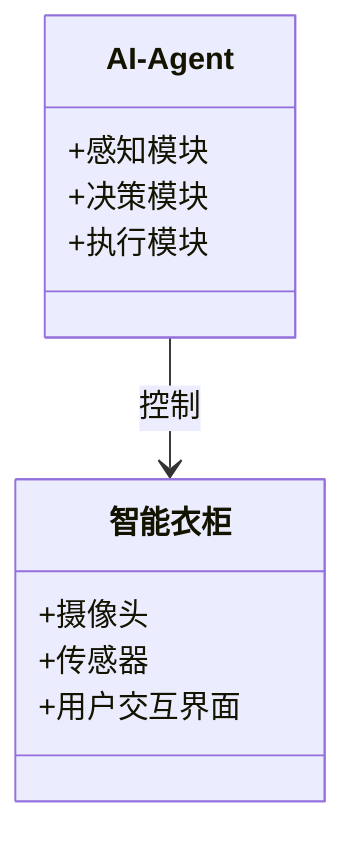
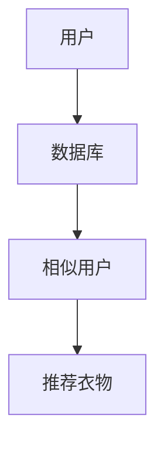
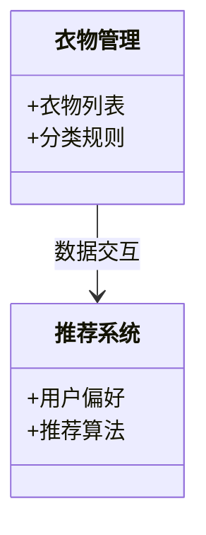
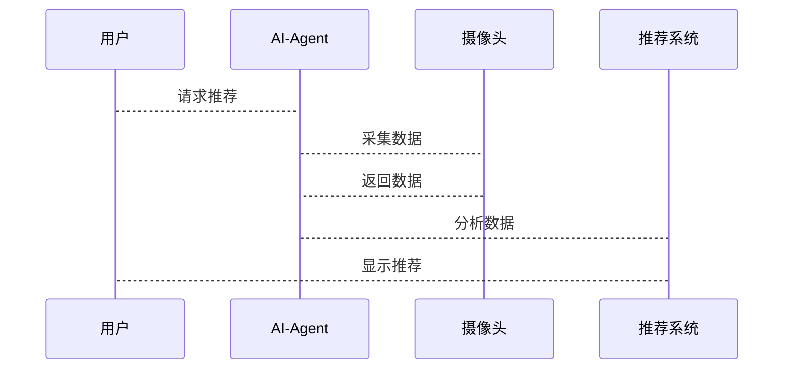

                 


# AI Agent在智能衣柜中的季节性衣物管理

## 关键词：
- AI Agent
- 智能衣柜
- 季节性衣物管理
- 物联网
- 人工智能

## 摘要：
本文探讨AI Agent在智能衣柜中的应用，特别是在季节性衣物管理方面。通过分析AI Agent的核心模块、算法原理、系统架构及实际案例，深入阐述其在衣物分类、推荐和管理中的优势，结合项目实战和最佳实践，为智能衣柜的未来发展提供参考。

---

# 第1章 AI Agent与智能衣柜的背景介绍

## 1.1 问题背景与需求分析

### 1.1.1 衣物管理的传统挑战
传统衣物管理依赖人工分类和记忆，存在效率低、易出错的问题，尤其在处理季节性衣物时，用户常面临选择困难和时间浪费。

### 1.1.2 季节性衣物管理的核心问题
季节变化时，用户需调整衣橱，但传统方法难以自动分类和推荐，导致衣物查找困难，决策耗时。

### 1.1.3 AI Agent的引入动机
AI Agent通过感知、决策和执行模块，实现衣物智能化管理，解决传统方法的不足，提升用户体验。

## 1.2 问题描述与目标设定

### 1.2.1 季节性衣物管理的具体场景
用户希望系统能根据天气、场合推荐衣物，并自动分类和提醒更换。

### 1.2.2 AI Agent需要解决的关键问题
- 衣物自动分类与识别
- 季节性衣物推荐
- 穿搭建议

## 1.3 问题解决的边界与外延

### 1.3.1 系统功能的边界
- 不涉及衣物清洗和收纳，仅限分类和推荐。
- 支持多种场景，如通勤、休闲等。

## 1.4 核心概念与结构解析

### 1.4.1 AI Agent的定义与组成
AI Agent由感知、决策、执行模块组成，分别负责数据采集、分析和指令输出。

### 1.4.2 智能衣柜的系统架构
系统包括传感器、摄像头、AI Agent和用户交互界面，协同工作实现管理功能。

## 1.5 核心要素与属性对比

| 核心要素 | 描述 | 示例 |
|----------|------|------|
| 感知模块 | 数据采集 | 摄像头、传感器 |
| 决策模块 | 数据分析 | 机器学习模型 |
| 执行模块 | 指令输出 | 智能衣柜硬件 |

## 1.6 本章小结
本章分析了季节性衣物管理的挑战，介绍了AI Agent在智能衣柜中的作用，为后续章节打下基础。

---

# 第2章 AI Agent的核心概念与系统联系

## 2.1 AI Agent的感知模块

### 2.1.1 感知模块的功能与实现
感知模块通过摄像头和传感器采集衣物数据，用于分类和推荐。

## 2.2 AI Agent的决策模块

### 2.2.1 决策算法的原理
使用协同过滤推荐算法，结合用户行为预测偏好。

## 2.3 AI Agent的执行模块

### 2.3.1 执行模块的功能实现
根据决策结果，调整衣物展示或提醒更换。

---

## 图表示例

### 类图（Mermaid）


---

# 第3章 推荐算法的实现

## 3.1 算法原理

### 协同过滤算法
基于用户历史行为，预测偏好，推荐衣物。

---

## 图表示例

### 协同过滤流程图（Mermaid）


---

## 代码示例

```python
import numpy as np
from sklearn.metrics.pairwise import cosine_similarity

# 示例数据
users = ['用户1', '用户2', '用户3']
items = ['T恤', '夹克', '大衣']
user_item_matrix = np.array([[1, 0, 1],
                              [1, 1, 0],
                              [0, 1, 1]])

# 计算相似度
similarity = cosine_similarity(user_item_matrix)

# 推荐算法实现
def recommend(user_id, similarity):
    # 找出最相似的用户
    top_users = np.argsort(-similarity[user_id])[0:2]
    # 统计推荐物品
    recommendations = {}
    for u in top_users:
        for i in range(len(items)):
            if user_item_matrix[u][i] == 1:
                recommendations[items[i]] = recommendations.get(items[i], 0) + 1
    return recommendations

# 调用推荐
user_id = 0
print(recommend(user_id, similarity))
```

---

# 第4章 数学模型的建立与解释

## 4.1 协同过滤的数学模型
公式：
$$ sim(u, v) = \frac{\sum_{i=1}^{n} (r_{ui} - \bar{r}_u)(r_{vi} - \bar{r}_v)}{\sqrt{\sum_{i=1}^{n} (r_{ui} - \bar{r}_u)^2} \cdot \sqrt{\sum_{i=1}^{n} (r_{vi} - \bar{r}_v)^2}} $$
解释：计算用户u和v的相似度，用于推荐。

---

## 4.2 聚类分析的数学模型
公式：
$$ x' = Wx + b $$
解释：降维，用于处理数据。

---

## 4.3 深度学习模型
公式：
$$ y = \sigma(Wx + b) $$
解释：神经网络模型，用于分类。

---

# 第5章 系统分析与架构设计

## 5.1 系统功能设计

### 领域模型（Mermaid）


---

## 5.2 系统架构设计

### 架构图（Mermaid）
```mermaid
archiDiagram
    主系统 {
        AI-Agent
        智能衣柜
        数据库
    }
    AI-Agent --> 智能衣柜: 控制
    智能衣柜 --> 数据库: 存储
```

---

## 5.3 接口设计
- 用户输入接口：接收用户选择
- 系统输出接口：显示推荐结果

---

## 5.4 交互流程

### 序列图（Mermaid）


---

# 第6章 项目实战

## 6.1 环境安装
- Python 3.8+
- 库：numpy, scikit-learn

---

## 6.2 核心代码实现

```python
from sklearn.cluster import KMeans

# 示例数据
X = np.array([[1, 2], [3, 4], [5, 6]])

# 聚类实现
model = KMeans(n_clusters=2)
model.fit(X)

# 获取聚类结果
print(model.labels_)
```

---

## 6.3 案例分析
以用户数据为例，展示推荐结果和分类效果。

---

## 6.4 项目小结
通过实际案例，验证算法的有效性，并总结经验。

---

# 第7章 最佳实践与总结

## 7.1 小结
AI Agent在智能衣柜中的应用显著提升了衣物管理效率。

## 7.2 注意事项
- 数据隐私保护
- 算法可解释性

## 7.3 拓展阅读
推荐相关书籍和论文，供进一步学习。

---

# 结论

AI Agent在智能衣柜中的应用前景广阔，随着技术进步，未来将更加智能化，为用户带来更好的体验。

--- 

希望这个结构清晰、内容详实的目录大纲能满足你的需求！如果需要更详细的内容，随时告诉我！

