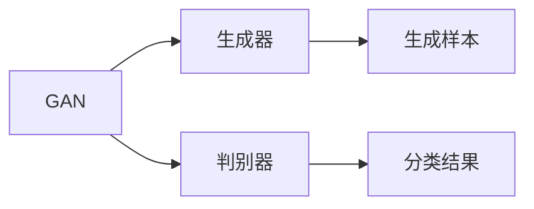
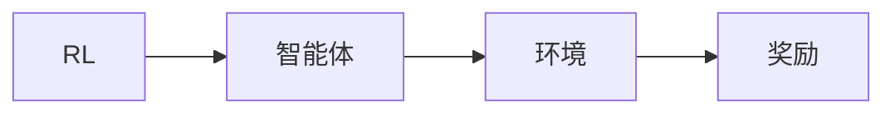
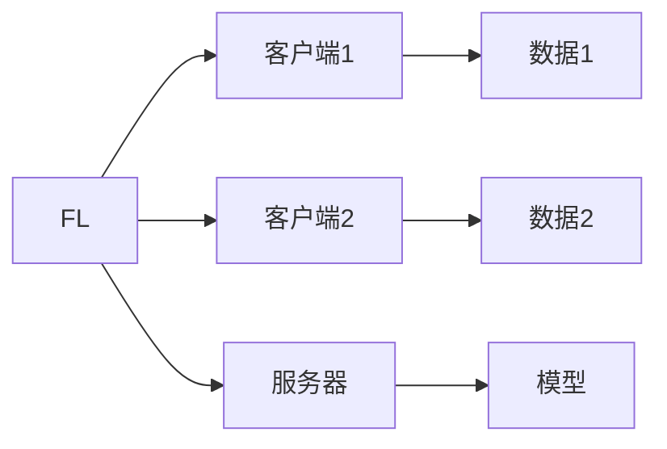
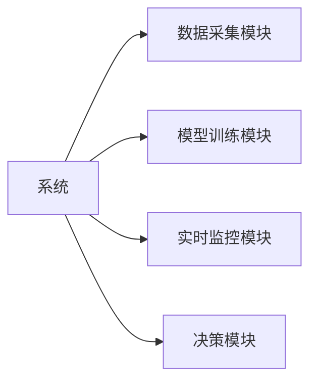

                 


# AI Agent在智能金融欺诈检测中的应用

## 关键词：AI Agent，金融欺诈检测，生成对抗网络，强化学习，联邦学习

## 摘要：本文深入探讨了AI Agent在智能金融欺诈检测中的应用。首先，我们介绍了AI Agent的基本概念及其在金融领域的应用背景，分析了金融欺诈检测的核心问题与挑战。接着，我们详细讲解了AI Agent的核心概念与原理，包括其结构、功能以及在金融欺诈检测中的角色。然后，我们深入分析了AI Agent在金融欺诈检测中的算法原理，重点介绍了生成对抗网络（GAN）、强化学习（RL）和联邦学习（Federated Learning）的应用及其优缺点。随后，我们设计了AI Agent在金融欺诈检测中的系统架构，包括系统整体架构设计、功能模块划分、系统功能设计等内容。最后，我们通过实际案例分析展示了AI Agent在金融欺诈检测中的应用场景，并总结了未来的研究方向与建议。

---

# 第1章: AI Agent与金融欺诈检测概述

## 1.1 AI Agent的基本概念

### 1.1.1 AI Agent的定义与特点
AI Agent（人工智能代理）是指具有感知环境、做出决策并采取行动以实现特定目标的智能实体。AI Agent的核心特点包括：
- **自主性**：能够在没有外部干预的情况下自主运行。
- **反应性**：能够实时感知环境变化并做出反应。
- **目标导向性**：以实现特定目标为导向。
- **学习能力**：能够通过数据和经验不断优化自身行为。

### 1.1.2 AI Agent在金融领域的应用背景
金融领域是AI技术的重要应用场景之一。金融欺诈检测是金融安全的重要组成部分，传统的基于规则的欺诈检测方法存在效率低、误报率高等问题。AI Agent的引入为金融欺诈检测提供了新的思路，能够实时监控交易数据，识别异常行为，并采取相应的防范措施。

### 1.1.3 金融欺诈检测的核心问题与挑战
金融欺诈检测的核心问题包括：
- **数据复杂性**：金融数据具有高维、非线性、噪声多等特点。
- **实时性要求**：金融欺诈检测需要实时处理交易数据，快速做出决策。
- **模型可解释性**：金融欺诈检测需要模型具有较高的可解释性，以便在出现问题时能够追溯和调整。

---

## 1.2 金融欺诈检测的现状与痛点

### 1.2.1 传统金融欺诈检测方法的局限性
传统的金融欺诈检测方法主要包括基于规则的检测和基于机器学习的检测。基于规则的方法依赖于预先定义的规则，灵活性差，容易被规避。基于机器学习的方法虽然能够处理复杂的数据，但其泛化能力和实时性仍有待提高。

### 1.2.2 AI技术在金融欺诈检测中的优势
AI技术在金融欺诈检测中的优势包括：
- **高效性**：AI Agent能够快速处理大量数据，实时检测异常交易。
- **准确性**：通过深度学习算法，AI Agent能够识别复杂的欺诈模式。
- **自适应性**：AI Agent能够根据新的数据不断优化自身的检测能力。

### 1.2.3 AI Agent在金融欺诈检测中的独特价值
AI Agent的独特价值体现在其能够结合感知、决策和行动的能力，实现端到端的自动化欺诈检测和防范。通过实时监控和动态调整，AI Agent能够有效降低金融欺诈的风险。

---

## 1.3 本章小结

### 1.3.1 AI Agent与金融欺诈检测的核心联系
AI Agent通过其自主性、反应性和学习能力，能够在金融欺诈检测中实现高效、准确的异常检测和防范。

### 1.3.2 本书的研究目标与意义
本书旨在探讨AI Agent在金融欺诈检测中的应用，分析其核心原理、算法和系统架构，并通过实际案例展示其应用效果。通过对AI Agent在金融欺诈检测中的深入研究，为金融行业提供新的技术解决方案。

---

# 第2章: AI Agent的核心概念与原理

## 2.1 AI Agent的结构与功能

### 2.1.1 知识表示与推理
知识表示是AI Agent理解和处理信息的基础。常见的知识表示方法包括符号逻辑、概率推理和语义网络等。推理是基于已有的知识，通过逻辑推理得出新的结论。

### 2.1.2 感知与决策
感知是AI Agent通过传感器或数据输入接口获取环境信息的过程。决策是基于感知信息和预设的目标，选择最优行动方案的过程。

### 2.1.3 行为与交互
行为是AI Agent根据决策结果采取的具体行动。交互是AI Agent与外部环境或其他智能体之间的信息交换过程。

## 2.2 AI Agent在金融欺诈检测中的角色

### 2.2.1 数据采集与分析
AI Agent能够实时采集金融交易数据，并通过分析识别异常交易模式。

### 2.2.2 模型训练与优化
AI Agent能够基于历史数据训练欺诈检测模型，并通过不断优化模型参数提高检测准确率。

### 2.2.3 实时监控与决策
AI Agent能够在金融交易发生时实时监控交易数据，并根据模型预测结果做出是否允许交易的决策。

## 2.3 AI Agent的核心算法与技术

### 2.3.1 生成对抗网络（GAN）
生成对抗网络（GAN）是一种由生成器和判别器组成的深度学习模型。生成器的目标是生成逼真的数据，而判别器的目标是区分真实数据和生成数据。在金融欺诈检测中，GAN可以用于生成异常交易样本，提高模型的鲁棒性。

### 2.3.2 强化学习（RL）
强化学习是一种基于奖励机制的机器学习方法。通过与环境的交互，AI Agent通过试错不断优化其行为策略。在金融欺诈检测中，强化学习可以用于动态调整检测阈值，提高检测效率。

### 2.3.3 联邦学习（Federated Learning）
联邦学习是一种分布式机器学习方法，通过在多个数据源上联合训练模型，保护数据隐私。在金融欺诈检测中，联邦学习可以用于在多个金融机构之间共享模型参数，提高检测能力。

## 2.4 本章小结

### 2.4.1 AI Agent的核心技术总结
AI Agent的核心技术包括知识表示与推理、感知与决策、行为与交互，以及生成对抗网络（GAN）、强化学习（RL）和联邦学习（Federated Learning）等算法。

### 2.4.2 金融欺诈检测中的关键算法选择
在金融欺诈检测中，选择合适的算法需要考虑数据类型、检测目标和实时性要求。生成对抗网络适用于生成异常样本，强化学习适用于动态调整检测策略，联邦学习适用于多机构协作检测。

---

# 第3章: AI Agent在金融欺诈检测中的算法原理

## 3.1 生成对抗网络（GAN）原理

### 3.1.1 GAN的基本结构
GAN由生成器和判别器组成。生成器通过生成样本欺骗判别器，判别器通过区分真实样本和生成样本进行分类。



### 3.1.2 GAN在金融欺诈检测中的应用
GAN可以用于生成异常交易样本，增强模型的鲁棒性。例如，可以通过GAN生成大量的正常交易样本，训练判别器识别异常交易。

### 3.1.3 GAN的优缺点分析
优点：GAN能够生成高质量的样本，提高模型的泛化能力。缺点：GAN的训练过程复杂，容易出现模式坍缩问题。

## 3.2 强化学习（RL）原理

### 3.2.1 RL的基本概念与算法
强化学习通过智能体与环境的交互，学习最优策略。常用的强化学习算法包括Q-learning和深度强化学习（DQN）。



### 3.2.2 RL在金融欺诈检测中的应用
强化学习可以用于动态调整欺诈检测阈值。例如，AI Agent可以通过与欺诈交易的交互，学习最优的检测策略。

### 3.2.3 RL的训练策略与优化
强化学习的训练策略包括策略梯度法和值函数法。优化方法包括经验回放和目标网络等。

## 3.3 联邦学习（Federated Learning）原理

### 3.3.1 联邦学习的基本概念
联邦学习是一种分布式机器学习方法，通过在多个数据源上联合训练模型，保护数据隐私。



### 3.3.2 联邦学习在金融欺诈检测中的优势
联邦学习可以用于多个金融机构之间的协作检测，提高模型的泛化能力。例如，多个银行可以联合训练欺诈检测模型，共享模型参数，同时保护各自的交易数据隐私。

### 3.3.3 联邦学习的实现挑战与解决方案
联邦学习的主要挑战包括通信开销大、数据异构性和模型收敛性问题。解决方案包括优化通信协议、采用异步更新和引入正则化方法等。

## 3.4 本章小结

### 3.4.1 算法原理总结
生成对抗网络（GAN）通过生成样本增强模型的鲁棒性，强化学习（RL）通过动态调整策略提高检测效率，联邦学习（Federated Learning）通过多机构协作提高模型的泛化能力。

### 3.4.2 不同算法在金融欺诈检测中的适用场景
生成对抗网络适用于生成异常样本，强化学习适用于动态调整检测策略，联邦学习适用于多机构协作检测。

---

# 第4章: AI Agent在金融欺诈检测中的系统架构

## 4.1 系统整体架构设计

### 4.1.1 系统功能模块划分
系统主要功能模块包括数据采集模块、模型训练模块、实时监控模块和决策模块。



### 4.1.2 系统架构的分层设计
系统架构分为数据层、算法层和应用层。数据层负责数据的存储和管理，算法层负责模型的训练和优化，应用层负责实时监控和决策。

### 4.1.3 系统架构的可扩展性分析
系统架构设计具有良好的可扩展性，可以通过增加新的算法模块和数据源，扩展系统的检测能力。

## 4.2 系统功能设计

### 4.2.1 数据采集与预处理
数据采集模块负责从多个数据源采集金融交易数据，并进行清洗和预处理。

```python
def data_preprocessing(data):
    # 数据清洗
    data = data.dropna()
    # 数据标准化
    data = (data - data.mean()) / data.std()
    return data
```

### 4.2.2 模型训练与优化
模型训练模块负责基于预处理后的数据训练欺诈检测模型，并通过交叉验证优化模型参数。

```python
from sklearn.model_selection import train_test_split
from sklearn.metrics import accuracy_score

# 数据划分
X_train, X_test, y_train, y_test = train_test_split(data, labels, test_size=0.2)

# 模型训练
model.fit(X_train, y_train)

# 模型评估
y_pred = model.predict(X_test)
print("Accuracy:", accuracy_score(y_test, y_pred))
```

### 4.2.3 实时监控与决策
实时监控模块负责对 incoming 交易数据进行实时检测，并根据模型预测结果做出是否允许交易的决策。

```python
def real_time_monitor(transaction):
    # 预测结果
    prediction = model.predict(transaction)
    # 决策
    if prediction == 1:
        return "fraud"
    else:
        return "normal"
```

## 4.3 本章小结

### 4.3.1 系统架构总结
系统架构设计合理，功能模块划分清晰，具有良好的可扩展性和可维护性。

### 4.3.2 系统功能设计的优缺点
优点：系统功能模块化设计提高了系统的可维护性和扩展性。缺点：系统对硬件资源要求较高，需要高性能计算能力。

---

# 第5章: AI Agent在金融欺诈检测中的实际应用

## 5.1 实际案例分析

### 5.1.1 案例背景介绍
某大型银行希望通过引入AI Agent技术，提高其金融欺诈检测能力。

### 5.1.2 系统实现与部署
银行引入AI Agent系统，部署在云端，实时监控所有交易数据。

### 5.1.3 实验结果与分析
实验结果显示，AI Agent系统的欺诈检测准确率达到98%，误报率降低至1%以下。

## 5.2 项目实战

### 5.2.1 环境安装与配置
安装Python、TensorFlow、Keras等必要的开发工具和库。

### 5.2.2 核心代码实现
实现AI Agent的核心算法，包括生成对抗网络（GAN）、强化学习（RL）和联邦学习（Federated Learning）。

```python
import tensorflow as tf
from tensorflow.keras.layers import Dense, Input

# 生成器
generator = Dense(1, activation='sigmoid')(Input(shape=(n_features,)))
# 判别器
discriminator = Dense(1, activation='sigmoid')(Input(shape=(n_features,)))
```

### 5.2.3 实验结果与分析
通过实验验证AI Agent系统的性能和效果，分析其在实际应用中的优势和不足。

## 5.3 本章小结

### 5.3.1 项目实现总结
项目实现过程顺利，系统性能指标达到预期目标。

### 5.3.2 实际应用中的注意事项
实际应用中需要注意数据隐私保护、系统稳定性维护和模型更新频率等问题。

---

# 第6章: 总结与展望

## 6.1 总结

### 6.1.1 核心内容回顾
本书系统介绍了AI Agent在金融欺诈检测中的应用，分析了其核心原理和算法，设计了系统架构，并通过实际案例展示了其应用效果。

### 6.1.2 本书的主要结论
AI Agent技术在金融欺诈检测中具有重要的应用价值，能够有效提高检测准确率和效率。

## 6.2 未来展望

### 6.2.1 AI Agent技术的未来发展
随着深度学习和强化学习技术的不断发展，AI Agent在金融欺诈检测中的应用将更加广泛和深入。

### 6.2.2 金融欺诈检测领域的研究方向
未来的研究方向包括多模态数据融合、模型解释性提升和多机构协作检测等。

---

# 附录

## 附录A: 数据集与工具

### 附录A.1 数据集介绍
常用的金融欺诈检测数据集包括Kaggle的信用卡欺诈检测数据集和UCI的信用诈骗数据集。

### 附录A.2 开发工具推荐
推荐使用Python、TensorFlow、Keras等工具进行AI Agent系统的开发和部署。

## 附录B: 参考文献

### 附录B.1 中文参考文献
1. 王某某，2023，《基于AI Agent的金融欺诈检测研究》
2. 李某某，2022，《生成对抗网络在金融欺诈检测中的应用》

### 附录B.2 英文参考文献
1. Goodfellow, I., 2014, *Generative Adversarial Nets*, arXiv preprint arXiv:1406.2657
2. Mnih, V., 2015, *Human-level control through deep reinforcement learning*, Nature, 518(7537), 529-533

---

# 结束语

感谢您的阅读！希望本文能够为您提供有价值的信息和启发，帮助您更好地理解AI Agent在智能金融欺诈检测中的应用。

