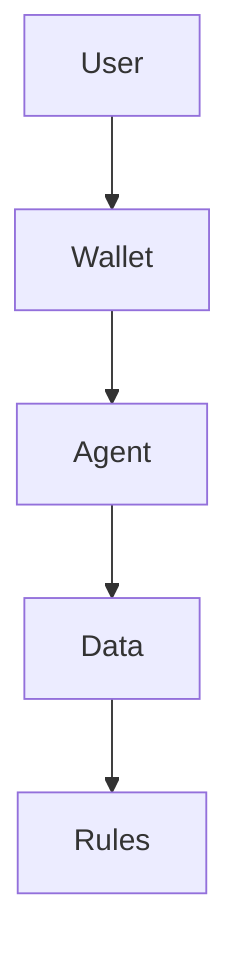
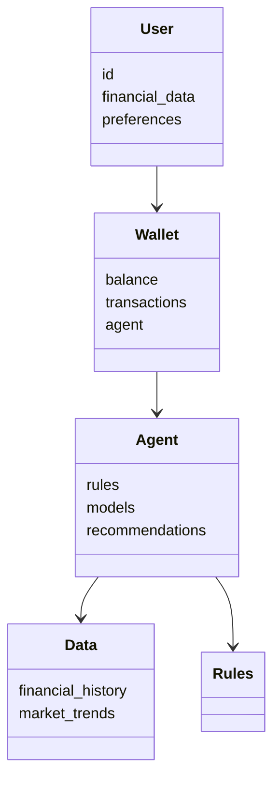
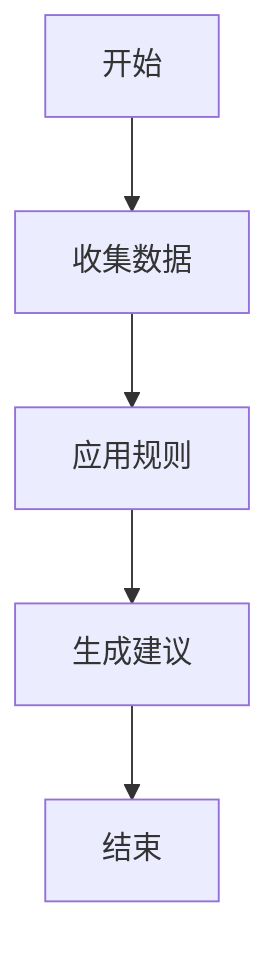
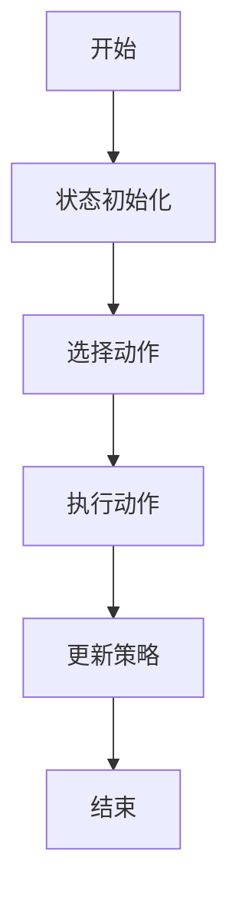
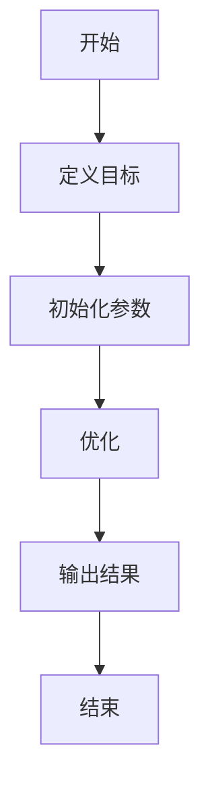
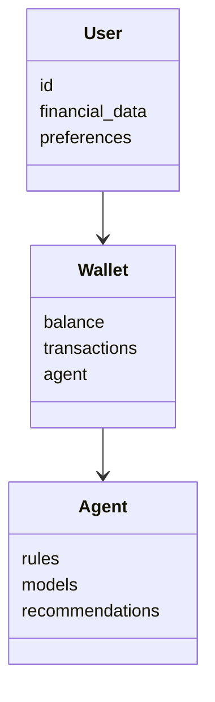
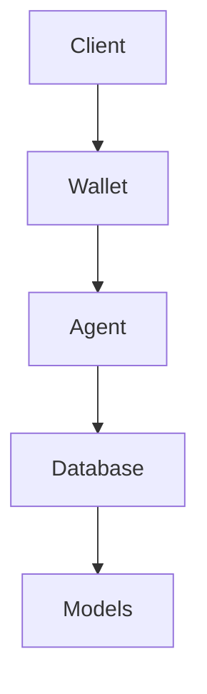
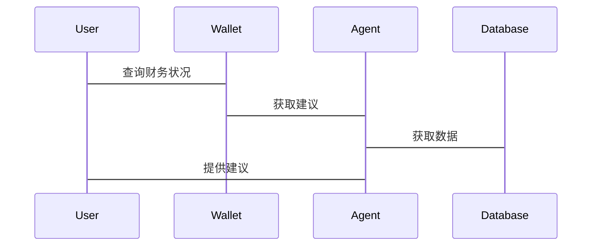

                 


# AI Agent在智能钱包中的个人财务健康顾问

## 关键词：
AI Agent，智能钱包，个人财务健康，金融科技，机器学习，预算管理

## 摘要：
本文探讨AI Agent在智能钱包中的应用，分析其如何作为个人财务健康顾问，帮助用户实现智能化、个性化的财务管理。通过详细的技术分析和实际案例，阐述AI Agent的核心算法、系统架构及项目实现，旨在为读者提供深入的技术洞察和实践指导。

---

## 第1章: 背景介绍

### 1.1 问题背景

#### 1.1.1 个人财务管理的现状与挑战
- 现代社会节奏加快，个人财务管理变得复杂。
- 传统财务管理工具依赖手动操作，效率低下，难以满足多样化需求。
- 金融市场波动大，用户需要实时、智能的决策支持。

#### 1.1.2 AI技术在金融领域的应用趋势
- AI技术在金融领域的广泛应用，如智能投顾、风险管理等。
- 大数据和机器学习技术的进步，为个性化财务管理提供了可能。

#### 1.1.3 智能钱包的概念与发展
- 智能钱包的定义：结合区块链技术，具备智能合约功能的钱包。
- 发展现状：从简单存储工具向多功能平台演进。

### 1.2 问题描述

#### 1.2.1 个人财务健康的核心问题
- 支出不合理、储蓄不足、投资决策失误等。
- 缺乏实时监控和智能建议，难以优化财务状况。

#### 1.2.2 现有财务工具的局限性
- 手动记录繁琐，难以实时更新。
- 缺乏智能化分析，无法提供个性化建议。

#### 1.2.3 用户需求与痛点分析
- 用户需求：实时监控、智能建议、自动化管理。
- 痛点：现有工具无法满足个性化、实时性的需求。

### 1.3 问题解决

#### 1.3.1 AI Agent在财务健康管理中的作用
- 提供实时监控和分析，优化支出和投资。
- 基于用户行为和市场变化，动态调整财务策略。

#### 1.3.2 智能钱包如何实现个人财务健康顾问
- 数据采集与分析：实时获取用户的交易数据，分析消费习惯。
- 智能建议：根据分析结果，提供预算调整和投资建议。

#### 1.3.3 解决方案的可行性分析
- 技术可行性：AI和大数据技术的发展。
- 市场需求：用户对智能化财务管理的强烈需求。

### 1.4 边界与外延

#### 1.4.1 AI Agent的功能边界
- 禁止涉及用户隐私数据的处理。
- 仅限于财务相关的决策支持。

#### 1.4.2 与传统财务工具的区分
- 传统工具依赖人工操作，AI Agent具备智能化决策能力。

#### 1.4.3 未来可能的扩展方向
- 与更多金融平台集成，提供跨平台服务。
- 引入区块链技术，确保数据安全和透明。

### 1.5 核心概念与要素组成

#### 1.5.1 AI Agent的定义与特征
- 定义：具备自主决策能力的智能体。
- 特征：智能性、自主性、适应性。

#### 1.5.2 智能钱包的功能架构
- 数据采集模块：收集用户的交易数据。
- AI决策模块：分析数据并生成建议。
- 用户交互界面：展示建议和操作界面。

#### 1.5.3 财务健康的评估指标
- 支出与收入比例：支出是否超过收入。
- 储蓄率：储蓄占收入的比例。
- 投资回报率：投资的收益情况。

---

## 第2章: 核心概念与联系

### 2.1 AI Agent的核心原理

#### 2.1.1 基于规则的决策机制
- 基于预设规则进行判断，如“月支出不超过收入的70%”。
- 适用于简单场景，如预算超支提醒。

#### 2.1.2 基于机器学习的自适应能力
- 使用机器学习模型分析用户行为，预测消费趋势。
- 通过反馈不断优化建议，提高准确性。

#### 2.1.3 多目标优化算法
- 在多个目标（如最大化收益、最小化风险）之间寻求平衡。
- 使用粒子群优化算法，寻找最优解。

### 2.2 智能钱包的系统架构

#### 2.2.1 数据采集与处理模块
- 数据来源：用户的交易记录、市场数据。
- 处理方式：清洗、分类和存储数据。

#### 2.2.2 AI Agent决策模块
- 数据分析：使用机器学习模型进行预测和分类。
- 生成建议：根据分析结果，制定优化方案。

#### 2.2.3 用户交互界面
- 界面设计：直观展示财务状况和建议。
- 交互方式：用户可以接受或拒绝建议。

### 2.3 实体关系图



### 2.4 领域模型类图



---

## 第3章: 算法原理讲解

### 3.1 基于规则的决策算法

#### 3.1.1 算法流程


#### 3.1.2 Python代码实现
```python
def rule_based_recommendation(transactions):
    rules = [
        ('支出超限', lambda t: max(t['amount']) > 0.7 * sum(t['amount'])),
        # 其他规则
    ]
    recommendations = []
    for rule in rules:
        if rule[1](transactions):
            recommendations.append(rule[0])
    return recommendations
```

### 3.2 强化学习算法

#### 3.2.1 算法流程


#### 3.2.2 Python代码实现
```python
class QLearningAgent:
    def __init__(self, actions):
        self.actions = actions
        self.q = {}

    def choose_action(self, state):
        # 具体实现选择动作的逻辑
        pass

    def learn(self, state, action, reward):
        # 更新Q值
        pass
```

### 3.3 多目标优化算法

#### 3.3.1 算法流程


#### 3.3.2 数学模型和公式
- **目标函数：** $$ \text{max} \sum_{i=1}^{n} w_i x_i $$
- **约束条件：** 
  $$ \sum_{i=1}^{n} x_i \leq C $$
  $$ x_i \geq 0 $$

---

## 第4章: 数学模型和公式

### 4.1 财务健康评分模型

#### 4.1.1 模型定义
$$ \text{健康评分} = w_1 \times \text{支出率} + w_2 \times \text{储蓄率} + w_3 \times \text{投资回报率} $$

#### 4.1.2 示例
$$ \text{健康评分} = 0.4 \times 0.7 + 0.3 \times 0.2 + 0.3 \times 0.15 = 0.35 + 0.06 + 0.045 = 0.455 $$

### 4.2 预算优化模型

#### 4.2.1 模型定义
$$ \text{预算} = \sum_{i=1}^{n} \text{支出}_i \leq \text{收入} $$

#### 4.2.2 示例
$$ \text{总收入} = 5000 $$
$$ \text{支出} = 3000（生活费） + 1000（投资） + 500（娱乐） = 4500 $$

---

## 第5章: 系统分析与架构设计

### 5.1 问题场景介绍
- 用户使用智能钱包进行日常交易，AI Agent实时监控并提供建议。

### 5.2 系统功能设计

#### 5.2.1 领域模型类图


### 5.3 系统架构设计

#### 5.3.1 系统架构图


### 5.4 接口设计

#### 5.4.1 接口定义
- API接口：`POST /api/recommendations`

### 5.5 交互设计

#### 5.5.1 交互流程


---

## 第6章: 项目实战

### 6.1 环境安装

#### 6.1.1 安装Python和相关库
```bash
pip install numpy pandas scikit-learn
```

### 6.2 核心代码实现

#### 6.2.1 数据预处理
```python
import pandas as pd

def preprocess_data(data):
    # 数据清洗和转换
    pass
```

### 6.3 代码解读与分析

#### 6.3.1 AI Agent实现
```python
class AIAgent:
    def __init__(self):
        self.models = {}  # 机器学习模型

    def analyze(self, data):
        # 使用模型进行分析
        pass

    def recommend(self, data):
        # 生成建议
        pass
```

### 6.4 实际案例分析

#### 6.4.1 案例分析
- 用户月收入：10000元
- 月支出：7000元
- 建议：减少娱乐支出，增加储蓄。

### 6.5 项目小结
- 通过实际案例，验证了AI Agent的有效性。

---

## 第7章: 最佳实践

### 7.1 小结
- AI Agent在智能钱包中的应用前景广阔。
- 技术实现需要结合多种算法和系统设计。

### 7.2 注意事项
- 保护用户隐私。
- 确保系统的安全性和稳定性。

### 7.3 拓展阅读
- 推荐阅读《机器学习实战》和《区块链入门》。

---

## 结语
AI Agent在智能钱包中的应用，将彻底改变个人财务管理的方式。通过智能化的决策支持，用户能够更好地管理财务健康，实现财富的稳健增长。

