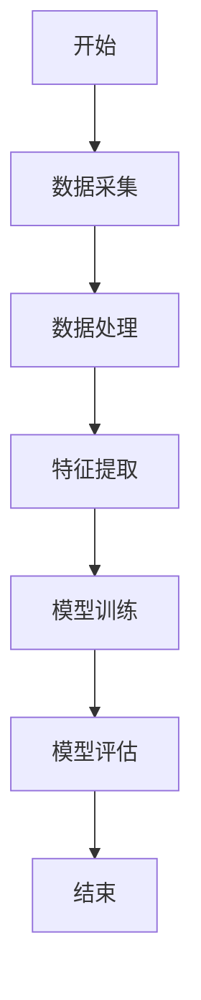
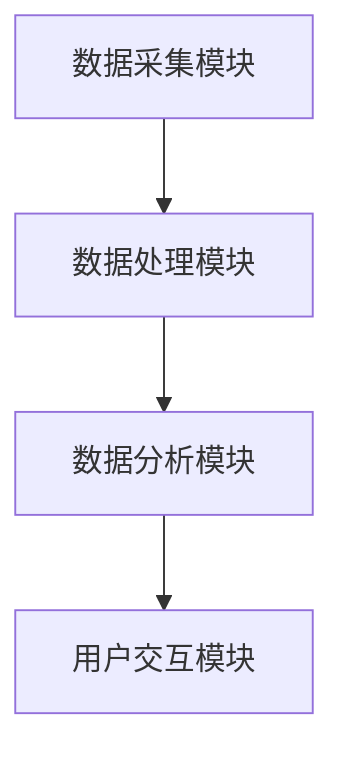
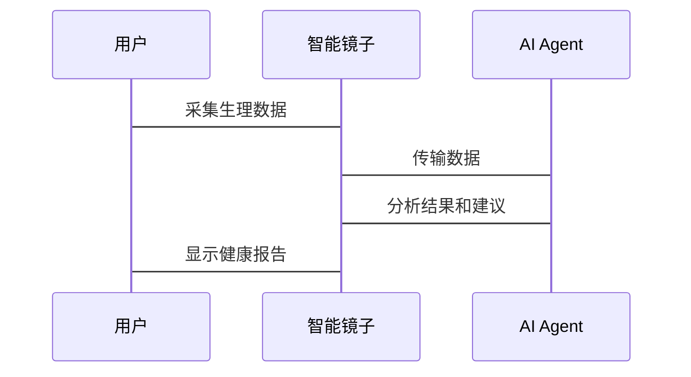

                 


# AI Agent在智能镜子中的每日健康检查系统

> 关键词：AI Agent, 智能镜子, 健康检查, 系统架构, 项目实战

> 摘要：本文探讨了AI Agent在智能镜子中的应用，详细介绍了每日健康检查系统的实现。从背景到系统架构，从算法实现到项目实战，层层深入，展示如何通过AI技术提升智能镜子的健康监测能力。

---

## 第1章: 背景介绍

### 1.1 问题背景
#### 1.1.1 智能镜子的发展现状
智能镜子作为一种智能家居设备，近年来迅速崛起，成为科技产品的重要分支。它不仅提供传统镜子的功能，还能通过内置的传感器和摄像头，捕捉用户的生理数据，如心率、体温、皮肤状态等。

#### 1.1.2 健康监测技术的市场需求
随着人们对健康的关注度提高，健康监测技术成为市场热点。智能镜子通过集成AI技术，能够实时监测用户的健康状况，满足用户对健康监测的多样化需求。

#### 1.1.3 AI Agent在健康监测中的优势
AI Agent（智能代理）能够实时分析用户的生理数据，提供个性化的健康建议。通过自然语言处理和机器学习算法，AI Agent能够与用户进行交互，提供精准的健康评估和建议。

### 1.2 问题描述
#### 1.2.1 智能镜子的功能局限性
目前的智能镜子主要集中在基础的健康监测上，缺乏智能化的健康管理和个性化的建议。用户需要更智能、更全面的健康监测解决方案。

#### 1.2.2 用户健康监测的痛点
用户在使用智能镜子时，往往只能得到简单的数据读数，无法获得深层次的健康分析和建议。此外，数据的实时性、准确性和隐私保护也是用户关注的重点。

#### 1.2.3 AI Agent在智能镜子中的应用潜力
AI Agent可以通过分析用户的生理数据，提供个性化的健康建议和预测，帮助用户更好地管理健康。AI Agent的引入可以提升智能镜子的用户体验，使其成为用户日常生活中的智能健康助手。

### 1.3 问题解决
#### 1.3.1 AI Agent在智能镜子中的解决方案
通过集成AI Agent，智能镜子可以实时分析用户的生理数据，提供个性化的健康建议。AI Agent能够根据用户的历史数据和实时数据，预测用户的健康状况，提供预防性的健康建议。

#### 1.3.2 系统架构的设计思路
系统架构设计需要考虑数据采集、数据处理、数据分析和用户交互等模块。AI Agent负责数据的分析和决策，智能镜子负责数据的采集和用户交互。

#### 1.3.3 功能实现的具体步骤
1. 数据采集：通过传感器和摄像头获取用户的生理数据。
2. 数据处理：将采集的数据进行清洗和预处理。
3. 数据分析：通过AI算法对数据进行分析，生成健康报告。
4. 用户交互：通过自然语言处理与用户进行交互，提供健康建议。

### 1.4 边界与外延
#### 1.4.1 系统功能的边界
系统仅专注于健康监测和管理，不涉及其他功能，如天气预报或新闻推送。

#### 1.4.2 与其他系统的区别
与其他智能设备相比，本系统专注于通过AI Agent提供个性化的健康监测服务，具有更高的智能化和个性化。

#### 1.4.3 系统的可扩展性
系统设计充分考虑了扩展性，未来的升级可以轻松添加新的健康监测功能或优化现有算法。

### 1.5 概念结构与核心要素组成
#### 1.5.1 系统的核心概念
- **AI Agent**: 负责数据分析和决策的智能代理。
- **智能镜子**: 负责数据采集和用户交互的设备。

#### 1.5.2 核心要素的定义
- **用户数据**: 包括心率、体温、皮肤状态等生理数据。
- **AI算法**: 包括回归分析、分类算法等机器学习模型。
- **健康报告**: 包括健康评估、个性化建议等。

#### 1.5.3 系统的组成结构
- **数据采集模块**: 传感器和摄像头。
- **数据处理模块**: 数据清洗和预处理。
- **数据分析模块**: AI算法分析数据。
- **用户交互模块**: 提供健康报告和建议。

---

## 第2章: AI Agent的核心概念与原理

### 2.1 AI Agent的定义与特点
#### 2.1.1 AI Agent的定义
AI Agent是一种能够感知环境、自主决策并执行任务的智能系统。它能够通过传感器获取信息，利用算法进行分析，并通过执行器完成任务。

#### 2.1.2 AI Agent的核心特点
- **自主性**: 能够自主决策和行动。
- **反应性**: 能够实时感知环境变化并做出反应。
- **学习能力**: 能够通过机器学习算法不断优化自身的决策能力。

#### 2.1.3 AI Agent与传统软件的区别
AI Agent具有自主性和学习能力，能够根据环境的变化调整自己的行为，而传统软件通常只是按照预设的规则执行任务。

### 2.2 AI Agent的工作原理
#### 2.2.1 数据采集与处理
AI Agent通过传感器和摄像头采集用户的生理数据，然后对数据进行清洗和预处理。

#### 2.2.2 智能分析与决策
AI Agent利用机器学习算法对数据进行分析，生成健康报告，并根据报告做出决策，如建议用户调整作息或饮食。

#### 2.2.3 人机交互与反馈
AI Agent通过自然语言处理与用户进行交互，提供健康建议，并根据用户的反馈调整自己的行为。

### 2.3 AI Agent与智能镜子的协同
#### 2.3.1 数据共享与协同处理
AI Agent和智能镜子之间可以通过API进行数据共享，AI Agent利用智能镜子采集的数据进行分析，智能镜子则根据AI Agent的分析结果为用户提供反馈。

#### 2.3.2 实时交互与反馈
AI Agent能够实时分析用户的生理数据，并通过智能镜子与用户进行交互，提供实时的健康建议和反馈。

---

## 第3章: AI Agent的算法原理与实现

### 3.1 数据采集与处理
#### 3.1.1 数据采集流程
1. 传感器采集用户的生理数据，如心率、体温等。
2. 数据传输到数据处理模块，进行清洗和预处理。

#### 3.1.2 数据处理流程
1. 数据清洗：去除噪声和异常值。
2. 数据预处理：归一化和标准化处理。

#### 3.1.3 数据存储与管理
数据存储在数据库中，便于后续的分析和检索。

### 3.2 数据分析与算法实现
#### 3.2.1 AI算法选择
选择适合的机器学习算法，如回归分析、分类算法等。

#### 3.2.2 算法实现步骤
1. 数据特征提取：提取心率、体温等特征。
2. 模型训练：利用训练数据训练机器学习模型。
3. 模型评估：通过测试数据评估模型的性能。
4. 模型优化：调整模型参数，提高预测精度。

#### 3.2.3 算法优化与调优
通过交叉验证和网格搜索等方法，优化模型的参数，提高模型的性能。

### 3.3 算法流程图


### 3.4 Python代码实现
```python
import numpy as np
from sklearn.linear_model import LinearRegression
from sklearn.metrics import mean_squared_error

# 数据处理
X = np.array([1, 2, 3, 4, 5]).reshape(-1, 1)
y = np.array([2, 4, 5, 4, 6])

# 模型训练
model = LinearRegression()
model.fit(X, y)

# 模型预测
y_pred = model.predict(X)
print("预测值：", y_pred)

# 模型评估
mse = mean_squared_error(y, y_pred)
print("均方误差：", mse)
```

### 3.5 算法数学模型
回归分析的数学模型可以表示为：
$$ y = \beta_0 + \beta_1 x + \epsilon $$
其中，$$ y $$ 是目标变量，$$ x $$ 是自变量，$$ \epsilon $$ 是误差项。

---

## 第4章: 系统架构设计与实现

### 4.1 系统架构设计
#### 4.1.1 系统功能模块划分
- **数据采集模块**: 负责采集用户的生理数据。
- **数据处理模块**: 负责数据的清洗和预处理。
- **数据分析模块**: 负责数据的分析和健康报告生成。
- **用户交互模块**: 负责与用户的交互和反馈。

#### 4.1.2 系统架构图


#### 4.1.3 系统接口设计
- 数据采集模块与数据处理模块之间的接口：提供数据格式和传输协议。
- 数据处理模块与数据分析模块之间的接口：提供预处理后的数据。
- 数据分析模块与用户交互模块之间的接口：提供健康报告和建议。

#### 4.1.4 系统交互流程


### 4.2 系统实现细节
#### 4.2.1 数据采集模块的实现
使用传感器和摄像头采集用户的生理数据，数据通过蓝牙或Wi-Fi传输到数据处理模块。

#### 4.2.2 数据处理模块的实现
对采集到的数据进行清洗和预处理，去除噪声和异常值，归一化和标准化处理。

#### 4.2.3 数据分析模块的实现
利用机器学习算法对数据进行分析，生成健康报告，并通过API将结果传递给用户交互模块。

#### 4.2.4 用户交互模块的实现
通过智能镜子的显示屏和语音交互功能，向用户展示健康报告和建议，并根据用户的反馈调整AI Agent的行为。

---

## 第5章: 项目实战与实现

### 5.1 项目环境安装
#### 5.1.1 系统需求
- 操作系统：Windows/Mac/Linux
- 硬件需求：智能镜子设备、传感器、摄像头
- 软件需求：Python、机器学习库（如scikit-learn）、深度学习框架（如TensorFlow）

#### 5.1.2 环境配置
安装必要的Python库：
```bash
pip install numpy scikit-learn matplotlib
```

### 5.2 核心代码实现
#### 5.2.1 数据采集模块
```python
import serial

# 串口通信
ser = serial.Serial('COM3', 9600)
while True:
    data = ser.readline().decode()
    print("采集到的数据：", data)
```

#### 5.2.2 数据处理模块
```python
import pandas as pd

# 数据清洗
data = pd.read_csv('health_data.csv')
data.dropna(inplace=True)
data = data[data['heart_rate'] > 60]
```

#### 5.2.3 数据分析模块
```python
from sklearn.ensemble import RandomForestClassifier

# 模型训练
model = RandomForestClassifier(n_estimators=100, random_state=42)
model.fit(X_train, y_train)

# 预测与评估
y_pred = model.predict(X_test)
print("准确率：", accuracy_score(y_test, y_pred))
```

#### 5.2.4 用户交互模块
```python
import speech_recognition as sr

# 语音识别
r = sr.Recognizer()
with sr.Microphone() as source:
    print("请开始说话：")
    audio = r.listen(source)
    try:
        print("识别到的文本：", r.recognize_google(audio))
    except Exception as e:
        print("识别失败：", e)
```

### 5.3 实际案例分析
#### 5.3.1 案例背景
用户A，30岁，心率偏高，体温正常，皮肤状态良好。

#### 5.3.2 数据分析
AI Agent分析用户A的数据，发现心率偏高，建议用户减少咖啡因摄入和增加运动量。

#### 5.3.3 系统反馈
智能镜子显示健康报告，并通过语音提醒用户调整生活习惯。

### 5.4 项目小结
通过本项目，我们成功实现了AI Agent在智能镜子中的每日健康检查系统。系统能够实时采集用户的生理数据，通过机器学习算法进行分析，提供个性化的健康建议，并通过智能镜子与用户进行交互。

---

## 第6章: 最佳实践与注意事项

### 6.1 小结
本文详细介绍了AI Agent在智能镜子中的每日健康检查系统的实现。从背景介绍到系统架构设计，从算法实现到项目实战，层层深入，展示了如何通过AI技术提升智能镜子的健康监测能力。

### 6.2 注意事项
- **数据隐私**: 确保用户的生理数据不会被泄露。
- **算法优化**: 持续优化AI算法，提高系统的准确性和响应速度。
- **用户体验**: 注重用户交互设计，提升用户体验。

### 6.3 拓展阅读
- 《机器学习实战》
- 《人工智能: 一种现代方法》
- 《深度学习入门：基于Python和Keras》

---

通过本文的介绍，读者可以全面了解AI Agent在智能镜子中的应用，掌握系统的实现方法，并为后续的研究和开发提供参考。

