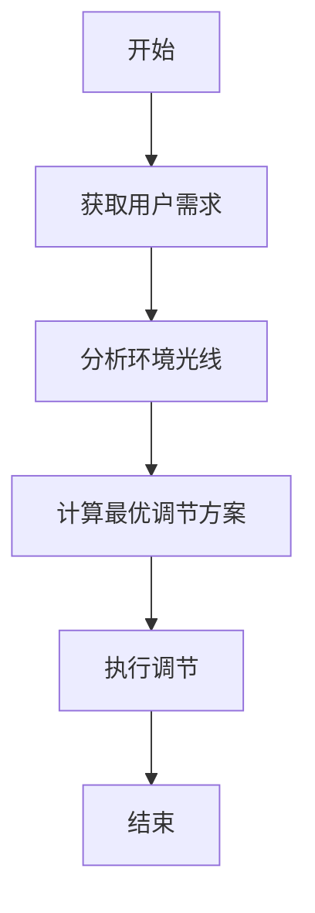
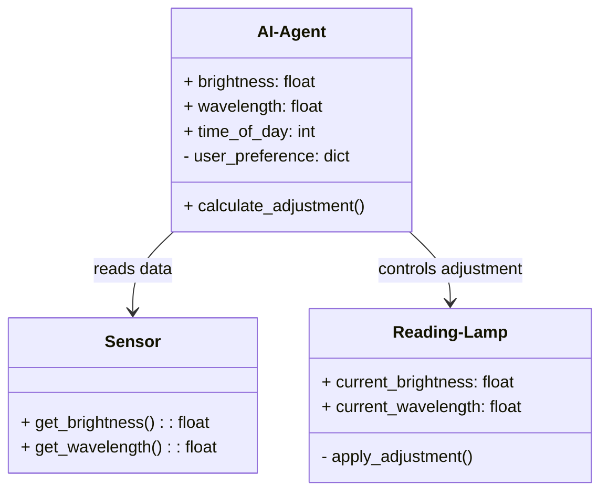
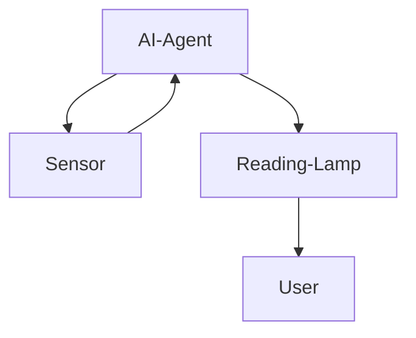
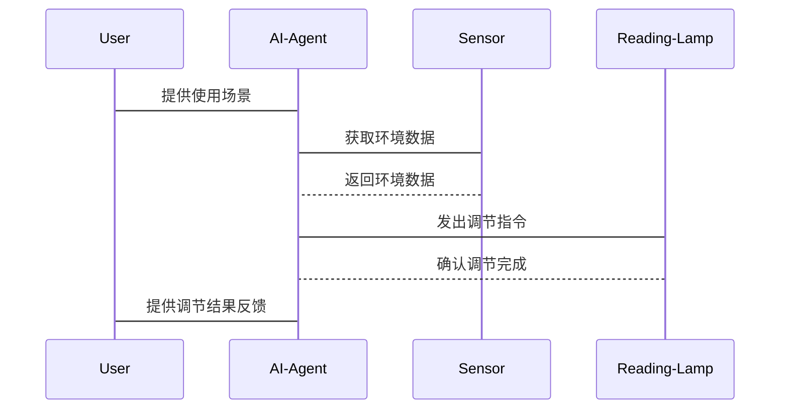

                 


# AI Agent在智能阅读灯中的护眼模式调节

## 关键词：AI Agent，护眼模式，智能阅读灯，光线调节，健康护眼

## 摘要：本文探讨了AI Agent在智能阅读灯护眼模式调节中的应用，通过分析背景、核心概念、算法原理、系统架构及项目实战，展示了如何利用AI技术实现个性化的护眼模式调节，提升用户体验。

---

# 第一章：背景介绍

## 1.1 问题背景

### 1.1.1 阅读灯的使用场景与需求
阅读灯广泛应用于家庭、办公室和学校，特别是在夜间或低光环境下，保护视力尤为重要。用户需求包括舒适的光线、减少蓝光伤害、动态调节亮度等。

### 1.1.2 护眼模式的必要性
长时间使用阅读灯可能导致眼睛疲劳、干涩甚至视力下降。传统阅读灯的光线固定，无法根据环境和用户需求自动调整，护眼效果有限。

### 1.1.3 AI技术在护眼模式中的应用潜力
AI Agent可以通过学习用户习惯和环境数据，智能调整光线参数，提供个性化的护眼模式。

## 1.2 问题描述

### 1.2.1 阅读灯光线调节的痛点
现有阅读灯无法根据用户的具体需求和环境变化自动调整光线参数，导致护眼效果不佳。

### 1.2.2 不同用户群体的护眼需求差异
不同用户对光线的需求不同，如儿童、老人、学生等，需要个性化的调节方案。

### 1.2.3 现有护眼模式的局限性
传统护眼模式缺乏智能化，无法实时适应环境和用户需求。

## 1.3 问题解决

### 1.3.1 AI Agent的核心作用
AI Agent通过实时分析环境数据和用户需求，动态调整阅读灯的光线参数，实现智能化的护眼模式。

### 1.3.2 护眼模式调节的实现路径
通过传感器采集环境数据，结合用户输入，利用AI算法计算出最优调节方案。

### 1.3.3 AI Agent在智能阅读灯中的具体应用
AI Agent控制阅读灯的亮度、色温和频闪，提供个性化的护眼模式。

## 1.4 边界与外延

### 1.4.1 AI Agent的功能边界
AI Agent仅负责护眼模式调节，不处理其他功能如开关控制。

### 1.4.2 护眼模式调节的适用范围
适用于智能阅读灯，不适用于其他设备。

### 1.4.3 与其他功能的交互关系
AI Agent与环境传感器、用户交互界面协同工作。

## 1.5 概念结构与核心要素组成

### 1.5.1 AI Agent的基本组成
- 感知模块：采集环境数据和用户输入。
- 计算模块：运行AI算法，计算调节方案。
- 执行模块：输出调节指令，控制阅读灯。

### 1.5.2 护眼模式调节的核心要素
- 环境光线：亮度、色温、频闪。
- 用户需求：个人偏好、使用场景。
- 调节算法：动态计算最优参数。

### 1.5.3 系统整体架构
- 硬件：环境传感器、阅读灯。
- 软件：AI Agent、调节算法。

---

# 第二章：核心概念与联系

## 2.1 AI Agent的原理

### 2.1.1 AI Agent的基本定义
AI Agent是具备感知、决策和执行能力的智能体，能够根据环境和用户需求自主调节阅读灯的光线参数。

### 2.1.2 AI Agent的核心算法
- 感知：数据采集与特征提取。
- 决策：基于机器学习的模型计算最优参数。
- 执行：输出调节指令。

### 2.1.3 AI Agent与智能硬件的结合
AI Agent通过接口与阅读灯连接，接收传感器数据并发送调节指令。

## 2.2 护眼模式调节的原理

### 2.2.1 光线调节的基本原理
通过调整亮度、色温和频闪，减少蓝光和频闪对眼睛的伤害。

### 2.2.2 蓝光过滤的实现机制
通过调节色温，减少蓝光比例，降低眼睛疲劳。

### 2.2.3 明暗调节的算法模型
基于环境光线和用户需求，动态调整亮度，确保舒适度。

## 2.3 AI Agent与护眼模式调节的关系

### 2.3.1 AI Agent在护眼模式调节中的作用
AI Agent作为控制中心，协调传感器和阅读灯，实现智能调节。

### 2.3.2 护眼模式调节对AI Agent的要求
高精度的环境感知和快速的计算能力。

### 2.3.3 两者结合的实现方式
通过传感器获取数据，AI Agent计算调节方案，执行调节。

## 2.4 核心概念属性特征对比表格

| 核心概念 | 属性 | 特征 |
|----------|------|------|
| AI Agent | 智能性 | 自主学习、决策 |
| 护眼模式调节 | 个性化 | 根据用户需求调整 |

## 2.5 ER实体关系图

```mermaid
er
actor(AI Agent) -[驱动]-> entity(护眼模式调节系统)
```

---

# 第三章：算法原理讲解

## 3.1 算法概述

### 3.1.1 算法的基本思路
根据环境数据和用户需求，动态计算最优调节方案。

### 3.1.2 算法的核心步骤
1. 采集环境数据：亮度、色温、频闪。
2. 获取用户需求：使用场景、个人偏好。
3. 计算调节方案：调整亮度、色温、频闪。
4. 执行调节：控制阅读灯。

### 3.1.3 算法的优化方向
提高计算速度和准确性，降低能耗。

## 3.2 算法流程图



## 3.3 算法实现代码

```python
def adjust_brightness(brightness, user_preference):
    # 根据用户偏好和环境亮度计算目标亮度
    target_brightness = brightness * (1 + user_preference['brightness_boost'] / 100)
    return target_brightness

def reduce_blue_light(wavelength, time_of_day):
    # 根据时间段调整蓝光比例
    blue_weight = (12 - abs(time_of_day - 12)) / 12
    target_wavelength = wavelength + (450 - wavelength) * blue_weight
    return target_wavelength

def main():
    import sensors
    import time

    # 获取环境数据
    brightness = sensors.get_brightness()
    wavelength = sensors.get_wavelength()
    time_of_day = time.datetime().hour

    # 获取用户需求
    user_preference = get_user_preference()

    # 计算调节方案
    target_brightness = adjust_brightness(brightness, user_preference)
    target_wavelength = reduce_blue_light(wavelength, time_of_day)

    # 执行调节
    apply_adjustment(target_brightness, target_wavelength)

if __name__ == "__main__":
    main()
```

## 3.4 算法的数学模型

### 3.4.1 环境光线分析模型
$$
\text{target\_brightness} = \text{current\_brightness} \times (1 + \frac{\text{brightness\_boost}}{100})
$$

### 3.4.2 蓝光过滤模型
$$
\text{blue\_weight} = \frac{12 - |\text{time\_of\_day} - 12|}{12}
$$

### 3.4.3 频闪调节模型
$$
\text{target\_freq} = \text{current\_freq} \times \frac{\text{max\_freq} - \text{current\_freq}}{\text{current\_freq} + 10}
$$

## 3.5 算法的优化与实现细节

### 3.5.1 参数调整
根据用户反馈不断优化算法参数，提高调节效果。

### 3.5.2 传感器数据融合
结合多个传感器的数据，提高环境感知的准确性。

### 3.5.3 算法效率
优化计算步骤，减少处理时间，提升用户体验。

---

# 第四章：数学模型与公式推导

## 4.1 环境光线分析模型

### 4.1.1 模型公式
$$
\text{target\_brightness} = \text{current\_brightness} \times (1 + \frac{\text{brightness\_boost}}{100})
$$

### 4.1.2 公式解释
根据当前亮度和用户偏好中的亮度提升比例，计算目标亮度。

## 4.2 蓝光过滤模型

### 4.2.1 模型公式
$$
\text{blue\_weight} = \frac{12 - |\text{time\_of\_day} - 12|}{12}
$$

### 4.2.2 公式解释
根据时间计算蓝光权重，减少蓝光比例，保护眼睛。

## 4.3 频闪调节模型

### 4.3.1 模型公式
$$
\text{target\_freq} = \text{current\_freq} \times \frac{\text{max\_freq} - \text{current\_freq}}{\text{current\_freq} + 10}
$$

### 4.3.2 公式解释
根据当前频闪和最大频闪，计算目标频闪，减少眼睛疲劳。

---

# 第五章：系统分析与架构设计

## 5.1 问题场景介绍

### 5.1.1 系统目标
实现AI Agent对智能阅读灯的护眼模式调节，提升用户体验。

### 5.1.2 项目介绍
开发一个智能阅读灯系统，集成AI Agent，实现动态护眼调节。

## 5.2 系统功能设计

### 5.2.1 领域模型



### 5.2.2 系统架构设计



## 5.3 系统接口设计

### 5.3.1 系统接口

| 接口名称 | 描述 |
|----------|------|
| get_brightness() | 获取当前亮度 |
| get_wavelength() | 获取当前色温 |
| apply_adjustment(brightness, wavelength) | 应用调节方案 |

## 5.4 系统交互



---

# 第六章：项目实战

## 6.1 环境安装

### 6.1.1 硬件安装
- 安装智能阅读灯。
- 连接传感器模块。

### 6.1.2 软件安装
- 安装Python环境。
- 安装必要的库，如传感器驱动。

## 6.2 系统核心实现源代码

### 6.2.1 传感器数据采集

```python
import sensors

brightness = sensors.get_brightness()
wavelength = sensors.get_wavelength()
```

### 6.2.2 AI Agent算法实现

```python
def calculate_adjustment(brightness, wavelength, user_preference):
    target_brightness = brightness * (1 + user_preference['brightness_boost'] / 100)
    blue_weight = (12 - abs(time_of_day - 12)) / 12
    target_wavelength = wavelength + (450 - wavelength) * blue_weight
    return target_brightness, target_wavelength
```

### 6.2.3 调节执行

```python
def apply_adjustment(target_brightness, target_wavelength):
    lamp.set_brightness(target_brightness)
    lamp.set_wavelength(target_wavelength)
```

## 6.3 代码应用解读与分析

### 6.3.1 代码结构
- 传感器数据采集。
- 算法计算最优调节方案。
- 执行调节指令。

### 6.3.2 代码优化
- 提高算法效率。
- 减少计算延迟。

## 6.4 实际案例分析

### 6.4.1 案例一
- 用户需求：夜间阅读。
- 调节方案：降低亮度，减少蓝光。

### 6.4.2 案例二
- 用户需求：儿童阅读。
- 调节方案：柔和光线，减少频闪。

## 6.5 项目小结

### 6.5.1 项目总结
通过AI Agent实现智能调节，提升了护眼效果和用户体验。

### 6.5.2 经验分享
- 系统设计要简洁高效。
- 算法优化至关重要。

---

# 第七章：最佳实践

## 7.1 注意事项

### 7.1.1 系统稳定性
确保系统稳定运行，避免调节失败。

### 7.1.2 用户隐私
保护用户数据，避免泄露。

## 7.2 小结

### 7.2.1 项目回顾
从背景到实现，系统性地展示了AI Agent在智能阅读灯中的应用。

### 7.2.2 展望未来
未来可以进一步优化算法，扩展功能，提升用户体验。

---

# 结语

通过本文的详细讲解，读者可以全面了解AI Agent在智能阅读灯护眼模式调节中的应用，从理论到实践，为后续研究和开发提供参考。

