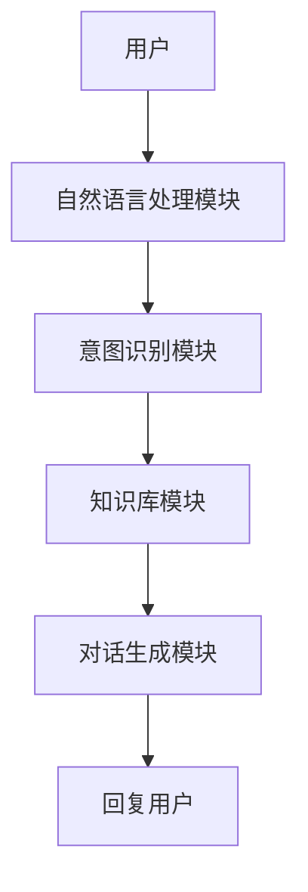
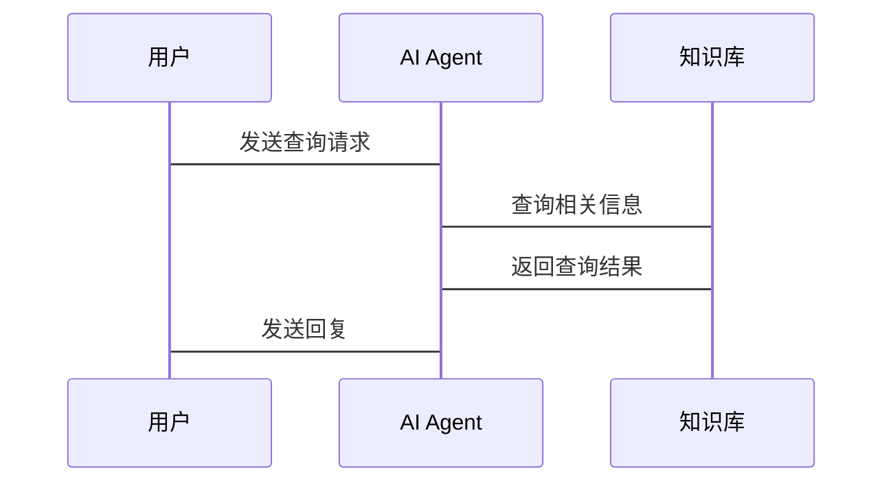

                 


# AI Agent在智能零售中的应用实践

> 关键词：AI Agent, 智能零售, 自然语言处理, 机器学习, 智能营销, 库存管理

> 摘要：随着人工智能技术的迅速发展，AI Agent（人工智能代理）在智能零售中的应用越来越广泛。本文将从AI Agent的基本概念出发，深入探讨其在智能零售中的应用场景、核心技术、算法原理、系统架构以及项目实战。通过实际案例分析和详细的技术解读，本文旨在为读者提供全面的AI Agent在智能零售中的应用实践指南，帮助他们在实际应用中更好地理解和部署相关技术。

---

## 第1章 AI Agent与智能零售概述

### 1.1 AI Agent的基本概念

#### 1.1.1 什么是AI Agent
AI Agent（人工智能代理）是一种能够感知环境并采取行动以实现目标的智能系统。它可以理解用户的需求，执行任务，并与用户进行交互。在智能零售中，AI Agent通常以虚拟助手或聊天机器人的形式出现，帮助用户完成购物、咨询、推荐等任务。

#### 1.1.2 AI Agent的核心特点
- **自主性**：AI Agent能够在没有人工干预的情况下自主运行。
- **反应性**：能够实时感知环境变化并做出响应。
- **目标导向**：通过设定目标来驱动行动。
- **学习能力**：能够通过数据和经验不断优化自身的性能。

#### 1.1.3 AI Agent在零售中的应用价值
AI Agent在零售中的应用价值主要体现在以下几个方面：
1. **提升客户体验**：通过智能交互提供个性化的购物体验。
2. **提高运营效率**：自动化处理订单、库存管理等任务。
3. **降低成本**：减少对人工客服的依赖，降低运营成本。
4. **增强营销效果**：通过精准推荐和智能营销提升销售额。

### 1.2 智能零售的背景与现状

#### 1.2.1 智能零售的定义与特点
智能零售是指利用人工智能、大数据、物联网等技术，通过智能化的系统和设备，实现零售过程的自动化、个性化和高效化。其特点是：
- **数据驱动**：依赖于大数据分析来优化运营。
- **智能化交互**：通过AI技术实现与消费者的智能互动。
- **个性化服务**：根据消费者的行为和偏好提供定制化服务。

#### 1.2.2 智能零售的发展历程
智能零售的发展可以分为以下几个阶段：
1. **传统零售**：以实体店铺为主，缺乏技术支撑。
2. **电子零售**：互联网技术的应用，实现了在线购物。
3. **数据驱动零售**：大数据技术的应用，推动了精准营销。
4. **智能零售**：人工智能技术的应用，实现了智能化的购物体验。

#### 1.2.3 当前智能零售的主要技术与趋势
当前智能零售的主要技术包括：
- **人工智能**：用于智能交互、推荐系统等。
- **大数据分析**：用于消费者行为分析、市场趋势预测。
- **物联网**：用于智能库存管理、智能设备集成。
- **区块链**：用于供应链管理和支付安全。

### 1.3 AI Agent在智能零售中的应用场景

#### 1.3.1 客户服务与交互
AI Agent可以作为虚拟客服，通过自然语言处理技术与用户进行对话，解答用户的疑问，提供购物建议。

#### 1.3.2 个性化推荐系统
AI Agent可以根据用户的历史行为和偏好，推荐相关的商品，提升用户的购买意愿。

#### 1.3.3 库存管理与供应链优化
AI Agent可以通过分析销售数据和预测需求，优化库存管理和供应链流程，减少库存积压和缺货现象。

#### 1.3.4 智能营销与精准广告
AI Agent可以根据用户的行为和偏好，制定精准的营销策略，推送个性化的广告内容，提升营销效果。

---

## 第2章 AI Agent的核心技术

### 2.1 自然语言处理（NLP）

#### 2.1.1 NLP的基本概念
自然语言处理（NLP）是人工智能的一个重要分支，致力于让计算机能够理解和处理人类语言。NLP在智能零售中的应用主要体现在智能客服、语音交互等方面。

#### 2.1.2 常见的NLP技术与工具
- **分词**：将文本分割成词语或短语。
- **实体识别**：识别文本中的实体，如人名、地名、组织名等。
- **情感分析**：分析文本中表达的情感倾向。
- **意图识别**：识别用户的意图，如“我想买一双运动鞋”。

#### 2.1.3 NLP在零售中的应用案例
例如，某电商平台使用NLP技术分析用户的聊天记录，识别用户的需求，并推荐相关商品。

### 2.2 机器学习与深度学习

#### 2.2.1 机器学习的基本原理
机器学习是一种通过数据训练模型，使其能够从数据中学习规律，并用于预测或分类的技术。在智能零售中，机器学习可以用于推荐系统、用户画像构建等。

#### 2.2.2 深度学习的核心技术
深度学习是一种基于人工神经网络的机器学习技术，能够处理复杂的非结构化数据，如图像、语音和文本。

#### 2.2.3 机器学习在零售中的应用
例如，某零售企业使用机器学习模型预测销售趋势，优化库存管理。

### 2.3 知识图谱与语义理解

#### 2.3.1 知识图谱的定义与构建
知识图谱是一种结构化的数据表示方式，用于描述实体之间的关系。在智能零售中，知识图谱可以用于构建商品知识库，帮助AI Agent更好地理解商品信息。

#### 2.3.2 语义理解的核心技术
语义理解是指计算机能够理解文本的含义，而不仅仅是表面的文字。基于知识图谱的语义理解可以提高AI Agent的理解能力。

#### 2.3.3 知识图谱在零售中的应用
例如，某电商平台使用知识图谱构建商品知识库，帮助AI Agent回答用户关于商品的详细问题。

### 2.4 本章小结

---

## 第3章 AI Agent的算法原理与实现

### 3.1 意图识别算法

#### 3.1.1 意图识别的基本原理
意图识别是指通过分析用户的输入，确定用户的意图。常见的意图识别方法包括基于规则的方法和基于机器学习的方法。

#### 3.1.2 基于机器学习的意图识别
- **数据准备**：收集和标注意图数据。
- **模型训练**：使用机器学习算法训练意图识别模型。
- **模型评估**：评估模型的准确性和性能。

#### 3.1.3 基于深度学习的意图识别
基于深度学习的意图识别通常使用循环神经网络（RNN）或变换器（Transformer）模型。

### 3.2 对话生成算法

#### 3.2.1 对话生成的基本原理
对话生成是指AI Agent能够生成符合上下文的回复。对话生成算法主要包括生成式和基于规则的方法。

#### 3.2.2 基于规则的对话生成
基于规则的对话生成方法是通过预定义的规则和模板生成回复。

#### 3.2.3 基于生成模型的对话生成
基于生成模型的对话生成方法使用深度学习模型（如GPT）生成回复。

### 3.3 知识推理算法

#### 3.3.1 知识推理的基本原理
知识推理是指通过知识图谱中的实体关系进行推理，得出新的事实或结论。

#### 3.3.2 基于符号逻辑的知识推理
基于符号逻辑的知识推理方法使用逻辑规则进行推理。

#### 3.3.3 基于概率模型的知识推理
基于概率模型的知识推理方法使用概率论进行推理，如马尔可夫逻辑网络。

---

## 第4章 AI Agent的系统架构设计

### 4.1 系统架构概述

#### 4.1.1 系统功能模块
AI Agent的系统架构通常包括以下几个模块：
- **自然语言处理模块**：负责文本的处理和分析。
- **知识库模块**：存储商品信息、用户信息等。
- **意图识别模块**：识别用户的意图。
- **对话生成模块**：生成回复。

#### 4.1.2 系统架构图


### 4.2 系统接口设计

#### 4.2.1 接口描述
系统接口通常包括以下几种：
- **用户输入接口**：接收用户的输入。
- **知识库查询接口**：查询知识库中的信息。
- **对话生成接口**：生成回复。

#### 4.2.2 接口交互流程


---

## 第5章 项目实战

### 5.1 项目介绍

#### 5.1.1 项目背景
本项目旨在开发一个基于AI Agent的智能客服系统，用于某电商平台的客户服务。

#### 5.1.2 项目目标
- 实现智能客服的功能，能够回答用户的问题，推荐商品。
- 提高客户满意度和用户体验。

### 5.2 核心代码实现

#### 5.2.1 环境搭建
- 安装Python和相关库（如TensorFlow、Keras）。

#### 5.2.2 意图识别模型的实现
```python
import numpy as np
from sklearn.feature_extraction.text import TfidfVectorizer
from sklearn.linear_model import LogisticRegression

# 数据准备
train_texts = [...]  # 训练文本
train_labels = [...]  # 标签

# 特征提取
vectorizer = TfidfVectorizer()
X = vectorizer.fit_transform(train_texts)

# 模型训练
model = LogisticRegression()
model.fit(X, train_labels)

# 模型预测
test_text = "我想买一双运动鞋"
X_test = vectorizer.transform([test_text])
predicted_label = model.predict(X_test)
```

#### 5.2.3 对话生成模块的实现
```python
import tensorflow as tf
from tensorflow.keras.models import Model
from tensorflow.keras.layers import Input, Dense, LSTM, Dropout, Bidirectional

# 定义模型
input_layer = Input(shape=(max_length,))
embedding_layer = Embedding(input_dim=vocabulary_size, output_dim=embedding_dim)(input_layer)
bidirectional_layer = Bidirectional(LSTM(units=hidden_units, return_sequences=True))(embedding_layer)
dropout_layer = Dropout(rate=0.5)(bidirectional_layer)
dense_layer = Dense(units=output_dim, activation='softmax')(dropout_layer)
model = Model(inputs=input_layer, outputs=dense_layer)
```

### 5.3 案例分析与实际应用

#### 5.3.1 案例分析
以某电商平台为例，分析AI Agent在智能客服中的应用效果。

#### 5.3.2 项目总结
通过本项目，我们可以看到AI Agent在智能零售中的巨大潜力。然而，实际应用中还需要解决一些问题，如数据隐私、模型优化等。

---

## 第6章 最佳实践与未来展望

### 6.1 最佳实践

#### 6.1.1 数据质量管理
确保数据的准确性和完整性，是AI Agent发挥效果的基础。

#### 6.1.2 模型优化
通过不断优化模型，提高AI Agent的准确性和响应速度。

#### 6.1.3 安全与隐私保护
在数据处理和模型训练中，必须重视数据安全和隐私保护。

### 6.2 未来展望

#### 6.2.1 技术发展趋势
随着人工智能技术的不断发展，AI Agent在智能零售中的应用将更加广泛和深入。

#### 6.2.2 应用场景扩展
未来的智能零售将更加注重用户体验，AI Agent将在更多场景中发挥作用，如智能试衣、智能导购等。

---

## 结语

AI Agent在智能零售中的应用前景广阔，随着技术的不断进步，AI Agent将为零售行业带来更大的变革。通过本文的介绍，希望能够为读者提供一些启发和参考，帮助他们在实际应用中更好地利用AI Agent技术，推动智能零售的发展。

--- 

**附录**  
- 附录A：术语表  
- 附录B：工具与资源

