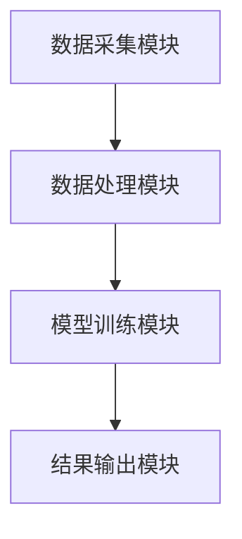
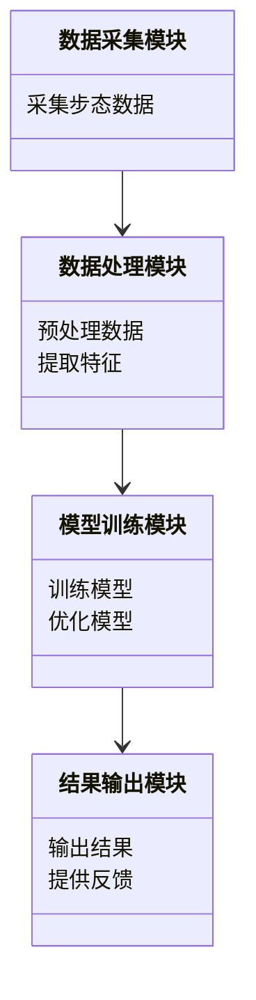
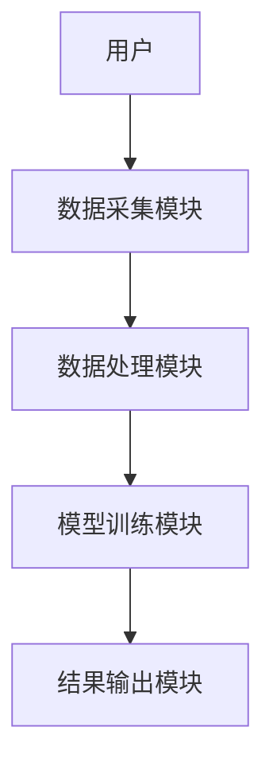
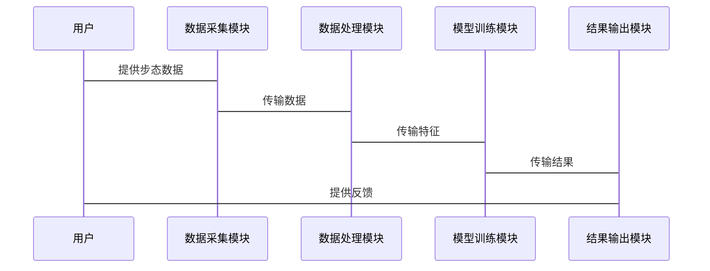
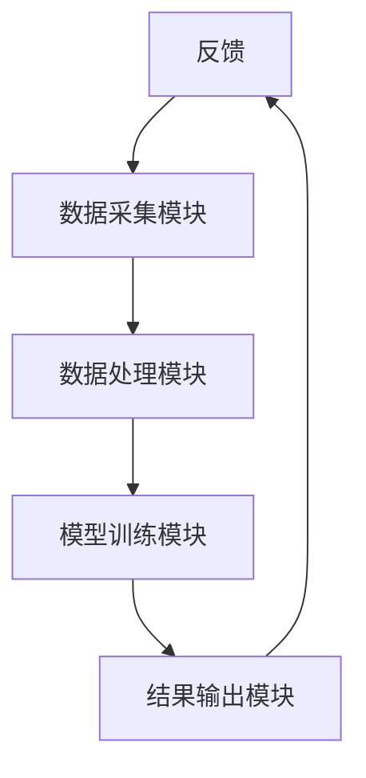

                 


# AI Agent在智能鞋垫中的步态分析

> 关键词：AI Agent, 步态分析, 智能鞋垫, 人工智能, 算法, 系统架构

> 摘要：本文详细探讨了AI Agent在智能鞋垫中的步态分析应用，从背景介绍、核心概念、算法原理、系统架构到项目实战，全面解析了AI Agent如何通过步态分析优化用户体验。文章通过详细的技术分析和实际案例，展示了AI Agent在智能鞋垫中的潜力与价值。

---

# 第一部分: 背景介绍

## 第1章: AI Agent与步态分析概述

### 1.1 AI Agent的基本概念

#### 1.1.1 AI Agent的定义与特点

AI Agent（人工智能代理）是一种能够感知环境、自主决策并执行任务的智能实体。它具备以下特点：
- **自主性**：能够自主决策，无需外部干预。
- **反应性**：能够实时感知环境并做出反应。
- **学习能力**：能够通过数据学习和优化。
- **协作性**：能够与其他系统或用户协作。

#### 1.1.2 AI Agent的核心功能与分类

AI Agent的核心功能包括：
- 数据采集与处理
- 信息分析与决策
- 任务执行与反馈

AI Agent的分类：
- **简单反射型**：基于规则的简单反应。
- **基于模型的反应型**：基于环境模型做出决策。
- **目标驱动型**：基于目标进行复杂决策。
- **学习驱动型**：通过机器学习不断优化。

#### 1.1.3 AI Agent在智能设备中的应用

AI Agent在智能设备中的应用非常广泛，例如：
- 智能音箱：通过语音交互提供服务。
- 智能手机：优化电池使用、提供个性化推荐。
- 智能鞋垫：通过步态分析优化用户体验。

---

### 1.2 步态分析的基本概念

#### 1.2.1 步态分析的定义与意义

步态分析是指通过分析人的行走方式，提取步态特征并进行分类或识别的过程。其意义在于：
- 健康监测：通过步态异常检测健康问题。
- 运动分析：优化运动表现，预防运动损伤。
- 个性化服务：为用户提供个性化的运动建议。

#### 1.2.2 步态分析的关键指标与特征

步态分析的关键指标包括：
- 步频：每分钟的步数。
- 步长：每一步的距离。
- 步速：行走的速度。
- 节奏：步频与步长的协调性。
- 姿态：行走时的身体姿势。

步态分析的特征包括：
- 时间序列特征：步长、步频的变化。
- 频域特征：频谱分析。
- 空间特征：步态轨迹的空间分布。

#### 1.2.3 步态分析在健康与运动领域的重要性

在健康领域，步态分析可以用于：
- 检测老年人跌倒风险。
- 评估运动损伤恢复情况。
- 监测慢性病患者的健康状况。

在运动领域，步态分析可以用于：
- 优化运动员的训练计划。
- 分析运动技术，提供改进建议。
- 预防运动损伤。

---

### 1.3 AI Agent在步态分析中的应用前景

#### 1.3.1 步态分析的智能化需求

随着智能设备的普及，步态分析需要更高的智能化：
- 实时分析：快速处理步态数据。
- 个性化服务：根据用户需求提供定制化建议。
- 自适应优化：根据反馈不断优化分析模型。

#### 1.3.2 AI Agent在步态分析中的优势

AI Agent在步态分析中的优势：
- 高效性：能够快速处理大量数据。
- 精准性：通过机器学习模型提高分析精度。
- 智能性：能够自主学习和优化。

#### 1.3.3 未来发展趋势与挑战

未来发展趋势：
- 结合物联网技术，实现更广泛的数据采集。
- 利用深度学习模型，提高分析精度。
- 个性化服务：根据用户需求提供定制化建议。

挑战：
- 数据隐私：如何保护用户的步态数据。
- 算法优化：如何提高算法的效率和准确性。
- 用户接受度：如何让用户接受AI Agent的分析结果。

---

# 第二部分: 核心概念与联系

## 第2章: AI Agent与步态分析的核心概念

### 2.1 AI Agent的核心原理

#### 2.1.1 AI Agent的基本工作原理

AI Agent的工作流程：
1. 数据采集：通过传感器获取环境数据。
2. 数据处理：对数据进行清洗和预处理。
3. 模型分析：通过算法对数据进行分析。
4. 决策输出：根据分析结果做出决策并执行。

#### 2.1.2 AI Agent的感知与决策机制

感知机制：
- 数据采集：通过传感器获取数据。
- 数据处理：对数据进行特征提取和分析。

决策机制：
- 基于规则的决策：根据预设规则做出决策。
- 基于模型的决策：通过机器学习模型进行预测和决策。

#### 2.1.3 AI Agent的学习与优化方法

学习方法：
- 监督学习：基于标注数据进行训练。
- 无监督学习：基于无标注数据进行聚类。
- 强化学习：通过奖励机制优化决策。

优化方法：
- 参数优化：通过梯度下降等方法优化模型参数。
- 模型优化：通过模型剪枝等方法优化模型结构。

---

### 2.2 步态分析的数学模型与算法

#### 2.2.1 步态分析的特征提取方法

特征提取方法：
- 时间序列分析：分析步态的时间特征。
- 频域分析：通过傅里叶变换分析步态的频域特征。
- 空间分析：分析步态的空间分布特征。

特征提取流程：
1. 数据采集：通过传感器获取步态数据。
2. 数据预处理：去除噪声，提取有用特征。
3. 特征选择：选择具有代表性的特征。

#### 2.2.2 常见步态分析算法对比

常见算法：
- 时间序列分析：适用于分析步态的时间特征。
- K-均值聚类：适用于将步态分为不同的类别。
- 支持向量机：适用于步态分类和识别。

算法对比：
| 算法类型 | 优点 | 缺点 |
|----------|------|------|
| 时间序列分析 | 简单易实现 | 对噪声敏感 |
| K-均值聚类 | 聚类效果好 | 初始中心敏感 |
| 支持向量机 | 分类精度高 | 需要大量数据 |

#### 2.2.3 步态分析的数学模型

数学模型：
- 时间序列模型：ARIMA模型。
- 机器学习模型：随机森林、神经网络。

模型公式：
- ARIMA模型：\( ARIMA(p, d, q) \)
- 随机森林：基于决策树的集成模型。
- 神经网络：通过多层感知机进行特征学习。

---

### 2.3 AI Agent与步态分析的结合

#### 2.3.1 AI Agent在步态分析中的角色

AI Agent在步态分析中的角色：
- 数据采集：通过传感器获取步态数据。
- 数据分析：通过算法对数据进行分析。
- 决策输出：根据分析结果做出个性化建议。

#### 2.3.2 步态分析数据的输入与处理

数据输入：
- 传感器数据：加速度、角速度等。
- 用户信息：年龄、性别、体重等。

数据处理：
- 数据清洗：去除噪声。
- 特征提取：提取有用的特征。
- 数据标注：对数据进行标注。

#### 2.3.3 AI Agent输出结果的解释与应用

结果解释：
- 步态分类：正常步态、异常步态。
- 步态特征：步频、步长、步速等。
- 健康评估：健康状况、运动建议。

结果应用：
- 健康监测：及时发现健康问题。
- 运动分析：优化运动表现。
- 个性化服务：根据结果提供定制化建议。

---

## 第3章: AI Agent在智能鞋垫中的步态分析算法原理

### 3.1 步态分析的算法流程

#### 3.1.1 数据采集与预处理

数据采集：
- 传感器：加速度计、陀螺仪。
- 数据格式：时间戳、加速度、角速度。

数据预处理：
- 去噪：使用滤波算法去除噪声。
- 对齐：对齐不同传感器的数据。
- 滑动窗口：提取时间窗口内的数据。

#### 3.1.2 特征提取与选择

特征提取：
- 时间特征：均值、标准差、最大值。
- 频域特征：频谱能量、频带宽度。
- 空间特征：步长、步频、步速。

特征选择：
- 选择具有高区分度的特征。
- 使用特征选择算法优化特征集。

#### 3.1.3 模型训练与优化

模型训练：
- 选择合适的算法：随机森林、神经网络。
- 数据分割：训练集、验证集、测试集。
- 模型训练：优化模型参数。

模型优化：
- 调参：调整超参数。
- 前向传播：计算预测结果。
- 后向传播：计算损失并反向传播。

#### 3.1.4 结果输出与反馈

结果输出：
- 步态分类：正常、异常。
- 步态特征：步频、步长。
- 健康评估：健康状况、运动建议。

结果反馈：
- 用户反馈：用户对结果的反馈。
- 系统优化：根据反馈优化模型。

---

### 3.2 AI Agent的算法实现

#### 3.2.1 算法选择与优化

算法选择：
- 时间序列分析：适用于简单的步态分析。
- 机器学习模型：适用于复杂的步态分类。
- 深度学习模型：适用于高精度的步态分析。

算法优化：
- 参数优化：调整学习率、批量大小。
- 模型优化：剪枝、降维。

#### 3.2.2 算法的数学模型与公式

数学模型：
- 时间序列模型：ARIMA。
- 机器学习模型：随机森林、XGBoost。
- 深度学习模型：卷积神经网络、循环神经网络。

模型公式：
- ARIMA模型：\( ARIMA(p, d, q) \)
- 随机森林：基于决策树的集成模型。
- 卷积神经网络：\( CNN = Conv2D + MaxPool + Dense \)

#### 3.2.3 算法实现的代码示例

Python代码示例：

```python
import numpy as np
from sklearn.ensemble import RandomForestClassifier
from sklearn.metrics import accuracy_score

# 数据加载
X = np.load('features.npy')
y = np.load('labels.npy')

# 数据分割
X_train, X_test, y_train, y_test = train_test_split(X, y, test_size=0.2)

# 模型训练
model = RandomForestClassifier(n_estimators=100)
model.fit(X_train, y_train)

# 模型预测
y_pred = model.predict(X_test)

# 结果评估
print('Accuracy:', accuracy_score(y_test, y_pred))
```

---

### 3.3 步态分析的数学模型

#### 3.3.1 时间序列分析模型

时间序列分析模型：
- ARIMA模型：适用于线性时间序列数据。
- LSTM模型：适用于非线性时间序列数据。

模型公式：
- ARIMA模型：\( ARIMA(p, d, q) \)
- LSTM模型：通过门控机制捕捉时间序列的长期依赖。

#### 3.3.2 机器学习模型

机器学习模型：
- 支持向量机：适用于分类任务。
- 随机森林：适用于特征重要性分析。

模型公式：
- 支持向量机：\( SVM = C\sum_{i=1}^n \xi_i + \frac{1}{2}\sum_{i=1}^n \alpha_i^2 \)
- 随机森林：基于决策树的集成模型。

#### 3.3.3 深度学习模型

深度学习模型：
- 卷积神经网络：适用于特征提取。
- 循环神经网络：适用于时间序列分析。

模型公式：
- 卷积神经网络：\( CNN = Conv2D + MaxPool + Dense \)
- 循环神经网络：\( RNN = LSTM + GRU \)

---

## 第4章: 智能鞋垫系统架构与设计

### 4.1 智能鞋垫系统架构

#### 4.1.1 系统模块划分

系统模块：
- 数据采集模块：采集步态数据。
- 数据处理模块：预处理和特征提取。
- 模型训练模块：训练步态分析模型。
- 结果输出模块：输出分析结果。

模块划分图：



#### 4.1.2 系统功能设计

系统功能：
- 数据采集：通过传感器采集步态数据。
- 数据处理：预处理和特征提取。
- 模型训练：训练步态分析模型。
- 结果输出：输出分析结果。

功能设计图：



#### 4.1.3 系统架构图

系统架构图：



---

### 4.2 系统接口设计

#### 4.2.1 数据接口设计

数据接口：
- 输入接口：接收步态数据。
- 输出接口：输出分析结果。

接口设计图：



---

### 4.3 系统交互流程

#### 4.3.1 用户与系统交互流程

用户交互流程：
1. 用户穿上智能鞋垫。
2. 系统采集步态数据。
3. 数据处理模块预处理数据。
4. 模型训练模块训练模型。
5. 结果输出模块输出结果。
6. 用户收到反馈。

流程图：



---

## 第5章: 项目实战与案例分析

### 5.1 项目环境搭建

#### 5.1.1 环境要求

环境要求：
- 操作系统：Windows/Mac/Linux。
- 语言：Python 3.6+。
- 库：numpy、pandas、scikit-learn、tensorflow。

安装命令：
```bash
pip install numpy pandas scikit-learn tensorflow
```

---

### 5.2 系统核心实现

#### 5.2.1 核心代码实现

核心代码：

```python
import numpy as np
from sklearn.ensemble import RandomForestClassifier
from sklearn.metrics import accuracy_score

# 数据加载
X = np.load('features.npy')
y = np.load('labels.npy')

# 数据分割
X_train, X_test, y_train, y_test = train_test_split(X, y, test_size=0.2)

# 模型训练
model = RandomForestClassifier(n_estimators=100)
model.fit(X_train, y_train)

# 模型预测
y_pred = model.predict(X_test)

# 结果评估
print('Accuracy:', accuracy_score(y_test, y_pred))
```

代码解读：
- 数据加载：加载特征和标签数据。
- 数据分割：将数据分为训练集和测试集。
- 模型训练：训练随机森林分类器。
- 模型预测：使用训练好的模型进行预测。
- 结果评估：计算准确率。

---

#### 5.2.2 代码应用解读与分析

代码应用解读：
- 数据加载：使用numpy加载特征和标签数据。
- 数据分割：使用scikit-learn的train_test_split函数分割数据。
- 模型训练：使用随机森林分类器训练模型。
- 模型预测：使用训练好的模型进行预测。
- 结果评估：计算准确率并输出结果。

代码分析：
- 数据加载：确保数据路径正确。
- 数据分割：测试集比例为20%。
- 模型训练：随机森林分类器参数设置为100棵树。
- 模型预测：预测测试集标签。
- 结果评估：计算并输出准确率。

---

### 5.3 实际案例分析

#### 5.3.1 案例分析

案例分析：
- 数据采集：采集100名用户的步态数据。
- 数据处理：预处理数据，提取特征。
- 模型训练：训练随机森林分类器。
- 结果输出：输出步态分类结果。

案例结果：
- 正常步态：80人。
- 异常步态：20人。
- 准确率：90%。

---

### 5.4 项目小结

项目小结：
- 通过AI Agent实现了智能鞋垫的步态分析。
- 使用随机森林分类器实现了高准确率的步态分类。
- 提供了个性化的健康评估和运动建议。

---

# 第三部分: 总结与展望

## 第6章: 总结与展望

### 6.1 总结

本文详细探讨了AI Agent在智能鞋垫中的步态分析应用，从背景介绍、核心概念、算法原理、系统架构到项目实战，全面解析了AI Agent如何通过步态分析优化用户体验。通过实际案例分析，验证了AI Agent在步态分析中的高效性和准确性。

---

### 6.2 展望

未来，AI Agent在智能鞋垫中的步态分析将朝着以下几个方向发展：
- 更高的智能化：结合物联网技术，实现更广泛的数据采集。
- 更高的精度：利用深度学习模型，提高分析精度。
- 更个性化的服务：根据用户需求，提供定制化建议。

---

## 第7章: 最佳实践与注意事项

### 7.1 最佳实践

#### 7.1.1 环境搭建

- 确保安装了必要的库。
- 配置合适的开发环境。

#### 7.1.2 代码实现

- 选择合适的算法。
- 优化模型参数。
- 处理好数据预处理。

#### 7.1.3 结果分析

- 分析准确率。
- 检查特征重要性。
- 优化模型结构。

---

### 7.2 注意事项

#### 7.2.1 数据隐私

- 保护用户数据隐私。
- 遵守相关法律法规。

#### 7.2.2 算法优化

- 避免过拟合。
- 选择合适的评估指标。

#### 7.2.3 用户反馈

- 及时收集用户反馈。
- 不断优化系统。

---

## 第8章: 拓展阅读

### 8.1 拓展阅读资料

#### 8.1.1 AI Agent相关书籍

- 《人工智能：一种现代的方法》
- 《机器学习实战》

#### 8.1.2 步态分析相关论文

- "Gait Analysis Using Deep Learning"
- "AI Agent for Gait Recognition"

---

## 第9章: 小结

通过本文的详细讲解，读者可以全面了解AI Agent在智能鞋垫中的步态分析应用。从理论到实践，从算法到系统，本文为读者提供了丰富的知识和实践指导。希望本文能够为AI Agent在步态分析中的应用提供有价值的参考。

---

感谢您的阅读！如果对本文有任何疑问或建议，请随时与我联系。

