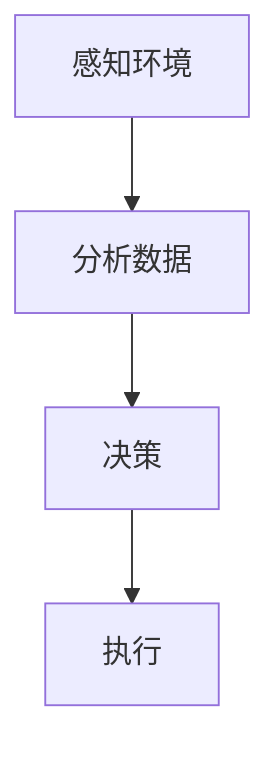
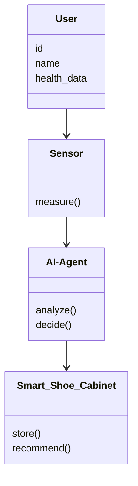
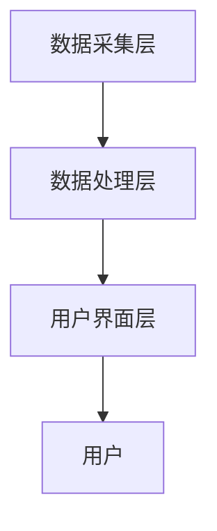
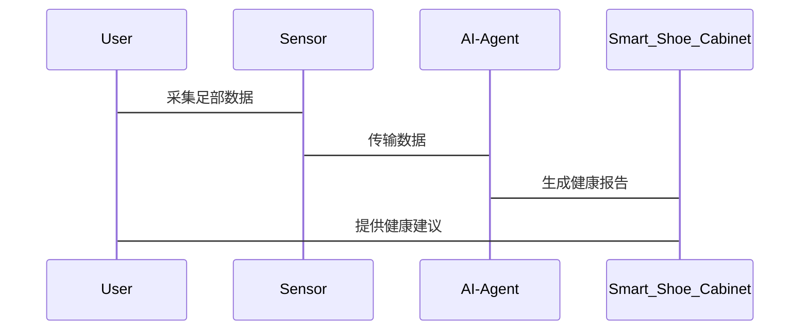

                 


# AI Agent在智能鞋柜中的足部健康管理系统

> **关键词**: AI Agent, 智能鞋柜, 足部健康, 健康管理系统, 人工智能, 物联网

> **摘要**: 本文深入探讨了AI Agent在智能鞋柜中的足部健康管理系统中的应用。通过分析足部健康的重要性，结合智能鞋柜的发展趋势，详细讲解了AI Agent的核心原理、算法实现、系统架构设计以及实际应用案例。文章从背景介绍、核心概念、算法原理、系统分析与设计、项目实战到最佳实践，全面覆盖了该系统的各个方面，为读者提供了一个系统化、理论化且实践性强的解决方案。

---

# 第一部分: 背景介绍

## 第1章: 问题背景

### 1.1 足部健康的重要性
足部健康是人体健康的重要组成部分，直接影响人的行走能力、舒适度以及整体健康状况。足部问题如扁平足、足骨增生、足底筋膜炎等，不仅会导致疼痛，还可能引发其他健康问题。因此，足部健康监测对于个人健康管理至关重要。

### 1.2 智能鞋柜的发展趋势
随着物联网和人工智能技术的快速发展，智能鞋柜逐渐从简单的存储工具演变为多功能的智能设备。现代智能鞋柜不仅可以存储鞋子，还能通过传感器和AI技术提供鞋子的健康监测、智能推荐、自动整理等功能。

### 1.3 AI Agent在足部健康管理中的作用
AI Agent（人工智能代理）是一种能够感知环境、自主决策并执行任务的智能系统。在足部健康管理系统中，AI Agent可以实时监测足部健康数据，分析用户行为，提供个性化建议，并与智能鞋柜交互，实现智能化的健康管理。

---

## 第2章: 问题描述

### 2.1 足部健康监测的难点
足部健康监测涉及多个维度，包括足部压力分布、足部温度、足部运动轨迹等。传统方法依赖于医生的主观判断，难以实现日常监测和实时反馈。

### 2.2 智能鞋柜的现有功能局限
目前的智能鞋柜主要关注鞋子的存储和管理，缺乏对足部健康的监测和分析功能。用户无法通过智能鞋柜获得足部健康的相关数据和建议。

### 2.3 AI Agent如何解决这些问题
AI Agent可以通过传感器数据采集、智能分析和实时反馈，帮助用户实现足部健康的实时监测和管理。AI Agent可以与智能鞋柜结合，提供个性化的健康管理方案。

---

## 第3章: 问题解决

### 3.1 AI Agent的核心功能
- **数据采集**: 通过传感器获取足部健康数据，如压力、温度、运动轨迹等。
- **数据分析**: 利用机器学习算法分析数据，识别足部健康问题。
- **个性化建议**: 根据分析结果，为用户提供针对性的健康建议。
- **智能交互**: 通过与智能鞋柜的交互，实现鞋子的自动整理和推荐。

### 3.2 智能鞋柜与AI Agent的结合
AI Agent作为智能鞋柜的核心模块，负责数据处理和决策制定。智能鞋柜通过AI Agent实现足部健康监测、鞋子推荐、健康提醒等功能。

### 3.3 系统的整体解决方案
- **数据采集层**: 传感器采集足部健康数据。
- **数据处理层**: AI Agent对数据进行分析和处理。
- **用户界面层**: 提供可视化界面，展示健康数据和建议。

---

# 第二部分: 核心概念与联系

## 第4章: 核心概念

### 4.1 AI Agent的定义与原理
AI Agent是一种能够感知环境、自主决策并执行任务的智能系统。它通过传感器获取数据，利用算法进行分析和决策，并通过执行器与环境交互。

### 4.2 智能鞋柜的功能分析
智能鞋柜不仅具备存储功能，还能够通过传感器和AI技术实现足部健康监测、鞋子推荐、健康提醒等功能。

### 4.3 足部健康管理系统的核心要素
- **数据采集**: 通过传感器获取足部健康数据。
- **数据分析**: 利用机器学习算法分析数据，识别健康问题。
- **用户界面**: 提供可视化界面，展示健康数据和建议。

### 4.4 核心概念的联系
AI Agent与足部健康管理系统、智能鞋柜之间的关系是相互依存的。AI Agent作为核心模块，驱动整个系统的运行。

---

## 第5章: 核心概念的对比分析

### 5.1 AI Agent与传统算法的对比
- **AI Agent**: 具备自主决策和学习能力，能够适应复杂环境。
- **传统算法**: 依赖预设规则，缺乏灵活性。

### 5.2 智能鞋柜与其他智能设备的对比
- **智能鞋柜**: 专注于足部健康监测和鞋子管理。
- **其他智能设备**: 如智能手表、智能手环，功能更为广泛。

### 5.3 足部健康管理系统与其他健康管理系统的对比
- **足部健康管理系统**: 专注于足部健康监测和管理。
- **其他健康管理系统**: 如心率监测、血压监测，功能更为多样化。

---

# 第三部分: 算法原理讲解

## 第6章: AI Agent的算法原理

### 6.1 强化学习的基本原理
强化学习是一种通过奖励机制来优化决策的算法。AI Agent通过与环境交互，逐步学习最优策略。

### 6.2 监督学习的应用
监督学习通过训练数据，学习输入与输出之间的关系，用于足部健康数据的分类和预测。

### 6.3 非监督学习的辅助作用
非监督学习用于数据聚类和异常检测，帮助识别足部健康数据中的异常情况。

---

## 第7章: 算法流程图与代码实现

### 7.1 AI Agent的决策流程


### 7.2 数据处理的Python代码
```python
import numpy as np

def analyze_data(data):
    # 数据分析算法
    return np.mean(data)

# 示例数据
data = [70, 75, 80, 85]
result = analyze_data(data)
print(result)
```

### 7.3 系统反馈机制的代码实现
```python
def feedback(result):
    if result > 75:
        return "正常"
    else:
        return "异常"
```

---

## 第8章: 算法的数学模型与公式

### 8.1 强化学习的数学模型
$$ Q(s, a) = r + \gamma \max Q(s', a') $$

### 8.2 监督学习的数学公式
$$ y = \theta x + b $$

---

# 第四部分: 系统分析与架构设计方案

## 第9章: 项目背景与目标

### 9.1 项目背景
本项目旨在通过AI Agent和智能鞋柜的结合，实现足部健康的实时监测和管理。

### 9.2 项目目标
- 实现足部健康数据的实时监测。
- 提供个性化的健康建议。
- 优化智能鞋柜的功能，提升用户体验。

---

## 第10章: 系统功能设计

### 10.1 领域模型类图


---

## 第11章: 系统架构设计

### 11.1 系统架构图


### 11.2 系统接口设计
- 数据采集接口：传感器数据的采集与传输。
- 数据处理接口：AI Agent的数据分析与决策。
- 用户界面接口：健康数据的可视化与交互。

---

## 第12章: 系统交互流程

### 12.1 系统交互序列图


---

# 第五部分: 项目实战

## 第13章: 环境安装与系统实现

### 13.1 环境安装
- 安装Python和相关库（如numpy、scikit-learn）。
- 安装智能鞋柜硬件和传感器。

### 13.2 系统核心代码实现
```python
import numpy as np
from sklearn import linear_model

def train_model(X, y):
    model = linear_model.LinearRegression()
    model.fit(X, y)
    return model

# 示例数据
X = np.array([[70], [75], [80], [85]])
y = np.array([72, 76, 80, 84])

model = train_model(X, y)
print(model.predict([[90]]))
```

---

## 第14章: 代码解读与分析

### 14.1 代码功能解读
- 数据采集与处理：传感器数据的采集和预处理。
- 模型训练：利用机器学习算法训练模型。
- 系统反馈：根据模型预测结果，生成健康建议。

### 14.2 实际案例分析
- 数据采集：用户足部压力分布数据。
- 数据分析：识别足部健康问题。
- 健康建议：根据分析结果，提供个性化建议。

---

## 第15章: 项目小结

### 15.1 项目成果
- 实现了足部健康数据的实时监测。
- 提供了个性化的健康建议。
- 优化了智能鞋柜的功能，提升了用户体验。

---

# 第六部分: 最佳实践

## 第16章: 小结与注意事项

### 16.1 小结
本文详细介绍了AI Agent在智能鞋柜中的足部健康管理系统的应用，从背景、核心概念、算法原理到系统设计和项目实战，为读者提供了一个全面的解决方案。

### 16.2 注意事项
- 数据隐私保护：确保用户数据的安全性。
- 系统稳定性：保证系统的可靠运行。
- 用户体验优化：提升用户交互体验。

---

## 第17章: 拓展阅读

### 17.1 相关领域
- 人工智能在医疗健康中的应用。
- 物联网技术在智能家居中的应用。
- 健康数据的分析与挖掘。

### 17.2 拓展学习资源
- 书籍推荐：《人工智能: 一种现代的方法》。
- 在线课程：Coursera上的《机器学习》课程。
- 开源项目：GitHub上的AI健康管理系统项目。

---

# 结语

通过本文的介绍，读者可以全面了解AI Agent在智能鞋柜中的足部健康管理系统中的应用。从理论到实践，从算法到系统设计，本文为读者提供了一个系统化、理论化且实践性强的解决方案。未来，随着人工智能和物联网技术的不断发展，足部健康管理系统将更加智能化和个性化，为用户提供更优质的健康管理服务。

