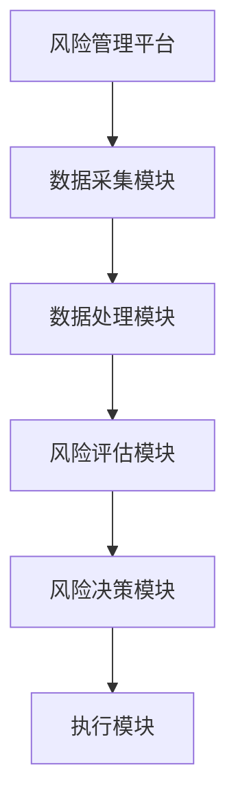
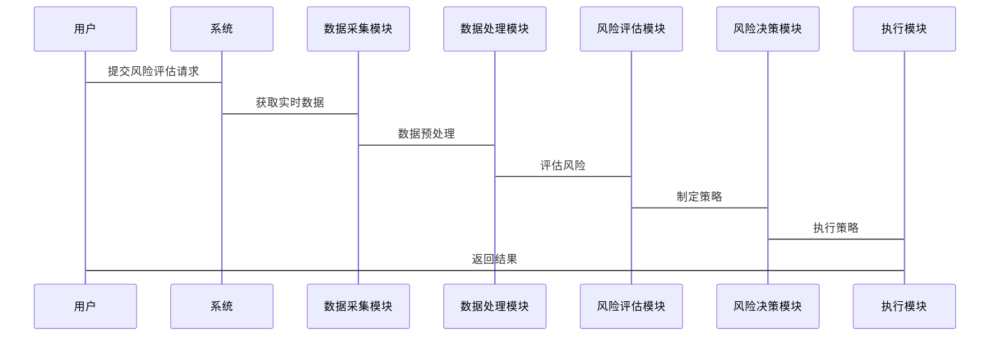

                 


# AI Agent在智能风险管理中的角色

> 关键词：AI Agent, 智能风险管理, 风险管理, 机器学习, 数据分析, 风险预测, 决策优化

> 摘要：本文探讨AI Agent在智能风险管理中的核心角色，分析其在风险感知、评估、决策与应对中的应用，结合实际案例和系统架构设计，详细讲解其算法原理与实现方法，最后总结AI Agent在智能风险管理中的优势与未来发展趋势。

---

## 第一章: AI Agent与风险管理基础

### 1.1 AI Agent的基本概念

#### 1.1.1 AI Agent的定义与特征
AI Agent（人工智能代理）是一种能够感知环境、自主决策并执行任务的智能实体。其核心特征包括：
- **自主性**：无需外部干预，自主完成任务。
- **反应性**：能够实时感知环境并做出响应。
- **学习能力**：通过数据和经验不断优化自身行为。
- **协作性**：能够与其他系统或人类进行有效协作。

#### 1.1.2 AI Agent与传统风险管理方法的对比
传统风险管理依赖人工分析和经验判断，存在效率低、覆盖面窄、响应慢等问题。而AI Agent通过机器学习、大数据分析等技术，能够实现实时、精准、高效的风险管理。

#### 1.1.3 AI Agent在风险管理中的应用
AI Agent在风险管理中的应用领域广泛，包括金融、医疗、交通、能源等。例如，在金融领域，AI Agent可以实时监控市场波动，预测风险并制定应对策略。

### 1.2 风险管理的基本原理

#### 1.2.1 风险管理的定义与分类
风险管理是指通过识别、评估和应对风险，降低其对目标的影响。常见的风险管理方法包括风险规避、风险减轻、风险转移和风险接受。

#### 1.2.2 传统风险管理方法的优缺点
- **优点**：简单易懂，适用于低复杂度场景。
- **缺点**：依赖人工经验，效率低，覆盖面窄，难以应对复杂多变的现代风险。

#### 1.2.3 AI Agent如何提升风险管理能力
AI Agent通过大数据分析、机器学习和实时监控，能够快速识别潜在风险，提供精准的预测和决策支持，显著提升风险管理的效率和准确性。

---

## 第二章: AI Agent在风险管理中的核心概念

### 2.1 AI Agent的风险感知机制

#### 2.1.1 数据采集与处理
AI Agent通过传感器、数据库等渠道采集环境数据，并进行清洗、特征提取和标准化处理，为后续分析提供高质量的数据支持。

#### 2.1.2 风险特征提取
通过机器学习算法（如PCA、LDA）对数据进行降维和特征提取，识别潜在风险的关键特征。

#### 2.1.3 风险识别与分类
基于分类算法（如决策树、随机森林）对风险进行分类，例如将风险分为高、中、低三个等级。

### 2.2 风险评估与预测模型

#### 2.2.1 风险评估的基本原理
风险评估是通过数学模型量化风险的可能性和影响程度，为决策提供依据。

#### 2.2.2 AI Agent中的风险预测算法
常用的预测算法包括：
- **逻辑回归**：用于二分类问题，例如预测客户违约风险。
- **支持向量机（SVM）**：适用于非线性可分数据。
- **神经网络**：适用于复杂非线性关系的预测。

#### 2.2.3 风险预测的数学模型
以逻辑回归为例，其概率公式为：
$$ P(Y=1|X) = \frac{1}{1 + e^{-\beta X}} $$

### 2.3 风险决策与应对策略

#### 2.3.1 决策的基本原理
决策是基于风险评估结果，选择最优应对策略的过程。

#### 2.3.2 AI Agent中的决策优化
通过强化学习（如Q-learning）优化决策策略，例如在金融投资中动态调整资产配置。

#### 2.3.3 决策执行与反馈
AI Agent根据决策结果执行操作，并通过反馈机制不断优化自身的决策模型。

---

## 第三章: AI Agent的风险管理算法原理

### 3.1 风险感知算法

#### 3.1.1 数据预处理与特征提取
使用Python的scikit-learn库进行数据标准化和特征选择：
```python
from sklearn.preprocessing import StandardScaler
from sklearn.feature_selection import SelectKBest

# 数据标准化
scaler = StandardScaler()
data_scaled = scaler.fit_transform(data)

# 特征选择
selector = SelectKBest(k=10)
data_selected = selector.fit_transform(data_scaled, labels)
```

#### 3.1.2 风险分类算法
使用决策树进行风险分类：
```python
from sklearn.tree import DecisionTreeClassifier

# 训练模型
clf = DecisionTreeClassifier()
clf.fit(data_selected, labels)
```

### 3.2 风险预测模型

#### 3.2.1 预测模型的数学基础
贝叶斯定理是概率预测的核心公式：
$$ P(A|B) = \frac{P(B|A)P(A)}{P(B)} $$

#### 3.2.2 基于机器学习的预测实现
使用随机森林进行风险预测：
```python
from sklearn.ensemble import RandomForestClassifier

# 训练模型
rf_clf = RandomForestClassifier(n_estimators=100)
rf_clf.fit(data_selected, labels)
```

### 3.3 风险决策优化

#### 3.3.1 强化学习在决策优化中的应用
使用Q-learning算法优化决策策略：
```python
# Q-learning状态转移
next_state = get_next_state(current_state, action)
```

#### 3.3.2 决策结果的反馈机制
通过实时反馈优化决策模型：
```python
# 反馈机制
reward = get_reward(current_state, action, next_state)
update_Q(current_state, action, reward)
```

---

## 第四章: 系统架构与设计

### 4.1 系统功能设计

#### 4.1.1 风险感知模块
负责实时采集和处理环境数据，识别潜在风险。

#### 4.1.2 风险评估模块
基于历史数据和实时信息，评估风险的可能性和影响程度。

#### 4.1.3 风险决策模块
根据评估结果，制定最优应对策略并执行。

### 4.2 系统架构设计

#### 4.2.1 系统架构图
使用Mermaid绘制系统架构图：


#### 4.2.2 系统交互流程
使用Mermaid绘制交互流程图：


---

## 第五章: 项目实战

### 5.1 环境安装与配置

#### 5.1.1 安装依赖
安装必要的Python库：
```bash
pip install numpy pandas scikit-learn matplotlib
```

### 5.2 核心代码实现

#### 5.2.1 数据预处理
```python
import pandas as pd
import numpy as np

# 加载数据
data = pd.read_csv('risk_data.csv')

# 数据清洗
data = data.dropna()
data = data.drop_duplicates()

# 特征提取
features = data.iloc[:, :-1]
labels = data.iloc[:, -1]
```

#### 5.2.2 模型训练
```python
from sklearn.model

