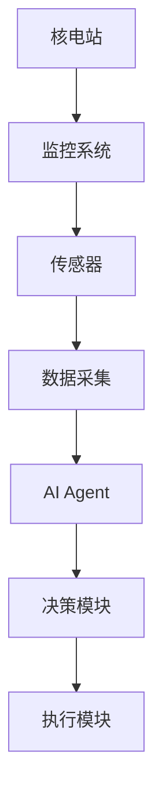
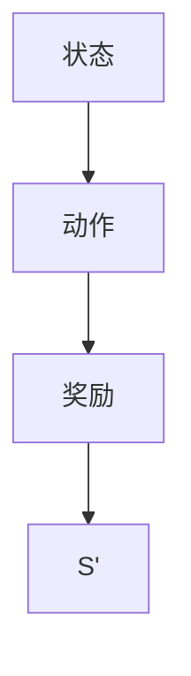
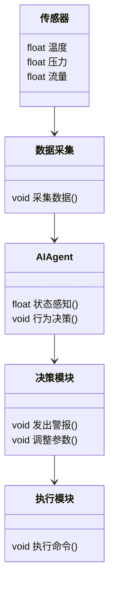
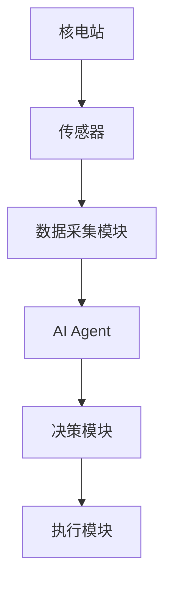
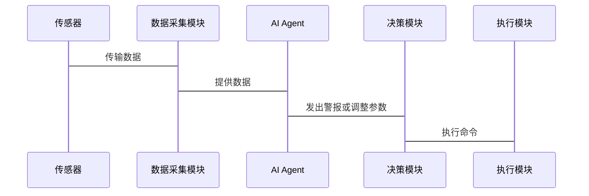

                 


```markdown
# AI Agent在核电站安全监控中的应用

> 关键词：核电站，AI Agent，安全监控，强化学习，监督学习

> 摘要：本文详细探讨了AI Agent在核电站安全监控中的应用，分析了其核心概念、算法原理、系统架构以及实际项目中的应用场景。通过理论与实践相结合的方式，展示了AI Agent如何提升核电站的安全监控效率和准确性。

---

# 第一部分: 核电站安全监控的背景与挑战

## 第1章: 核电站安全监控的背景

### 1.1 核电站的基本概念与运行特点

核电站是一种利用核反应产生能量的发电站，其核心部分包括核反应堆、蒸汽轮机、发电机等。核电站的运行需要高度精确的控制和实时监控，以确保系统的安全性和稳定性。

#### 1.1.1 核电站的基本概念
核电站通过核裂变反应产生热量，将水加热成蒸汽，推动汽轮机发电。核反应堆的控制需要极高的精度，任何微小的偏差都可能导致严重的后果。

#### 1.1.2 核电站的运行特点
- 高度自动化：核电站的运行需要依赖先进的自动化系统。
- 高安全性：核电站的安全性是最重要的考量因素。
- 实时监控：核电站需要实时监控各种参数，包括温度、压力、流量等。

### 1.2 核电站安全监控的重要性

核电站的安全监控是确保核电站稳定运行的关键。任何参数的异常都可能导致严重的事故，例如切尔诺贝利和福岛核电站事故都凸显了安全监控的重要性。

#### 1.2.1 安全监控的核心目标
- 实时检测异常情况
- 快速响应潜在风险
- 确保系统的稳定运行

### 1.3 当前核电站安全监控的主要挑战

尽管核电站的安全监控技术已经非常先进，但仍面临一些挑战。

#### 1.3.1 数据量大且复杂
核电站会产生大量的实时数据，包括温度、压力、流量等参数。这些数据需要快速处理和分析。

#### 1.3.2 系统的实时性要求高
核电站的安全监控需要在极短的时间内做出决策，任何延迟都可能导致事故的发生。

#### 1.3.3 系统的容错性和可靠性
核电站的安全监控系统必须具备极高的容错性和可靠性，以确保在极端情况下仍能正常运行。

## 1.4 AI Agent在核电站安全监控中的作用

AI Agent（智能体）是一种能够感知环境并采取行动以实现目标的实体。在核电站安全监控中，AI Agent可以用于实时数据分析、异常检测和决策支持。

### 1.4.1 AI Agent的核心优势
- **智能性**：AI Agent能够自主学习和适应，不断提升监控的准确性。
- **实时性**：AI Agent可以快速处理大量数据，实现实时监控。
- **自主性**：AI Agent能够在没有人工干预的情况下独立运行。

### 1.4.2 AI Agent的应用场景
- **实时数据分析**：对核电站的实时数据进行分析，识别潜在的异常情况。
- **异常检测**：通过机器学习算法检测数据中的异常模式。
- **决策支持**：基于分析结果，提供最优的应对策略。

### 1.4.3 AI Agent的边界与外延
- **边界**：AI Agent仅用于核电站的安全监控，不涉及电站的运行控制。
- **外延**：AI Agent可以通过与其他系统的集成，实现更广泛的监控和管理。

---

# 第二部分: AI Agent的核心概念与原理

## 第2章: AI Agent的基本原理

### 2.1 AI Agent的定义与特点

#### 2.1.1 AI Agent的定义
AI Agent是一种能够感知环境并采取行动以实现目标的智能实体。它具备自主性、反应性、目标导向和社交能力等特性。

#### 2.1.2 AI Agent的特点
- **自主性**：AI Agent可以在没有外部干预的情况下独立运行。
- **反应性**：AI Agent能够实时感知环境并做出反应。
- **目标导向**：AI Agent的所有行动都是为了实现特定的目标。
- **社交能力**：AI Agent能够与其他系统或人类进行交互和协作。

### 2.2 AI Agent的核心概念

#### 2.2.1 状态感知
AI Agent需要实时感知核电站的状态，包括温度、压力、流量等参数。

#### 2.2.2 行为决策
基于感知到的状态，AI Agent需要做出相应的决策，例如发出警报或调整参数。

#### 2.2.3 自适应优化
AI Agent能够通过学习和优化，不断提升监控的准确性和效率。

### 2.3 AI Agent的核心概念对比

| **特性**       | **传统监控系统**                | **AI Agent**                     |
|----------------|--------------------------------|---------------------------------|
| 数据处理能力   | 基于规则，处理能力有限           | 基于机器学习，处理能力强         |
| 自适应能力     | 无或有限                        | 强，能够自主学习和优化             |
| 决策能力       | 基于预设规则，决策能力有限       | 基于实时数据，决策能力更强       |

### 2.4 AI Agent的实体关系图



---

# 第三部分: AI Agent的算法原理

## 第3章: AI Agent的核心算法

### 3.1 强化学习算法

#### 3.1.1 强化学习的基本概念
强化学习是一种通过试错机制来学习最优策略的算法。AI Agent通过与环境的交互，逐步优化自己的行为以获得最大的奖励。

#### 3.1.2 Q-learning算法
Q-learning是一种经典的强化学习算法，适用于离散动作空间的问题。



#### 3.1.3 算法实现步骤
1. 初始化Q表。
2. 选择当前状态下的动作。
3. 执行动作，获得奖励和新的状态。
4. 更新Q表中的值。

#### 3.1.4 代码示例
```python
import numpy as np

# 初始化Q表
Q = np.zeros((state_space_size, action_space_size))

# Q-learning算法
for episode in range(max_episodes):
    current_state = initial_state
    while not episode_over:
        # 选择动作
        if np.random.random() < epsilon:
            action = np.random.randint(action_space_size)
        else:
            action = np.argmax(Q[current_state])
        
        # 执行动作，获得奖励和新状态
        reward = get_reward(current_state, action)
        new_state = get_new_state(current_state, action)
        
        # 更新Q表
        Q[current_state][action] = Q[current_state][action] + learning_rate * (reward + gamma * np.max(Q[new_state]) - Q[current_state][action])
        
        current_state = new_state
```

### 3.2 监督学习算法

#### 3.2.1 监督学习的基本概念
监督学习是一种通过 labeled 数据训练模型的算法。AI Agent可以通过监督学习来识别正常和异常状态。

#### 3.2.2 算法实现步骤
1. 收集训练数据。
2. 训练模型。
3. 使用训练好的模型进行预测。

#### 3.2.3 代码示例
```python
from sklearn.linear_model import LogisticRegression

# 收集训练数据
X_train = ...  # 特征数据
y_train = ...  # 标签数据

# 训练模型
model = LogisticRegression()
model.fit(X_train, y_train)

# 预测
X_test = ...  # 测试数据
y_pred = model.predict(X_test)
```

---

# 第四部分: AI Agent的系统架构设计

## 第4章: 核电站安全监控的系统分析

### 4.1 系统功能设计

#### 4.1.1 领域模型
核电站安全监控的领域模型包括传感器、数据采集、AI Agent、决策模块和执行模块。



### 4.2 系统架构设计

#### 4.2.1 系统架构图
核电站安全监控系统的架构包括传感器、数据采集模块、AI Agent、决策模块和执行模块。



### 4.3 系统接口设计

#### 4.3.1 系统接口
- 传感器接口：与传感器连接，接收实时数据。
- 决策模块接口：与执行模块连接，发送决策指令。

#### 4.3.2 接口描述
- 传感器接口：提供温度、压力、流量等参数。
- 数据采集模块接口：接收传感器数据并存储。
- AI Agent接口：从数据采集模块获取数据，进行分析和决策。
- 决策模块接口：根据AI Agent的分析结果，发出警报或调整参数。
- 执行模块接口：执行决策模块的指令。

### 4.4 系统交互流程



---

# 第五部分: AI Agent的项目实战

## 第5章: 核电站安全监控的项目实战

### 5.1 环境安装

#### 5.1.1 安装Python
```bash
# 安装Python
sudo apt-get install python3
```

#### 5.1.2 安装依赖库
```bash
# 安装numpy和scikit-learn
pip install numpy scikit-learn
```

### 5.2 系统核心实现

#### 5.2.1 数据采集模块实现
```python
import numpy as np

# 数据采集模块
class DataCollector:
    def collect_data(self):
        # 模拟传感器数据
        temperature = np.random.uniform(200, 300)
        pressure = np.random.uniform(10, 30)
        flow = np.random.uniform(100, 500)
        return temperature, pressure, flow
```

#### 5.2.2 AI Agent实现
```python
from sklearn.linear_model import LogisticRegression

# AI Agent实现
class AIAssistant:
    def __init__(self):
        self.model = LogisticRegression()
    
    def train(self, X_train, y_train):
        self.model.fit(X_train, y_train)
    
    def predict(self, X_test):
        return self.model.predict(X_test)
```

### 5.3 代码应用解读与分析

#### 5.3.1 数据采集模块解读
数据采集模块负责从传感器获取实时数据，并将其传递给AI Agent。

#### 5.3.2 AI Agent解读
AI Agent接收数据后，使用训练好的模型进行预测，识别潜在的异常情况。

#### 5.3.3 决策模块解读
决策模块根据AI Agent的预测结果，发出警报或调整参数。

### 5.4 实际案例分析

#### 5.4.1 案例描述
假设核电站的温度传感器检测到异常高温，AI Agent通过分析数据，识别出潜在的危险情况，并发出警报。

#### 5.4.2 分析过程
1. 数据采集模块收集传感器数据。
2. AI Agent接收数据并进行分析。
3. AI Agent识别出温度异常。
4. 决策模块发出警报并调整参数。

### 5.5 项目小结

---

# 第六部分: 总结与展望

## 第6章: 总结与展望

### 6.1 本章小结

AI Agent在核电站安全监控中的应用具有重要意义。通过强化学习和监督学习算法，AI Agent能够实时分析数据，识别异常情况，并提供最优的应对策略。

### 6.2 注意事项

- 数据的准确性和完整性是AI Agent正常运行的关键。
- 系统的实时性和可靠性必须得到保证。
- 系统的安全性必须得到充分考虑。

### 6.3 未来的发展方向

- **算法优化**：进一步优化强化学习和监督学习算法，提升系统的智能性。
- **多系统集成**：将AI Agent与其他系统集成，实现更全面的监控。
- **边缘计算**：结合边缘计算技术，进一步提升系统的实时性和响应速度。

### 6.4 拓展阅读

- 《Reinforcement Learning: Theory and Algorithms》
- 《Supervised Learning: Theory and Practice》

---

# 结语

通过本文的详细介绍，我们可以看到AI Agent在核电站安全监控中的巨大潜力。随着人工智能技术的不断发展，AI Agent将在核电站安全监控中发挥越来越重要的作用。

---

**注**：本文版权归作者所有，未经授权，不得转载。如需转载请注明来源：https://github.com/your-repo
```

