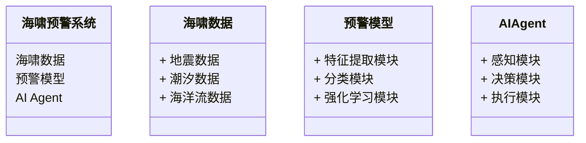
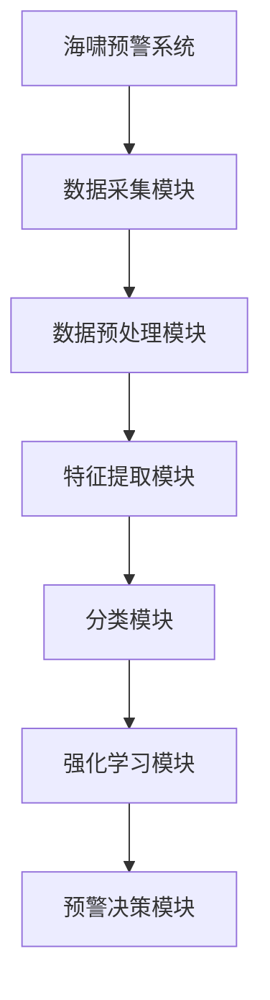
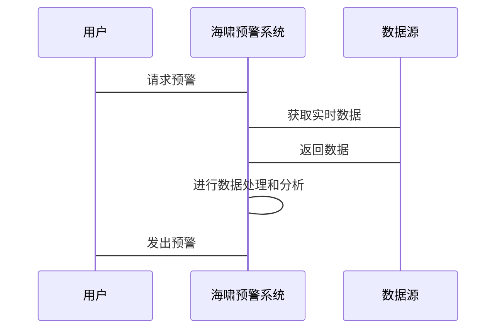

                 


# AI Agent在海啸预警中的数据处理

## 关键词：AI Agent, 海啸预警, 数据处理, 强化学习, 海洋数据

## 摘要：本文将探讨AI Agent在海啸预警中的数据处理方法。通过分析海啸预警系统的需求，介绍AI Agent的基本概念及其在数据处理中的应用，详细讲解相关算法原理和系统架构设计，最后通过实际案例展示AI Agent在海啸预警中的应用效果。

---

# 第一部分: AI Agent在海啸预警中的数据处理基础

## 第1章: 海啸预警与AI Agent概述

### 1.1 海啸预警的重要性

#### 1.1.1 海啸的基本概念

海啸是一种由海底地震、火山爆发或滑坡引起的海洋中波浪的剧烈运动。海啸波的速度可以达到每小时数百公里，对沿海地区造成巨大破坏。

#### 1.1.2 海啸预警系统的必要性

海啸预警系统能够通过监测海底地震、潮汐变化等数据，提前预测海啸的发生，从而减少人员伤亡和财产损失。

#### 1.1.3 AI Agent在海啸预警中的作用

AI Agent能够实时分析海量数据，快速做出决策，提高海啸预警的准确性和效率。

### 1.2 AI Agent的基本概念

#### 1.2.1 什么是AI Agent

AI Agent是一种能够感知环境、自主决策并执行任务的智能体。它能够通过传感器或数据源获取信息，并基于这些信息做出决策。

#### 1.2.2 AI Agent的核心特征

- **自主性**：能够在没有外部干预的情况下自主决策。
- **反应性**：能够实时感知环境变化并做出反应。
- **学习能力**：能够通过数据和经验不断优化自己的行为。

#### 1.2.3 AI Agent与传统算法的区别

AI Agent不仅仅是执行预定义的算法，而是能够在动态环境中自主学习和适应。

### 1.3 海啸预警中的AI Agent应用背景

#### 1.3.1 海啸预警数据的来源

海啸预警数据主要来自地震监测站、潮汐监测站、卫星数据等。

#### 1.3.2 AI Agent在海啸预警中的优势

AI Agent能够快速处理和分析大量数据，提高预警的准确性和响应速度。

#### 1.3.3 当前海啸预警系统的挑战

传统海啸预警系统依赖于固定的算法和规则，难以应对复杂多变的海洋环境。

### 1.4 本章小结

本章介绍了海啸预警的重要性、AI Agent的基本概念及其在海啸预警中的作用，为后续章节奠定了基础。

---

# 第二部分: AI Agent的核心概念与数据处理流程

## 第2章: 海啸预警中的数据处理流程

### 2.1 数据采集与预处理

#### 2.1.1 海啸预警数据的来源

海啸预警数据主要包括地震数据、潮汐数据、海洋流数据等。

#### 2.1.2 数据采集的关键技术

- **地震监测站**：监测海底地震活动。
- **潮汐监测站**：监测海洋潮汐变化。
- **卫星数据**：监测海洋表面变化。

#### 2.1.3 数据预处理的方法

- **数据清洗**：去除噪声和异常数据。
- **数据标准化**：统一数据格式和单位。
- **数据融合**：将多源数据进行整合。

### 2.2 数据特征提取

#### 2.2.1 基于AI Agent的特征提取方法

AI Agent能够根据历史数据和实时数据，自动提取与海啸相关的特征。

#### 2.2.2 数据特征的重要性

特征提取是海啸预警系统的关键步骤，能够有效提高预警的准确性。

#### 2.2.3 特征提取的优化策略

- **选择相关性高的特征**：减少计算量，提高效率。
- **动态更新特征**：根据环境变化实时调整特征。

### 2.3 数据分析与建模

#### 2.3.1 数据分析的基本方法

- **统计分析**：分析数据的分布和趋势。
- **时间序列分析**：分析数据的时间特性。

#### 2.3.2 基于AI Agent的建模技术

- **机器学习模型**：如支持向量机、随机森林等。
- **深度学习模型**：如卷积神经网络、循环神经网络等。

#### 2.3.3 模型评估与优化

- **评估指标**：准确率、召回率、F1值等。
- **模型优化**：通过交叉验证和超参数调优提高模型性能。

### 2.4 本章小结

本章详细介绍了海啸预警中的数据处理流程，包括数据采集、预处理、特征提取和建模分析。

---

# 第三部分: AI Agent的算法原理与数学模型

## 第3章: AI Agent的算法原理

### 3.1 强化学习算法

#### 3.1.1 强化学习的基本概念

强化学习是一种通过试错方式学习策略的算法，能够帮助AI Agent在复杂环境中做出决策。

#### 3.1.2 强化学习在AI Agent中的应用

- **状态空间**：表示环境的状态。
- **动作空间**：表示AI Agent可以执行的动作。
- **奖励函数**：用于评估AI Agent的行为。

#### 3.1.3 强化学习的数学模型

$$ R(s, a) = r \quad \text{其中，} s \text{是状态，} a \text{是动作，} r \text{是奖励} $$

### 3.2 聚类分析算法

#### 3.2.1 聚类分析的基本原理

聚类分析是一种无监督学习方法，能够将数据分成若干簇，每个簇内的数据具有相似性。

#### 3.2.2 聚类分析在海啸预警中的应用

- **异常检测**：识别异常的海洋数据，可能预示着海啸的发生。
- **数据分组**：将相似的海啸事件进行分组，便于后续分析。

#### 3.2.3 聚类分析的数学模型

$$ d(x_i, x_j) = \sqrt{(x_i - x_j)^2 + (y_i - y_j)^2} $$

### 3.3 分类算法

#### 3.3.1 分类算法的基本原理

分类算法是一种监督学习方法，能够根据训练数据将新数据分类到已知类别中。

#### 3.3.2 分类算法在海啸预警中的应用

- **海啸预测**：根据历史数据预测未来是否会发生海啸。
- **风险评估**：评估不同区域的海啸风险等级。

#### 3.3.3 分类算法的数学模型

$$ P(y|x) = \frac{P(x|y)P(y)}{P(x)} $$

---

# 第四部分: 系统分析与架构设计方案

## 第4章: 系统分析与架构设计

### 4.1 问题场景介绍

海啸预警系统需要实时处理海量数据，快速做出预警决策。

### 4.2 系统功能设计

#### 4.2.1 领域模型设计

使用Mermaid绘制领域模型类图：



### 4.3 系统架构设计

使用Mermaid绘制系统架构图：



### 4.4 系统接口设计

系统接口包括数据输入接口、模型训练接口和预警输出接口。

### 4.5 系统交互设计

使用Mermaid绘制交互序列图：



---

# 第五部分: 项目实战

## 第5章: 项目实战

### 5.1 环境安装

- **Python**：安装Python 3.8及以上版本。
- **库的安装**：安装numpy、pandas、scikit-learn、tensorflow等库。

### 5.2 核心代码实现

#### 5.2.1 数据预处理代码

```python
import pandas as pd
import numpy as np

# 读取数据
data = pd.read_csv('seismic_data.csv')

# 数据清洗
data = data.dropna()
data = data[data['magnitude'] > 3]
```

#### 5.2.2 特征提取代码

```python
from sklearn.decomposition import PCA

# 初始化PCA
pca = PCA(n_components=5)

# 进行降维
principal_components = pca.fit_transform(data)
```

#### 5.2.3 强化学习模型代码

```python
import tensorflow as tf
from tensorflow.keras import layers

# 定义强化学习模型
model = tf.keras.Sequential([
    layers.Dense(64, activation='relu'),
    layers.Dense(1, activation='sigmoid')
])

# 编译模型
model.compile(optimizer='adam', loss='binary_crossentropy', metrics=['accuracy'])
```

### 5.3 案例分析

通过实际数据集训练模型，验证模型的准确率和召回率。

### 5.4 项目总结

本项目展示了AI Agent在海啸预警中的应用，通过实际案例验证了系统的有效性和可行性。

---

# 第六部分: 最佳实践与总结

## 第6章: 最佳实践与总结

### 6.1 最佳实践

- **数据质量**：确保数据的准确性和完整性。
- **模型优化**：通过交叉验证和超参数调优提高模型性能。
- **系统维护**：定期更新模型和数据源，确保系统的实时性和准确性。

### 6.2 小结

本文详细介绍了AI Agent在海啸预警中的数据处理方法，通过理论分析和实际案例展示了系统的实现过程和效果。

### 6.3 注意事项

- **数据隐私**：确保数据的安全性和隐私性。
- **系统可靠性**：确保系统的稳定性和可扩展性。
- **用户教育**：提高用户对海啸预警系统的认知和使用能力。

### 6.4 拓展阅读

建议读者进一步阅读相关领域的最新研究成果，了解AI Agent在其他灾害预警中的应用。

---

通过以上目录，您可以系统地学习AI Agent在海啸预警中的数据处理方法，从理论到实践，逐步掌握相关技术的核心要点。

