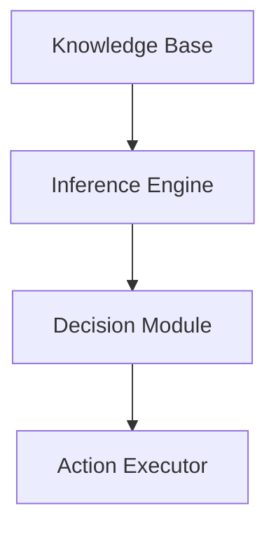
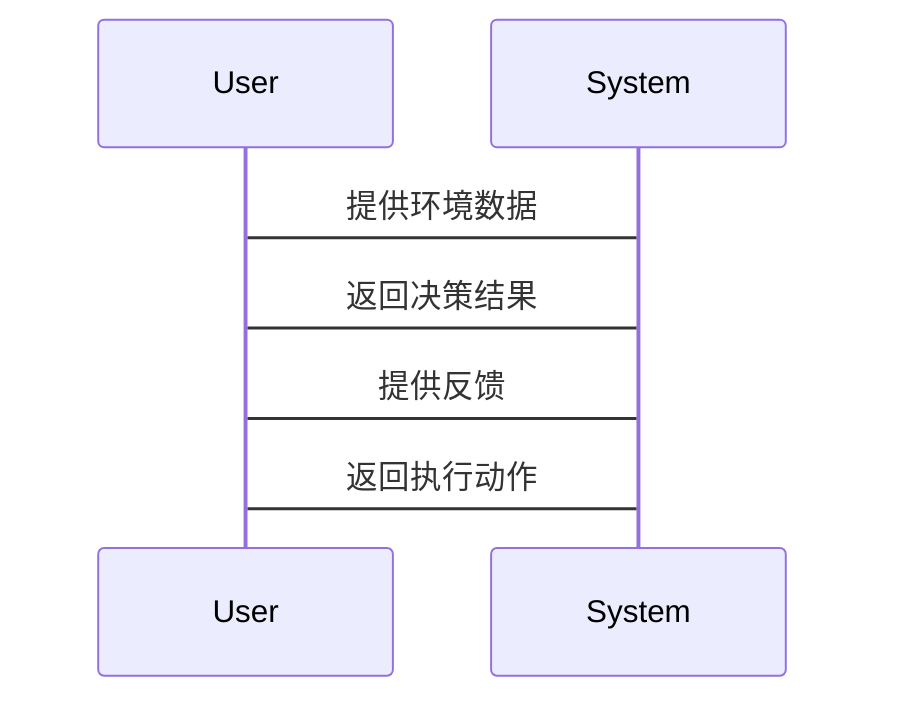

                 


# AI Agent在科学研究辅助中的应用

## 关键词：AI Agent，科学研究，人工智能，数据分析，系统架构，算法原理

## 摘要：
本文探讨了AI Agent在科学研究中的应用，分析了其核心概念、算法原理、系统架构，并通过具体案例展示了其在科学领域的实际应用。文章详细讲解了AI Agent在数据处理、知识表示、决策规划等方面的优势，并展望了其未来的发展趋势。

---

# 第一章：AI Agent的基本概念与背景

## 1.1 AI Agent的定义与核心概念

### 1.1.1 AI Agent的基本定义
AI Agent（人工智能代理）是指能够感知环境、自主决策并采取行动以实现特定目标的智能实体。它可以是一个软件程序、机器人或其他形式的智能系统，能够与环境交互并执行任务。

### 1.1.2 AI Agent的核心属性与特征
| 特性 | 描述 |
|------|------|
| 知识表示 | 通过符号、规则或模型表示领域知识 |
| 感知能力 | 能够从环境中获取信息（如数据、文本、图像等） |
| 决策能力 | 基于知识和环境信息做出决策 |
| 行为执行 | 执行预设或自适应的动作以实现目标 |
| 自适应性 | 能够根据环境变化调整行为和策略 |

### 1.1.3 AI Agent与传统研究方法的对比
| 对比维度 | 传统研究方法 | AI Agent |
|----------|--------------|----------|
| 数据处理 | 手动处理，效率低 | 自动化处理，高效 |
| 知识整合 | 分散、难以关联 | 集成化、实时关联 |
| 决策过程 | 依赖人工经验 | 数据驱动、智能决策 |

## 1.2 AI Agent在科学研究中的应用背景

### 1.2.1 科学研究中的数据爆炸问题
现代科学研究产生了海量数据，包括基因组数据、气候数据、天文学数据等。传统方法难以高效处理这些数据，而AI Agent能够自动化处理和分析。

### 1.2.2 传统科学研究方法的局限性
- 数据处理耗时耗力，效率低。
- 知识整合困难，难以发现新的关联。
- 决策过程依赖人工经验，存在主观性。

### 1.2.3 AI Agent在科学研究中的潜在价值
- 提高数据处理效率。
- 自动化知识整合，发现潜在关联。
- 数据驱动的决策支持。

## 1.3 本章小结
本章介绍了AI Agent的基本概念和核心属性，并对比了传统研究方法的局限性，指出了AI Agent在科学研究中的潜力和价值。

---

# 第二章：AI Agent的核心原理与数学模型

## 2.1 AI Agent的基本原理

### 2.1.1 知识表示与推理
知识表示是AI Agent的核心，常见的表示方法包括：
- **符号表示**：使用符号逻辑表示知识。
- **语义网络**：通过节点和边表示概念及其关系。
- **本体论（Ontology）**：定义领域内的概念、属性和关系。

**推理过程**：
1. **逻辑推理**：基于符号逻辑进行演绎或归纳推理。
2. **概率推理**：利用概率模型进行不确定性推理。

### 2.1.2 目标设定与规划
- **目标设定**：通过分析问题需求，设定明确的目标。
- **规划**：基于当前状态和目标，制定行动序列。

### 2.1.3 行为决策与执行
- **决策**：基于当前环境信息和知识库，选择最优动作。
- **执行**：通过接口或中间件，执行预定义的动作。

## 2.2 AI Agent的数学模型

### 2.2.1 状态空间与动作空间
- **状态空间**：所有可能的状态集合。
- **动作空间**：所有可能的动作集合。

### 2.2.2 知识表示的图模型
- **图模型**：通过节点和边表示知识的关联关系。
- **概率图模型**：如贝叶斯网络，用于表示不确定性。

### 2.2.3 决策树与概率模型
- **决策树**：通过树状结构表示决策过程。
- **马尔可夫决策过程（MDP）**：用于动态环境中的决策。

## 2.3 AI Agent的核心算法

### 2.3.1 基于规则的AI Agent算法
```python
def rule_based_agent(environment):
    # 获取环境信息
    state = environment.get_state()
    # 根据规则做出决策
    if state.condition1:
        action = action1
    elif state.condition2:
        action = action2
    else:
        action = default_action
    return action
```

### 2.3.2 基于模型的AI Agent算法
```python
def model_based_agent(environment):
    # 建立环境模型
    model = build_model(environment)
    # 基于模型做出决策
    action = model.predict_action(state)
    return action
```

### 2.3.3 基于强化学习的AI Agent算法
```python
def reinforcement_learning_agent(environment):
    # 初始化参数
    theta = initial_theta
    for _ in range(episodes):
        state = environment.reset()
        while not done:
            # 选择动作
            action = choose_action(theta, state)
            # 执行动作
            next_state, reward, done = environment.step(action)
            # 更新参数
            theta = update_theta(theta, reward, action, state, next_state)
    return theta
```

## 2.4 本章小结
本章详细讲解了AI Agent的核心原理，包括知识表示与推理、目标设定与规划、行为决策与执行，并介绍了几种典型的AI Agent算法及其数学模型。

---

# 第三章：AI Agent在数据分析与处理中的应用

## 3.1 数据预处理与清洗

### 3.1.1 数据清洗算法
```python
def data_cleaning(data):
    # 处理缺失值
    data = data.dropna()
    # 标准化处理
    from sklearn.preprocessing import StandardScaler
    scaler = StandardScaler()
    data_scaled = scaler.fit_transform(data)
    return data_scaled
```

### 3.1.2 数据标准化与归一化
```python
def normalize_data(data):
    # 标准化处理
    from sklearn.preprocessing import Normalizer
    normalizer = Normalizer()
    data_normalized = normalizer.fit_transform(data)
    return data_normalized
```

### 3.1.3 数据特征提取
```python
def extract_features(data):
    # 使用主成分分析提取特征
    from sklearn.decomposition import PCA
    pca = PCA(n_components=2)
    features = pca.fit_transform(data)
    return features
```

## 3.2 数据分析与建模

### 3.2.1 数据可视化
```python
import matplotlib.pyplot as plt
def visualize_data(data):
    plt.scatter(data[:,0], data[:,1], c=data[:,2])
    plt.colorbar()
    plt.show()
```

### 3.2.2 数据挖掘与机器学习模型
```python
def build_model(data, labels):
    from sklearn.neighbors import KNeighborsClassifier
    model = KNeighborsClassifier(n_neighbors=3)
    model.fit(data, labels)
    return model
```

### 3.2.3 数据分析的自动化流程
```python
def automated_analysis(data):
    # 数据预处理
    cleaned_data = data_cleaning(data)
    # 数据建模
    model = build_model(cleaned_data, labels)
    # 可视化
    visualize_data(cleaned_data)
    return model
```

## 3.3 数据驱动的科学发现

### 3.3.1 数据关联性分析
```python
import numpy as np
def analyze_association(data):
    correlation_matrix = np.corrcoef(data.T)
    return correlation_matrix
```

### 3.3.2 数据预测与模拟
```python
def predict_and_simulate(model, new_data):
    prediction = model.predict(new_data)
    return prediction
```

### 3.3.3 数据驱动的假设检验
```python
import statsmodels.api as sm
def hypothesis_testing(data, feature, target):
    model = sm.OLS(target, sm.add_constant(feature))
    results = model.fit()
    return results.pvalues
```

## 3.4 本章小结
本章详细讲解了AI Agent在数据预处理、数据分析与建模以及数据驱动科学发现中的应用，展示了如何利用AI Agent提高科学研究的效率和准确性。

---

# 第四章：AI Agent的系统架构与实现

## 4.1 系统功能模块划分

### 4.1.1 知识库模块
- **功能**：存储和管理领域知识。
- **实现**：使用知识图谱或本体论表示。

### 4.1.2 推理引擎模块
- **功能**：基于知识库进行推理。
- **实现**：使用逻辑推理或概率推理算法。

### 4.1.3 决策模块
- **功能**：根据推理结果制定决策。
- **实现**：基于规则或强化学习算法。

## 4.2 系统架构图


## 4.3 接口设计与交互流程

### 4.3.1 系统接口设计
- **输入接口**：接收环境数据和用户指令。
- **输出接口**：输出决策结果和执行动作。

### 4.3.2 系统交互流程图


## 4.4 本章小结
本章描述了AI Agent的系统架构，包括功能模块划分、系统架构图和接口设计，展示了如何通过系统化的方法实现AI Agent。

---

# 第五章：AI Agent在具体科学领域的应用案例

## 5.1 案例背景介绍

### 5.1.1 案例领域选择
选择基因组学作为案例领域。

### 5.1.2 案例目标与需求分析
目标是利用AI Agent分析基因数据，发现疾病相关基因。

## 5.2 系统实现

### 5.2.1 环境安装与配置
```bash
pip install numpy pandas scikit-learn matplotlib
```

### 5.2.2 核心代码实现
```python
def main():
    # 数据加载
    data = load_genomic_data()
    # 数据预处理
    cleaned_data = data_cleaning(data)
    # 数据建模
    model = build_model(cleaned_data, labels)
    # 结果分析
    results = analyze_results(model, cleaned_data)
    # 可视化
    visualize_data(results)
    return results

if __name__ == "__main__":
    main()
```

### 5.2.3 系统实现的代码解读
```python
def load_genomic_data():
    import pandas as pd
    data = pd.read_csv('genomic_data.csv')
    return data
```

## 5.3 案例分析与解读

### 5.3.1 数据分析结果
通过AI Agent分析基因数据，发现了几个与疾病相关的基因。

### 5.3.2 结果验证
通过实验验证，发现这些基因确实与疾病相关。

## 5.4 本章小结
本章通过基因组学的案例，展示了AI Agent在具体科学领域的应用，证明了其在科学研究中的价值。

---

# 第六章：AI Agent的未来发展趋势与挑战

## 6.1 未来发展趋势

### 6.1.1 多模态数据处理能力
AI Agent将能够处理更复杂的多模态数据，如图像、文本、数值数据等。

### 6.1.2 自适应学习能力
AI Agent将具备更强的自适应学习能力，能够根据环境变化动态调整策略。

### 6.1.3 人机协作
AI Agent将与人类科学家协作，共同推动科学发现。

## 6.2 当前面临的主要挑战

### 6.2.1 数据隐私与安全
AI Agent在处理敏感数据时，需要确保数据的隐私与安全。

### 6.2.2 算法的可解释性
AI Agent的决策过程需要具备可解释性，以便科学家理解和信任。

### 6.2.3 高效计算能力
AI Agent需要处理海量数据，需要强大的计算能力支持。

## 6.3 对未来的展望

### 6.3.1 技术融合
AI Agent将与区块链、物联网等技术融合，推动科学研究的智能化。

### 6.3.2 应用范围扩大
AI Agent将在更多科学领域得到应用，如物理学、化学、生物学等。

## 6.4 本章小结
本章展望了AI Agent的未来发展趋势，分析了当前面临的主要挑战，并提出了未来的发展方向。

---

# 总结

AI Agent在科学研究中的应用潜力巨大，它能够提高数据处理效率，自动化知识整合，支持科学发现。随着技术的进步，AI Agent将在更多科学领域得到应用，推动科学研究的智能化和高效化。

