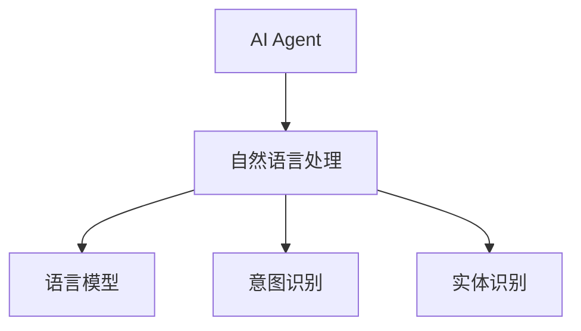

                 


# AI Agent在自然语言处理中的最新进展与应用

> 关键词：AI Agent, 自然语言处理, 注意力机制, 强化学习, 语言模型, 意图识别, 实体识别

> 摘要：本文系统介绍了AI Agent在自然语言处理中的最新进展与应用，涵盖AI Agent的基本概念、核心算法、系统架构以及实际案例，旨在为读者提供深入的技术分析和实践指导。

---

## 第一部分: AI Agent与自然语言处理的背景与概述

### 第1章: AI Agent的定义与自然语言处理的进展

#### 1.1 AI Agent的基本概念
- **AI Agent的定义**：AI Agent是能够感知环境并采取行动以实现目标的智能体。
- **核心特征**：
  - 独立性：自主决策
  - 智能性：具备学习和推理能力
  - 交互性：能够与用户或其他系统进行交互

#### 1.2 自然语言处理的最新进展
- **NLP的核心技术**：
  - 词嵌入（如Word2Vec、BERT）
  - 意图识别
  - 实体识别
  - 机器翻译
- **当前趋势**：
  - 增量学习
  - 多模态处理
  - 可解释性

#### 1.3 AI Agent在NLP中的作用
- **任务支持**：
  - 意图识别：确定用户的请求类型
  - 实体识别：提取关键信息
  - 语境理解：处理上下文关系
- **应用场景**：
  - 智能客服
  - 联网搜索
  - 信息提取

#### 1.4 当前研究热点与未来趋势
- **热点**：
  - 多轮对话
  - 知识图谱整合
  - 预训练模型的应用
- **未来趋势**：
  - 更加个性化的服务
  - 跨领域应用
  - 边缘计算结合

---

### 第2章: AI Agent与自然语言处理的核心概念与联系

#### 2.1 AI Agent的基本原理
- **感知与决策机制**：
  - 感知：通过NLP技术理解输入
  - 决策：基于理解生成响应
- **NLP关键技术**：
  - 词法分析：分词、词性标注
  - 句法分析：语法结构解析
  - 实语义分析：意图识别、实体识别

#### 2.2 AI Agent与NLP的关系
- **AI Agent如何利用NLP**：
  - 通过NLP技术处理用户输入，提取意图和实体
  - 使用NLP生成自然语言输出
- **NLP如何支持AI Agent**：
  - 提供语言理解能力
  - 支持多语言处理
  - 优化交互体验

#### 2.3 核心概念对比与ER实体关系图



---

## 第3章: AI Agent在自然语言处理中的算法原理

### 3.1 注意力机制
#### 3.1.1 注意力机制的原理
- **自注意力机制**：允许模型在处理序列中的每个元素时，考虑其他元素的相关性
- **多头注意力**：通过多个注意力头捕捉不同的特征

#### 3.1.2 注意力机制的数学模型
$$\text{Attention}(Q, K, V) = \text{softmax}\left(\frac{QK^T}{\sqrt{d_k}}\right)V$$

#### 3.1.3 示例
- 输入：多个词语的向量表示
- 输出：每个词语的重要性权重

### 3.2 强化学习在AI Agent中的应用
#### 3.2.1 强化学习的基本原理
- **策略网络**：直接输出动作
- **价值函数**：评估状态的价值

#### 3.2.2 AI Agent的策略网络
$$Q(s, a) = \text{网络}$$

#### 3.2.3 示例
- 输入：当前对话状态
- 输出：最佳动作

---

## 第4章: AI Agent的系统分析与架构设计

### 4.1 系统功能设计
- **领域模型**：
  - 意图识别
  - 实体识别
  - 语义理解

### 4.2 系统架构设计


### 4.3 接口与交互
- **接口设计**：
  - 输入：文本字符串
  - 输出：结构化数据或自然语言
- **交互流程**：
  1. 用户输入问题
  2. AI Agent解析意图
  3. 生成响应
  4. 返回结果

---

## 第5章: 项目实战

### 5.1 环境安装
```bash
pip install transformers torch
```

### 5.2 核心实现代码
```python
import torch
from transformers import BertTokenizer, BertModel

tokenizer = BertTokenizer.from_pretrained('bert-base-uncased')
model = BertModel.from_pretrained('bert-base-uncased')

def encode_sequence(text):
    inputs = tokenizer(text, return_tensors='pt')
    outputs = model(**inputs)
    return outputs.last_hidden_state
```

### 5.3 案例分析
- **案例**：智能客服系统
  - 用户输入：退款流程
  - 系统响应：指引用户完成退款

---

## 第6章: 最佳实践与小结

### 6.1 最佳实践
- **数据质量**：确保数据的多样性和代表性
- **模型调优**：定期更新和优化模型
- **用户体验**：注重交互的流畅性和可解释性

### 6.2 小结
AI Agent在自然语言处理中的应用前景广阔，随着技术的不断进步，其在各领域的应用将更加深入和多样化。

### 6.3 注意事项
- **隐私保护**：处理用户数据时需注意隐私问题
- **性能优化**：提升模型的响应速度和准确性

### 6.4 拓展阅读
- 《Transformers: Pre-training of Self-attentional Neural Networks》
- 《Attention Is All You Need》

---

这篇文章详细介绍了AI Agent在自然语言处理中的最新进展与应用，从基础概念到算法实现，再到实际案例，为读者提供了全面的技术指导。通过系统化的分析和实践，读者可以深入理解并应用这些技术。

