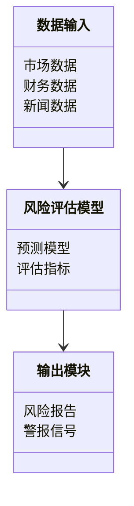
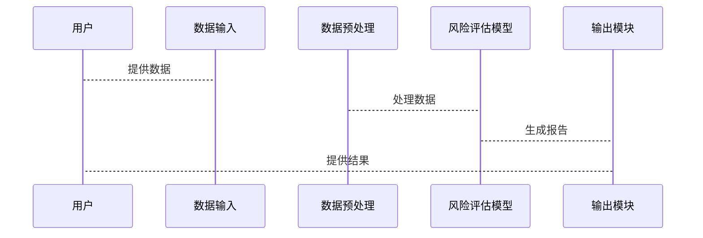

                 


# AI Agent在金融风险评估中的应用

## 关键词：AI Agent，金融风险评估，机器学习，算法原理，系统架构

## 摘要：本文探讨了AI Agent在金融风险评估中的应用，分析了其核心概念、算法原理、系统架构，并通过实际案例展示了如何利用AI Agent提升风险评估的效率和准确性。

---

# 第1章: AI Agent与金融风险评估的背景介绍

## 1.1 AI Agent的基本概念
### 1.1.1 AI Agent的定义与特点
人工智能代理（AI Agent）是能够感知环境并采取行动以实现目标的智能实体。AI Agent的特点包括自主性、反应性、目标导向和学习能力。

### 1.1.2 AI Agent在金融领域的应用现状
AI Agent在金融领域的应用日益广泛，特别是在风险管理、交易自动化和客户服务方面。

### 1.1.3 金融风险评估的基本概念
金融风险评估是识别和量化潜在财务损失的过程，旨在帮助机构做出更稳健的决策。

## 1.2 金融风险评估的重要性
### 1.2.1 金融风险的类型与特征
包括市场风险、信用风险、操作风险等，每种风险都有其独特的特征和影响。

### 1.2.2 传统金融风险评估方法的局限性
传统方法在数据处理和复杂性方面存在不足，难以应对现代金融市场的复杂性。

### 1.2.3 AI Agent在金融风险评估中的优势
AI Agent能够处理大量数据，快速识别模式，并提供实时反馈，显著提升了风险评估的效率和准确性。

## 1.3 本章小结
总结了AI Agent的基本概念及其在金融风险评估中的重要性。

---

# 第2章: AI Agent与金融风险评估的核心概念

## 2.1 AI Agent的类型与功能
### 2.1.1 基于规则的AI Agent
基于预定义规则的AI Agent，适用于规则明确的场景。

### 2.1.2 基于模型的AI Agent
基于数学模型的AI Agent，能够处理复杂的数据关系。

### 2.1.3 基于机器学习的AI Agent
通过机器学习算法不断优化的AI Agent，适用于动态环境。

## 2.2 金融风险评估的关键要素
### 2.2.1 数据来源与特征
包括市场数据、财务数据和新闻数据等。

### 2.2.2 风险评估模型的选择
选择合适的模型对于准确评估风险至关重要。

### 2.2.3 结果解读与决策支持
将模型输出转化为可操作的决策建议。

## 2.3 AI Agent与金融风险评估的关系
### 2.3.1 数据流与信息处理
从数据收集到处理再到分析的过程。

### 2.3.2 模型构建与优化
通过机器学习算法构建和优化风险评估模型。

### 2.3.3 决策支持与反馈机制
AI Agent通过反馈机制不断优化决策过程。

## 2.4 本章小结
详细解释了AI Agent与金融风险评估的核心概念及其相互关系。

---

# 第3章: AI Agent在金融风险评估中的算法原理

## 3.1 常见算法概述
### 3.1.1 随机森林算法
一种基于树的集成学习算法，适用于分类和回归问题。

### 3.1.2 梯度提升树算法
通过迭代优化模型的算法，常用于处理复杂数据。

### 3.1.3 神经网络与深度学习算法
适用于处理高维和非线性数据。

## 3.2 算法原理与实现
### 3.2.1 随机森林的工作原理
通过投票机制进行预测，减少过拟合。

### 3.2.2 XGBoost算法的数学模型
目标函数：$$L = \sum_{i=1}^n (y_i - \hat{y}_i) + \lambda \Omega$$
其中，$\Omega$是正则化项。

### 3.2.3 神经网络的基本结构
包括输入层、隐藏层和输出层，使用反向传播算法进行训练。

## 3.3 算法实现的Python代码示例
```python
import xgboost as xgb

# 示例代码
data = ...  # 输入数据
model = xgb.XGBRegressor(n_estimators=100, learning_rate=0.1, max_depth=3)
model.fit(data[['特征1', '特征2'], data['目标变量'])
```

## 3.4 本章小结
详细讲解了常见算法及其在金融风险评估中的应用。

---

# 第4章: 系统分析与架构设计

## 4.1 问题场景介绍
设计一个基于AI Agent的金融风险评估系统，用于实时监控和预测风险。

## 4.2 项目介绍
系统名称：智能金融风险评估平台。

## 4.3 系统功能设计
### 4.3.1 领域模型


## 4.4 系统架构设计


## 4.5 系统接口设计
### 4.5.1 数据接口
定义了数据输入的格式和接口。

### 4.5.2 模型接口
定义了模型的输入和输出接口。

## 4.6 系统交互设计


## 4.7 本章小结
详细描述了系统的架构设计和交互流程。

---

# 第5章: 项目实战

## 5.1 环境安装
### 5.1.1 安装Python和相关库
```bash
pip install numpy pandas scikit-learn xgboost
```

## 5.2 核心代码实现
### 5.2.1 数据预处理
```python
import pandas as pd
data = pd.read_csv('风险数据.csv')
data = data.dropna()
```

### 5.2.2 模型训练
```python
from sklearn.ensemble import RandomForestClassifier
model = RandomForestClassifier(n_estimators=100)
model.fit(X_train, y_train)
```

### 5.2.3 模型评估
```python
from sklearn.metrics import accuracy_score
y_pred = model.predict(X_test)
print(accuracy_score(y_test, y_pred))
```

## 5.3 实际案例分析
分析一个具体案例，展示AI Agent在风险评估中的应用效果。

## 5.4 本章小结
通过实际项目展示了AI Agent的应用过程。

---

# 第6章: 最佳实践与注意事项

## 6.1 数据预处理的重要性
确保数据质量和完整性。

## 6.2 模型调优与优化
选择合适的参数和算法，提升模型性能。

## 6.3 模型部署与维护
确保模型稳定运行并及时更新。

## 6.4 小结与注意事项
总结了项目中的经验和教训。

---

# 附录

## 附录A: 术语表
定义了书中使用的关键术语。

## 附录B: 参考文献
列出了本书参考的相关文献和资料。

## 附录C: 致谢
感谢在本书编写过程中提供帮助的个人和机构。

---

# 结束语

通过系统的介绍和详细的案例分析，本书为读者提供了全面了解AI Agent在金融风险评估中的应用的视角。

