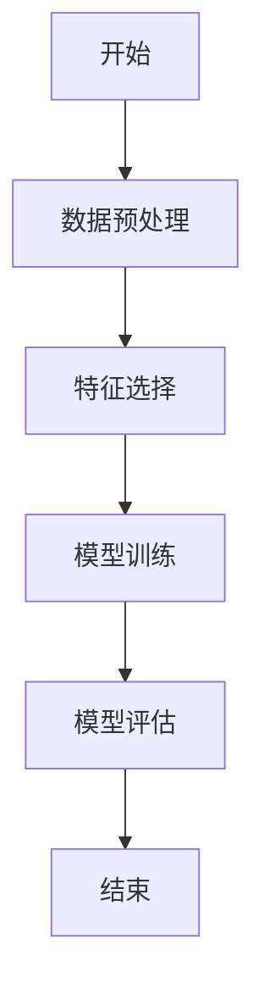
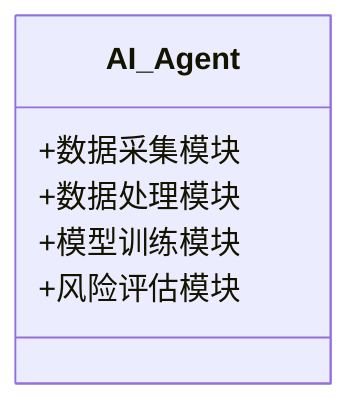
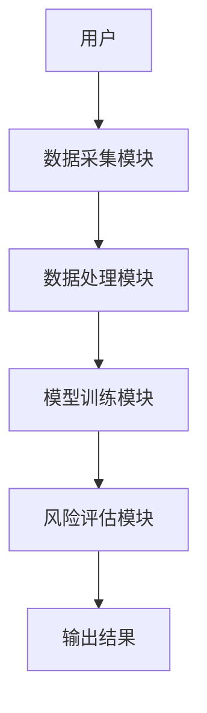
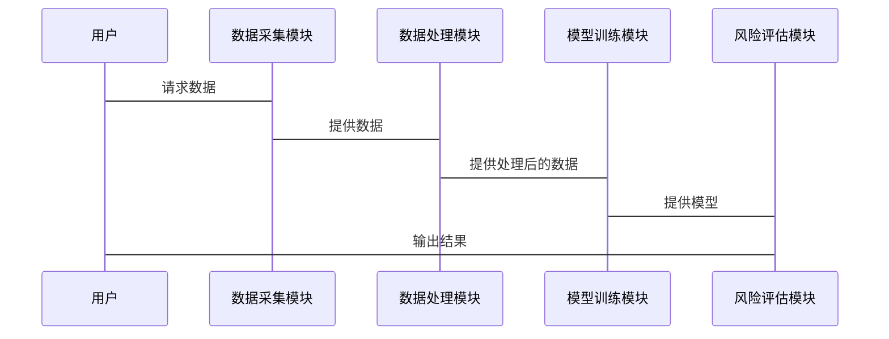

                 


# AI Agent在金融风险评估中的应用与挑战

## 关键词：AI Agent、金融风险评估、机器学习、NLP、强化学习

## 摘要：  
随着人工智能技术的快速发展，AI Agent在金融领域的应用逐渐成为热点。本文深入探讨AI Agent在金融风险评估中的应用场景、技术实现及面临的挑战，结合实际案例分析，为读者提供全面的技术解读和解决方案。通过系统架构设计、算法原理解析及项目实战，本文旨在帮助读者更好地理解AI Agent在金融风险评估中的潜力和实际应用价值。

---

# 第一部分: AI Agent与金融风险评估的背景与概述

## 第1章: AI Agent的基本概念与金融风险评估的定义

### 1.1 AI Agent的基本概念

#### 1.1.1 AI Agent的定义与特点
AI Agent（人工智能代理）是一种能够感知环境、自主决策并执行任务的智能体。它具备以下特点：
- **自主性**：能够独立决策，无需外部干预。
- **反应性**：能实时感知环境变化并做出响应。
- **学习能力**：通过数据和经验不断优化自身行为。
- **社交能力**：能够与其他系统或人类交互协作。

#### 1.1.2 AI Agent的核心功能与应用场景
AI Agent的核心功能包括数据采集、分析、决策和执行。在金融领域，应用场景广泛：
- **智能投顾**：为投资者提供个性化投资建议。
- **风险管理**：实时监控和评估金融风险。
- **欺诈检测**：识别异常交易行为。
- **信用评估**：预测客户的信用风险。

#### 1.1.3 AI Agent与传统金融工具的对比
与传统金融工具相比，AI Agent的优势在于其智能化和自动化能力。传统工具依赖人工分析，效率较低且可能存在主观偏差，而AI Agent能够快速处理大量数据，提供精准的决策支持。

### 1.2 金融风险评估的定义与分类

#### 1.2.1 金融风险的基本概念
金融风险是指在金融活动中可能发生的损失或收益波动。常见的金融风险类型包括：
- **市场风险**：由于市场波动导致的资产价值损失。
- **信用风险**：债务人或交易对手未能履行合同义务的风险。
- **操作风险**：由于内部流程或系统故障导致的损失。

#### 1.2.2 金融风险的主要类型
- **市场风险**：受市场波动影响的风险，如股票价格波动。
- **信用风险**：借款人违约的风险。
- **操作风险**：操作失误或系统故障导致的风险。
- **流动性风险**：无法及时变现资产的风险。

#### 1.2.3 金融风险评估的重要性与挑战
金融风险评估是金融机构稳健运营的关键，能够帮助机构识别潜在风险，制定有效的风险管理策略。然而，金融数据的复杂性、实时性和动态性给风险评估带来了巨大挑战。

### 1.3 AI Agent在金融风险评估中的结合与必要性

#### 1.3.1 为什么需要结合AI Agent进行金融风险评估
传统金融风险评估方法依赖人工分析，效率低且难以应对海量数据。AI Agent能够快速处理大量数据，提供实时、精准的风险评估。

#### 1.3.2 AI Agent在金融风险评估中的独特优势
- **实时性**：能够实时监控市场动态，及时发现风险。
- **准确性**：通过机器学习算法提高风险预测的准确性。
- **自动化**：实现风险评估的自动化流程，降低人工干预。

#### 1.3.3 金融风险评估结合AI Agent的必要性与未来趋势
随着金融市场的日益复杂化，结合AI Agent进行风险评估成为必然趋势。未来，AI Agent将在金融风险评估中发挥越来越重要的作用。

---

## 第2章: AI Agent的核心技术与金融领域的应用

### 2.1 AI Agent的核心技术

#### 2.1.1 机器学习算法在AI Agent中的应用
机器学习是AI Agent的核心技术之一。常用的算法包括：
- **监督学习**：用于分类和回归任务。
- **无监督学习**：用于聚类和异常检测。
- **强化学习**：用于策略优化和动态决策。

#### 2.1.2 自然语言处理（NLP）在AI Agent中的应用
NLP技术使AI Agent能够理解并处理文本数据，如新闻、财报和社交媒体信息，帮助识别潜在风险。

#### 2.1.3 强化学习在AI Agent中的应用
强化学习使AI Agent能够在复杂环境中做出最优决策，适用于高频交易和动态风险管理。

### 2.2 AI Agent在金融领域的具体应用

#### 2.2.1 风险管理
AI Agent能够实时监控市场动态，识别潜在风险，并提供预警。

#### 2.2.2 智能投顾
AI Agent为投资者提供个性化的投资建议，优化投资组合。

#### 2.2.3 欺诈检测
通过分析交易数据，AI Agent能够识别异常交易行为，预防金融欺诈。

---

## 第3章: AI Agent在金融风险评估中的算法原理

### 3.1 机器学习算法在风险评估中的应用

#### 3.1.1 逻辑回归
逻辑回归是一种常用的分类算法，适用于二分类问题。其数学模型如下：
$$ P(y=1|x) = \frac{e^{\beta_0 + \beta_1 x}}{1 + e^{\beta_0 + \beta_1 x}} $$
其中，$\beta_0$和$\beta_1$是模型参数，通过训练数据优化。

#### 3.1.2 支持向量机（SVM）
SVM适用于高维数据分类，通过构建超平面将数据分为两类。其数学模型如下：
$$ y = \text{sign}(\sum_{i=1}^n \alpha_i y_i x_i \cdot x + b) $$
其中，$\alpha_i$是拉格朗日乘子，$x_i$是训练数据点，$b$是偏置项。

#### 3.1.3 随机森林
随机森林是一种集成学习算法，通过构建多棵决策树进行投票或平均。其数学模型如下：
$$ y = \text{mode}(\{f_i(x)\}_{i=1}^n) $$
其中，$f_i(x)$是第$i$棵树的预测结果，$\text{mode}$表示众数。

#### 3.1.4 算法实现步骤
1. 数据预处理：清洗数据，处理缺失值和异常值。
2. 特征选择：提取关键特征，如市场指标和信用评分。
3. 模型训练：使用训练数据训练模型，调整参数。
4. 模型评估：通过测试数据评估模型性能，计算准确率和召回率。

#### 3.1.5 算法优缺点对比
| 算法 | 优点 | 缺点 |
|------|------|------|
| 逻辑回归 | 实现简单，易于解释 | 非线性分类能力有限 |
| SVM   | 分类性能好，适合高维数据 | 计算复杂度高 |
| 随机森林 | 鲁棒性强，适合复杂数据 | 计算资源消耗大 |

#### 3.1.6 算法流程图


#### 3.1.7 代码实现
```python
import pandas as pd
from sklearn.model_selection import train_test_split
from sklearn.linear_model import LogisticRegression

# 数据加载与预处理
data = pd.read_csv('financial_data.csv')
X = data.drop('label', axis=1)
y = data['label']

# 数据分割
X_train, X_test, y_train, y_test = train_test_split(X, y, test_size=0.2)

# 模型训练
model = LogisticRegression()
model.fit(X_train, y_train)

# 模型评估
print(model.score(X_test, y_test))
```

### 3.2 NLP算法在金融风险评估中的应用

#### 3.2.1 文本数据处理
NLP技术用于处理新闻、财报等文本数据，提取情感倾向和关键词。

#### 3.2.2 基于NLP的风险评估流程
1. 文本清洗：去除停用词和标点符号。
2. 词嵌入：使用Word2Vec或BERT生成词向量。
3. 模型训练：使用RNN或LSTM进行文本分类。

#### 3.2.3 基于NLP的金融风险预测案例
```python
from tensorflow.keras.preprocessing.text import Tokenizer
from tensorflow.keras.preprocessing.sequence import pad_sequences

# 文本数据加载与预处理
texts = ["Market is bullish", "Company reported good earnings", "High debt ratio"]
tokenizer = Tokenizer(num_words=1000)
sequences = tokenizer.texts_to_sequences(texts)
padded_sequences = pad_sequences(sequences, padding='post', truncating='post')

# 模型构建
model = Sequential()
model.add(Embedding(1000, 16, input_length=padded_sequences.shape[1]))
model.add(LSTM(32))
model.add(Dense(1, activation='sigmoid'))
model.compile(optimizer='adam', loss='binary_crossentropy', metrics=['accuracy'])
```

---

## 第4章: AI Agent的系统架构设计

### 4.1 项目介绍
本项目旨在开发一个基于AI Agent的金融风险评估系统，帮助金融机构实时监控和评估风险。

### 4.2 系统功能设计

#### 4.2.1 领域模型


#### 4.2.2 系统架构设计


#### 4.2.3 系统接口设计
系统接口包括数据接口、模型接口和用户接口，分别用于数据交互、模型调用和用户操作。

#### 4.2.4 系统交互设计


---

## 第5章: 项目实战

### 5.1 环境安装
安装Python、TensorFlow、Scikit-learn等必要的库。

### 5.2 系统核心实现

#### 5.2.1 数据预处理
```python
import pandas as pd
import numpy as np

data = pd.read_csv('financial_data.csv')
data = data.dropna()
```

#### 5.2.2 模型训练
```python
from sklearn.linear_model import LogisticRegression

model = LogisticRegression()
model.fit(X_train, y_train)
```

#### 5.2.3 结果分析
```python
print(model.score(X_test, y_test))
print(classification_report(y_test, model.predict(X_test)))
```

### 5.3 项目总结
通过本项目，我们成功实现了基于AI Agent的金融风险评估系统，验证了AI技术在金融领域的巨大潜力。

---

## 第6章: 挑战与解决方案

### 6.1 挑战

#### 6.1.1 数据质量问题
金融数据的复杂性和不完整性影响模型性能。

#### 6.1.2 模型解释性问题
复杂的模型难以解释其决策过程。

### 6.2 解决方案

#### 6.2.1 数据增强
通过数据清洗和特征工程提高数据质量。

#### 6.2.2 模型优化
使用可解释性模型（如线性回归）或增强模型的可解释性（如SHAP值）。

---

## 第7章: 总结与展望

### 7.1 总结
本文详细探讨了AI Agent在金融风险评估中的应用，分析了其核心技术、系统架构及实际案例。

### 7.2 未来展望
随着技术进步，AI Agent将在金融领域发挥更重要的作用，推动金融智能化发展。

### 7.3 最佳实践 Tips
- 数据预处理是关键，确保数据质量。
- 选择合适的算法，平衡准确性和解释性。
- 定期更新模型，适应市场变化。

---

通过本文的深入分析，我们看到了AI Agent在金融风险评估中的巨大潜力。希望本文能为读者提供有价值的技术指导和实践参考。

