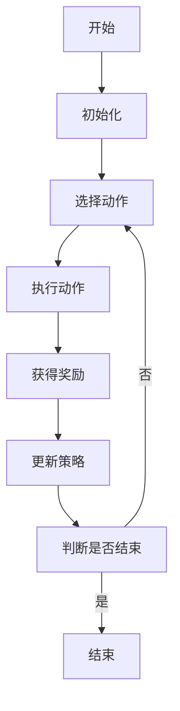
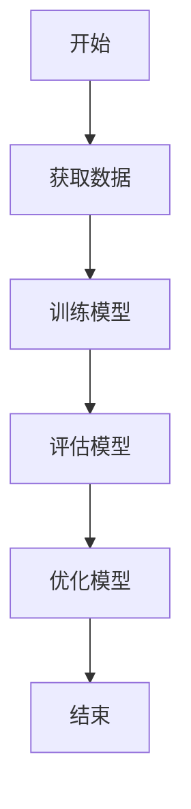
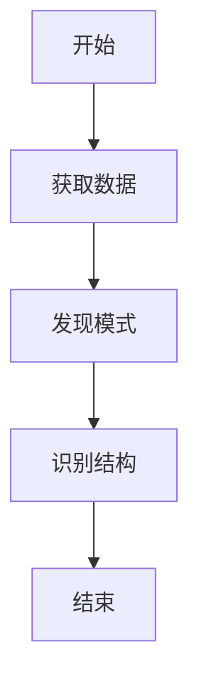
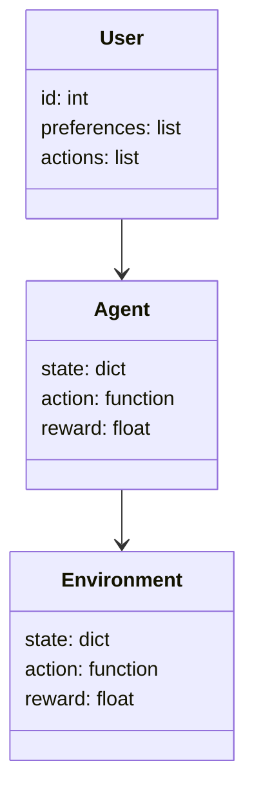
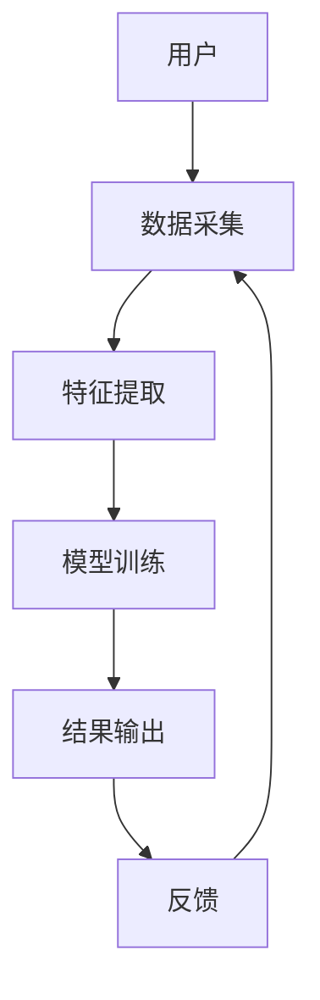
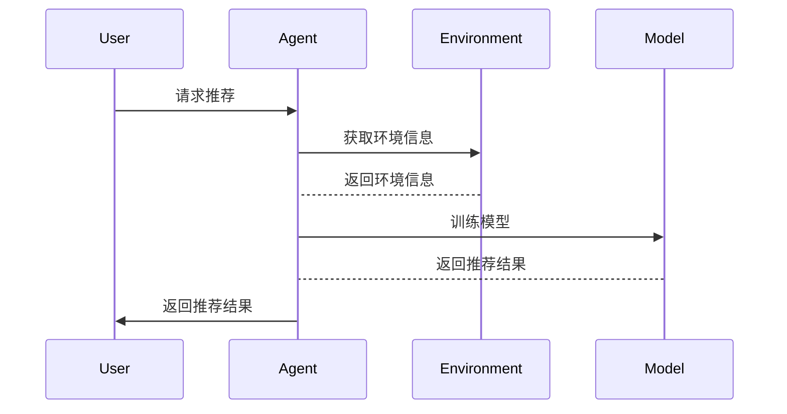

                 


# AI Agent的个性化与定制化实现

## 关键词：
AI Agent、个性化、定制化、算法原理、系统架构、项目实战

## 摘要：
本文深入探讨了AI Agent的个性化与定制化实现，从核心概念到算法原理，再到系统架构和项目实战，全面解析了AI Agent的实现过程。文章通过详细的技术分析和实际案例，展示了如何通过强化学习、监督学习和无监督学习等算法，结合系统设计和架构优化，实现AI Agent的个性化与定制化。同时，本文还提供了丰富的代码示例和数学模型，帮助读者更好地理解和应用这些技术。

---

# 第一部分: AI Agent 的背景与概念

## 第1章: AI Agent 的背景与概念

### 1.1 AI Agent 的基本概念

#### 1.1.1 问题背景与描述
AI Agent（人工智能代理）是指能够感知环境、自主决策并采取行动的智能实体。随着人工智能技术的快速发展，AI Agent 在各个领域中的应用越来越广泛，例如智能助手、推荐系统、自动驾驶等。AI Agent 的核心目标是通过感知和行动，为用户或系统提供智能化的服务。

#### 1.1.2 AI Agent 的问题解决方法
AI Agent 的实现需要结合多种技术，包括机器学习、自然语言处理、计算机视觉等。通过这些技术的融合，AI Agent 可以实现个性化的服务，例如根据用户的偏好推荐内容，或者根据环境的变化自动调整行为。

#### 1.1.3 AI Agent 的边界与外延
AI Agent 的边界是指其功能和能力的范围。例如，一个智能助手的边界可能包括语音交互、信息检索和任务调度。外延则是指AI Agent 的扩展功能，例如与其他系统的集成、数据的安全性等。

#### 1.1.4 AI Agent 的核心要素组成
AI Agent 的核心要素包括感知能力、决策能力、行动能力和学习能力。感知能力是指AI Agent 通过传感器或数据源获取环境信息的能力；决策能力是指基于感知信息做出最优决策的能力；行动能力是指通过执行器或接口对外界进行操作的能力；学习能力是指通过机器学习算法不断优化自身能力的能力。

### 1.2 AI Agent 的定义与特点

#### 1.2.1 AI Agent 的定义
AI Agent 是一种能够感知环境、自主决策并采取行动的智能实体，其核心目标是通过智能化的服务满足用户的需求。

#### 1.2.2 AI Agent 的核心特点
1. **自主性**：AI Agent 能够自主决策，无需人工干预。
2. **反应性**：AI Agent 能够实时感知环境并做出反应。
3. **学习能力**：AI Agent 能够通过机器学习算法不断优化自身能力。
4. **可定制性**：AI Agent 的行为和功能可以根据具体需求进行定制。

#### 1.2.3 个性化与定制化的实现方式
个性化是指根据用户的偏好或需求，提供定制化的服务。定制化则是指根据具体场景或任务，调整AI Agent 的行为和功能。例如，一个推荐系统可以根据用户的浏览历史和偏好，推荐个性化的内容。

---

## 第二部分: AI Agent 的核心概念与联系

## 第2章: AI Agent 的核心概念与联系

### 2.1 核心概念原理

#### 2.1.1 AI Agent 的核心算法
AI Agent 的实现依赖于多种算法，包括强化学习、监督学习和无监督学习。这些算法分别适用于不同的场景和任务。

#### 2.1.2 个性化与定制化的实现机制
个性化与定制化的实现机制包括数据采集、特征提取、模型训练和结果输出。通过这些步骤，AI Agent 可以根据用户的需求提供个性化的服务。

#### 2.1.3 相关概念的对比分析
AI Agent 与其他智能体（例如传统智能体）的区别在于其自主性和学习能力。传统智能体通常需要人工干预，而AI Agent 可以自主决策并不断优化自身能力。

### 2.2 核心概念对比表格

| 概念               | AI Agent                          | 传统智能体                        |
|--------------------|-----------------------------------|----------------------------------|
| 自主性             | 高                                | 低                                |
| 学习能力           | 高                                | 低                                |
| 个性化与定制化     | 支持                              | 不支持                            |
| 反应性             | 高                                | 低                                |

### 2.3 ER 实体关系图

```mermaid
er
    actor: 用户
    agent: AI Agent
    action: 行为
    perception: 感知
    decision: 决策
    action_execution: 行动执行

    actor --> perception
    perception --> decision
    decision --> action_execution
    action_execution --> action
```

---

## 第三部分: AI Agent 的算法原理

## 第3章: AI Agent 的算法原理

### 3.1 算法原理概述

#### 3.1.1 强化学习算法
强化学习是一种通过试错机制优化决策的算法。AI Agent 通过与环境的交互，逐步优化其行为策略，以获得最大的累计奖励。

#### 3.1.2 监督学习算法
监督学习是一种通过标记数据训练模型的算法。AI Agent 可以通过监督学习算法，根据历史数据预测未来的趋势。

#### 3.1.3 无监督学习算法
无监督学习是一种通过数据本身进行模式识别的算法。AI Agent 可以通过无监督学习算法，发现数据中的隐藏结构。

### 3.2 算法流程图

#### 强化学习算法流程图



#### 监督学习算法流程图



#### 无监督学习算法流程图



### 3.3 算法实现代码

#### 强化学习算法实现

```python
import numpy as np

class AI-Agent:
    def __init__(self, state_space, action_space):
        self.state_space = state_space
        self.action_space = action_space
        self.Q = np.zeros((state_space, action_space))

    def choose_action(self, state):
        if np.random.rand() < 0.5:
            return np.random.randint(self.action_space)
        else:
            return np.argmax(self.Q[state])

    def update_Q(self, state, action, reward):
        self.Q[state, action] += reward
```

#### 监督学习算法实现

```python
from sklearn.linear_model import LinearRegression

model = LinearRegression()
model.fit(X_train, y_train)
y_pred = model.predict(X_test)
```

#### 无监督学习算法实现

```python
from sklearn.cluster import KMeans

model = KMeans(n_clusters=3)
model.fit(X)
clusters = model.labels_
```

### 3.4 数学模型与公式

#### 强化学习数学模型
在强化学习中，Q-learning 的目标是找到最优的 Q 值，公式如下：

$$ Q(s, a) = Q(s, a) + \alpha (r + \gamma Q(s', a') - Q(s, a)) $$

其中：
- \( Q(s, a) \) 是当前状态下动作 \( a \) 的 Q 值。
- \( \alpha \) 是学习率。
- \( r \) 是奖励。
- \( \gamma \) 是折扣因子。
- \( Q(s', a') \) 是下一个状态下的最优 Q 值。

#### 监督学习数学模型
在监督学习中，线性回归的损失函数公式如下：

$$ \text{Loss} = \frac{1}{2m} \sum_{i=1}^{m} (y_i - \hat{y_i})^2 $$

其中：
- \( m \) 是样本数量。
- \( y_i \) 是真实值。
- \( \hat{y_i} \) 是预测值。

#### 无监督学习数学模型
在无监督学习中，K-means 的目标函数公式如下：

$$ \text{Loss} = \sum_{i=1}^{n} \sum_{j=1}^{k} (x_i - c_j)^2 \cdot I(c_j \text{ 是 } x_i \text{ 的簇中心}) $$

其中：
- \( n \) 是样本数量。
- \( k \) 是簇的数量。
- \( c_j \) 是第 \( j \) 个簇的中心。
- \( I \) 是指示函数。

---

## 第四部分: AI Agent 的系统分析与架构设计

## 第4章: AI Agent 的系统分析与架构设计

### 4.1 问题场景介绍

#### 4.1.1 个性化与定制化的实现需求
在一个推荐系统中，用户需要根据其偏好推荐个性化的内容。AI Agent 需要通过学习用户的浏览历史和行为，提供个性化的推荐。

#### 4.1.2 系统功能需求分析
系统需要实现的功能包括数据采集、特征提取、模型训练和结果输出。

#### 4.1.3 系统性能需求分析
系统需要满足高并发、低延迟和高准确性。

### 4.2 系统功能设计

#### 4.2.1 领域模型类图



#### 4.2.2 系统架构设计图



#### 4.2.3 系统接口设计

1. 数据采集接口：用于获取用户的行为数据。
2. 特征提取接口：用于提取用户特征。
3. 模型训练接口：用于训练推荐模型。
4. 结果输出接口：用于输出推荐结果。

#### 4.2.4 系统交互序列图



---

## 第五部分: AI Agent 的项目实战

## 第5章: AI Agent 的项目实战

### 5.1 环境安装与配置

#### 5.1.1 安装依赖
```bash
pip install numpy scikit-learn matplotlib
```

#### 5.1.2 配置环境变量
```bash
export PYTHONPATH=$PYTHONPATH:.
```

### 5.2 系统核心实现

#### 5.2.1 核心代码实现

```python
import numpy as np
from sklearn.linear_model import LinearRegression
from sklearn.cluster import KMeans

class AI-Agent:
    def __init__(self, state_space, action_space):
        self.state_space = state_space
        self.action_space = action_space
        self.Q = np.zeros((state_space, action_space))

    def choose_action(self, state):
        if np.random.rand() < 0.5:
            return np.random.randint(self.action_space)
        else:
            return np.argmax(self.Q[state])

    def update_Q(self, state, action, reward):
        self.Q[state, action] += reward

    def train(self, data):
        model = LinearRegression()
        model.fit(data)
        return model.predict(data)
```

#### 5.2.2 代码解读与分析
- `choose_action` 方法用于选择动作。
- `update_Q` 方法用于更新 Q 值。
- `train` 方法用于训练模型。

### 5.3 实际案例分析

#### 5.3.1 案例描述
假设我们正在开发一个推荐系统，用户输入一个查询，AI Agent 根据用户的浏览历史和行为推荐相关内容。

#### 5.3.2 案例分析
1. 数据采集：获取用户的浏览历史和行为。
2. 特征提取：提取用户的兴趣特征。
3. 模型训练：训练推荐模型。
4. 结果输出：输出推荐结果。

#### 5.3.3 详细讲解
通过强化学习算法，AI Agent 可以根据用户的反馈不断优化推荐结果，从而提高推荐的准确性。

### 5.4 项目小结

---

## 第六部分: AI Agent 的最佳实践

## 第6章: AI Agent 的最佳实践

### 6.1 小结
本文详细介绍了 AI Agent 的个性化与定制化实现，从核心概念到算法原理，再到系统架构和项目实战，全面解析了 AI Agent 的实现过程。

### 6.2 注意事项
1. 在实现 AI Agent 时，需要考虑数据的安全性和隐私保护。
2. 确保系统的可扩展性和可维护性。
3. 定期更新模型，以保持系统的准确性。

### 6.3 拓展阅读
1. 《强化学习入门》
2. 《机器学习实战》
3. 《AI Agent 的设计与实现》

---

# 结语
通过本文的讲解，读者可以全面了解 AI Agent 的个性化与定制化实现，掌握其实现的核心技术，并能够在实际项目中应用这些技术。

