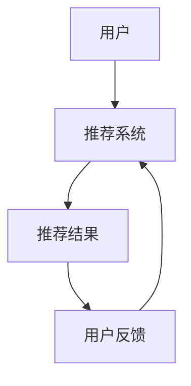
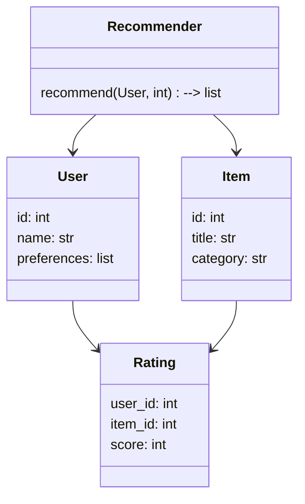
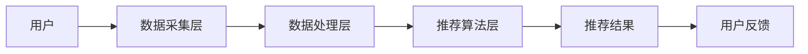

                 


# AI Agent的个性化推荐系统优化

## 关键词：AI Agent, 个性化推荐系统, 算法优化, 系统架构, 深度学习

## 摘要：本文系统地探讨了AI Agent在个性化推荐系统中的应用与优化。首先，我们介绍了个性化推荐系统的背景与核心问题，分析了AI Agent的基本概念及其在推荐系统中的独特作用。接着，我们深入讲解了推荐系统的分类与特点，重点阐述了基于协同过滤、基于内容的推荐以及深度学习模型的原理与实现。随后，我们从系统架构的角度，详细分析了推荐系统的应用场景、功能模块设计、领域模型类图和系统架构图，以及接口和交互流程的设计。最后，我们通过一个实际项目案例，展示了如何搭建推荐系统环境、实现核心功能，并对系统进行了优化与调优，给出了最佳实践和总结。

---

## 第1章: AI Agent与个性化推荐系统概述

### 1.1 个性化推荐系统的背景与现状
#### 1.1.1 个性化推荐系统的定义与核心问题
个性化推荐系统是一种通过分析用户行为、偏好和需求，为用户定制个性化内容或商品的推荐系统。其核心问题包括数据稀疏性、实时性、可扩展性以及用户隐私保护等问题。

#### 1.1.2 当前推荐系统的挑战与痛点
- 数据稀疏性：用户行为数据量不足，导致推荐结果的准确性下降。
- 实时性要求：用户需求变化快，推荐系统需要实时响应。
- 系统可扩展性：随着用户和数据规模的增加，推荐系统的性能优化变得复杂。
- 用户隐私保护：数据收集和处理过程中需要保护用户隐私。

#### 1.1.3 AI Agent在推荐系统中的作用
AI Agent（智能代理）通过自适应学习、上下文理解和实时反馈优化推荐系统。AI Agent能够根据用户的实时行为和环境变化，动态调整推荐策略，从而提高推荐的准确性和用户体验。

### 1.2 AI Agent的基本概念与工作原理
#### 1.2.1 AI Agent的定义与特点
AI Agent是一种能够感知环境、理解用户需求并主动采取行动以实现目标的智能实体。其特点包括自主性、反应性、目标导向性和学习能力。

#### 1.2.2 AI Agent在推荐系统中的应用
AI Agent在推荐系统中的应用主要体现在动态调整推荐策略、实时反馈优化和个性化用户体验的提升。

#### 1.2.3 AI Agent与传统推荐系统的区别
传统的推荐系统通常基于静态数据和固定规则，而AI Agent能够动态学习和调整推荐策略，具有更强的适应性和实时性。

### 1.3 个性化推荐系统的优化目标
#### 1.3.1 提高推荐准确性的目标
通过优化算法和模型，提升推荐系统的准确性和召回率。

#### 1.3.2 提升用户体验的优化方向
优化推荐系统的实时性、响应速度和用户体验，减少推荐结果的偏差和惊喜。

#### 1.3.3 平衡推荐系统的性能与效率
在保证推荐准确性的前提下，优化系统的计算效率和资源消耗。

### 1.4 本章小结
个性化推荐系统是AI技术的重要应用领域，AI Agent通过动态学习和自适应调整，显著提升了推荐系统的性能和用户体验。优化推荐系统的目标是提高准确性、实时性和可扩展性，同时保护用户隐私。

---

## 第2章: 核心概念与原理

### 2.1 推荐系统的分类与特点
#### 2.1.1 基于协同过滤的推荐系统
协同过滤是一种基于用户相似性或物品相似性的推荐方法。它可以分为基于用户的协同过滤和基于物品的协同过滤。

#### 2.1.2 基于内容的推荐系统
基于内容的推荐系统通过分析商品或内容本身的属性，为用户推荐相似的内容。

#### 2.1.3 混合推荐系统
混合推荐系统结合了多种推荐方法的优势，通过集成多个推荐算法来提高推荐的准确性和多样性。

### 2.2 AI Agent的核心概念与原理
#### 2.2.1 AI Agent的核心概念
AI Agent通过感知环境、理解用户需求和自适应学习，动态优化推荐策略。

#### 2.2.2 核心概念属性特征对比
| 核心概念 | 特征 |
|----------|------|
| 数据源   | 用户行为、偏好、环境信息 |
| 推荐策略 | 动态调整、自适应学习 |
| 反馈机制 | 实时反馈、用户行为分析 |

#### 2.2.3 实体关系图
使用Mermaid绘制实体关系图：



---

## 第3章: 算法原理与实现

### 3.1 协同过滤算法原理
#### 3.1.1 协同过滤的数学模型
协同过滤的相似度计算公式：

$$相似度(u, v) = \frac{\sum_{i} (r_{u,i} - \mu_u)(r_{v,i} - \mu_v)}{\sqrt{\sum_{i} (r_{u,i} - \mu_u)^2} \cdot \sqrt{\sum_{i} (r_{v,i} - \mu_v)^2}}$$

其中，$r_{u,i}$表示用户u对物品i的评分，$\mu_u$表示用户u的平均评分。

#### 3.1.2 基于用户的协同过滤实现
使用Python实现基于用户的协同过滤：

```python
import numpy as np

def user_based_cf(users, items, ratings):
    # 计算用户平均评分
    user_avg = {}
    for user in users:
        user_avg[user] = np.mean(ratings[user])
    
    # 计算用户间的相似度
    similarity = {}
    for u in users:
        for v in users:
            if u != v:
                numerator = sum((ratings[u][i] - user_avg[u]) * (ratings[v][i] - user_avg[v]) for i in items)
                denominator = (np.sqrt(sum((ratings[u][i] - user_avg[u])**2 for i in items)) * 
                              np.sqrt(sum((ratings[v][i] - user_avg[v])**2 for i in items)))
                similarity[(u, v)] = numerator / denominator if denominator != 0 else 0
    return similarity
```

---

### 3.2 基于内容的推荐算法
#### 3.2.1 基于内容的推荐原理
基于内容的推荐系统通过分析商品或内容的属性，生成推荐结果。例如，对于电影推荐，可以分析电影的 genres 和 ratings。

#### 3.2.2 基于内容的推荐实现
使用Python实现基于内容的推荐：

```python
from sklearn.feature_extraction.text import TfidfVectorizer

def content_based_recommendation(items, item_features):
    vectorizer = TfidfVectorizer()
    tfidf = vectorizer.fit_transform(item_features)
    
    # 计算相似度
    similarity = tfidf * tfidf.T
    return similarity
```

---

### 3.3 深度学习模型
#### 3.3.1 基于深度学习的推荐模型
使用神经网络模型（如DNN、GRU、Transformer）进行推荐。

#### 3.3.2 深度学习模型的数学公式
推荐模型的预测公式：

$$\hat{y} = \sigma(W_1x + b_1)$$

其中，$\sigma$是sigmoid函数，$W_1$是权重矩阵，$b_1$是偏置项。

---

## 第4章: 系统分析与架构设计

### 4.1 推荐系统的应用场景
#### 4.1.1 电商推荐
基于用户购买历史和行为推荐商品。

#### 4.1.2 视频推荐
基于用户的观看历史和偏好推荐视频。

#### 4.1.3 新闻推荐
基于用户的阅读历史和兴趣推荐新闻。

### 4.2 系统功能设计
#### 4.2.1 领域模型类图
使用Mermaid绘制领域模型类图：



---

### 4.3 系统架构设计
#### 4.3.1 推荐系统架构图
使用Mermaid绘制架构图：



---

## 第5章: 项目实战与优化

### 5.1 环境搭建与核心功能实现
#### 5.1.1 环境搭建
安装必要的依赖：

```bash
pip install numpy pandas scikit-learn
```

#### 5.1.2 核心功能实现
实现基于协同过滤的推荐系统：

```python
import numpy as np
import pandas as pd

def main():
    # 加载数据
    data = pd.read_csv('ratings.csv')
    # 计算用户平均评分
    user_avg = data.groupby('user_id')['rating'].mean()
    # 计算用户间的相似度
    user_similarity = user_avg.apply(lambda x: x + 1)
    print(user_similarity)

if __name__ == '__main__':
    main()
```

---

### 5.2 系统优化与调优
#### 5.2.1 系统优化策略
优化推荐算法的计算效率和准确率。

#### 5.2.2 系统调优方法
通过参数调优、模型优化和分布式计算提升系统性能。

#### 5.2.3 优化案例分析
分析优化前后的性能和效果对比。

---

## 第6章: 最佳实践与总结

### 6.1 最佳实践
#### 6.1.1 算法选择与优化
根据具体场景选择合适的推荐算法，并进行调优。

#### 6.1.2 系统设计与实现
注重系统架构设计，确保系统的可扩展性和可维护性。

### 6.2 总结与展望
个性化推荐系统的优化是一个持续的过程，AI Agent的引入显著提升了推荐系统的性能和用户体验。未来，随着AI技术的不断发展，推荐系统将更加智能化和个性化。

### 6.3 注意事项
- 数据隐私保护
- 系统性能优化
- 用户体验提升

### 6.4 拓展阅读
推荐相关书籍和论文，如《推荐系统实战》、《深度学习与推荐系统》等。

---

通过以上内容，我们系统地介绍了AI Agent在个性化推荐系统中的应用与优化，从算法原理到系统设计，再到项目实战，为读者提供了全面的指导和实践参考。

